# MediCare — Class Diagrams

One diagram per service. Only real entities, enums, and key relationships from the source code.

---

## 1. User Service (`user_db`)

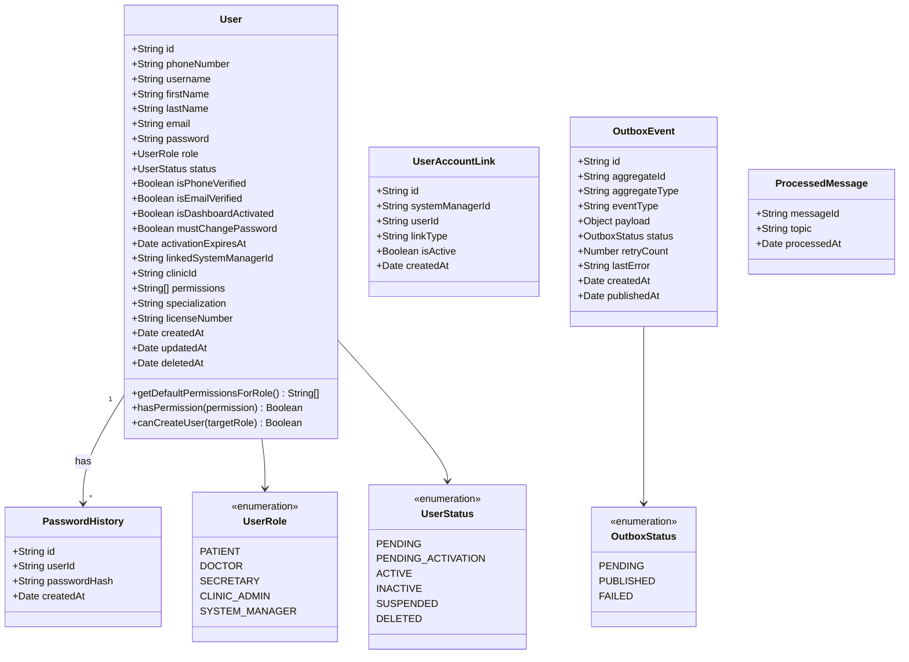

---

## 2. Auth Service (`auth_db`)

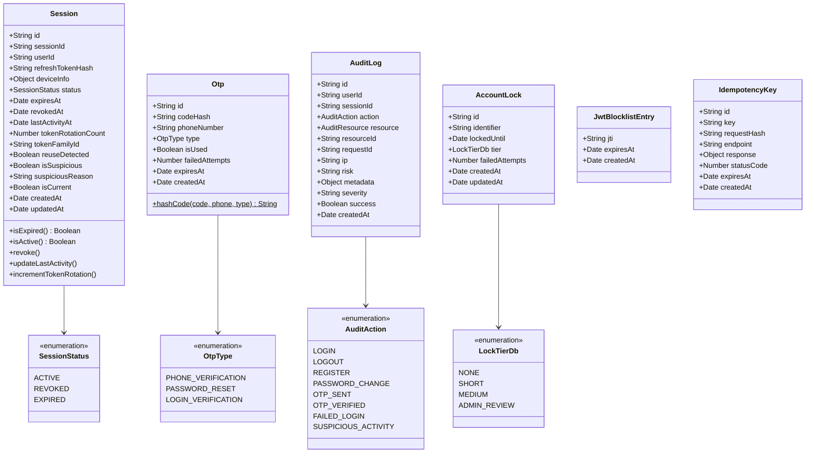

---

## 3. System Manager Service (`system_db`)

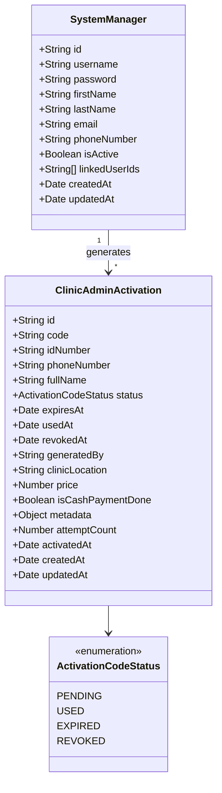

---

## 4. Clinic Service (`clinic_db`)

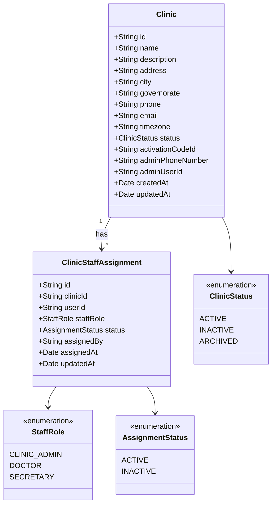

---

## 5. Scheduling Service (`scheduling_db`)

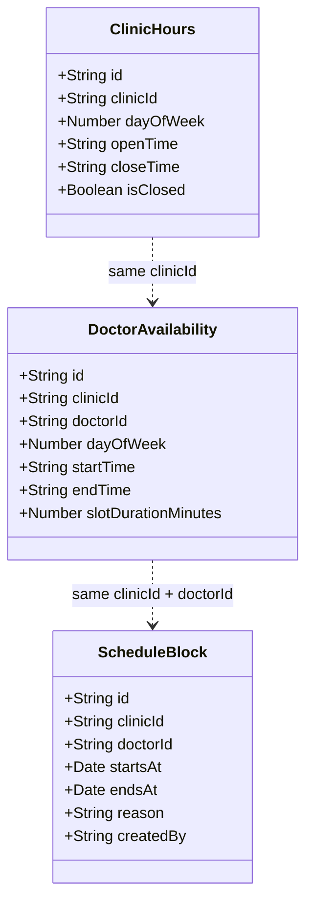

---

## 6. Appointment Service (`appointment_db`)

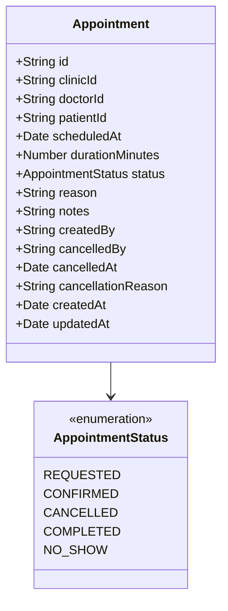

---

## 7. Notification Service (`notification_db`)

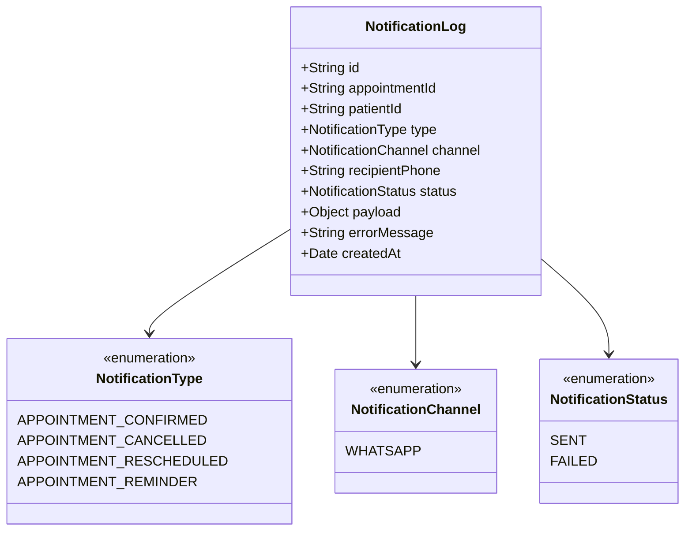

---

## 8. Reminder Service (`reminder_db`)

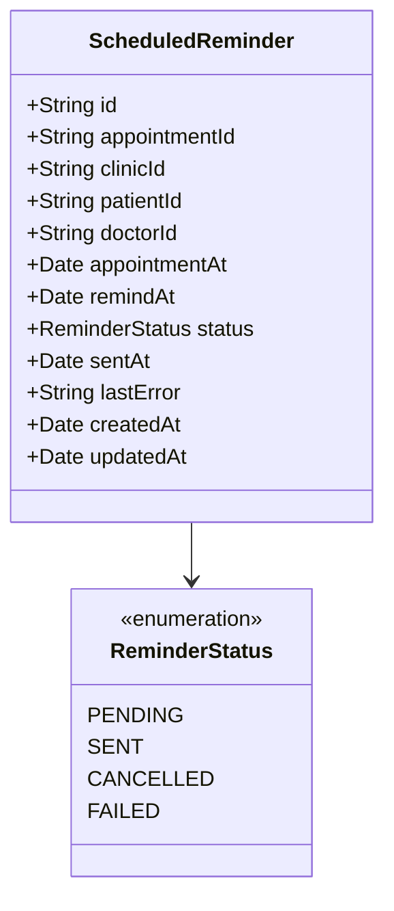

---

## 9. EMR Service (`emr_db`)

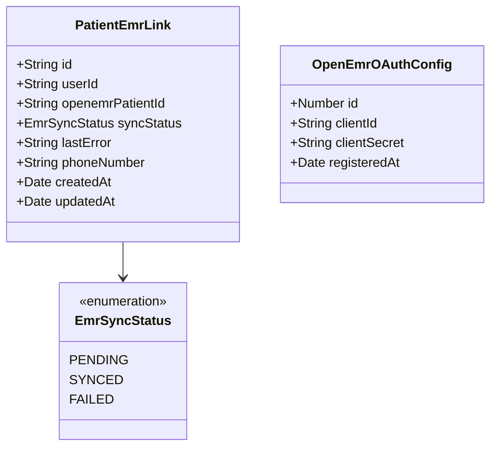

---

## 10. AI Service (`ai_db`)

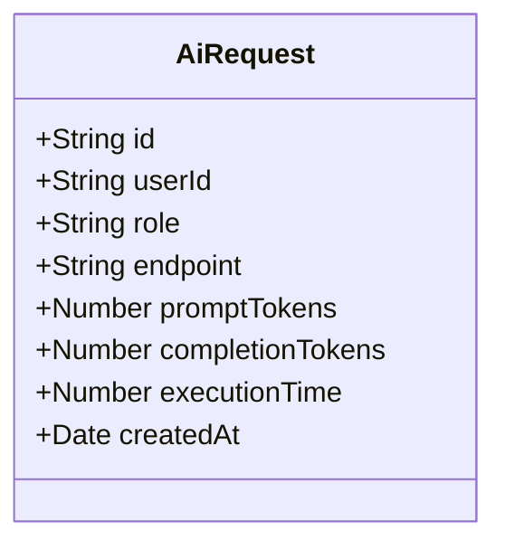

---

## Cross-Service References (logical, no DB foreign keys)

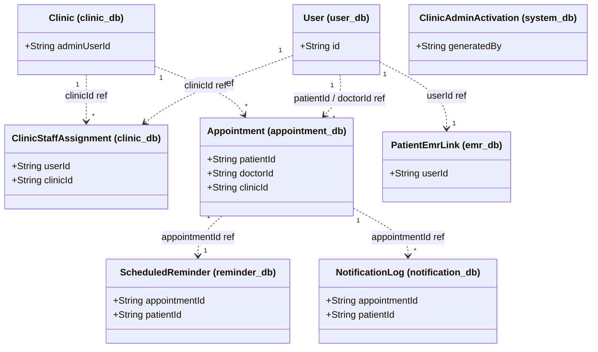
