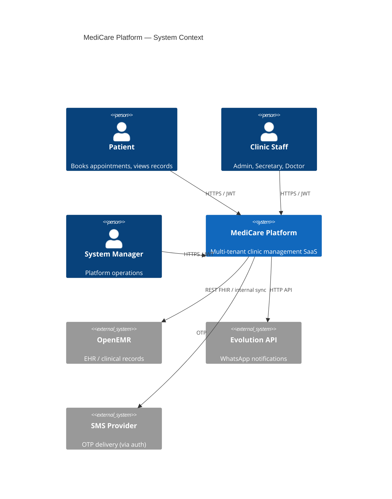
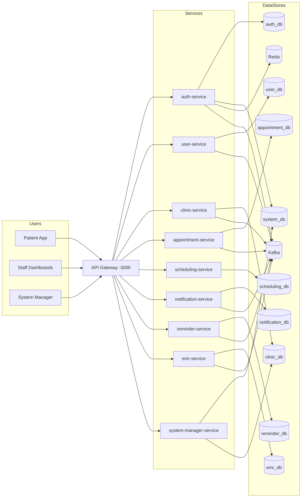

# Context Diagram — MediCare Platform

```mermaid
C4Context
    title MediCare Platform — System Context

    Person(patient, "Patient", "Books appointments, views records")
    Person(staff, "Clinic Staff", "Admin, Secretary, Doctor")
    Person(sysmgr, "System Manager", "Platform operations")

    System(medicare, "MediCare Platform", "Multi-tenant clinic management SaaS")

    System_Ext(openemr, "OpenEMR", "EHR / clinical records")
    System_Ext(whatsapp, "Evolution API", "WhatsApp notifications")
    System_Ext(sms, "SMS Provider", "OTP delivery (via auth)")

    Rel(patient, medicare, "HTTPS / JWT")
    Rel(staff, medicare, "HTTPS / JWT")
    Rel(sysmgr, medicare, "HTTPS / JWT")

    Rel(medicare, openemr, "REST FHIR / internal sync")
    Rel(medicare, whatsapp, "HTTP API")
    Rel(medicare, sms, "OTP")
```

## Simplified Context (Users → Gateway → Services → Databases)

```mermaid
flowchart LR
    subgraph Users
        P[Patient App]
        S[Staff Dashboards]
        M[System Manager]
    end

    GW[API Gateway :3000]

    subgraph Services
        AUTH[auth-service]
        USR[user-service]
        CLN[clinic-service]
        APT[appointment-service]
        SCH[scheduling-service]
        NTF[notification-service]
        REM[reminder-service]
        EMR[emr-service]
        SYS[system-manager-service]
    end

    subgraph DataStores
        ADB[(auth_db)]
        UDB[(user_db)]
        CDB[(clinic_db)]
        APDB[(appointment_db)]
        SDB[(scheduling_db)]
        NDB[(notification_db)]
        RDB[(reminder_db)]
        EDB[(emr_db)]
        SYDB[(system_db)]
        REDIS[(Redis)]
        KAFKA[(Kafka)]
    end

    P & S & M --> GW
    GW --> AUTH & USR & CLN & APT & SCH & NTF & REM & EMR & SYS

    AUTH --> ADB & SYDB & REDIS & KAFKA
    USR --> UDB & KAFKA
    CLN --> CDB & KAFKA
    APT --> APDB & KAFKA
    SCH --> SDB
    NTF --> NDB & KAFKA
    REM --> RDB & KAFKA
    EMR --> EDB & KAFKA
    SYS --> SYDB & CDB
```
