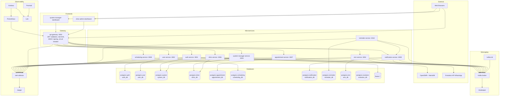

# Container Diagram — MediCare Microservices & Infrastructure

```mermaid
flowchart TB
    subgraph External
        BROWSER[Web Browsers]
        OPENEMR[OpenEMR + MariaDB]
        EVOLUTION[Evolution API WhatsApp]
    end

    subgraph Frontends
        SMD[system-manager-dashboard]
        CAD[clinic-admin-dashboard]
    end

    subgraph Gateway
        GW[api-gateway :3000<br/>JWT validation, rate limit,<br/>HMAC signing, circuit breaker]
    end

    subgraph Microservices
        AUTH[auth-service :3001]
        USER[user-service :3002]
        SYS[system-manager-service :3003]
        EMR[emr-service :3004]
        CLINIC[clinic-service :3006]
        APT[appointment-service :3007]
        SCH[scheduling-service :3008]
        NTF[notification-service :3009]
        REM[reminder-service :3010]
    end

    subgraph Messaging
        ZK[Zookeeper]
        KAFKA[Kafka broker]
        KINIT[kafka-init]
    end

    subgraph Databases
        PG_AUTH[(postgres-auth<br/>auth_db)]
        PG_USER[(postgres-user<br/>user_db)]
        PG_SYS[(postgres-system<br/>system_db)]
        PG_CLINIC[(postgres-clinic<br/>clinic_db)]
        PG_APT[(postgres-appointment<br/>appointment_db)]
        PG_SCH[(postgres-scheduling<br/>scheduling_db)]
        PG_NTF[(postgres-notification<br/>notification_db)]
        PG_REM[(postgres-reminder<br/>reminder_db)]
        PG_EMR[(postgres-emr<br/>emr_db)]
        PG_EVO[(postgres-evolution<br/>evolution_db)]
        REDIS[(Redis 7)]
    end

    subgraph Observability
        OTEL[otel-collector]
        JAEGER[Jaeger]
        PROM[Prometheus]
        GRAF[Grafana]
        LOKI[Loki]
        PTAIL[Promtail]
    end

    BROWSER --> SMD & CAD & GW
    SMD & CAD --> GW

    GW --> AUTH & USER & SYS & EMR & CLINIC & APT & SCH & NTF

    AUTH --> PG_AUTH & PG_SYS & REDIS & KAFKA
    USER --> PG_USER & KAFKA
    SYS --> PG_SYS & PG_CLINIC & KAFKA
    EMR --> PG_EMR & OPENEMR & KAFKA
    CLINIC --> PG_CLINIC & KAFKA
    APT --> PG_APT & KAFKA
    SCH --> PG_SCH
    NTF --> PG_NTF & EVOLUTION & KAFKA
    REM --> PG_REM & NTF & KAFKA

    KINIT --> KAFKA
    KAFKA --> ZK

    AUTH & USER & CLINIC & APT & SCH & NTF & REM & EMR & SYS & GW --> OTEL
    OTEL --> JAEGER
    PROM --> GW
    GRAF --> PROM & LOKI
    PTAIL --> LOKI
```
