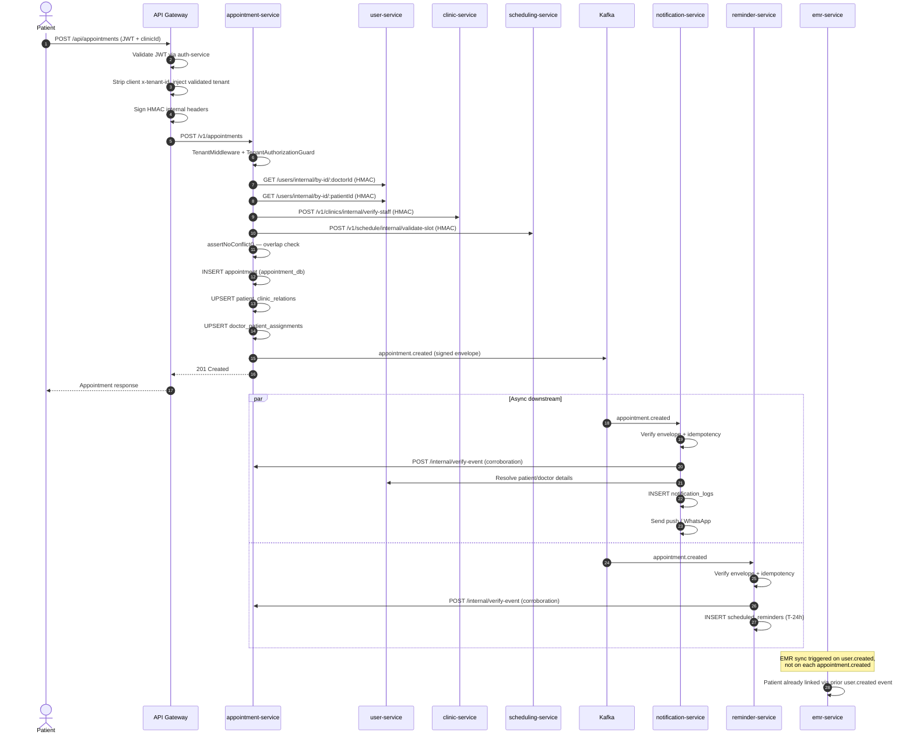

# Sequence Diagram — Appointment Booking Flow

```mermaid
sequenceDiagram
    autonumber
    actor Patient
    participant GW as API Gateway
    participant APT as appointment-service
    participant USR as user-service
    participant CLN as clinic-service
    participant SCH as scheduling-service
    participant KAFKA as Kafka
    participant NTF as notification-service
    participant REM as reminder-service
    participant EMR as emr-service

    Patient->>GW: POST /api/appointments (JWT + clinicId)
    GW->>GW: Validate JWT via auth-service
    GW->>GW: Strip client x-tenant-id, inject validated tenant
    GW->>GW: Sign HMAC internal headers
    GW->>APT: POST /v1/appointments

    APT->>APT: TenantMiddleware + TenantAuthorizationGuard
    APT->>USR: GET /users/internal/by-id/:doctorId (HMAC)
    APT->>USR: GET /users/internal/by-id/:patientId (HMAC)
    APT->>CLN: POST /v1/clinics/internal/verify-staff (HMAC)
    APT->>SCH: POST /v1/schedule/internal/validate-slot (HMAC)
    APT->>APT: assertNoConflict() — overlap check
    APT->>APT: INSERT appointment (appointment_db)
    APT->>APT: UPSERT patient_clinic_relations
    APT->>APT: UPSERT doctor_patient_assignments

    APT->>KAFKA: appointment.created (signed envelope)
    APT-->>GW: 201 Created
    GW-->>Patient: Appointment response

    par Async downstream
        KAFKA->>NTF: appointment.created
        NTF->>NTF: Verify envelope + idempotency
        NTF->>APT: POST /internal/verify-event (corroboration)
        NTF->>USR: Resolve patient/doctor details
        NTF->>NTF: INSERT notification_logs
        NTF->>NTF: Send push / WhatsApp
    and
        KAFKA->>REM: appointment.created
        REM->>REM: Verify envelope + idempotency
        REM->>APT: POST /internal/verify-event (corroboration)
        REM->>REM: INSERT scheduled_reminders (T-24h)
    end

    Note over EMR: EMR sync triggered on user.created,<br/>not on each appointment.created
    EMR->>EMR: Patient already linked via prior user.created event
```
