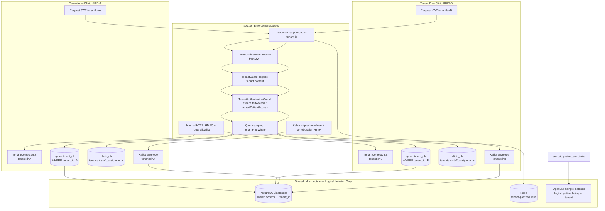
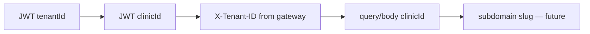

# Multi-Tenant Isolation Diagram

## Tenant Resolution Priority (Staff)

## Patient Role Exception

Patients **ignore** JWT/header tenant claims; only `body.clinicId` / `query.clinicId` is trusted, then `assertPatientAccess` verifies relation.
