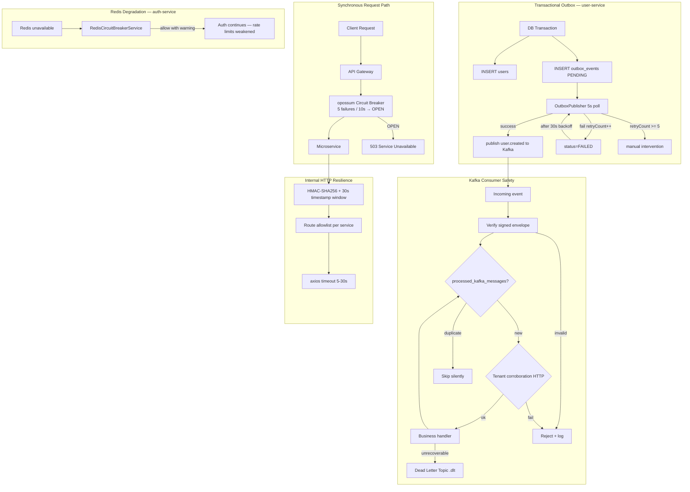

# Failure Handling Diagram — Retry, Outbox, Idempotency

```mermaid
flowchart TB
    subgraph SyncPath["Synchronous Request Path"]
        REQ[Client Request]
        GW[API Gateway]
        CB[opossum Circuit Breaker<br/>5 failures / 10s → OPEN]
        SVC[Microservice]
        REQ --> GW --> CB --> SVC
        CB -->|OPEN| ERR503[503 Service Unavailable]
    end

    subgraph OutboxPattern["Transactional Outbox — user-service"]
        TX[DB Transaction]
        USER_ROW[INSERT users]
        OUTBOX[INSERT outbox_events PENDING]
        TX --> USER_ROW & OUTBOX
        POLL[OutboxPublisher 5s poll]
        OUTBOX --> POLL
        POLL -->|success| PUB[publish user.created to Kafka]
        POLL -->|fail retryCount++| FAIL[status=FAILED]
        FAIL -->|after 30s backoff| POLL
        POLL -->|retryCount >= 5| DEAD[manual intervention]
    end

    subgraph KafkaConsumer["Kafka Consumer Safety"]
        MSG[Incoming event]
        ENV[Verify signed envelope]
        IDEM{processed_kafka_messages?}
        CORR{Tenant corroboration HTTP}
        HANDLER[Business handler]
        DLT[Dead Letter Topic .dlt]

        MSG --> ENV
        ENV -->|invalid| DROP[Reject + log]
        ENV --> IDEM
        IDEM -->|duplicate| SKIP[Skip silently]
        IDEM -->|new| CORR
        CORR -->|fail| DROP
        CORR -->|ok| HANDLER
        HANDLER -->|unrecoverable| DLT
        HANDLER --> IDEM
    end

    subgraph InternalHTTP["Internal HTTP Resilience"]
        HMAC[HMAC-SHA256 + 30s timestamp window]
        ALLOW[Route allowlist per service]
        TIMEOUT[axios timeout 5-30s]
        HMAC --> ALLOW --> TIMEOUT
    end

    subgraph RedisFallback["Redis Degradation — auth-service"]
        REDIS_DOWN[Redis unavailable]
        RCB[RedisCircuitBreakerService]
        REDIS_DOWN --> RCB
        RCB -->|allow with warning| AUTH_CONTINUE[Auth continues — rate limits weakened]
    end

    PUB --> MSG
    SVC --> HMAC
```
