# Deployment Diagram — Docker Compose Topology

```mermaid
flowchart TB
    subgraph Host["Docker Host"]
        subgraph clinic_network["bridge: clinic_network"]
            subgraph Edge["Published Ports — prod overlay"]
                GW_P[api-gateway :3000]
            end

            subgraph AppTier["Application Tier — 512MB each"]
                GW[api-gateway]
                AUTH[auth-service :3001]
                USER[user-service :3002]
                SYS[system-manager-service :3003]
                EMR[emr-service :3004]
                CLINIC[clinic-service :3006]
                APT[appointment-service :3007]
                SCH[scheduling-service :3008]
                NTF[notification-service :3009]
                REM[reminder-service :3010]
                SMD[system-manager-dashboard :80]
                CAD[clinic-admin-dashboard :80]
            end

            subgraph DataTier["Data Tier"]
                REDIS[redis :6379<br/>512MB AOF]
                PG_AUTH[postgres-auth]
                PG_USER[postgres-user]
                PG_SYS[postgres-system]
                PG_CLINIC[postgres-clinic]
                PG_APT[postgres-appointment]
                PG_SCH[postgres-scheduling]
                PG_NTF[postgres-notification]
                PG_REM[postgres-reminder]
                PG_EMR[postgres-emr]
                PG_EVO[postgres-evolution]
                MARIADB[mariadb-openemr]
                MONGO[mongodb]
            end

            subgraph MessagingTier["Messaging Tier"]
                ZK[zookeeper-1]
                KAFKA[kafka-1 :9092<br/>1GB heap]
                KINIT[kafka-init one-shot]
            end

            subgraph IntegrationTier["Integration Tier"]
                OE[openemr :443<br/>1GB]
                EVO[evolution-api :8080]
                EVO_INIT[evolution-init one-shot]
            end

            subgraph ObsTier["Observability Tier — internal only in prod"]
                OTEL[otel-collector]
                JAEGER[jaeger]
                PROM[prometheus]
                GRAF[grafana]
                LOKI[loki]
                PTAIL[promtail]
            end
        end

        subgraph Volumes["Named Volumes"]
            V_PG[postgres_*_data × 10]
            V_REDIS[redis_data]
            V_KAFKA[kafka_1_data]
            V_OE[openemr_sites + logs]
            V_OBS[prometheus_data, grafana_data, loki_data]
        end
    end

    Internet((Internet)) --> GW_P
    GW_P --> GW
    GW --> AppTier

    KINIT --> KAFKA --> ZK
    AppTier --> DataTier & MessagingTier
    EMR --> OE --> MARIADB
    NTF --> EVO --> PG_EVO & REDIS
    EVO_INIT --> EVO

    DataTier --- V_PG & V_REDIS
    MessagingTier --- V_KAFKA
    IntegrationTier --- V_OE
    ObsTier --- V_OBS

    PTAIL -.->|docker.sock| Host
    SYS -.->|docker.sock read-only| Host
```

## Resource Summary (docker-compose.yml limits)

| Component | Memory Limit | CPU Limit |
|-----------|-------------|-----------|
| Each Postgres (×9) | 512 MB | 1.0 |
| Redis | 512 MB | 1.0 |
| Kafka | 1 GB | 1.0 |
| OpenEMR | 1 GB | 1.5 |
| Each microservice (×9) | 512 MB | 1.0 |
| **Estimated total** | **~14–16 GB** | **~18 vCPU** |

