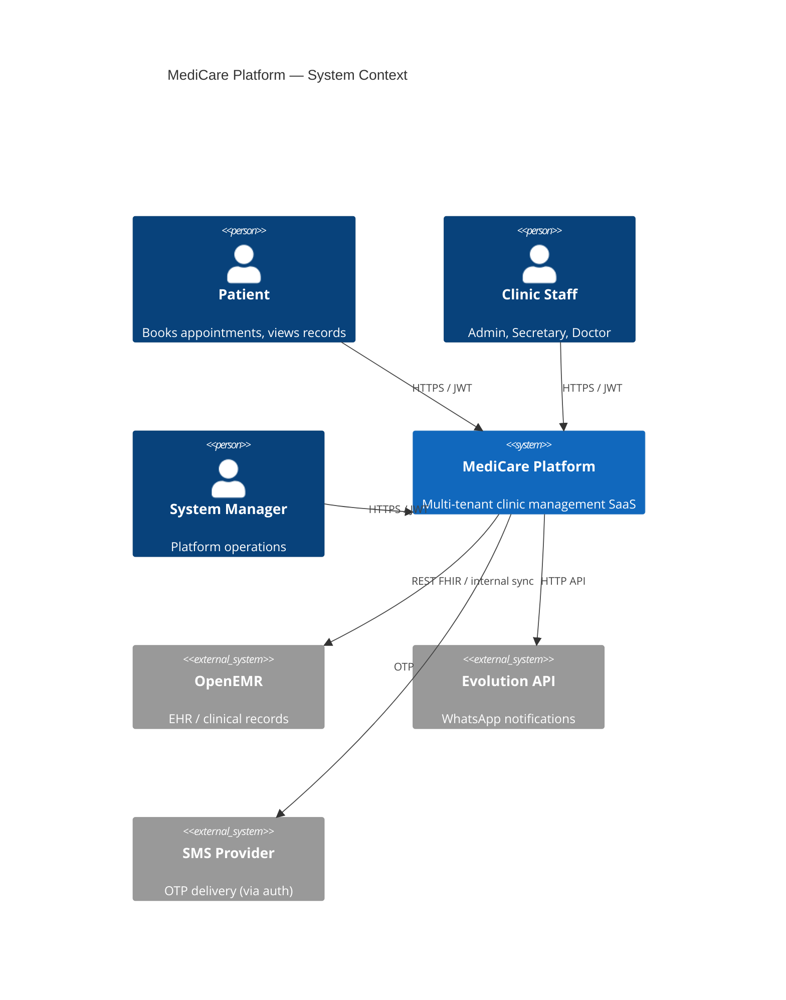
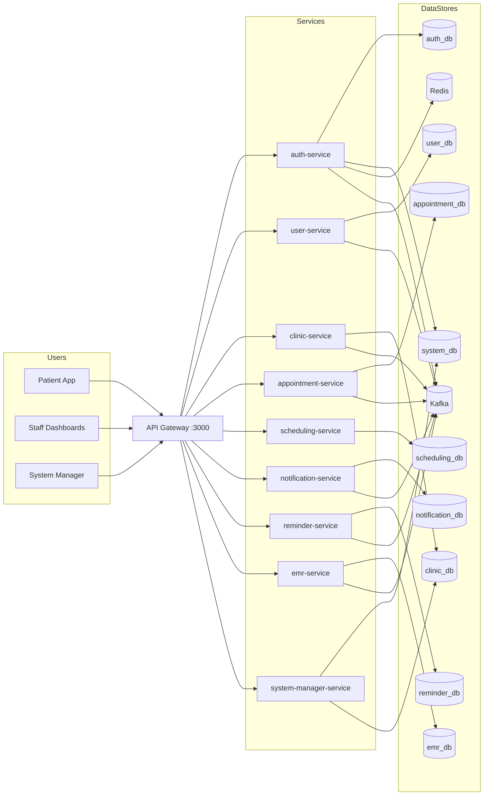
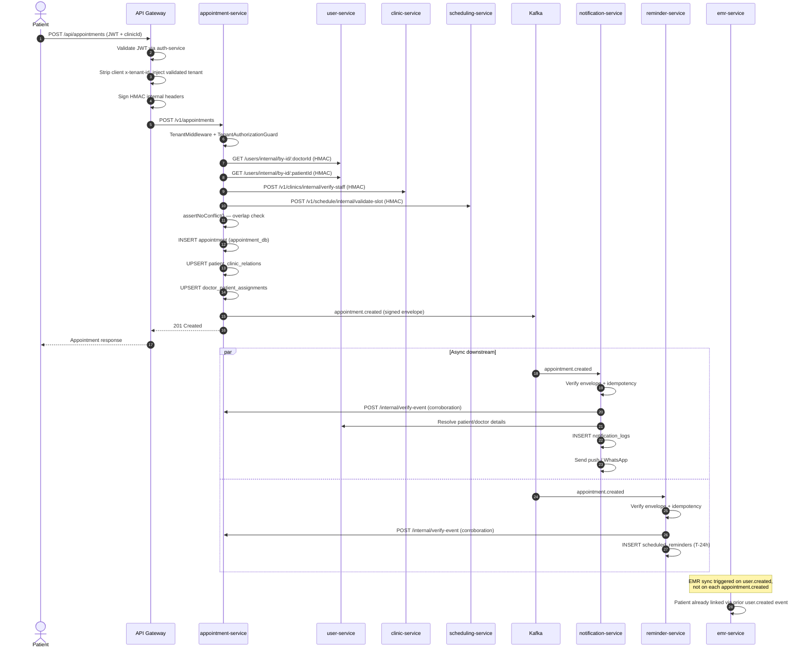
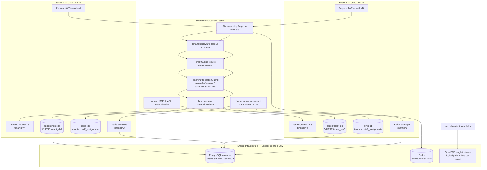
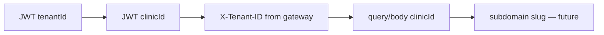
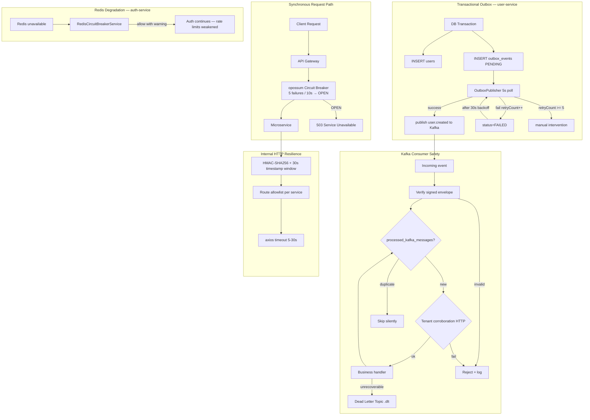

# Phase Final — Architecture Deep Audit

**Project:** MediCare Clinic Management System  
**Date:** 2026-07-03  
**Auditor roles:** Principal Software Architect, Distributed Systems Engineer, Senior Backend Engineer, Database Architect  
**Evidence base:** Live codebase inspection, `docker-compose.yml`, E2E validation (`tools/dev/e2e-validation-results.json`), prior audit deltas

---

## Executive Verdict

| Question | Answer |
|----------|--------|
| **Is the architecture good?** | **Yes — for a Docker-hosted, 20–100 clinic SaaS.** Bounded microservices, DB-per-service, Kafka fan-out, HMAC internal auth, and multi-layer tenant isolation are appropriate and production-minded. |
| **Can it safely serve 50 clinics?** | **Yes, with P0 fixes applied** (automated backups, appointment race-condition guard, secrets rotation). Current capacity estimate holds. |
| **What must be fixed before production?** | Automated DB backups, appointment double-booking race, secrets out of `.env`, unknown-role default-allow in `TenantAuthorizationGuard`, Prometheus alerting. |
| **Is architectural redesign necessary?** | **No.** Horizontal scaling of existing components (second gateway instance, Kafka RF=3, connection pool tuning) is sufficient to 100 clinics. |

**Overall Architecture Score: 71 / 100** (post-remediation baseline)

---

## 1. System Architecture Audit

### 1.1 Service Boundaries & Responsibilities

| Service | Cohesion | Coupling | Verdict |
|---------|----------|----------|---------|
| auth-service | High — identity only | HTTP to user-service; Kafka to user-service | ✅ Correct |
| user-service | High — profiles + outbox | Kafka producer; HTTP to clinic-service | ✅ Correct |
| clinic-service | High — tenant registry | HTTP from 6 services | ⚠️ Hub service — acceptable |
| appointment-service | High — booking lifecycle | 3 sync HTTP deps on create | ⚠️ Hot path latency |
| scheduling-service | High — slot computation | HTTP to clinic + appointment | ✅ Correct |
| notification-service | High — delivery | Kafka consumer + Evolution API | ✅ Correct |
| reminder-service | High — T-24h cron | Kafka consumer + HTTP to notification | ✅ Correct |
| emr-service | High — OpenEMR bridge | Kafka + OpenEMR REST | ✅ Correct |
| system-manager-service | Medium — platform ops | Direct clinic_db pool read | ⚠️ Minor boundary leak |

**Over-engineering:** None detected. No service mesh, no K8s, no CQRS.  
**Under-engineering:** Appointment create lacks transactional slot lock; backup automation absent.

### 1.2 Communication Patterns

| Pattern | Usage | Assessment |
|---------|-------|------------|
| Sync HTTP | Appointment booking (3–4 hops), auth validation | Necessary; 200–800ms P95 expected |
| Async Kafka | Notifications, reminders, EMR sync, audit | Correct decoupling |
| Request-reply Kafka | Auth ↔ user-service (login, OTP) | Acceptable; circuit breaker wrapped |
| Outbox | user-service only | ⚠️ appointment-service emits Kafka directly (no outbox) — acceptable because appointment row is source of truth |

### 1.3 Hidden Bottlenecks

1. **Appointment create sync chain** — 4 HTTP calls before DB write (`user×2`, `clinic`, `scheduling`)
2. **OpenEMR single instance** — 1 GB RAM, 250ms/tenant throttle; limits EMR sync throughput
3. **Single Kafka broker** — RF=1; broker loss = total async pipeline halt
4. **Single Redis** — sessions, rate limits, JWT cache, Evolution cache — memory capped 512 MB
5. **Single API gateway** — no horizontal redundancy in compose
6. **`assertNoConflict`** — read-then-write without row lock (see §1.4)

### 1.4 Race Conditions & Consistency

| Risk | Evidence | Severity |
|------|----------|----------|
| Double booking | `assertNoConflict()` at line 735–762: SELECT then INSERT, no `SELECT FOR UPDATE`, no exclusion constraint | **HIGH** |
| Outbox-at-least-once | Outbox poll + Kafka publish not in same TX as mark-published | LOW — idempotent consumers |
| Kafka consumer ordering | 3 partitions; per-tenant ordering not guaranteed | LOW — idempotency handles |
| Stale slot validation | scheduling validates, then appointment checks again — TOCTOU window ~100ms | MEDIUM |

**No deadlock risks identified** — short transactions, no cross-DB locks.

### 1.5 Internal Auth (HMAC)

- `signInternalRequest`: HMAC-SHA256, 30s freshness window ✅
- Route allowlists per service ✅
- Gateway signs all proxied requests ✅
- E2E: forged HMAC → 401 ✅

**Gap:** `INTERNAL_AUTH_SECRET` must not live in committed `.env` files (P0).

### 1.6 API Gateway

- Env-driven routes (`GATEWAY_ROUTES`) — no hardcoded service list in prod ✅
- JWT validation with Redis cache (`tenant:{id}:jwt:{hash}`) ✅
- opossum circuit breaker: 5 failures / 10s ✅
- Strips `x-tenant-id`, `x-service-token` from clients ✅
- Rate limiting on auth paths ✅

**SPOF:** Single gateway container.

### 1.7 Kafka Architecture

- 40+ topics, DLT companions, `kafka-init` gate ✅
- Signed envelopes + security matrix ✅
- Tenant corroboration on `appointment.*` ✅
- `processed_kafka_messages` idempotency ✅

**Gap:** Single broker; production config defines RF=3 but compose uses RF=1.

### 1.8 Redis Usage

| Consumer | Purpose | Key pattern |
|----------|---------|-------------|
| auth-service | Sessions, rate-limit, account-lock, JWT blocklist, Kafka CB | Global + `tenant:{id}:*` |
| api-gateway | JWT validation cache | `tenant:{id}:jwt:{hash}` |
| evolution-api | Instance cache | `medicare_evolution:*` (DB 6) |

**Risk:** 512 MB with `volatile-lru` — session eviction under memory pressure. Auth has `RedisCircuitBreakerService` fallback.

### 1.9 Failure Isolation

| Failure | Impact | Isolation |
|---------|--------|-----------|
| notification-service down | Booking succeeds; notifications delayed | ✅ Partial failure OK |
| Kafka down | Services won't start (depends_on) | ❌ Hard dependency |
| Redis down | Auth rate limits weakened; cache miss → more HTTP | ⚠️ Degraded |
| Single DB down | Only that domain affected | ✅ Per-service DB |
| OpenEMR down | EMR reads fail; booking unaffected | ✅ Async sync |

---

## 2. Database Deep Audit

### 2.1 Per-Database Assessment

#### auth_db — Score: 78/100

| Table | Indexes | tenant_id | Growth risk | Issue |
|-------|---------|-----------|-------------|-------|
| sessions | `(tenant_id, status, expires_at)` | nullable | Medium — purge expired | ✅ TTL index helps |
| audit_logs | `(tenant_id, created_at)` | nullable | **HIGH** — unbounded | P1: partition/archive |
| phi_audit_logs | `(tenant_id, timestamp)` | nullable | **HIGH** — unbounded | P1: 90-day retention job |
| otps | phone+type | N/A | Low — short TTL | ✅ |
| rate_limits | identifier | N/A | Medium | ✅ expires_at index |
| idempotency_keys | unique key | N/A | Low | ✅ expires_at index |

**Minimal fix:** Add cron job to purge `audit_logs` / `phi_audit_logs` > 90 days.

#### user_db — Score: 82/100

| Table | Issue | Fix |
|-------|-------|-----|
| users | Global phone unique — correct for patients | None |
| outbox_events | `(status, created_at)` index ✅ | Monitor FAILED count |
| processed_messages | Kafka idempotency | ✅ |

**No FK to clinic_db** — correct; UUID references only.

#### clinic_db — Score: 85/100

| Table | Assessment |
|-------|------------|
| tenants | Root entity; slug unique ✅ |
| tenant_staff_assignments | `(tenant_id, user_id)` unique ✅ |

**Hotspot:** `tenants` — small table, 50 rows at 50 clinics. No issue.

#### appointment_db — Score: 74/100

| Table | Indexes | Issue |
|-------|---------|-------|
| appointments | `(tenant_id, doctor_id, scheduled_at)` ✅ | **No exclusion constraint for overlaps** |
| patient_clinic_relations | `(patient_id, tenant_id)` unique ✅ | — |
| doctor_patient_assignments | `(tenant_id, doctor_id, patient_id)` unique ✅ | — |

**Minimal fix (P0):** Add PostgreSQL `btree_gist` exclusion constraint:

```sql
-- Conceptual: prevents overlapping appointments per doctor
EXCLUDE USING gist (
  tenant_id WITH =,
  doctor_id WITH =,
  tsrange(scheduled_at, scheduled_at + duration * interval '1 minute') WITH &&
) WHERE (status IN ('REQUESTED', 'CONFIRMED'));
```

Or: `SELECT FOR UPDATE` on doctor's appointments in same transaction.

**Row growth:** ~20k appointments/day × 365 = 7.3M rows/year. Index `(tenant_id, created_at)` supports archival queries. P2: partition by month after 1M rows.

#### scheduling_db — Score: 80/100

Low write volume. `(tenant_id, doctor_id, day_of_week)` indexes adequate. No hotspot.

#### notification_db — Score: 76/100

| Table | Growth | Fix |
|-------|--------|-----|
| notification_logs | **HIGH** — one row per send | P1: archive > 180 days |
| staff_inbox_notifications | Medium | `(tenant_id, created_at)` ✅ |
| processed_kafka_messages | Bounded by Kafka retention | ✅ |

**Burst handling:** Kafka consumer processes sequentially per partition; 3 partitions = ~3 concurrent. At 500 notifications/min, lag possible. P2: increase partitions to 6.

#### reminder_db — Score: 82/100

`scheduled_reminders (tenant_id, status, remind_at)` — cron scans due reminders. Low volume. ✅

#### emr_db — Score: 79/100

`patient_emr_links (tenant_id, user_id)` unique ✅. Nullable tenant_id backfilled. Small table.

#### system_db — Score: 80/100

Activation codes, system managers, platform incidents. Low volume. ✅

### 2.2 Cross-Service Consistency

| Concern | Mechanism | Gap |
|---------|-----------|-----|
| User exists before appointment | HTTP verify at booking | ✅ |
| Slot available | scheduling + appointment double-check | TOCTOU race |
| Notification matches appointment | Kafka corroboration HTTP | ✅ |
| EMR patient exists | Kafka user.created + link table | Eventual (seconds) |

**No saga orchestrator** — choreography via Kafka is sufficient at current scale.

### 2.3 Migration Quality

43 TypeORM migrations found. Multi-tenancy migrations (`20250623*`, `20250624*`) include backfill + NOT NULL enforcement. Quality: **good**. No raw SQL drift detected.

---

## 3. Non-Functional Requirements Audit

### 3.1 Scalability — Score: 68/100

| Target | Verdict | Bottleneck |
|--------|---------|------------|
| 50 clinics | ✅ Safe (with P0 fixes) | Gateway + appointment_db connections |
| 100 clinics | ⚠️ Marginal | Kafka single broker, OpenEMR, Postgres RAM |
| 500 clinics | ❌ Not supported | Requires horizontal scaling not in compose |

### 3.2 Availability — Score: 55/100

| Component | SPOF? | Mitigation exists? |
|-----------|-------|-------------------|
| API Gateway | **Yes** | Circuit breakers only |
| Kafka | **Yes** | None in compose |
| Redis | **Yes** | Auth CB fallback |
| Each Postgres | Per-DB SPOF | Health checks + restart |
| OpenEMR | **Yes** | Health check |
| Zookeeper | **Yes** | Required by Kafka |

**DB failure:** Service goes unhealthy; gateway returns 502. No read replica failover.

**Kafka failure:** All services block at startup. Running system: consumers stall, notifications stop.

**Redis failure:** Degraded auth; no hard outage.

**Gateway failure:** Total API outage.

### 3.3 Reliability — Score: 72/100

| Mechanism | Present? |
|-----------|----------|
| Retries | ✅ Outbox (5×), Kafka consumer retry, axios timeouts |
| Circuit breakers | ✅ Gateway opossum, auth Kafka CB, auth Redis CB |
| Fallback behavior | ⚠️ Redis down → auth continues (weaker security) |
| Partial failures | ✅ Booking without notification delivery |
| Idempotency | ✅ processed_kafka_messages, idempotency_keys, outbox dedup |
| DLT | ✅ user.created.dlt + 12 DLT topics |

### 3.4 Performance — Score: 65/100

| Endpoint / Path | Est. P95 | Risk |
|-----------------|----------|------|
| POST /appointments | 400–900ms | 4 HTTP hops + 2 DB writes |
| GET /appointments (list) | 50–150ms | Indexed query ✅ |
| GET /platform/stats | 200–500ms | Parallel: clinic_db + user-service |
| GET /emr/patient | 500–2000ms | OpenEMR REST latency |
| Dashboard load | 1–3s | Multiple API calls from frontend |

**N+1:** Appointment list does not fan-out to user-service per row (stores UUIDs only). ✅  
**Heavy aggregation:** `PlatformStatsService` uses 2 parallel queries — acceptable.

### 3.5 Security — Score: 74/100

| Area | Status |
|------|--------|
| Tenant isolation | ✅ 7-layer model; E2E passes |
| Internal HMAC | ✅ Implemented |
| Secrets management | ❌ .env files; P0 |
| JWT handling | ✅ HS256 pinned; blocklist; rotation |
| PHI leakage in logs | ⚠️ Structured logging; no automatic scrub |
| Backups | ❌ pgBackRest commented out |
| Gateway header stripping | ✅ |

### 3.6 Maintainability — Score: 58/100

| Area | Status |
|------|--------|
| Code duplication | ⚠️ `tenant-shared/`, `kafka-security-shared/`, `internal-auth-shared/` copied per service (9×) |
| Shared modules | `@medicare/telemetry` ✅; tenant not extracted to npm package |
| Service contracts | ✅ Route allowlists, Kafka security matrix |
| Migration drift | ✅ Per-service migrations |
| Technical debt | AI service remnants in repo (removed from compose) |

---

## 4. Capacity Planning

### 4.1 Capacity Table

| Scale | Clinics | Users | Concurrent Staff | Req/sec | Verdict |
|-------|---------|-------|------------------|---------|---------|
| **Current safe** | 20–40 | 8k–25k | 100–300 | 150–500 | ✅ Production-viable with P0 fixes |
| **Minor optimizations** | 40–60 | 25k–40k | 300–450 | 500–700 | ✅ Pool tuning, backup, exclusion constraint |
| **Medium optimizations** | 60–100 | 40k–60k | 450–700 | 700–1000 | ⚠️ Needs Kafka partition increase, gateway replica, PG memory bump |
| **50 clinics target** | 50 | ~30k | ~350 | ~400 | ✅ **Achievable** |
| **100 clinics** | 100 | ~60k | ~700 | ~800 | ⚠️ Marginal on single host |
| **500 clinics** | 500 | ~300k | ~3500 | ~4000 | ❌ Requires multi-host / redesign |

### 4.2 Bottleneck Ranking

| Rank | Bottleneck | Evidence | Trigger point |
|------|------------|----------|---------------|
| **1st** | Appointment create sync HTTP chain + connection pools | 4 sequential HTTP calls; pool max=20 per service | ~400 concurrent bookings/hour across platform |
| **2nd** | Single Kafka broker (RF=1) | `docker-compose.yml` kafka-1 only | Broker CPU > 80% or disk > 1GB |
| **3rd** | OpenEMR single instance | 1 GB RAM, 250ms/tenant throttle | > 100 patient registrations/hour sustained |

### 4.3 Host Sizing

Minimum production host: **16 GB RAM, 8 vCPU, 200 GB SSD**  
Recommended for 50 clinics: **24 GB RAM, 12 vCPU, 500 GB SSD**

---

## 5. Improvement Plan

### P0 — Critical (before production)

| # | Fix | Effort | Impact |
|---|-----|--------|--------|
| 1 | Enable automated Postgres backups (pg_dump cron or pgBackRest) | 1 day | Data survival |
| 2 | Appointment overlap exclusion constraint or `SELECT FOR UPDATE` | 0.5 day | Prevents double-booking |
| 3 | Rotate `INTERNAL_AUTH_SECRET`, `JWT_SECRET`, `POSTGRES_PASSWORD` out of committed `.env` | 0.5 day | Secret exposure |
| 4 | `TenantAuthorizationGuard`: default-deny unknown roles | 1 hour | Authorization gap |
| 5 | Prometheus alert rules: gateway 5xx, service down, Kafka lag | 1 day | Incident detection |

### P1 — High Value

| # | Fix | Effort |
|---|-----|--------|
| 6 | Purge job: `phi_audit_logs`, `audit_logs`, `notification_logs` > 90 days | 0.5 day |
| 7 | Increase `appointment-service` pool to 30; `auth-service` already 50 | 1 hour |
| 8 | Pin `openemr/openemr` image tag (not `:latest`) | 15 min |
| 9 | Second api-gateway instance behind nginx upstream (no K8s) | 1 day |
| 10 | Log PHI scrubbing policy — ban phone/email in debug logs | 0.5 day |

### P2 — Medium

| # | Fix | Effort |
|---|-----|--------|
| 11 | Kafka partitions 3→6 on `appointment.created`, `notification.sent` | 2 hours |
| 12 | Postgres memory limits 512→768 MB for appointment_db, auth_db | 1 hour |
| 13 | Extract `tenant-shared` to `@medicare/tenant` npm workspace package | 2 days |
| 14 | appointment-service outbox pattern for Kafka emit | 1 day |

### Optional Future

| # | Item | When |
|---|------|------|
| 15 | Kafka 3-broker cluster (RF=3) | > 80 clinics |
| 16 | Postgres RLS policies | Regulatory requirement |
| 17 | OpenEMR per-tenant instance | > 200 clinics |
| 18 | Read replica for appointment_db | > 1M appointment rows |
| 19 | Appointment table monthly partitioning | > 2M rows |

---

## 6. Deliverables Index

### Diagrams (`Diagrams/`)

| File | Content |
|------|---------|
| `01-context-diagram.md` | Users → Gateway → Services → Databases |
| `02-container-diagram.md` | All microservices + infra |
| `03-sequence-appointment-booking.md` | Full booking flow with Kafka fan-out |
| `04-multi-tenant-isolation.md` | Tenant boundaries across layers |
| `05-failure-handling.md` | Retry / outbox / idempotency |
| `06-deployment-diagram.md` | Docker topology + resource table |

### ADRs (`Diagrams/ADR/`)

| ADR | Title |
|-----|-------|
| ADR-001 | Microservices architecture |
| ADR-002 | Database per service |
| ADR-003 | Multi-tenancy strategy |
| ADR-004 | Kafka async communication |
| ADR-005 | OpenEMR integration strategy |
| ADR-006 | Internal HMAC authentication |
| ADR-007 | Tenant isolation enforcement |
| ADR-008 | Observability architecture |

---

## 7. Final Answers

1. **Architecture quality:** Sound, pragmatic, appropriately decomposed for healthcare SaaS at 20–100 clinic scale. Not over-engineered.

2. **50 clinics:** **Yes** — within capacity envelope after P0 fixes. Estimated ~30k users, ~350 concurrent staff, ~400 req/sec peak.

3. **Pre-production must-fix:** Backups, appointment race condition, secrets hygiene, unknown-role guard, basic alerting.

4. **Redesign required:** **No.** Preserve Docker Compose, single-host or dual-host deployment, existing service boundaries. Scale vertically and add gateway replica before considering infrastructure redesign.

---

*This audit supersedes pre-remediation scores in `MultiTenancyAuditReport.md` (39/100) and `ProductionSecurityAudit.md` (52/100) where cited fixes have been implemented and E2E validation confirms cross-tenant security.*


# ADR-001: Microservices Architecture

| Field | Value |
|-------|-------|
| **Status** | Accepted |
| **Date** | 2026-07-03 |
| **Deciders** | Platform Architecture Team |

## Context

MediCare is a multi-tenant clinic management SaaS handling authentication, user profiles, clinic administration, appointment booking, scheduling, notifications, reminders, EMR integration, and platform operations. The system must support independent scaling of write-heavy domains (appointments, notifications) while keeping PHI boundaries explicit.

The platform is deployed via Docker Compose on a single or small number of hosts — not Kubernetes. Services communicate over an internal bridge network (`clinic_network`).

## Decision

Adopt a **bounded-context microservices architecture** with nine NestJS services plus an API gateway:

| Service | Port | Primary responsibility |
|---------|------|------------------------|
| api-gateway | 3000 | JWT validation, routing, rate limiting, HMAC signing |
| auth-service | 3001 | Identity, sessions, OTP, MFA, JWT issuance |
| user-service | 3002 | User profiles, account linking, outbox publisher |
| system-manager-service | 3003 | Platform admin, activation codes, observability probes |
| emr-service | 3004 | OpenEMR patient sync and record access |
| clinic-service | 3006 | Tenant registry, staff assignments |
| appointment-service | 3007 | Appointment lifecycle, patient–clinic relations |
| scheduling-service | 3008 | Clinic hours, doctor availability, slot validation |
| notification-service | 3009 | Push, WhatsApp, staff inbox |
| reminder-service | 3010 | T-24h scheduled reminders |

**Synchronous HTTP** is used for request/response paths requiring immediate consistency (appointment booking validation chain). **Asynchronous Kafka** is used for fan-out side effects (notifications, reminders, EMR sync, audit).

## Consequences

### Positive
- Clear ownership boundaries; appointment contention isolated to `appointment_db`
- Independent deployability per service (Docker image per service)
- Failure isolation at process level — one service crash does not take down others
- Gateway centralizes auth and strips dangerous client headers

### Negative
- Appointment create requires 3+ synchronous internal HTTP hops (latency amplification)
- Distributed transactions absent — eventual consistency via Kafka
- Operational overhead: 9 services × health checks × migrations
- `tenant-shared/` modules copied per service — drift risk

## Risks

| Risk | Severity | Mitigation |
|------|----------|------------|
| Sync call chain failure on booking | Medium | Gateway circuit breakers; internal timeouts |
| Service sprawl without orchestration | Low | Docker Compose dependency ordering |
| Cross-service schema coupling | Medium | Kafka events + internal APIs only |

## Alternatives Considered

1. **Modular monolith** — Rejected: harder to isolate appointment/notification load; team already invested in service split.
2. **Kubernetes + service mesh** — Rejected: over-engineering for current scale target (≤100 clinics).
3. **Fewer services (merge scheduling + appointment)** — Rejected: scheduling is read-heavy; appointment is write-contended.

# ADR-002: Database Per Service

| Field | Value |
|-------|-------|
| **Status** | Accepted |
| **Date** | 2026-07-03 |
| **Deciders** | Platform Architecture Team |

## Context

MediCare services own distinct data domains. Shared tables would create tight coupling, complicate migrations, and amplify blast radius on schema changes. Healthcare workloads require auditability per domain.

## Decision

Implement **database-per-service** using dedicated PostgreSQL 15 containers:

| Database | Owning service | Key tables |
|----------|---------------|------------|
| auth_db | auth-service | sessions, otps, audit_logs, phi_audit_logs, rate_limits |
| user_db | user-service | users, outbox_events, processed_messages |
| clinic_db | clinic-service | tenants, tenant_staff_assignments |
| appointment_db | appointment-service | appointments, patient_clinic_relations, doctor_patient_assignments |
| scheduling_db | scheduling-service | clinic_hours, doctor_availability, schedule_blocks |
| notification_db | notification-service | notification_logs, staff_inbox, push_device_tokens |
| reminder_db | reminder-service | scheduled_reminders, processed_kafka_messages |
| emr_db | emr-service | patient_emr_links, openemr_oauth_config |
| system_db | system-manager-service | system_managers, activation_codes, platform_incidents |

**Exceptions (intentional):**
- `auth-service` also reads `system_db` for system-manager token validation
- `system-manager-service` opens a read pool to `clinic_db` for platform stats (cross-DB read)
- OpenEMR uses MariaDB (`mariadb-openemr`) — external EHR, not owned schema
- Evolution API uses `evolution_db` + MongoDB — WhatsApp integration

**Foreign keys across databases are prohibited.** References use UUIDs validated via internal HTTP or Kafka corroboration.

## Consequences

### Positive
- Independent migration pipelines per service (TypeORM migrations)
- Failure isolation — `notification_db` outage does not block appointment writes
- Per-DB connection pool tuning possible

### Negative
- No cross-DB ACID transactions — appointment + notification consistency is eventual
- Cross-service reads require HTTP fan-out (N+1 risk on dashboards)
- 9 Postgres instances × 512 MB = ~4.5 GB baseline RAM on host
- Backup complexity — 10 databases to protect

## Risks

| Risk | Severity | Mitigation |
|------|----------|------------|
| Orphaned references (user deleted, appointment remains) | Medium | Soft-delete patterns; Kafka user.deleted (future) |
| system-manager direct clinic_db access | Low | Read-only pool; consider API delegation |
| Backup not automated | **Critical** | P0: enable pg_dump cron or pgBackRest |

## Alternatives Considered

1. **Shared single Postgres, schema-per-service** — Rejected: weaker blast-radius isolation; connection pool contention.
2. **DB-per-tenant** — Rejected: operational cost at 100+ clinics; current shared-schema + tenant_id sufficient.
3. **CQRS read replicas** — Deferred: not needed before 100 clinics.


# ADR-003: Multi-Tenancy Strategy

| Field | Value |
|-------|-------|
| **Status** | Accepted |
| **Date** | 2026-07-03 |
| **Deciders** | Platform Architecture Team |

## Context

MediCare serves multiple independent clinics on shared infrastructure. Patients may visit multiple clinics (global identity). Staff belong to specific clinics via assignments. Platform operators (system managers) are tenant-agnostic. PHI must not leak across tenant boundaries.

## Decision

Adopt **shared database, shared schema, row-level isolation** via `tenant_id` column:

1. **Tenant root:** `clinic_db.tenants` — each clinic is a tenant (UUID)
2. **Staff scope:** `tenant_staff_assignments` junction table
3. **Patient scope:** Global `user_db.users` row; access scoped per clinic via `patient_clinic_relations` and appointments
4. **Resolution:** `TenantMiddleware` + `resolveTenantId()` priority chain
5. **Authorization:** `TenantAuthorizationGuard` calls `assertStaffAccess` / `assertPatientAccess`
6. **Query scoping:** `tenantFindWhere()` utility on all tenant-bound queries
7. **Gateway:** Strips client-supplied `x-tenant-id`; re-injects from validated JWT
8. **Patient exception:** Patients ignore JWT/header tenant claims; only `body.clinicId` trusted

Kafka events carry `tenantId` in signed envelopes. Consumers corroborate tenant claims via HTTP callback to source service.

## Consequences

### Positive
- Simple operations — one migration applies to all tenants
- Cost-efficient for 20–100 clinics
- Indexes on `(tenant_id, ...)` provide per-tenant query performance
- E2E cross-tenant tests pass (forged headers stripped, HMAC enforced)

### Negative
- Application-layer enforcement only — no Postgres RLS policies
- Shared OpenEMR instance — logical isolation via `patient_emr_links.tenant_id`
- `tenant-shared/` copied to each service — 9 copies to maintain
- Nullable `tenant_id` on some auth tables for global patients (by design)

## Risks

| Risk | Severity | Mitigation |
|------|----------|------------|
| Missing tenant filter in new query | High | Code review; `tenantFindWhere` convention |
| Unknown role bypass in TenantAuthorizationGuard | Medium | P1: default-deny unknown roles |
| Shared OpenEMR cross-tenant | Medium | Per-tenant OAuth config; link scoping |
| SQL injection bypassing app layer | Low | TypeORM parameterized queries |

## Alternatives Considered

1. **Schema-per-tenant** — Rejected: migration × N clinics complexity.
2. **Database-per-tenant** — Rejected: 50+ Postgres instances impractical on Docker host.
3. **Postgres Row-Level Security** — Deferred: adds complexity; app-layer sufficient at current scale.


# ADR-004: Kafka Async Communication

| Field | Value |
|-------|-------|
| **Status** | Accepted |
| **Date** | 2026-07-03 |
| **Deciders** | Platform Architecture Team |

## Context

Appointment lifecycle events must fan out to notification, reminder, and audit consumers without blocking the booking HTTP response. User creation must trigger EMR sync. Auth flows use request-reply over Kafka for user-service integration.

## Decision

Use **Apache Kafka** (Confluent 7.4, single broker in Docker Compose) as the async event bus:

- **Topic registry:** `Messaging/Kafka/kafka-config/topics/topics.config.ts` — 40+ topics with DLT companions
- **Init:** `kafka-init` one-shot container creates topics before services start
- **Producers:** Signed event envelopes via `SignedKafkaPublisher` / `createSignedKafkaEnvelope`
- **Consumers:** `withSecuredKafkaEvent()` — envelope verification, idempotency, tenant corroboration
- **Security matrix:** `KAFKA_TOPIC_SECURITY_MATRIX` defines allowed producers/consumers per topic
- **Idempotency:** `processed_kafka_messages` table in notification-service and reminder-service
- **DLT:** `.dlt` topics for manual intervention (e.g., `user.created.dlt`)
- **Outbox:** user-service transactional outbox (`outbox_events`) polled every 5s

**Key event flows:**
- `appointment.created` → notification-service, reminder-service
- `user.created` → emr-service (OpenEMR patient sync)
- `user.password.changed` → auth-service
- `audit.log` → auth-service (centralized PHI audit ingestion)

## Consequences

### Positive
- Decoupled side effects — booking returns before notification sends
- At-least-once delivery with idempotency guards
- Topic-level producer/consumer ACL via security matrix
- Tenant corroboration prevents spoofed cross-tenant events

### Negative
- Single broker = SPOF; RF=1 in dev compose
- Eventual consistency — notification may lag seconds behind booking
- Zookeeper dependency (legacy Kafka architecture)
- Not all topics in security matrix (only actively secured subset)

## Risks

| Risk | Severity | Mitigation |
|------|----------|------------|
| Kafka broker down | High | Services block startup on kafka-init; P1: broker health alerting |
| Duplicate notifications | Low | processed_kafka_messages + eventId |
| Outbox poll lag | Low | 5s interval; batch 50 |
| Message retention disk growth | Medium | 7-day retention configured; 1GB per partition cap |

## Alternatives Considered

1. **Redis Pub/Sub** — Rejected: no persistence, no replay, no DLT.
2. **RabbitMQ** — Rejected: team standardized on Kafka; NestJS microservices Kafka transport already integrated.
3. **Direct HTTP fan-out from appointment-service** — Rejected: tight coupling; booking latency increase.


# ADR-005: OpenEMR Integration Strategy

| Field | Value |
|-------|-------|
| **Status** | Accepted |
| **Date** | 2026-07-03 |
| **Deciders** | Platform Architecture Team |

## Context

MediCare must integrate with a certified EHR for patient records, clinical documentation, and regulatory compliance. OpenEMR is deployed as a Docker container with MariaDB backend. Patient identity originates in MediCare `user-service`; clinical records live in OpenEMR.

## Decision

Integrate via a dedicated **emr-service** (port 3004) using:

1. **Deployment:** `openemr/openemr:latest` + `mariadb:11.8` in Docker Compose
2. **Sync trigger:** Kafka `user.created` event → `PatientSyncService.syncPatientFromUserCreated()`
3. **Mapping store:** `emr_db.patient_emr_links` — `(tenant_id, user_id) → openemr_patient_id`
4. **Tenant scoping:** Per-tenant `openemr_oauth_config`; links require non-null `tenant_id`
5. **Access control:** `emr-record.service.ts` enforces role-based access (doctor: assigned patients only; admin: clinic-wide)
6. **Throttling:** `TenantQueueThrottle` — 250ms min interval per tenant for EMR API calls
7. **Corroboration:** `UserKafkaCorroborator` verifies user exists before sync
8. **Internal API:** `GET /internal/emr/patient/:userId` for appointment-service lookups
9. **PHI audit:** Reads/writes emit `phi_audit_logs` via `PhiAuditPublisherService`

Appointments do **not** trigger EMR sync — only user registration does.

## Consequences

### Positive
- Async sync does not block user registration HTTP path
- Per-tenant link table enables multi-tenant logical isolation
- Throttle prevents OpenEMR API flooding
- FHIR/REST APIs enabled via OpenEMR settings

### Negative
- **Single shared OpenEMR instance** for all tenants — physical isolation absent
- OpenEMR is memory-heavy (1 GB limit) — scaling bottleneck
- Sync lag between user.created and EMR availability (seconds to minutes)
- OpenEMR MariaDB is additional operational surface

## Risks

| Risk | Severity | Mitigation |
|------|----------|------------|
| OpenEMR container crash | High | Health check + restart; P1: EMR health dashboard |
| Cross-tenant patient in OpenEMR | Medium | tenant_id on links; corroboration |
| OpenEMR upgrade breaking API | Medium | Pin image tag in production |
| EMR sync DLT accumulation | Medium | Monitor user.created.dlt |

## Alternatives Considered

1. **OpenEMR per tenant** — Rejected: 50 containers impractical on current infra.
2. **Synchronous EMR create on registration** — Rejected: OpenEMR latency blocks auth flow.
3. **Third-party FHIR server (HAPI)** — Rejected: OpenEMR already integrated and deployed.


# ADR-006: Internal HMAC Authentication

| Field | Value |
|-------|-------|
| **Status** | Accepted |
| **Date** | 2026-07-03 |
| **Deciders** | Platform Architecture Team |

## Context

Microservices communicate over a flat Docker bridge network. Any compromised container could reach any internal port. A shared static token alone is insufficient — replay and caller impersonation must be prevented.

## Decision

Implement **HMAC-SHA256 request signing** for all service-to-service HTTP:

**Headers:**
- `x-service-name` — caller identity (must be in `INTERNAL_SERVICE_NAMES`)
- `x-service-timestamp` — epoch ms
- `x-service-signature` — HMAC of `METHOD\nPATH\nBODY\nTIMESTAMP`

**Implementation:**
- `internal-auth.crypto.ts` — sign/verify with 30-second freshness window
- `internal-http.signer.ts` — outbound header creation
- `InternalServiceGuard` — inbound verification on `/internal/*` routes
- `INTERNAL_ROUTE_ALLOWLISTS` — per-service, per-route caller allowlist (e.g., only `appointment-service` may call `validate-slot`)

**Gateway:** Signs all proxied upstream requests as `api-gateway`.

**Kafka:** Separate signed envelope verification via `kafka-event.verifier.ts` (not HMAC on HTTP, but analogous trust model).

## Consequences

### Positive
- Replay protection via timestamp window
- Caller identity bound to signature — cannot impersonate another service
- Route-level allowlists limit blast radius of compromised service
- E2E test confirms forged HMAC returns 401

### Negative
- Clock skew between containers can cause false rejections (30s window is tight)
- Body canonicalization must match exactly (JSON key ordering via `stableStringify`)
- Secret rotation requires coordinated rollout across all services
- Some legacy endpoints may still accept token-only auth during migration

## Risks

| Risk | Severity | Mitigation |
|------|----------|------------|
| Secret in .env committed to repo | Critical | P0: secrets manager; rotate on deploy |
| Allowlist gaps (empty allowlist = deny) | Low | `findRouteAllowlist` returns undefined → deny |
| mTLS not implemented | Medium | Acceptable at current scale; HMAC sufficient |

## Alternatives Considered

1. **Shared static x-service-token only** — Rejected: no replay protection; E2E proved insufficient.
2. **mTLS / SPIFFE** — Deferred: operational complexity for Docker Compose deployment.
3. **JWT service tokens** — Rejected: HMAC per-request is simpler and stateless.


# ADR-007: Tenant Isolation Enforcement

| Field | Value |
|-------|-------|
| **Status** | Accepted |
| **Date** | 2026-07-03 |
| **Deciders** | Platform Architecture Team |

## Context

Multi-tenant SaaS handling PHI requires defense-in-depth beyond database column scoping. Prior audits identified gaps where tenant context could be set without verifying actor membership. Remediation added authorization guards and cross-tenant security tests.

## Decision

Enforce tenant isolation through **seven layers**:

| Layer | Mechanism | Location |
|-------|-----------|----------|
| 1 | Strip client tenant headers | `api-gateway/src/main.ts` |
| 2 | JWT validation + tenant injection | Gateway → auth-service `validate-token` |
| 3 | Tenant resolution | `tenant-resolver.ts` |
| 4 | Tenant context (ALS) | `TenantContextService` |
| 5 | Tenant membership guard | `TenantGuard` |
| 6 | Actor authorization | `TenantAuthorizationGuard` + `TenantAccessChecker` |
| 7 | Query scoping | `tenantFindWhere()` on all reads/writes |

**Kafka isolation:**
- Signed envelopes with `tenantId`
- `topicRequiresTenantCorroboration` → HTTP verify-event callback
- `processed_kafka_messages` prevents replay

**Internal HTTP isolation:**
- HMAC + route allowlists
- Internal paths exempt from tenant guard but require service identity

**Patient-specific rule:** Patients cannot set tenant via header/JWT — only explicit `clinicId` in request body, then `assertPatientAccess` verifies `patient_clinic_relations`.

## Consequences

### Positive
- Cross-tenant security E2E tests pass (6 flows + 4 negative tests)
- Gateway prevents header injection attacks
- Kafka corroboration prevents forged appointment events
- Staff/patient access verified against clinic-service / appointment-service

### Negative
- `TenantAuthorizationGuard` returns `true` for unknown roles (line 74) — gap remains
- No Postgres RLS — DB admin can bypass app layer
- Internal service compromise bypasses JWT entirely (mitigated by HMAC + allowlists)

## Risks

| Risk | Severity | Mitigation |
|------|----------|------------|
| New endpoint missing guards | High | Convention: `@UseGuards(JwtAuthGuard, TenantGuard, TenantAuthorizationGuard)` |
| Unknown role bypass | Medium | P1: throw ForbiddenException for unrecognized roles |
| Corroboration HTTP failure | Low | Consumer rejects event; no side effect |

## Alternatives Considered

1. **Postgres RLS policies** — Deferred: requires SET app.tenant_id per connection.
2. **API gateway tenant routing only** — Rejected: insufficient; services must enforce independently.
3. **Per-tenant API keys** — Rejected: poor UX for staff dashboards.

# ADR-008: Observability Architecture

| Field | Value |
|-------|-------|
| **Status** | Accepted |
| **Date** | 2026-07-03 |
| **Deciders** | Platform Architecture Team |

## Context

A 9-service distributed system requires unified visibility into request latency, error rates, Kafka lag, and PHI access patterns. Production deployment must detect failures before clinics report them.

## Decision

Implement the **Grafana observability stack** in Docker Compose:

| Component | Role | Exposure |
|-----------|------|----------|
| OpenTelemetry Collector | Trace/metric ingestion | Internal :4317/:4318 |
| Jaeger | Distributed tracing UI | Internal :16686 |
| Prometheus | Metrics scraping | Internal :9090 |
| Grafana | Dashboards + alerting UI | Internal (prod); optional host port in dev |
| Loki | Log aggregation | Internal :3100 |
| Promtail | Docker log shipping | Reads docker.sock |

**Application instrumentation:**
- `@medicare/telemetry` shared library
- `OTEL_EXPORTER_OTLP_ENDPOINT=http://otel-collector:4318` on all services
- Structured logging with `tenant_id`, `request_id`, `event` fields
- `/health/live`, `/health/ready`, `/metrics` on every service
- PHI audit via `phi_audit_logs` table + Kafka `audit.log` topic

**System Manager integration:**
- `platform-observability.service.ts` probes Prometheus, Grafana, Loki, Jaeger
- Docker socket read-only for container status
- Embedded Grafana dashboard in system-manager-dashboard

## Consequences

### Positive
- End-to-end tracing from gateway through internal HTTP chains
- PHI audit trail separate from application logs
- Platform health visible to system managers
- Production overlay disables anonymous Grafana access

### Negative
- All-in-one on single host — observability stack competes for RAM with app services
- Promtail docker.sock access is a security surface
- No alerting rules configured in Prometheus by default (dashboards only)
- Log retention in Loki unbounded without explicit limits

## Risks

| Risk | Severity | Mitigation |
|------|----------|------------|
| PHI in application logs | High | P1: log scrubbing policy; structured fields only |
| Observability stack SPOF | Low | System functions without Grafana; degrades debuggability |
| Disk growth (Loki + Prometheus TSDB) | Medium | P2: retention policies |
| Missing SLO alerting | Medium | P1: alert on gateway 5xx, Kafka lag, DB connections |

## Alternatives Considered

1. **Cloud-managed (Datadog, Honeycomb)** — Rejected: cost and vendor lock-in; Docker-first deployment.
2. **ELK stack** — Rejected: heavier resource footprint than Loki.
3. **Logs only, no tracing** — Rejected: insufficient for debugging 4-hop appointment chains.


Context-Diagrams :

# Context Diagram — MediCare Platform



## Simplified Context (Users → Gateway → Services → Databases)


# Container Diagram — MediCare Microservices & Infrastructure

```mermaid
flowchart TB
    subgraph External
        BROWSER[Web Browsers]
        OPENEMR[OpenEMR + MariaDB]
        EVOLUTION[Evolution API WhatsApp]
    end

    subgraph Frontends
        SMD[system-manager-dashboard]
        CAD[clinic-admin-dashboard]
    end

    subgraph Gateway
        GW[api-gateway :3000<br/>JWT validation, rate limit,<br/>HMAC signing, circuit breaker]
    end

    subgraph Microservices
        AUTH[auth-service :3001]
        USER[user-service :3002]
        SYS[system-manager-service :3003]
        EMR[emr-service :3004]
        CLINIC[clinic-service :3006]
        APT[appointment-service :3007]
        SCH[scheduling-service :3008]
        NTF[notification-service :3009]
        REM[reminder-service :3010]
    end

    subgraph Messaging
        ZK[Zookeeper]
        KAFKA[Kafka broker]
        KINIT[kafka-init]
    end

    subgraph Databases
        PG_AUTH[(postgres-auth<br/>auth_db)]
        PG_USER[(postgres-user<br/>user_db)]
        PG_SYS[(postgres-system<br/>system_db)]
        PG_CLINIC[(postgres-clinic<br/>clinic_db)]
        PG_APT[(postgres-appointment<br/>appointment_db)]
        PG_SCH[(postgres-scheduling<br/>scheduling_db)]
        PG_NTF[(postgres-notification<br/>notification_db)]
        PG_REM[(postgres-reminder<br/>reminder_db)]
        PG_EMR[(postgres-emr<br/>emr_db)]
        PG_EVO[(postgres-evolution<br/>evolution_db)]
        REDIS[(Redis 7)]
    end

    subgraph Observability
        OTEL[otel-collector]
        JAEGER[Jaeger]
        PROM[Prometheus]
        GRAF[Grafana]
        LOKI[Loki]
        PTAIL[Promtail]
    end

    BROWSER --> SMD & CAD & GW
    SMD & CAD --> GW

    GW --> AUTH & USER & SYS & EMR & CLINIC & APT & SCH & NTF

    AUTH --> PG_AUTH & PG_SYS & REDIS & KAFKA
    USER --> PG_USER & KAFKA
    SYS --> PG_SYS & PG_CLINIC & KAFKA
    EMR --> PG_EMR & OPENEMR & KAFKA
    CLINIC --> PG_CLINIC & KAFKA
    APT --> PG_APT & KAFKA
    SCH --> PG_SCH
    NTF --> PG_NTF & EVOLUTION & KAFKA
    REM --> PG_REM & NTF & KAFKA

    KINIT --> KAFKA
    KAFKA --> ZK

    AUTH & USER & CLINIC & APT & SCH & NTF & REM & EMR & SYS & GW --> OTEL
    OTEL --> JAEGER
    PROM --> GW
    GRAF --> PROM & LOKI
    PTAIL --> LOKI
```



# Sequence Diagram — Appointment Booking Flow




# Multi-Tenant Isolation Diagram



## Tenant Resolution Priority (Staff)



## Patient Role Exception

Patients **ignore** JWT/header tenant claims; only `body.clinicId` / `query.clinicId` is trusted, then `assertPatientAccess` verifies relation.


# Failure Handling Diagram — Retry, Outbox, Idempotency



# Deployment Diagram — Docker Compose Topology

```mermaid
flowchart TB
    subgraph Host["Docker Host"]
        subgraph clinic_network["bridge: clinic_network"]
            subgraph Edge["Published Ports — prod overlay"]
                GW_P[api-gateway :3000]
            end

            subgraph AppTier["Application Tier — 512MB each"]
                GW[api-gateway]
                AUTH[auth-service :3001]
                USER[user-service :3002]
                SYS[system-manager-service :3003]
                EMR[emr-service :3004]
                CLINIC[clinic-service :3006]
                APT[appointment-service :3007]
                SCH[scheduling-service :3008]
                NTF[notification-service :3009]
                REM[reminder-service :3010]
                SMD[system-manager-dashboard :80]
                CAD[clinic-admin-dashboard :80]
            end

            subgraph DataTier["Data Tier"]
                REDIS[redis :6379<br/>512MB AOF]
                PG_AUTH[postgres-auth]
                PG_USER[postgres-user]
                PG_SYS[postgres-system]
                PG_CLINIC[postgres-clinic]
                PG_APT[postgres-appointment]
                PG_SCH[postgres-scheduling]
                PG_NTF[postgres-notification]
                PG_REM[postgres-reminder]
                PG_EMR[postgres-emr]
                PG_EVO[postgres-evolution]
                MARIADB[mariadb-openemr]
                MONGO[mongodb]
            end

            subgraph MessagingTier["Messaging Tier"]
                ZK[zookeeper-1]
                KAFKA[kafka-1 :9092<br/>1GB heap]
                KINIT[kafka-init one-shot]
            end

            subgraph IntegrationTier["Integration Tier"]
                OE[openemr :443<br/>1GB]
                EVO[evolution-api :8080]
                EVO_INIT[evolution-init one-shot]
            end

            subgraph ObsTier["Observability Tier — internal only in prod"]
                OTEL[otel-collector]
                JAEGER[jaeger]
                PROM[prometheus]
                GRAF[grafana]
                LOKI[loki]
                PTAIL[promtail]
            end
        end

        subgraph Volumes["Named Volumes"]
            V_PG[postgres_*_data × 10]
            V_REDIS[redis_data]
            V_KAFKA[kafka_1_data]
            V_OE[openemr_sites + logs]
            V_OBS[prometheus_data, grafana_data, loki_data]
        end
    end

    Internet((Internet)) --> GW_P
    GW_P --> GW
    GW --> AppTier

    KINIT --> KAFKA --> ZK
    AppTier --> DataTier & MessagingTier
    EMR --> OE --> MARIADB
    NTF --> EVO --> PG_EVO & REDIS
    EVO_INIT --> EVO

    DataTier --- V_PG & V_REDIS
    MessagingTier --- V_KAFKA
    IntegrationTier --- V_OE
    ObsTier --- V_OBS

    PTAIL -.->|docker.sock| Host
    SYS -.->|docker.sock read-only| Host
```



## Resource Summary (docker-compose.yml limits)

| Component | Memory Limit | CPU Limit |
|-----------|-------------|-----------|
| Each Postgres (×9) | 512 MB | 1.0 |
| Redis | 512 MB | 1.0 |
| Kafka | 1 GB | 1.0 |
| OpenEMR | 1 GB | 1.5 |
| Each microservice (×9) | 512 MB | 1.0 |
| **Estimated total** | **~14–16 GB** | **~18 vCPU** |
