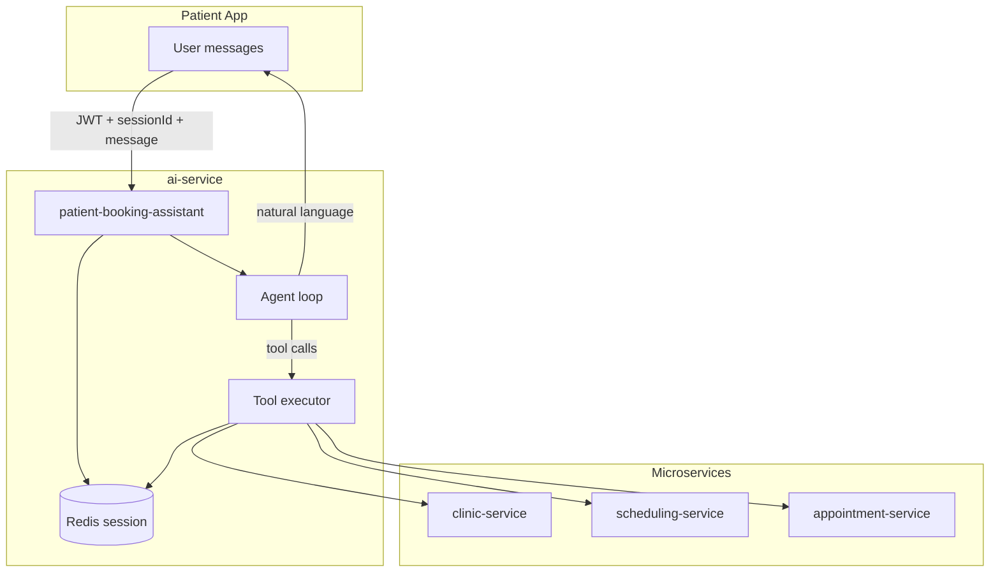
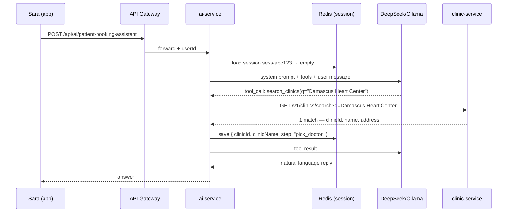
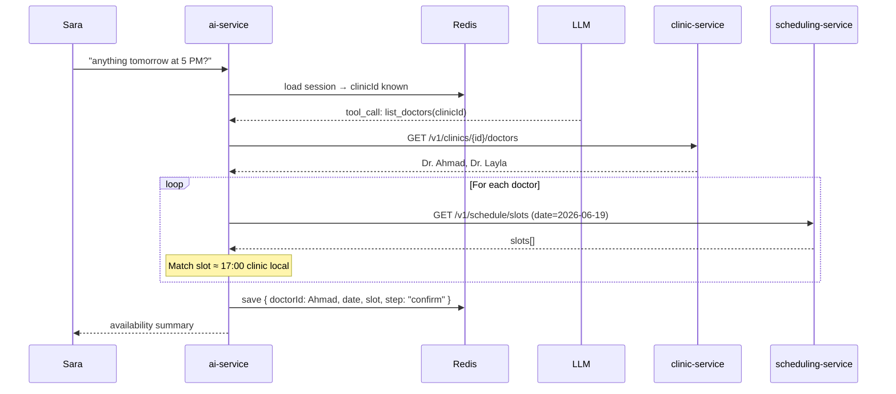
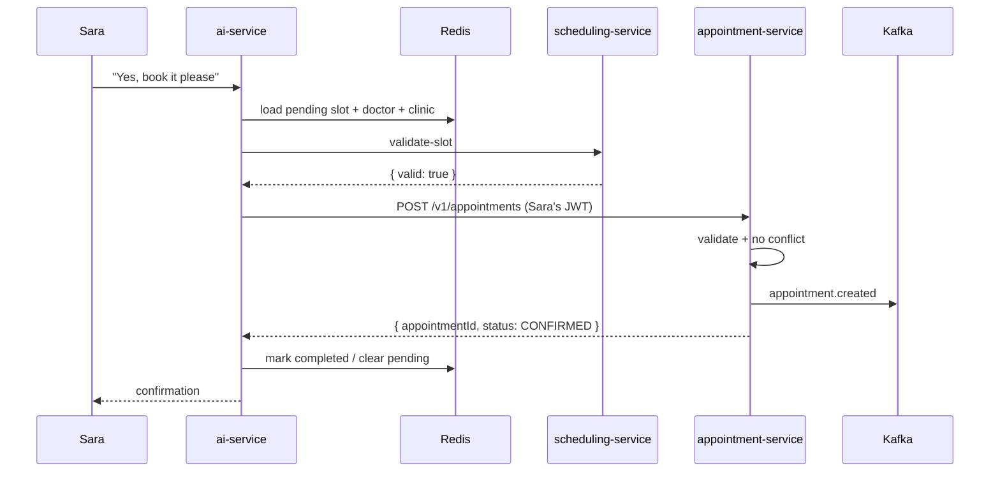
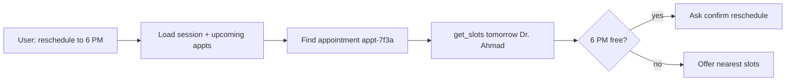
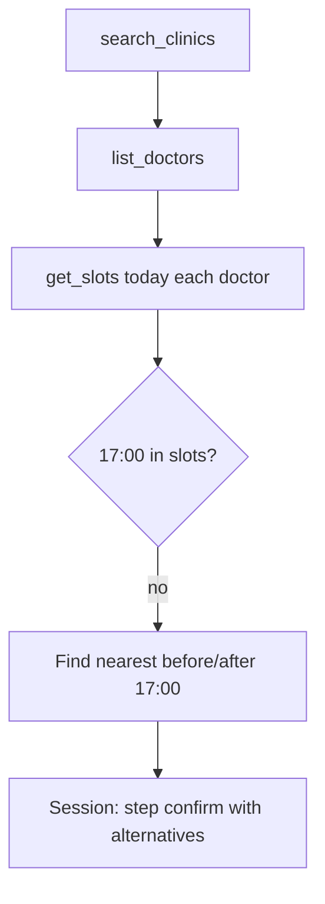
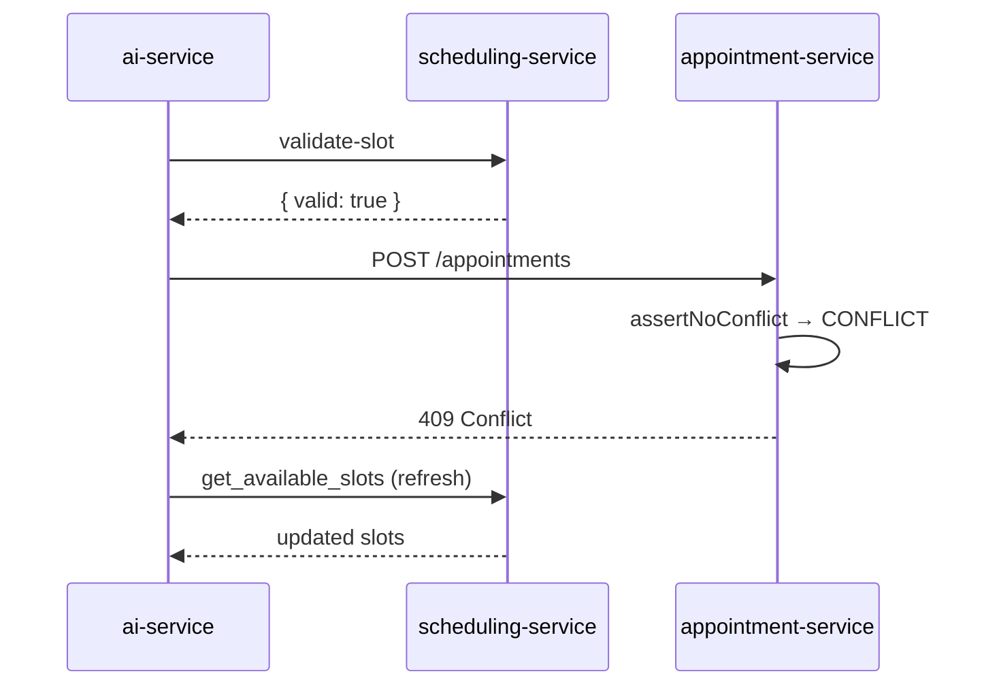
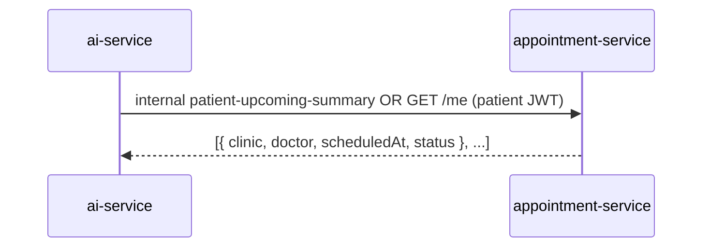
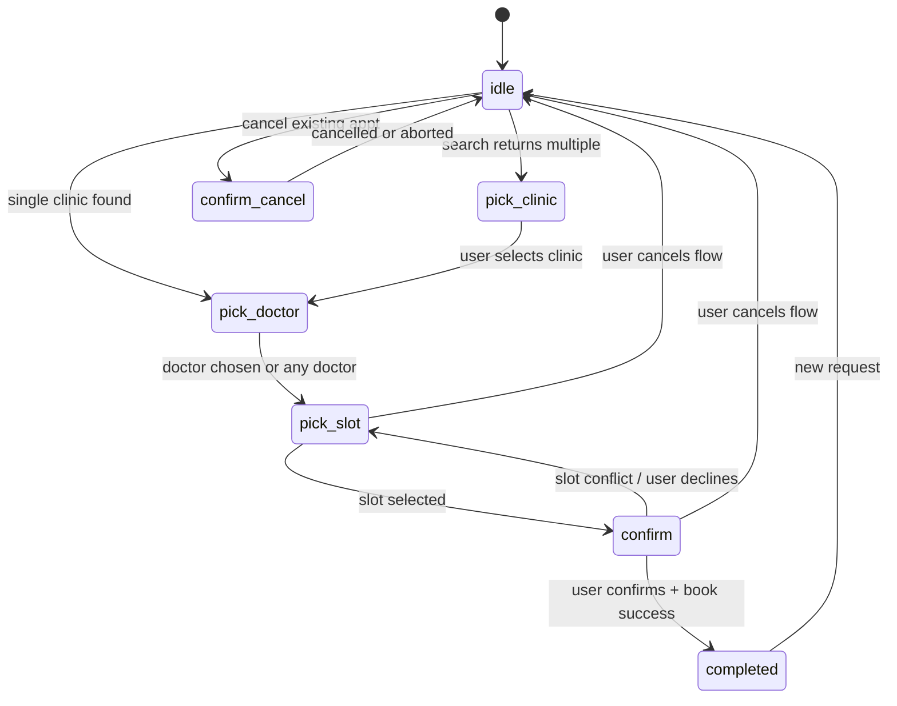

# AI Patient Booking Assistant — Scenario Reference

This document describes **expected behavior** once the full patient booking assistant is implemented in `ai-service` (tool-calling agent + Redis session + microservice APIs).

**Assumed endpoint:** `POST /api/ai/patient-booking-assistant`  
**Payload:** `{ "sessionId": string, "message": string }`  
**Auth:** Patient JWT via API Gateway  

**Tools (conceptual):**

| Tool | Service | Purpose |
|------|---------|---------|
| `search_clinics` | clinic-service | Find clinics by name, city, etc. |
| `list_doctors` | clinic-service | Doctors at a clinic |
| `get_available_slots` | scheduling-service | Free slots for clinic + doctor + date |
| `book_appointment` | appointment-service | Create booking (patient JWT) |
| `update_appointment` | appointment-service | Reschedule / change time |
| `cancel_appointment` | appointment-service | Cancel with reason |

**Design rules (all scenarios):**

- LLM never queries databases directly — only tools → microservice HTTP APIs.
- Slot is **re-validated** immediately before any write.
- Booking requires an explicit user confirmation (“Yes, book it”).
- Session state lives in Redis (`sessionId` → clinic, doctor, date, pending slot, step).

---

## Architecture overview



---

## Scenario 1 — Happy path: search, check 5 PM, book

**Patient:** Sara  
**Goal:** Find “Damascus Heart Center”, check **5 PM tomorrow**, book if available.

### Turn 1 — Search clinic

**User sends:**
```json
{
  "sessionId": "sess-abc123",
  "message": "I'm looking for a clinic called Damascus Heart Center"
}
```

**Under the hood:**


**AI returns:**
> I found **Damascus Heart Center** on Al-Mazzeh Street, Damascus.
>
> Doctors available there:
> - **Dr. Ahmad Khalil** — Cardiology
> - **Dr. Layla Haddad** — Internal Medicine
>
> Which doctor would you like, or should I check availability with any of them?

**Session:** `{ clinicId, clinicName: "Damascus Heart Center", step: "pick_doctor" }`

---

### Turn 2 — Check 5 PM tomorrow

**User sends:**
```json
{
  "sessionId": "sess-abc123",
  "message": "Do you have anything tomorrow at 5 PM?"
}
```

**Under the hood:**


**AI returns:**
> For **tomorrow (Friday, 19 June)**:
>
> - **5:00 PM** — available with **Dr. Ahmad Khalil**
> - **5:00 PM** — not available with Dr. Layla Haddad (next slot: 6:30 PM)
>
> Would you like me to book **tomorrow at 5:00 PM** with **Dr. Ahmad Khalil**?

---

### Turn 3 — Confirm booking

**User sends:**
```json
{
  "sessionId": "sess-abc123",
  "message": "Yes, book it please"
}
```

**Under the hood:**


**AI returns:**
> Done. Your appointment is confirmed.
>
> **Damascus Heart Center**  
> **Dr. Ahmad Khalil** — Cardiology  
> **Friday, 19 June 2026 — 5:00 PM**  
> **Reference:** `appt-7f3a-...`
>
> Please arrive 10–15 minutes early with your ID and insurance card.
>
> *Disclaimer: This assistant helped schedule your visit. For medical questions, speak with your doctor.*

---

### Turn 4 — Reschedule follow-up

**User sends:**
```json
{
  "sessionId": "sess-abc123",
  "message": "Can I reschedule to 6 PM instead?"
}
```

**Under the hood:**


**AI returns:**
> **6:00 PM tomorrow** is available with Dr. Ahmad Khalil.
>
> Should I move your appointment from **5:00 PM → 6:00 PM**?

---

### Turn 5 — FAQ during same session

**User sends:**
```json
{
  "sessionId": "sess-abc123",
  "message": "Do I need to fast before this visit?"
}
```

**Under the hood:** FAQ mode only — no booking tools, uses visit context from session.

**AI returns:**
> For a routine cardiology follow-up, fasting is usually **not** required unless your clinic told you otherwise. If blood work is included, you may need to fast 8–12 hours — confirm with the clinic if unsure.
>
> *Disclaimer: General information only, not medical advice.*

---

### Scenario 1 — Conversation summary

| Turn | User says | Main backend action | AI reply (summary) |
|------|-----------|---------------------|---------------------|
| 1 | Find Damascus Heart Center | `search_clinics` | Found clinic + doctors |
| 2 | Anything tomorrow at 5 PM? | `list_doctors` + `get_slots` × 2 | 5 PM free with Dr. Ahmad |
| 3 | Yes, book it | `validate_slot` + `book_appointment` | Confirmed |
| 4 | Reschedule to 6 PM? | `get_slots` + pending `update_appointment` | 6 PM available — confirm? |
| 5 | Do I need to fast? | FAQ only | General prep advice |

---

## Scenario 2 — Ambiguous clinic name (multiple matches)

**Patient:** Omar  
**Goal:** Book at “City Clinic” — name matches several locations.

### Turn 1

**User:** `"I want to book at City Clinic tomorrow afternoon"`

**Under the hood:**
- `search_clinics(q="City Clinic")` → 3 results (Downtown, Mazzeh, Jaramana)
- Session: `{ step: "pick_clinic", candidates: [...] }`
- No slot check yet — clinic not chosen

**AI returns:**
> I found **3 clinics** named “City Clinic”:
>
> 1. **City Clinic — Downtown** (Al-Shaalan)  
> 2. **City Clinic — Mazzeh** (Al-Mazzeh)  
> 3. **City Clinic — Jaramana** (Jaramana)
>
> Which location do you mean? You can reply with **1**, **2**, or **3**.

### Turn 2

**User:** `"Mazzeh"`

**Under the hood:**
- Resolve candidate #2 → `clinicId`
- `list_doctors` → 2 doctors
- `get_available_slots` for tomorrow afternoon (13:00–17:00 window) for both doctors
- Session: `{ clinicId, step: "pick_slot" }`

**AI returns:**
> At **City Clinic — Mazzeh** tomorrow afternoon:
>
> - **2:00 PM** — Dr. Samir Nassar  
> - **3:30 PM** — Dr. Samir Nassar  
> - **4:00 PM** — Dr. Rana Issa  
>
> Which time works for you?

### Turn 3

**User:** `"4 PM with Dr. Rana"`

**Under the hood:**
- Match slot → `step: "confirm"`

**AI returns:**
> Book **tomorrow 4:00 PM** with **Dr. Rana Issa** at City Clinic Mazzeh?

---

## Scenario 3 — Requested time not available (alternatives)

**Patient:** Nour  
**Goal:** Book **5 PM today** — slot taken.

### Turn 1

**User:** `"Book me at Al-Noor Medical Center today at 5 PM with any doctor"`

**Under the hood:**


- `search_clinics` → 1 match  
- `list_doctors` → Dr. Youssef only  
- `get_available_slots(today)` → 5 PM **not** in list (booked or outside hours)  
- Nearest: **4:30 PM**, **5:30 PM**

**AI returns:**
> **5:00 PM today** is not available at Al-Noor Medical Center with Dr. Youssef.
>
> Closest options:
> - **Today 4:30 PM**
> - **Today 5:30 PM**
> - **Tomorrow 5:00 PM**
>
> Would you like one of these, or a different day?

### Turn 2

**User:** `"Tomorrow 5 PM is fine"`

**Under the hood:**
- `get_available_slots(tomorrow)` → 5 PM **available**
- Session: pending slot, `step: "confirm"`

**AI returns:**
> **Tomorrow at 5:00 PM** is available. Should I book it?

---

## Scenario 4 — Race condition: slot taken between check and book

**Patient:** Hana  
**Goal:** Confirm booking but another patient took the slot seconds earlier.

### Turn 1–2

*(Same as happy path — slot shown as available, user confirms.)*

**User:** `"Yes, book it"`

**Under the hood:**


**AI returns:**
> Sorry — **5:00 PM** was just booked by someone else.
>
> Still available today:
> - **5:30 PM**
> - **6:00 PM**
>
> Would you like me to book one of these instead?

**Session:** `{ step: "pick_slot" }` — pending booking cleared, clinic/doctor retained.

---

## Scenario 5 — User cancels mid-flow

**Patient:** Karim  
**Goal:** Starts booking, then backs out.

### Turn 1

**User:** `"Find Green Valley Clinic and book Monday morning"`

**AI:** *(search + slots)* → offers Mon 9:00 AM, 9:30 AM, 10:00 AM.

### Turn 2

**User:** `"Actually never mind, cancel"`

**Under the hood:**
- Intent: `cancel_flow` (no API write to appointments)
- Redis: delete pending slot / reset `step` to `idle`
- Optional: keep `sessionId` for new requests

**AI returns:**
> No problem — I’ve cancelled the booking request. Nothing was scheduled.
>
> If you want to book later, just tell me the clinic and time.

---

## Scenario 6 — Specific doctor unavailable; user switches

**Patient:** Lina  
**Goal:** Must see **Dr. Hassan**; he has no 5 PM slots.

### Turn 1

**User:** `"I need Dr. Hassan at Central Hospital tomorrow at 5 PM"`

**Under the hood:**
- `search_clinics` → Central Hospital  
- `list_doctors` → verify Dr. Hassan exists at clinic  
- `get_available_slots(tomorrow, doctorId=Hassan)` → no 17:00 slot  
- Dr. Hassan's next: **3:00 PM**, **6:00 PM**

**AI returns:**
> Dr. **Hassan** doesn’t have **5:00 PM** tomorrow at Central Hospital.
>
> His available times tomorrow:
> - **3:00 PM**
> - **6:00 PM**
>
> Would either work, or should I check another doctor at the same clinic?

### Turn 2

**User:** `"Check another doctor at 5 PM"`

**Under the hood:**
- `get_available_slots` for other doctors at same clinic  
- Dr. Maha has 5:00 PM

**AI returns:**
> **Dr. Maha Farouk** has **5:00 PM** tomorrow. Book with her instead of Dr. Hassan?

---

## Scenario 7 — Clinic closed / no slots on requested day

**Patient:** Ali  
**Goal:** Book on **Friday** — clinic closed that day.

### Turn 1

**User:** `"Book Damascus Heart Center this Friday at 10 AM"`

**Under the hood:**
- `search_clinics` → match  
- `get_available_slots(Friday)` → `[]` (clinic hours: `isClosed: true` for Friday)

**AI returns:**
> **Damascus Heart Center** is **closed on Fridays**.
>
> Next openings:
> - **Saturday 9:00 AM** — multiple slots  
> - **Sunday 10:00 AM** — multiple slots  
>
> Which day would you prefer?

---

## Scenario 8 — View existing appointments (read-only, no new booking)

**Patient:** Sara (already has upcoming visits)  
**Goal:** Ask what’s already booked — uses existing `getPatientUpcomingSummary` + optional `GET /appointments/me`.

### Turn 1

**User:** `"What appointments do I have coming up?"`

**Under the hood:**


**AI returns:**
> You have **2 upcoming appointments**:
>
> 1. **Mon 23 Jun, 9:00 AM** — Dr. Ahmad Khalil, Damascus Heart Center (Confirmed)  
> 2. **Thu 26 Jun, 2:30 PM** — Al-Noor Medical Center, Dr. Youssef (Confirmed)
>
> Would you like to reschedule or cancel either of these, or book something new?

---

## Scenario 9 — Cancel existing appointment via chat

**Patient:** Sara  
**Goal:** Cancel the Monday visit.

### Turn 1

**User:** `"Cancel my Monday appointment at Damascus Heart Center"`

**Under the hood:**
- Load upcoming appointments → match Mon 23 Jun  
- Session: `{ appointmentId, step: "confirm_cancel" }`

**AI returns:**
> Cancel this appointment?
>
> **Mon 23 Jun, 9:00 AM** — Dr. Ahmad Khalil, Damascus Heart Center  
>
> Reply **yes** to confirm cancellation.

### Turn 2

**User:** `"Yes"`

**Under the hood:**
- `PATCH /v1/appointments/{id}/status` → `CANCELLED`
- Kafka: `appointment.cancelled`

**AI returns:**
> Your appointment on **Mon 23 Jun at 9:00 AM** has been cancelled. You can book a new time anytime.

---

## Scenario 10 — Mixed language / vague time (NLU edge case)

**Patient:** Rami  
**Goal:** Casual phrasing — system must normalize time and date.

### Turn 1

**User:** `"بدي موعد بكرة العصر عند عيادة الشام"`  
*(Arabic: "I want an appointment tomorrow afternoon at Al-Sham clinic")*

**Under the hood:**
- LLM extracts: `clinicQuery="Al-Sham"`, `date=tomorrow`, `timeWindow=afternoon (13:00–17:00)`  
- `search_clinics` → Al-Sham Polyclinic  
- `get_available_slots` filtered to afternoon window  

**AI returns:**
> (Arabic or bilingual reply, per product setting)
>
> At **Al-Sham Polyclinic** tomorrow afternoon:
> - **2:00 PM** — Dr. …  
> - **3:30 PM** — Dr. …  
>
> Which time do you prefer?

---

## Error handling (all scenarios)

| Condition | System behavior | Example AI message |
|-----------|-----------------|-------------------|
| Clinic not found | No booking tools run | "I couldn't find that clinic. Try a different name or city." |
| No doctors at clinic | Stop before slots | "This clinic has no doctors listed yet. Please contact the clinic." |
| User not logged in | 401 from gateway | "Please log in to book an appointment." |
| Rate limit | 429 from ai-service | "Too many requests — please wait a moment." |
| Service down | Circuit breaker / graceful fail | "Booking is temporarily unavailable. Try again or call the clinic." |
| User confirms without pending slot | No write | "I don't have a time selected yet. Which clinic and time do you want?" |

---

## Session state machine



---

## Related documentation

- Patient REST APIs: `Postman-Patient-Endpoints.postman_collection.json` (Discover, Scheduling, Appointments)
- Current AI service (FAQ only): `Integrations/AI/ai-service/` — `patient-chat` does **not** implement this document yet
- Use case index: `UseCase.md` — Book Appointment, View Slots, AI Patient Chat

---

*This file describes target behavior for a future `patient-booking-assistant` implementation. It is not implemented in the codebase as of the last update.*
