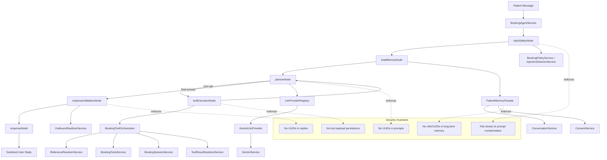

# LangGraph Booking Architecture

## Notes
- LangGraph orchestration is enabled by `LANGGRAPH_ENABLED=true`.
- Provider selection is configuration-based via `AI_PROVIDER` (initial provider: Gemini).
- LangGraph does not access PostgreSQL directly; all booking operations remain tool/API mediated.
