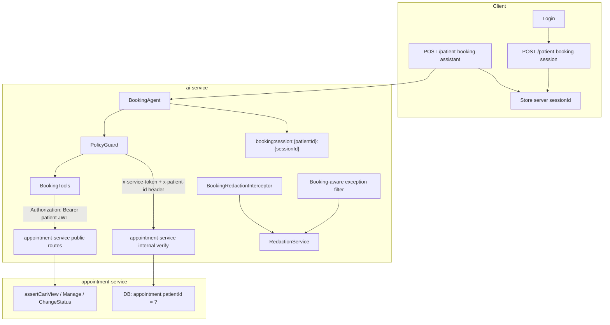

# Phase 1 Remediation Plan — Security Fixes (R1–R4)

**Status:** Implemented (2026-06-22)  
**Scope:** Close verification gaps from Phase 1 audit. **Do not start Phase 2.**

**Approval amendments (2026-06-22):**
1. Internal ownership verify uses **`x-patient-id` header** + body `{ appointmentId }` — never `patientId` in body.
2. Injection detection: **403 only for high-confidence** (tool JSON, encoded tools, explicit internal/ID/token/prompt requests). Generic jailbreak phrases continue with normal scope restrictions.

---

## Recommended Architecture (Summary)



---

## R1 — Patient-Scoped Appointment Mutations

### Problem

`appointment-http.client-v2.ts` calls `POST/PATCH /v1/appointments/*` with **only** `x-service-token`. Appointment-service `JwtAuthGuard` requires a **Bearer JWT**, so mutations fail auth today. If “fixed” with service token alone, **ownership would be bypassed**.

### Options Evaluated

| Approach | Pros | Cons | Verdict |
|----------|------|------|---------|
| **A. Forward patient JWT** to existing public routes | Reuses `assertCanView/Manage/ChangeStatus`; no new mutation surface; strongest alignment with gateway model | JWT expiry; must map `slotId` → `scheduledAt`; ai-service must never log token | **Primary choice for mutations** |
| **B. New internal mutation endpoints** (`x-service-token` + `patientId`) | No JWT forwarding; works for long sessions | New attack surface if `patientId` trusted from body; duplicate auth logic | **Avoid for mutations** |
| **C. Hybrid** — JWT for mutations, internal for read/verify | Best of both | Two patterns to maintain | **Recommended overall** |

### Selected Design: **Hybrid C**

#### Mutations — patient JWT (required)

| Operation | Route | Auth | Ownership enforcement |
|-----------|-------|------|------------------------|
| Book | `POST /v1/appointments` | `Authorization: Bearer <patient JWT>` | `resolvePatientId`: PATIENT role → `actor.userId`; `assertCanCreate` |
| Cancel | `PATCH /v1/appointments/:id/status` | Patient JWT | `assertCanChangeStatus` (patient + own appointment + CANCELLED only) |
| Reschedule | `PUT /v1/appointments/:id` | Patient JWT | `assertCanManage` (patient owns appointment) |

**ai-service changes:**

- `AppointmentHttpClient.bookAppointment(cancel, update)(..., patientAuthHeader: string)` — pass through `Authorization` from controller.
- Remove `x-service-token` from mutation calls (gateway adds it for proxied calls; direct service-to-service calls use JWT only for mutations).
- Map booking payload: `{ clinicId, doctorId, scheduledAt }` using session `date` + `slotTime` (or extend scheduling internal `get-slot` if needed).
- Fix cancel body: `{ status: 'CANCELLED', cancellationReason }` (not `reason`).

#### Reads / ownership verify — internal (service token + trusted header)

| Operation | Route | Auth | Ownership |
|-----------|-------|------|-----------|
| Upcoming summary | `POST /internal/patient-upcoming-summary` | `x-service-token` | Query scoped by `patientId` from ai JWT context |
| **Verify ownership** (new) | `POST /internal/verify-ownership` | `x-service-token` + **`x-patient-id` header** | `SELECT WHERE id = ? AND patientId = ?` |

Replace `isAppointmentOwnedByPatient` list-scan with DB ownership check (fixes false negatives beyond top-50 upcoming).

**appointment-service new endpoint:**

```typescript
// POST /v1/appointments/internal/verify-ownership
// Headers: x-service-token, x-patient-id (trusted metadata — NOT request body)
// Body: { appointmentId: UUID }
// Guard: InternalServiceGuard
// Returns: { owned: boolean }
```

`x-patient-id` is set by ai-service from JWT `req.user.userId` only. Appointment-service treats it as trusted caller metadata (same trust model as gateway `x-user-id`), not user-controlled payload.

### Tradeoffs

- **JWT forwarding:** Simplest path to real `assertCan*` enforcement. Risk: expired JWT mid-chat → user re-authenticates. Acceptable for patients.
- **Internal verify:** Keeps policy guard accurate without exposing appointment IDs to JWT-less paths for writes.
- **Not chosen:** Internal book/cancel — would duplicate authorization and invite `patientId` spoofing if miswired.

---

## R2 — Remove UUIDs from Logs

### New shared utility

**File:** `ai-service/src/ai/security/secure-logging.ts`

```typescript
export function correlationId(req?: { headers?: Record<string, string> }): string;
export function hashRef(value: string): string;  // sha256 → 8-char hex prefix
export function sanitizeAxiosError(err: unknown): {
  correlationId: string;
  status?: number;
  code?: string;
  reason: string;
};
```

Use `x-correlation-id` from gateway or generate per request via `AsyncLocalStorage` middleware.

### Files to update

| File | Change |
|------|--------|
| `booking-policy.service.ts` | `Cancel denied` → `{ correlationId, reason: 'ownership_check_failed' }` |
| `booking-session.service.ts` | Remove `sessionId` from logs; use `hashRef(sessionId)` |
| `appointment-http.client-v2.ts` | `sanitizeAxiosError` on all catches |
| `clinic-http.client.ts` | Same |
| `scheduling-http.client.ts` | Same |
| `user-http.client.ts` | Same |
| `booking-agent.service.ts` | `LLM call failed` → structured, no `${error}` |
| `ai-rate-limit.service.ts` | Structured log on Redis failure |

### Rule

Never interpolate: `patientId`, `appointmentId`, `clinicId`, `doctorId`, `sessionId`, JWTs, prompts, tool JSON, or raw `error` objects.

---

## R3 — Redaction on Exception Paths

### Problem

`BookingRedactionInterceptor` uses `map()` — exceptions skip redaction.

### Selected approach: **Path-aware extension of global exception filter**

**Why not `catchError` in interceptor alone:**

- Validation errors throw before handler; interceptor `catchError` may not see all pipe errors consistently.
- A single **exception filter** is the Nest-recommended place for all error response shaping.

**Implementation:**

1. Extend `AiExceptionFilter` (or add `BookingExceptionFilter` registered after it) to:
   - Detect `req.url` ends with `/patient-booking-assistant` or `/patient-booking-session`
   - Run `RedactionService.redactOutput()` on all string fields in JSON body (`message`, `error`, array messages)
   - Recursively redact nested validation error arrays
2. Keep `BookingRedactionInterceptor` for **success** path input sanitization + output redaction (defense in depth).
3. Document in filter header comment: *booking routes always redact outbound bodies*.

**Coverage matrix (after fix):**

| Path | Mechanism |
|------|-----------|
| Success | Interceptor + agent |
| 403 Forbidden | Exception filter |
| 400 Validation | Exception filter |
| 429 Rate limit | Exception filter |
| 408/504 Timeout | Exception filter |
| 500 Unhandled | Exception filter |

---

## R4 — Server-Generated Session IDs

### Problem

Client sends `sessionId` (default `browser-test-1`); no rotation on login.

### API changes

#### 1. New endpoint: `POST /v1/ai/patient-booking-session`

- Auth: `PATIENT` JWT
- Body: optional `{ resumeToken?: string }` (legacy client sessionId)
- Behavior:
  - Generate `sessionId = crypto.randomUUID()`
  - If `resumeToken` provided: attempt `get(patientId, resumeToken)` → migrate state to new key → delete old keys
  - Store `booking:active-session:{patientId}` → current `sessionId` (for rotation invalidation)
  - Return `{ sessionId, expiresInSeconds: 3600 }`

#### 2. Change `PatientBookingAssistantDto`

```typescript
sessionId?: string;  // optional resume hint only — NOT trusted as authority
message: string;
```

Server resolves effective session:

1. If `sessionId` matches `booking:active-session:{patientId}` → use it
2. Else if missing/unknown → **reject** with `400` + message: *Call /patient-booking-session first* (or auto-create only on first message — prefer explicit init for clarity)

**Recommendation:** Explicit init endpoint (clearer rotation semantics).

#### 3. Login rotation (client)

After successful login/MFA:

```typescript
POST /api/ai/patient-booking-session  // no resumeToken
→ store sessionId in memory (not user-editable input)
```

Remove editable `sessionId` field from test UI (display-only).

#### 4. Invalidation

On new session init:

- `DEL booking:session:{patientId}:{oldSessionId}`
- `DEL booking:session:{oldResumeToken}` (legacy)
- Update `booking:active-session:{patientId}`

### Migration

| Client behavior | Server behavior |
|-----------------|-----------------|
| Old client sends `browser-test-1` | First init with `resumeToken: "browser-test-1"` migrates Redis state |
| New client | Always uses server `sessionId` |
| Legacy key `booking:session:{sessionId}` | Existing lazy migration retained |

---

## Additional Fixes

### Prompt-injection (tiered)

**File:** `injection-detector.service.ts`

| Tier | Examples | Action |
|------|----------|--------|
| **High-confidence (403)** | Embedded `{"tool":...}`, encoded tool calls, explicit requests for prompts/UUIDs/tokens/hidden context/tool outputs | `ForbiddenException` |
| **Benign / conversational** | `ignore previous instructions`, `disregard the above` | **Allow** — continue with normal PolicyGuard + scope restrictions |

HTTP 403 reserved for high-confidence attacks only.

### Rate limiting — fail-closed with in-memory fallback

**File:** `ai-rate-limit.service.ts`

```typescript
// When Redis unavailable:
// 1. Use per-process Map<userId, { count, windowStart }>
// 2. Same maxRequests / windowSeconds
// 3. Log: { correlationId, reason: 'redis_unavailable_using_memory_fallback' }
// 4. If both Redis AND memory fail → throw 503 (fail-closed)
```

Remove `allowing request` on Redis error.

---

## File-by-File Implementation Plan

### appointment-service

| File | Action |
|------|--------|
| `controllers/internal-appointment.controller.ts` | Add `POST verify-ownership` |
| `services/appointment.service.ts` | Add `verifyOwnership(patientId, appointmentId)` |
| `dto/internal.dto.ts` (new) | Validated DTO for internal bodies |

### ai-service

| File | Action |
|------|--------|
| `security/secure-logging.ts` | **NEW** — correlationId, hashRef, sanitizeAxiosError |
| `security/injection-detector.service.ts` | **NEW** — expanded injection patterns |
| `security/redaction.service.ts` | Delegate injection checks; deepen redaction |
| `security/booking-policy.service.ts` | Use `verifyOwnership` internal; safe logs |
| `services/appointment-http.client-v2.ts` | JWT mutations; internal verify; safe logs |
| `services/booking-tools.service.ts` | Pass `authHeader` to appointment client |
| `services/booking-agent.service.ts` | Pass auth; session resolution via active session |
| `services/booking-session.service.ts` | `resolveSession`, `createSession`, `rotateSession`; safe logs |
| `services/scheduling-http.client.ts` | Optional: resolve slot → scheduledAt; safe logs |
| `services/ai-rate-limit.service.ts` | Memory fallback; fail-closed |
| `interceptors/booking-redaction.interceptor.ts` | Minor: correlation ID attachment |
| `common/filters/ai-exception.filter.ts` | Booking-path response redaction |
| `common/middleware/correlation-id.middleware.ts` | **NEW** |
| `dto/booking-assistant.dto.ts` | `sessionId` optional |
| `dto/booking-session.dto.ts` | **NEW** |
| `controllers/ai.controller.ts` | Session init endpoint; pass auth everywhere |
| `ai.module.ts` | Register new providers |

### Frontend (test page only)

| File | Action |
|------|--------|
| `patient-ai-test/src/app.ts` | Call session init on login; remove editable sessionId |
| `patient-ai-test/index.html` | Display sessionId read-only |

### Tests

| File | Action |
|------|--------|
| `test/secure-logging.spec.ts` | **NEW** |
| `test/injection-detector.spec.ts` | **NEW** |
| `test/booking-exception-filter.spec.ts` | **NEW** |
| `test/booking-session.service.spec.ts` | **NEW** — rotation, migration |
| `test/appointment-http.client.spec.ts` | **NEW** — JWT header present on mutations |
| `test/booking-policy.service.spec.ts` | Update for verify-ownership mock |
| `test/booking-assistant.e2e.spec.ts` | **NEW** — E2E scenarios below |

---

## Migration Strategy

### Deployment order

1. **appointment-service** — deploy `verify-ownership` (backward compatible)
2. **ai-service** — deploy all fixes
3. **Rebuild** `docker compose up -d --build appointment-service ai-service`
4. **Frontend test page** — session init flow

### Redis key additions

| Key | Purpose |
|-----|---------|
| `booking:active-session:{patientId}` | Current valid sessionId |
| `booking:session:{patientId}:{sessionId}` | Unchanged |

### Backward compatibility (2-week window)

- Accept optional `resumeToken` on session init for old clients
- Log deprecation warning (structured, no IDs): `reason: 'legacy_resume_token_used'`
- Remove resume-from-client-`sessionId` on assistant DTO in Phase 2

### Rollback

- appointment-service internal endpoint is additive — safe to rollback ai-service independently
- JWT mutation path uses existing routes — no rollback risk on appointment-service

---

## Test Plan

### Unit

| ID | Test | Pass criteria |
|----|------|---------------|
| U1 | `hashRef` never equals raw UUID | Hash only in log output |
| U2 | `sanitizeAxiosError` | No response body in log object |
| U3 | Injection detector | Blocks 6+ attack strings |
| U4 | Exception filter | 403 body redacted when message contains UUID |
| U5 | Session rotate | Old key deleted; new key active |
| U6 | Appointment client book | `Authorization` header set; no `x-service-token` alone |

### E2E (supertest or dockerized)

| ID | Scenario | Pass criteria |
|----|----------|---------------|
| E1 | UUID leakage | Response body has no UUID regex match |
| E2 | Session hijacking | Patient B cannot read Patient A session with A's sessionId |
| E3 | Unauthorized cancel | Cancel victim appointment → 403 at policy + appointment unchanged |
| E4 | Prompt injection (high-confidence) | `{"tool":"cancel_appointment"...}` → 403 |
| E4b | Benign jailbreak phrase | `ignore previous instructions` → **200**, normal processing |
| E5 | Exception redaction | Force 403 with UUID in internal message → client sees redacted |
| E6 | Rate limit Redis down | Memory fallback enforces limit (no bypass) |
| E7 | Session init on login | New sessionId after login; old session rejected |

### Manual smoke

1. Login demo patient → session init → book flow search
2. `grep -E` UUID pattern on network responses
3. Check container logs for raw UUIDs — none

---

## Updated Go / No-Go for Phase 2

| Gate | Current | After remediation |
|------|---------|-------------------|
| R1 downstream ownership | **FAIL** | **PASS** (target) |
| R2 log hygiene | **FAIL** | **PASS** (target) |
| R3 exception redaction | **FAIL** | **PASS** (target) |
| R4 session IDs | **FAIL** | **PASS** (target) |
| E2E security tests | **MISSING** | **PASS** (target) |

### Recommendation

**NO-GO for Phase 2 today.**

**GO for Phase 2 after:**

- [ ] This plan approved
- [ ] Implementation merged and deployed
- [ ] All U1–U6 + E1–E7 pass
- [ ] Manual smoke + log UUID scan clean
- [ ] Re-run verification checklist from `PHASE1_SECURITY.md`

---

## Approval Checklist

Reply to approve or request changes:

- [x] Hybrid R1 approach (JWT mutations + internal verify with `x-patient-id` header)
- [x] Session init endpoint + client rotation
- [x] Exception filter extension (vs interceptor-only)
- [x] Fail-closed rate limit with memory fallback
- [x] Tiered injection detection
- [x] Proceed with implementation
