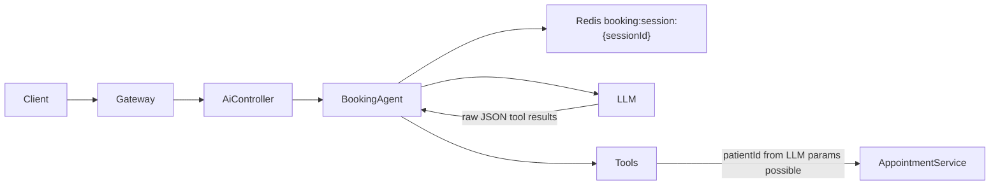
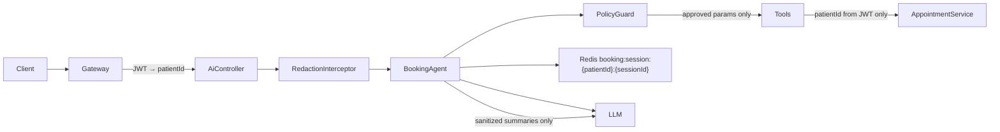

# Phase 1 — Patient Booking Assistant Security

**Status:** Implemented (awaiting approval before Phase 2)  
**Scope:** Security hardening only — no memory, multilingual, or compliance features.

---

## 1. Architecture Changes

### Before



**Problems:** Client-controlled `sessionId`, no patient binding, UUIDs in prompts and LLM context, tool calls executable without ownership checks, prompt injection via embedded JSON.

### After



**Principles:**

| Layer | Responsibility |
|-------|----------------|
| **JWT context** | Sole source of `patientId` |
| **Session service** | Keys scoped to authenticated patient |
| **Redaction** | Strip UUIDs, tokens, endpoints from I/O |
| **PolicyGuard** | Allowlist tools, validate params, ownership |
| **Tool sanitizer** | Human summaries for LLM (no raw JSON) |
| **Tools service** | Defense-in-depth ownership on cancel |

---

## 2. File-by-File Modification Plan

| File | Action | Changes |
|------|--------|---------|
| `security/booking-tool.types.ts` | **NEW** | Approved tool list, `PolicyContext`, `PolicyDecision` |
| `security/redaction.service.ts` | **NEW** | UUID/JWT/URL redaction, injection pattern detection |
| `security/tool-result-sanitizer.service.ts` | **NEW** | LLM-safe tool summaries |
| `security/booking-policy.service.ts` | **NEW** | PolicyGuard — validates every tool call |
| `interceptors/booking-redaction.interceptor.ts` | **NEW** | HTTP input/output redaction middleware |
| `services/booking-session.service.ts` | **MODIFIED** | Key `booking:session:{patientId}:{sessionId}`, legacy migration |
| `services/booking-agent.service.ts` | **MODIFIED** | Policy integration, no IDs in prompts, sanitized LLM context |
| `services/booking-tools.service.ts` | **MODIFIED** | `cancelAppointment(patientId, ...)` with ownership check |
| `services/appointment-http.client-v2.ts` | **MODIFIED** | `isAppointmentOwnedByPatient()` |
| `controllers/ai.controller.ts` | **MODIFIED** | `@UseInterceptors(BookingRedactionInterceptor)` |
| `ai.module.ts` | **MODIFIED** | Register security providers |
| `test/*.spec.ts` | **NEW** | Unit tests for redaction, policy, sanitizer |
| `PHASE1_SECURITY.md` | **NEW** | This document |

---

## 3. New Interfaces and Schemas

### `booking-tool.types.ts`

```typescript
export const APPROVED_BOOKING_TOOLS = [
  'search_clinics',
  'list_doctors',
  'get_available_slots',
  'book_appointment',
  'get_upcoming_appointments',
  'cancel_appointment',
] as const;

export interface PolicyContext {
  patientId: string;      // from JWT only
  sessionId: string;
  userMessage: string;
}

export interface PolicyDecision {
  allowed: boolean;
  reason?: string;
  normalizedTool?: ApprovedBookingTool;
  sanitizedParams?: Record<string, unknown>;
}
```

### `BookingSession` (extended)

```typescript
export interface BookingSession {
  patientId?: string;
  clinicId?: string;              // server-only, never in LLM prompt
  clinicName?: string;
  doctorId?: string;
  doctorName?: string;
  doctorCandidates?: Array<{ id: string; name?: string }>;
  candidates?: Array<{ id: string; name?: string; city?: string; address?: string }>;
  date?: string;
  slotId?: string;
  slotTime?: string;
  appointmentId?: string;
  step?: 'pick_doctor' | 'pick_slot' | 'confirm' | 'completed';
}
```

### Forbidden LLM parameters

`patientId`, `userId`, `authorization`, `token`, `accessToken`, `refreshToken`

### Policy rules (summary)

| Tool | Params allowed from LLM | Server-resolved |
|------|-------------------------|-----------------|
| `search_clinics` | `query` | — |
| `list_doctors` | — | `clinicId` from session/candidates |
| `get_available_slots` | `date` | `clinicId`, `doctorId` from session |
| `book_appointment` | — | all IDs from session; requires `step === 'confirm'` |
| `get_upcoming_appointments` | none | `patientId` from JWT |
| `cancel_appointment` | `reason` | `appointmentId` validated against patient's appointments |

---

## 4. Migration Strategy

### Redis session keys

| Old | New |
|-----|-----|
| `booking:session:{sessionId}` | `booking:session:{patientId}:{sessionId}` |

**Runtime migration (lazy):**

1. On `get(patientId, sessionId)`, read scoped key first.
2. If missing, read legacy key `booking:session:{sessionId}`.
3. If legacy exists and `legacy.patientId` mismatches authenticated patient → return empty session (no hijack).
4. Otherwise copy to scoped key, delete legacy key.

**No downtime required.** Old sessions migrate on next access. Unreferenced legacy keys expire via TTL (1 hour).

### Deployment order

1. Deploy ai-service with Phase 1 code.
2. Verify tests pass (`npm test` in ai-service).
3. Rebuild container: `docker compose up -d --build ai-service`.
4. Smoke-test patient booking assistant on `:5175` test page.

---

## 5. Test Plan

### Automated (Jest)

| Test file | Scenario |
|-----------|----------|
| `redaction.service.spec.ts` | UUID leakage, JWT redaction, injection pattern, URL redaction |
| `booking-policy.service.spec.ts` | Embedded tool JSON rejection, forbidden params, cancel ownership, book confirm gate, foreign clinicId |
| `tool-result-sanitizer.service.spec.ts` | Summaries exclude UUIDs |

Run: `cd Integrations/AI/ai-service && npm test`

### Manual / integration

| # | Scenario | Steps | Expected |
|---|----------|-------|----------|
| 1 | **UUID leakage** | Search clinics, list doctors | Response contains names/cities only; no UUID pattern in reply |
| 2 | **Session hijacking** | Patient A creates session; Patient B reuses A's `sessionId` | B gets empty session; A's context not visible to B |
| 3 | **Unauthorized cancel** | Send embedded cancel tool JSON as message | HTTP 403; appointment unchanged |
| 4 | **Prompt injection** | User message with embedded tool JSON | HTTP 403 `Invalid request format` |
| 5 | **Foreign clinic access** | LLM/tool tries clinicId not in session | Policy denies |
| 6 | **Book without confirm** | Force book before confirm step | Policy denies booking |
| 7 | **Own cancel** | List upcoming, cancel own appointment | Success |

### Demo patient credentials

- Phone: `+963999000100`
- Password: `Demo@Test1`
- Test UI: `Frontend/patient-ai-test/` (port 5175)

---

## 6. Out of Scope (Phase 2+)

- Persistent conversation memory / summarization
- Multilingual support
- Consent banners, audit logging, retention policies, HIPAA/GDPR controls
- Deterministic booking UX improvements beyond security gates

---

## 7. Approval Gate

Phase 2 work should **not** begin until this phase is reviewed and approved.
