# MediCare Platform — Enterprise Architecture Knowledge Base

> **Document class:** Principal / Enterprise Architecture artefact
> **Audience:** Enterprise Architecture, Security, Compliance (HIPAA-adjacent), Platform/DevOps, Clinical Systems, and Engineering teams.
> **Scale target:** 100,000+ patients across multiple clinics.
> **Status legend:** ✅ *Implemented* · 🟡 *Partially implemented / declared* · 🔵 *Planned Architecture (future-state)*

This knowledge base augments the root [`../README.md`](../README.md) service-level documentation with **platform-wide** security, domain (DDD), event, data, operability, and future-state architecture. **No existing content is removed**; the original Integrations catalogue is preserved verbatim in [§0](#0-integration-catalogue-preserved).

All diagrams use [Mermaid](https://mermaid.js.org/) and render natively on GitHub/GitLab and the VS Code Markdown preview. Every diagram carries a title and a short explanation. Future-state components are explicitly tagged **🔵 Planned**.

---

## 0. Integration Catalogue (preserved)

*The following is the original content of this file, retained verbatim.*

# Integrations

Third-party systems connected to the MediCare platform.

| Integration | Folder | Description |
|-------------|--------|-------------|
| OpenEMR | `OpenEMR/` | EHR — emr-service, MariaDB, FHIR sync, patient links |
| WhatsApp | `WhatsApp/` | Evolution API client, MongoDB, OTP delivery |
| AI (Ollama) | `AI/` | Local LLM — ai-service, qwen3:4b, clinical docs & assistants |

---

## Table of Contents

**Platform inventory**
- [0. Integration Catalogue (preserved)](#0-integration-catalogue-preserved)
- [Service inventory — current vs future](#service-inventory--current-vs-future)

**Part I — Security Architecture**
- [1. Security Architecture Diagram](#1-security-architecture-diagram)
- [2. Trust Boundary Diagram](#2-trust-boundary-diagram)
- [3. Threat Model Diagram (STRIDE)](#3-threat-model-diagram-stride)
- [4. Attack Surface Diagram](#4-attack-surface-diagram)
- [5. Authentication Flow Diagrams](#5-authentication-flow-diagrams)
- [6. Authorization Matrix](#6-authorization-matrix)

**Part II — Domain & Events (DDD + EDA)**
- [7. Event Storming Model](#7-event-storming-model)
- [8. Event Flow Diagram](#8-event-flow-diagram)
- [9. Saga Diagrams](#9-saga-diagrams)
- [10. Domain Model Diagram](#10-domain-model-diagram)
- [11. Bounded Context Diagram](#11-bounded-context-diagram)
- [12. Service Dependency Diagram](#12-service-dependency-diagram)
- [13. Service Communication Diagram](#13-service-communication-diagram)
- [14. Message Flow Diagram](#14-message-flow-diagram)

**Part III — State & Data**
- [15. State Machine Diagrams](#15-state-machine-diagrams)
- [16. OTP State Machine](#16-otp-state-machine)
- [17. User State Machine](#17-user-state-machine)
- [18. Data Lineage Diagram](#18-data-lineage-diagram)
- [19. Data Ownership Diagram](#19-data-ownership-diagram)
- [20. Data Lifecycle Diagram](#20-data-lifecycle-diagram)

**Part IV — Operability (mostly 🔵 Future-state)**
- [21. Audit Flow Diagram](#21-audit-flow-diagram)
- [22. Observability Diagram](#22-observability-diagram)
- [23. Monitoring Architecture Diagram](#23-monitoring-architecture-diagram)
- [24. CI/CD Pipeline Diagram](#24-cicd-pipeline-diagram)
- [25. Disaster Recovery Diagram](#25-disaster-recovery-diagram)
- [26. Chaos Engineering Diagram](#26-chaos-engineering-diagram)

**Part V — C4 & Per-service**
- [27. C4 Models](#27-c4-models)
- [28. Per-Service Documentation](#28-per-service-documentation)

**Part VI — Governance & Roadmaps**
- [Architecture Decision Records (ADR)](#architecture-decision-records-adr)
- [Future Roadmap Architecture](#future-roadmap-architecture)
- [Production Readiness](#production-readiness)
- [Security Roadmap](#security-roadmap)
- [Scalability Roadmap](#scalability-roadmap)

---

## Service inventory — current vs future

The platform follows a **database-per-service**, **event-driven** microservice topology orchestrated today via Docker Compose, with a **Kubernetes-ready** target state.

| # | Service / Component | Status | Primary store | Sync API | Async (Kafka) |
|---|---|---|---|---|---|
| 1 | API Gateway | ✅ | — | HTTP/REST | — |
| 2 | Auth Service | ✅ | PostgreSQL (`auth_db`) | HTTP + Kafka RR | producer |
| 3 | User Service | ✅ | PostgreSQL (`user_db`) | Kafka RR | producer + consumer |
| 4 | System Manager Service | ✅ | PostgreSQL (`sysmgr_db`) | HTTP + Kafka RR | producer + consumer |
| 5 | Kafka Cluster (+ ZooKeeper) | ✅ | broker logs | — | backbone |
| 6 | Redis | ✅ | in-memory | — | — |
| 7 | PostgreSQL (per service) | ✅ | disk volumes | — | — |
| 8 | OpenEMR Integration | ✅ | MariaDB | FHIR R4 / REST | — |
| 9 | Evolution API (WhatsApp) | ✅ | MongoDB | HTTP webhook | — |
| 10 | AI Service (Ollama) | 🟡 | Redis cache | HTTP/REST | — |
| 11 | Notification Service | 🔵 | PostgreSQL | HTTP | consumer |
| 12 | Audit Service | 🔵 | append-only store | HTTP | consumer |
| 13 | EMR Service | 🔵 | PostgreSQL + FHIR | HTTP | consumer |
| 14 | Appointment Service | 🔵 | PostgreSQL | HTTP | producer + consumer |
| 15 | Billing Service | 🔵 | PostgreSQL | HTTP | producer + consumer |
| 16 | Laboratory Service | 🔵 | PostgreSQL | HTTP/HL7 | producer + consumer |
| 17 | Pharmacy Service | 🔵 | PostgreSQL | HTTP | producer + consumer |
| 18 | Analytics Service | 🔵 | columnar / lake | gRPC/HTTP | consumer |
| 19 | Reporting Service | 🔵 | read replicas | HTTP | consumer |
| 20 | Monitoring + Observability Stack | 🔵 | Prometheus/Loki/Tempo | — | scrape/push |
| 21 | Identity Provider (OIDC) | 🔵 | IdP store | OIDC/OAuth2 | — |
| 22 | File Storage Service | 🔵 | S3-compatible | HTTP | — |
| 23 | Kubernetes Platform Layer | 🔵 | etcd | API server | — |
| 24 | CI/CD Platform | 🔵 | Git + registry | webhooks | — |

```mermaid
flowchart LR
  subgraph NOW["✅ Current platform"]
    direction TB
    GW["API Gateway"]
    AUTH["Auth Service"]
    USER["User Service"]
    SYS["System Manager"]
    K["Kafka + ZooKeeper"]
    R["Redis"]
    PG[("PostgreSQL per service")]
    OE["OpenEMR + MariaDB"]
    WA["Evolution API + MongoDB"]
    AI["AI Service + Ollama"]
  end
  subgraph FUT["🔵 Planned platform"]
    direction TB
    NOTIF["Notification"]
    AUD["Audit"]
    EMR["EMR"]
    APPT["Appointment"]
    BILL["Billing"]
    LAB["Laboratory"]
    PHARM["Pharmacy"]
    ANALYTICS["Analytics + Reporting"]
    OBS["Observability Stack"]
    IDP["Identity Provider"]
  end
  NOW ==> FUT
  classDef now fill:#e6f4ea,stroke:#34a853,color:#0b3d1f;
  classDef fut fill:#e8f0fe,stroke:#4285f4,color:#0b2a6b;
  class GW,AUTH,USER,SYS,K,R,PG,OE,WA,AI now;
  class NOTIF,AUD,EMR,APPT,BILL,LAB,PHARM,ANALYTICS,OBS,IDP fut;
```

*Explanation.* The platform today runs nine production components plus a partially-wired AI service. The roadmap (Part VI) incrementally adds clinical, financial, and operability services — each retaining the database-per-service and event-first principles so the future-state remains horizontally scalable to the 100k-patient target.

---

# Part I — Security Architecture

## 1. Security Architecture Diagram

Defence-in-depth across seven concentric zones. Each hop **drops privilege** and **re-authenticates**: the public edge is JWT-bearer, the internal mesh is HMAC service-token, and data stores are network-isolated with credential-scoped access.

### 1.1 Layered security zones (✅ current + 🔵 future)

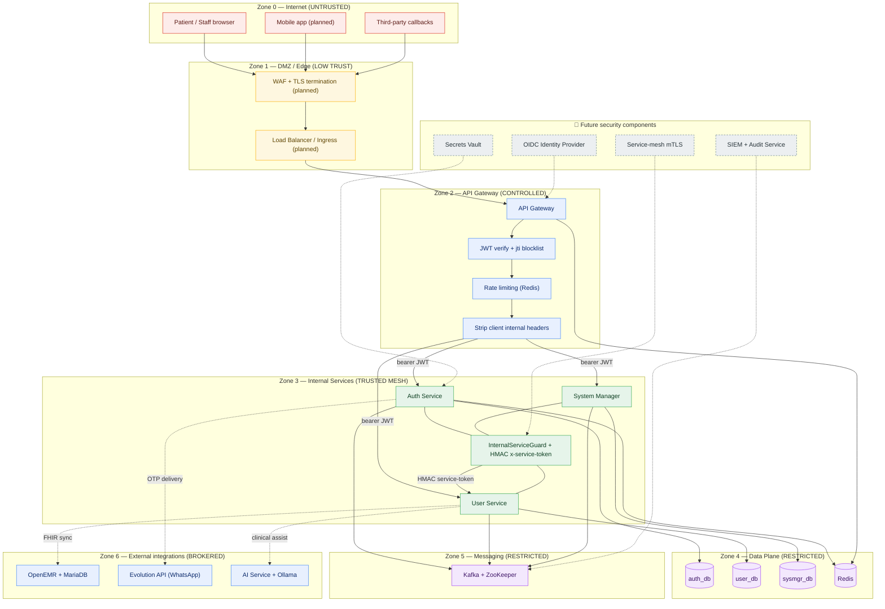

*Explanation.* Requests cross five trust transitions before touching data. The Gateway is the only component reachable from Zone 0; it verifies the JWT, enforces Redis-backed rate limits, and **strips any client-supplied internal headers** so a caller cannot forge `x-service-token`. Internal calls between services are authenticated with an HMAC service token validated by `InternalServiceGuard`. Data stores and Kafka are never internet-routable. Dashed future components (OIDC IdP, secrets vault, mesh mTLS, SIEM) slot in without changing the zone model.

### 1.2 Security control map

| Control | Mechanism (✅/🔵) | Zone | Reference |
|---|---|---|---|
| TLS termination | 🔵 Ingress/WAF TLS 1.2+ | Z1 | [Security Roadmap](#security-roadmap) |
| JWT authentication | ✅ short-lived access JWT with `jti` | Z2 | [§5.4](#54-login) |
| Refresh-token rotation | ✅ rotating family, reuse-detection | Z3 | [§5.5](#55-refresh-token) |
| Internal service auth | ✅ HMAC `x-service-token` + guard | Z3 | [§5.9](#59-internal-service-authentication) |
| RBAC authorization | ✅ role guards | Z2/Z3 | [§6](#6-authorization-matrix) |
| Rate limiting | ✅ Redis sliding window | Z2 | [§4](#4-attack-surface-diagram) |
| Account locking | ✅ Redis counter + lock TTL | Z3 | [§17](#17-user-state-machine) |
| Session management | ✅ server-side session rows + Redis | Z3 | [§15](#15-state-machine-diagrams) |
| Secrets management | 🟡 env today → 🔵 Vault | Z3 | [ADR-006](#adr-006-secrets-management) |
| Audit logging | ✅ per-service → 🔵 central Audit Service | Z3 | [§21](#21-audit-flow-diagram) |
| mTLS service mesh | 🔵 future | Z3 | [§1.3](#13-mtls-future-architecture) |

### 1.3 mTLS future architecture 🔵

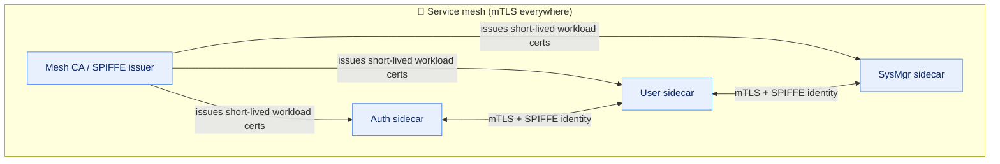

*Explanation.* Today inter-service trust relies on a shared HMAC token over the internal network. The planned mesh replaces ambient trust with **per-workload cryptographic identity** (SPIFFE/SPIRE), short-lived certificates, and mutual TLS — eliminating the static shared secret and enabling fine-grained, identity-aware authorization.

---

## 2. Trust Boundary Diagram

Trust boundaries are the lines where data changes ownership or trust level and therefore must be **validated, authenticated, and logged**.

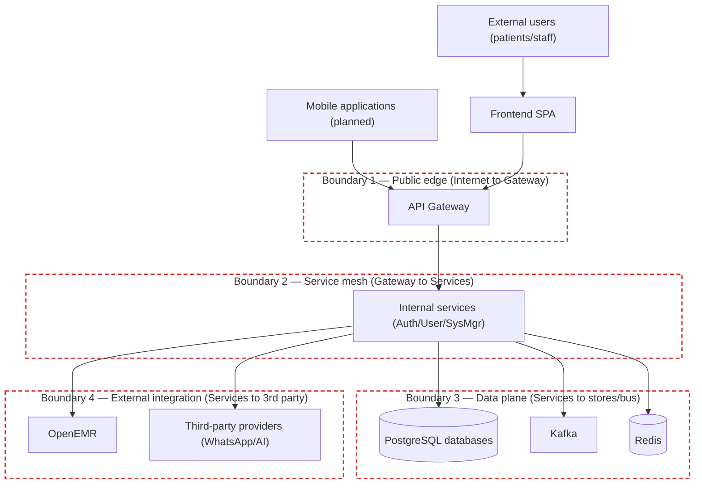

### 2.1 Boundary crossing controls & attack points

| Boundary | Crossing | Primary attacks (⚠) | Controls |
|---|---|---|---|
| **B1** Public edge | Internet → Gateway | ⚠ credential stuffing, token theft, DoS, injection | TLS, JWT verify, rate limit, input validation, header stripping |
| **B2** Service mesh | Gateway → Services | ⚠ SSRF, internal-header forgery, lateral movement | HMAC service-token, `InternalServiceGuard`, network policy, (🔵 mTLS) |
| **B3** Data plane | Services → DB/Kafka/Redis | ⚠ SQL injection, data exfiltration, topic poisoning | parameterised ORM, least-privilege creds, network isolation, ACLs (🔵) |
| **B4** External | Services → OpenEMR/WhatsApp/AI | ⚠ replay, webhook spoofing, PHI leakage | signed/verified webhooks, scoped API keys, egress allow-list (🔵) |

*Explanation.* The four dashed boundaries mark where the platform must never trust the input implicitly. The highest-risk crossing is **B1** (anyone on the Internet) and **B2** (the point an attacker would target after a foothold to move laterally). Boundary **B4** is where Protected Health Information (PHI) leaves the platform’s control and therefore demands the strongest egress governance.

---

## 3. Threat Model Diagram (STRIDE)

STRIDE applied per component. The diagram maps each asset to its dominant threat categories; the table provides concrete threats and mitigations.

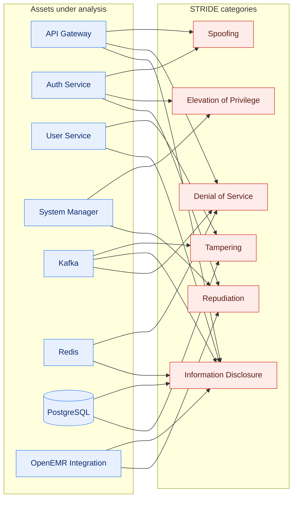

### 3.1 STRIDE threat register

| Component | Threat (STRIDE) | Scenario | Mitigation |
|---|---|---|---|
| API Gateway | **S** Spoofing | forged JWT / replayed token | signature verify, `jti` blocklist, short TTL |
| API Gateway | **D** DoS | request flood | Redis rate limit, connection caps, (🔵 WAF) |
| API Gateway | **I** Info disclosure | verbose errors leak internals | normalized error envelopes, no stack traces |
| Auth Service | **S** Spoofing | impersonation via stolen refresh token | rotating refresh family + reuse detection → revoke family |
| Auth Service | **E** Elevation | privilege escalation on role claim | server-side role resolution, signed claims |
| Auth Service | **R** Repudiation | user denies action | append-only audit log with actor + timestamp |
| User Service | **T** Tampering | mutate profile via crafted event | request-reply validation, idempotency keys, outbox |
| User Service | **I** Info disclosure | PII over-exposure | field-level DTO projection, RBAC |
| System Manager | **E** Elevation | unauthorized clinic activation | SM-only guard, activation-code validation |
| System Manager | **R** Repudiation | disputed clinic admin assignment | audit log of assignments |
| Kafka | **T/I/D** | message injection / eavesdrop / partition flood | network isolation, (🔵 ACLs + TLS), DLT + retry |
| Redis | **D/I** | cache poisoning / data leak | isolated network, no public bind, key namespacing |
| PostgreSQL | **I/T** | SQL injection, exfiltration | parameterised ORM, least-privilege roles, backups |
| OpenEMR | **I/R** | PHI disclosure across boundary | scoped FHIR access, audit, egress control |

*Explanation.* Spoofing and Elevation concentrate on the identity services (Auth/SysMgr); Information Disclosure dominates any component touching PHI (User, PostgreSQL, OpenEMR). Each row’s mitigation is either implemented today or earmarked in the [Security Roadmap](#security-roadmap).

---

## 4. Attack Surface Diagram

Every externally- or internally-reachable entry point, with its authentication, authorization, and residual risk.

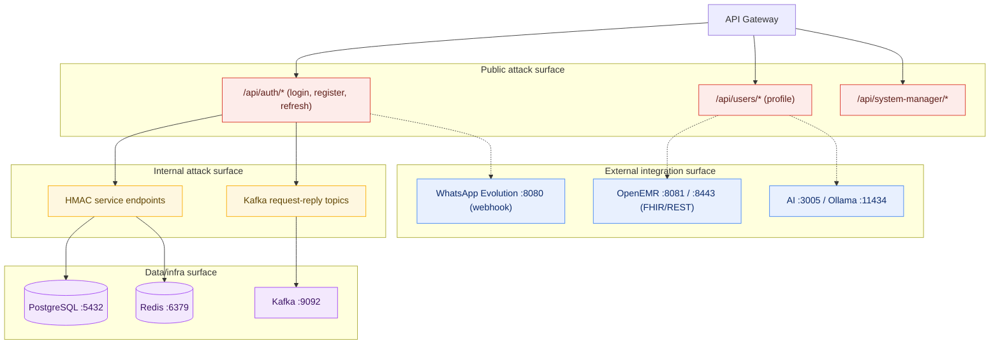

### 4.1 Attack-surface register

| Surface | Entry point | AuthN | AuthZ | Risk |
|---|---|---|---|---|
| Public API | `/api/auth/login`, `/register`, `/refresh-token` | none → issues JWT | public/self | **High** |
| Public API | `/api/users/*` | JWT bearer | RBAC + ownership | **Medium** |
| Public API | `/api/system-manager/*` | JWT bearer | SM role only | **High** |
| Internal API | HMAC service endpoints | `x-service-token` HMAC | `InternalServiceGuard` | **Medium** |
| Kafka | request-reply + event topics | network trust (🔵 ACL/TLS) | topic scope | **Medium** |
| DB | PostgreSQL `:5432` | DB credentials | role grants | **High** (isolate) |
| Cache | Redis `:6379` | (🔵 AUTH/ACL) | namespace | **Medium** |
| External | OpenEMR `:8081/:8443` | FHIR OAuth2/creds | scoped | **High** (PHI) |
| External | WhatsApp `:8080` | API key + webhook verify | scoped | **Medium** |
| External | AI `:3005`, Ollama `:11434` | internal only | scoped | **Medium** |

> **Hardening note.** In the development compose, AI, Ollama, Evolution, and OpenEMR are host-published for convenience. In production these MUST sit behind the gateway/ingress on a private network and never be directly internet-exposed (see [Risks](#production-readiness)).

*Explanation.* The unauthenticated auth endpoints and the PHI-bearing OpenEMR surface are the two highest-risk areas. Public surfaces are JWT-guarded; the internal HMAC surface is the lateral-movement target hardened by the service guard and (in future) mTLS.

---

## 5. Authentication Flow Diagrams

Detailed sequence diagrams for the full identity lifecycle. Participants: **C** Client, **GW** Gateway, **A** Auth Service, **U** User Service, **R** Redis, **DB** auth_db, **WA** WhatsApp/Evolution.

### 5.1 Registration

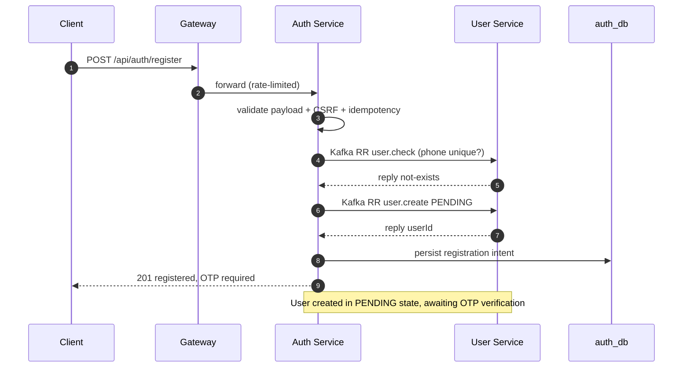

*Explanation.* Registration is a request-reply choreography: Auth validates and delegates user creation to User Service over Kafka, leaving the account in `PENDING` until OTP verification (see [§17](#17-user-state-machine)).

### 5.2 OTP Generation

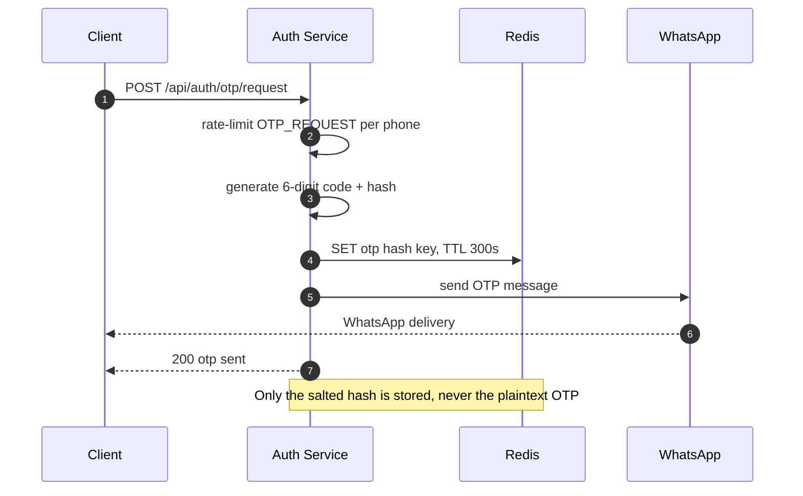

*Explanation.* The OTP plaintext is sent out-of-band via WhatsApp; only a salted hash is cached in Redis with a short TTL, so a Redis compromise does not reveal usable codes.

### 5.3 OTP Verification

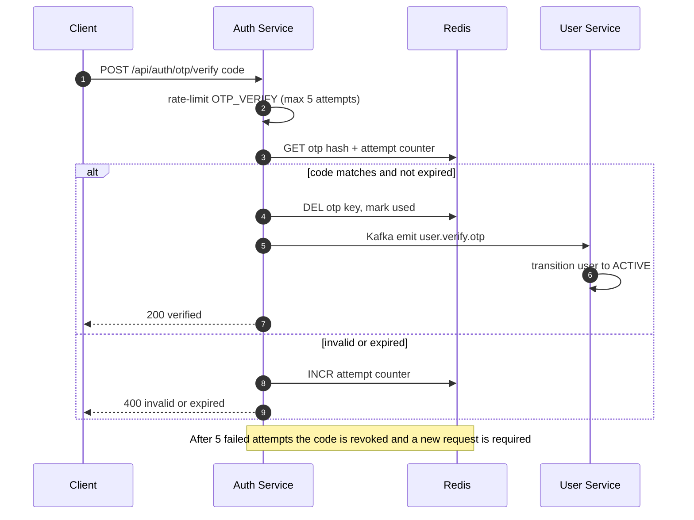

### 5.4 Login

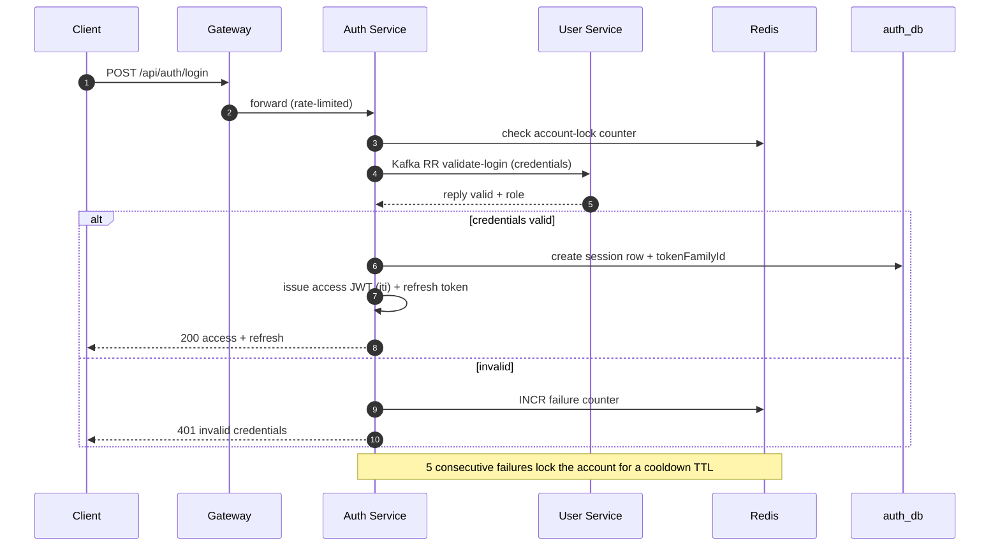

### 5.5 Refresh Token

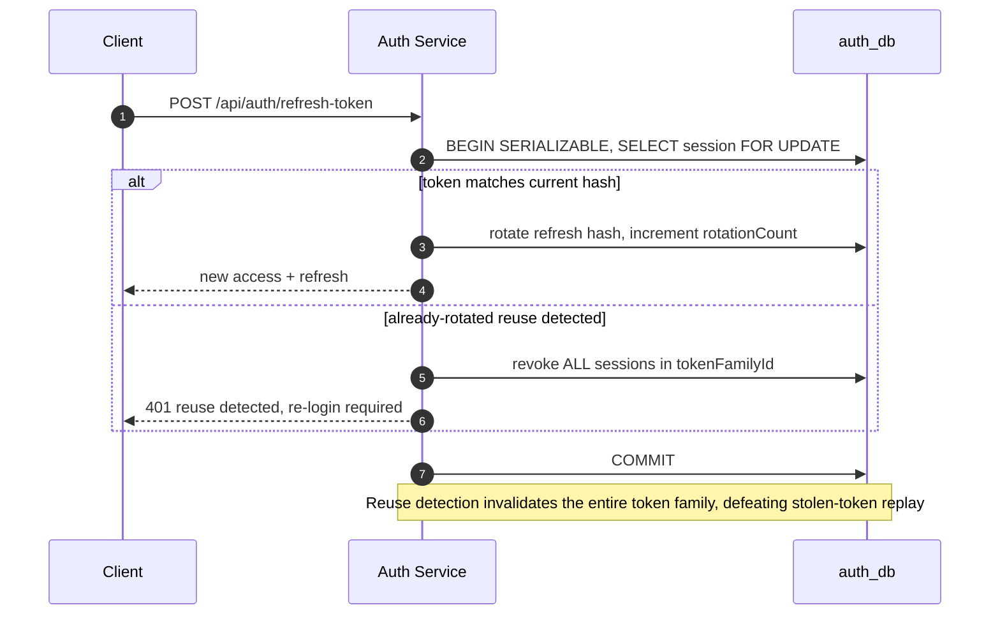

### 5.6 Logout

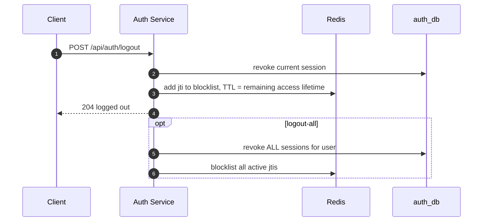

### 5.7 Password Reset

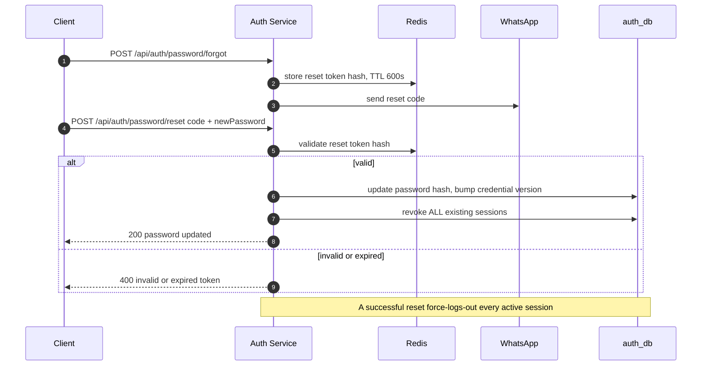

### 5.8 Session Validation

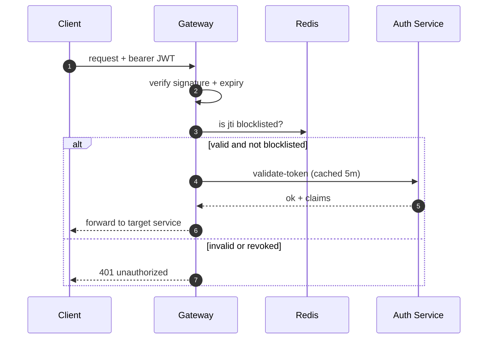

### 5.9 Internal Service Authentication

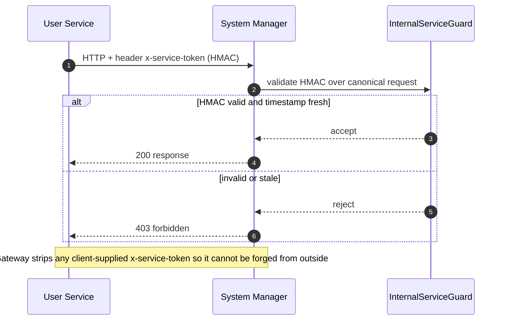

*Explanation.* Internal calls are authenticated with a keyed HMAC over a canonical representation of the request plus a freshness timestamp, blocking both forgery (the secret is server-only) and replay (stale timestamps are rejected). The 🔵 future mesh replaces this with mTLS + SPIFFE identities.

---

## 6. Authorization Matrix

Role-Based Access Control across the platform’s resources and actions. Legend: **C** Create · **R** Read · **U** Update · **D** Delete · **Ap** Approve · **Act** Activate · **De** Deactivate · **—** no access · **(o)** own records only · 🔵 future resource.

| Role \ Resource | Patient Records | Encounters 🔵 | Prescriptions 🔵 | Labs 🔵 | Billing 🔵 | Users | Clinics | System Settings |
|---|---|---|---|---|---|---|---|---|
| **Patient** | R(o) | R(o) | R(o) | R(o) | R(o) | R/U(o) | — | — |
| **Doctor** | C R U | C R U Ap | C R U | C R U Ap | R | R(o) | R | — |
| **Nurse** | R U | C R U | R | C R U | — | R(o) | R | — |
| **Receptionist** | C R U | R | — | R | C R U | R(o) | R | — |
| **Clinic Admin** | C R U D | R | R | R | C R U Ap | C R U De | R U | R |
| **System Manager** | R | R | R | R | R | C R U D De | C R U D Act De | C R U |
| **Internal Service** | R U | C R U | C R U | C R U | C R U | R U | R | R |

### 6.1 Authorization decision flow

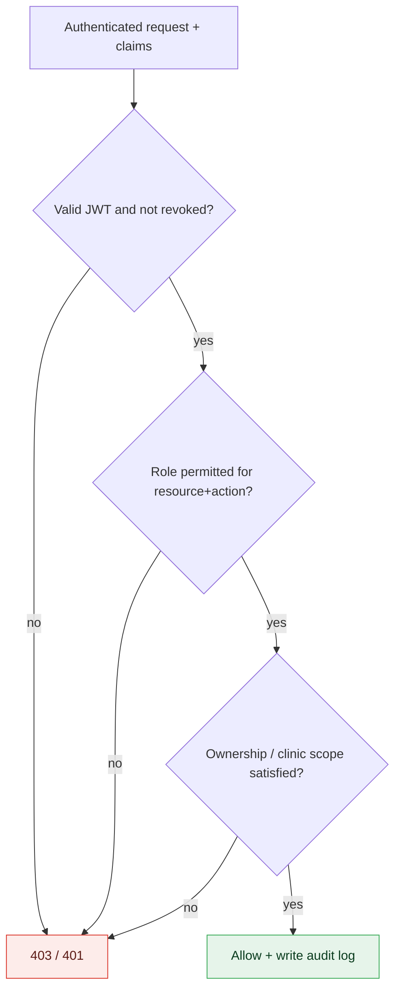

*Explanation.* Authorization is a three-gate decision: authentication validity → role-permission on the resource/action → contextual scope (own records, or the caller’s clinic). Every allow/deny is audit-logged, satisfying HIPAA access-accounting expectations. The matrix is intentionally least-privilege: patients only ever reach their own records, and only the System Manager can activate clinics.

---

# Part II — Domain & Events (DDD + EDA)

## 7. Event Storming Model

Event Storming notation used throughout this section:

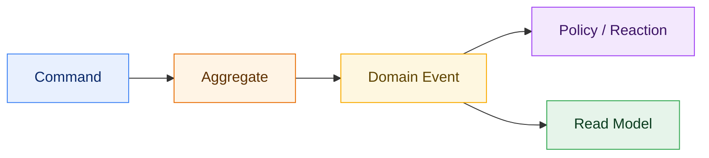

*Blue = command (intent), Orange = domain event (fact), Purple = policy (reactive rule), Amber = aggregate (consistency boundary), Green = read model (projection).*

### 7.1 Patient Registration (✅)


### 7.2 Authentication (✅)

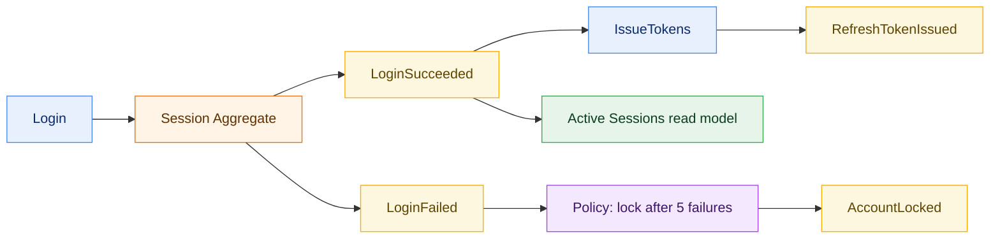

### 7.3 EMR Creation 🔵

```mermaid
flowchart LR
  E0["UserVerified"]:::evt --> P0["Policy: provision EMR"]:::pol
  P0 --> C1["CreateEmrRecord"]:::cmd
  C1 --> A1["Patient Aggregate"]:::agg
  A1 --> E1["EmrRecordCreated"]:::evt
  E1 --> C2["SyncToOpenEMR"]:::cmd
  C2 --> E2["PatientSynced FHIR"]:::evt
  E2 --> RM1["Clinical Summary read model"]:::rm
  classDef cmd fill:#e8f0fe,stroke:#4285f4,color:#0b2a6b;
  classDef evt fill:#fef7e0,stroke:#f9ab00,color:#5f4400;
  classDef pol fill:#f3e8fd,stroke:#a142f4,color:#3d1466;
  classDef agg fill:#fff4e5,stroke:#e8710a,color:#5f3000;
  classDef rm fill:#e6f4ea,stroke:#34a853,color:#0b3d1f;
```

### 7.4 Appointment Booking 🔵

```mermaid
flowchart LR
  C1["BookAppointment"]:::cmd --> A1["Appointment Aggregate"]:::agg
  A1 --> P1["Policy: check slot availability"]:::pol
  P1 --> E1["AppointmentBooked"]:::evt
  E1 --> P2["Policy: schedule reminder"]:::pol
  P2 --> E2["ReminderScheduled"]:::evt
  E1 --> RM1["Clinic Calendar read model"]:::rm
  classDef cmd fill:#e8f0fe,stroke:#4285f4,color:#0b2a6b;
  classDef evt fill:#fef7e0,stroke:#f9ab00,color:#5f4400;
  classDef pol fill:#f3e8fd,stroke:#a142f4,color:#3d1466;
  classDef agg fill:#fff4e5,stroke:#e8710a,color:#5f3000;
  classDef rm fill:#e6f4ea,stroke:#34a853,color:#0b3d1f;
```

### 7.5 Prescription Management 🔵

```mermaid
flowchart LR
  C1["PrescribeMedication"]:::cmd --> A1["Prescription Aggregate"]:::agg
  A1 --> P1["Policy: drug-interaction check"]:::pol
  P1 --> E1["PrescriptionIssued"]:::evt
  E1 --> C2["DispenseAtPharmacy"]:::cmd
  C2 --> E2["MedicationDispensed"]:::evt
  E1 --> RM1["Medication History read model"]:::rm
  classDef cmd fill:#e8f0fe,stroke:#4285f4,color:#0b2a6b;
  classDef evt fill:#fef7e0,stroke:#f9ab00,color:#5f4400;
  classDef pol fill:#f3e8fd,stroke:#a142f4,color:#3d1466;
  classDef agg fill:#fff4e5,stroke:#e8710a,color:#5f3000;
  classDef rm fill:#e6f4ea,stroke:#34a853,color:#0b3d1f;
```

### 7.6 Laboratory Workflow 🔵

```mermaid
flowchart LR
  C1["OrderLabTest"]:::cmd --> A1["LabOrder Aggregate"]:::agg
  A1 --> E1["LabOrdered"]:::evt
  E1 --> C2["CollectSpecimen"]:::cmd
  C2 --> E2["SpecimenCollected"]:::evt
  E2 --> C3["PublishResult"]:::cmd
  C3 --> E3["LabResultReady"]:::evt
  E3 --> P1["Policy: notify clinician"]:::pol
  E3 --> RM1["Lab Results read model"]:::rm
  classDef cmd fill:#e8f0fe,stroke:#4285f4,color:#0b2a6b;
  classDef evt fill:#fef7e0,stroke:#f9ab00,color:#5f4400;
  classDef pol fill:#f3e8fd,stroke:#a142f4,color:#3d1466;
  classDef agg fill:#fff4e5,stroke:#e8710a,color:#5f3000;
  classDef rm fill:#e6f4ea,stroke:#34a853,color:#0b3d1f;
```

*Explanation.* Each storming model exposes the consistency boundaries (aggregates) and the reactive policies that turn one bounded context’s events into another’s commands — the seams along which the future services in §0 are carved.

---

## 8. Event Flow Diagram

Kafka topology: producers, topics, consumer groups, retry, and dead-letter topics. Resilience uses 3 in-broker retries then routes to a `.dlt` topic with a dedicated handler.

### 8.1 Current event flow (✅)

```mermaid
flowchart LR
  AUTH["Auth Service"] -->|"produce"| T1["user.verify.otp"]
  USER["User Service"] -->|"produce"| T2["user.created"]
  USER -->|"produce"| T3["account.linked"]
  SYS["System Manager"] -->|"produce"| T4["system.manager.activate.clinic.admin"]
  T1 --> CG1["user-service-consumer"]
  T2 --> CG2["downstream consumers"]
  T3 --> CG3["system-manager-consumer"]
  CG1 -->|"handler throws 3x"| RT["retry (in-broker)"]
  RT -->|"exhausted"| DLT1["user.verify.otp.dlt"]
  DLT1 --> DH["DLT handler: log + alert"]
  classDef p fill:#e8f0fe,stroke:#4285f4,color:#0b2a6b;
  classDef t fill:#fef7e0,stroke:#f9ab00,color:#5f4400;
  classDef c fill:#e6f4ea,stroke:#34a853,color:#0b3d1f;
  classDef d fill:#fdecea,stroke:#d93025,color:#5c1b16;
  class AUTH,USER,SYS p;
  class T1,T2,T3,T4 t;
  class CG1,CG2,CG3,DH c;
  class RT,DLT1 d;
```

### 8.2 Future event flow 🔵

```mermaid
flowchart LR
  USER["User Service"] -->|"user.created"| BUS["Kafka topic bus"]
  APPT["Appointment 🔵"] -->|"appointment.*"| BUS
  BILL["Billing 🔵"] -->|"billing.*"| BUS
  LAB["Laboratory 🔵"] -->|"lab.*"| BUS
  BUS --> EMR["EMR Service 🔵"]
  BUS --> NOTIF["Notification 🔵"]
  BUS --> AUD["Audit Service 🔵"]
  BUS --> ANALYTICS["Analytics 🔵"]
  NOTIF -->|"on failure"| DLT["*.dlt + retry topics"]
  classDef p fill:#e8f0fe,stroke:#4285f4,color:#0b2a6b;
  classDef t fill:#fef7e0,stroke:#f9ab00,color:#5f4400;
  classDef c fill:#e6f4ea,stroke:#34a853,color:#0b3d1f;
  classDef d fill:#fdecea,stroke:#d93025,color:#5c1b16;
  class USER,APPT,BILL,LAB p;
  class BUS t;
  class EMR,NOTIF,AUD,ANALYTICS c;
  class DLT d;
```

*Explanation.* The future-state introduces a fan-out backbone where every clinical/financial fact lands on the bus and is independently consumed by EMR, Notification, Audit, and Analytics — each with its own retry and DLT, so a slow consumer never blocks producers.

---

## 9. Saga Diagrams

Distributed transactions use the **Saga** pattern (orchestration) with explicit compensations, because no cross-service 2-phase commit exists in a database-per-service topology.

### 9.1 Patient Registration Saga (✅ core, 🔵 EMR step)

```mermaid
flowchart TD
  S0["Start: RegisterPatient"] --> S1["Step 1: Create User PENDING"]
  S1 --> S2["Step 2: Generate OTP"]
  S2 --> S3["Step 3: Verify OTP"]
  S3 --> S4["Step 4: Create EMR Record 🔵"]
  S4 --> S5["Step 5: Activate User"]
  S5 --> DONE["Saga complete"]

  S3 -. "fail" .-> CC2["Compensate: Invalidate OTP"]
  S4 -. "fail" .-> CC3["Compensate: Rollback EMR"]
  S5 -. "fail" .-> CC1["Compensate: Delete User"]
  CC3 --> CC2
  CC2 --> CC1
  CC1 --> ABORT["Saga aborted, clean state"]

  classDef step fill:#e8f0fe,stroke:#4285f4,color:#0b2a6b;
  classDef comp fill:#fdecea,stroke:#d93025,color:#5c1b16;
  classDef done fill:#e6f4ea,stroke:#34a853,color:#0b3d1f;
  class S0,S1,S2,S3,S4,S5 step;
  class CC1,CC2,CC3 comp;
  class DONE,ABORT done;
```

*Explanation.* Forward steps execute in order; any failure triggers compensations in reverse order (Rollback EMR → Invalidate OTP → Delete User), guaranteeing the system returns to a consistent state with no orphaned PENDING accounts.

### 9.2 Appointment Saga 🔵

```mermaid
flowchart TD
  A0["BookAppointment"] --> A1["Reserve slot"]
  A1 --> A2["Create appointment"]
  A2 --> A3["Schedule reminder"]
  A3 --> AD["Confirmed"]
  A2 -. "fail" .-> AC1["Release slot"]
  A3 -. "fail" .-> AC2["Cancel appointment"]
  AC2 --> AC1
  AC1 --> AAB["Aborted"]
  classDef step fill:#e8f0fe,stroke:#4285f4,color:#0b2a6b;
  classDef comp fill:#fdecea,stroke:#d93025,color:#5c1b16;
  class A0,A1,A2,A3 step;
  class AC1,AC2 comp;
```

### 9.3 Billing Saga 🔵

```mermaid
flowchart TD
  B0["GenerateInvoice"] --> B1["Create invoice"]
  B1 --> B2["Authorize payment"]
  B2 --> B3["Capture payment"]
  B3 --> B4["Post to ledger"]
  B4 --> BD["Settled"]
  B3 -. "fail" .-> BC2["Void authorization"]
  B4 -. "fail" .-> BC1["Refund payment"]
  BC1 --> BC2
  BC2 --> BAB["Aborted"]
  classDef step fill:#e8f0fe,stroke:#4285f4,color:#0b2a6b;
  classDef comp fill:#fdecea,stroke:#d93025,color:#5c1b16;
  class B0,B1,B2,B3,B4 step;
  class BC1,BC2 comp;
```

### 9.4 Prescription Saga 🔵

```mermaid
flowchart TD
  P0["PrescribeMedication"] --> P1["Validate interactions"]
  P1 --> P2["Issue prescription"]
  P2 --> P3["Reserve pharmacy stock"]
  P3 --> P4["Dispense"]
  P4 --> PD["Completed"]
  P3 -. "fail" .-> PC2["Cancel prescription"]
  P4 -. "fail" .-> PC1["Release stock"]
  PC1 --> PC2
  PC2 --> PAB["Aborted"]
  classDef step fill:#e8f0fe,stroke:#4285f4,color:#0b2a6b;
  classDef comp fill:#fdecea,stroke:#d93025,color:#5c1b16;
  class P0,P1,P2,P3,P4 step;
  class PC1,PC2 comp;
```

*Explanation.* Every future saga follows the same orchestration contract: idempotent forward steps, idempotent compensations, and a terminal “aborted, clean state” node — making the workflows safe to retry under the at-least-once delivery guarantees of Kafka.

---

## 10. Domain Model Diagram

DDD tactical model across domains. Stereotypes: `<<Aggregate Root>>`, `<<Entity>>`, `<<Value Object>>`, `<<Repository>>`, `<<Domain Service>>`.

### 10.1 Identity Domain (✅)

```mermaid
classDiagram
  class User {
    <<Aggregate Root>>
    +UUID id
    +PhoneNumber phone
    +Role role
    +UserStatus status
    +verify()
    +lock()
    +deactivate()
  }
  class Session {
    <<Entity>>
    +UUID id
    +UUID tokenFamilyId
    +int rotationCount
    +rotate()
    +revoke()
  }
  class Otp {
    <<Value Object>>
    +string hash
    +DateTime expiresAt
    +int attempts
  }
  class PhoneNumber {
    <<Value Object>>
    +string e164
  }
  class IUserRepository {
    <<Repository>>
    +findById(id)
    +save(user)
  }
  class AuthDomainService {
    <<Domain Service>>
    +authenticate(creds)
    +rotateRefresh(session)
  }
  User "1" o-- "many" Session
  User "1" *-- "1" PhoneNumber
  User "1" ..> Otp : issues
  AuthDomainService ..> User
  AuthDomainService ..> Session
  IUserRepository ..> User
```

### 10.2 Patient / EMR / Clinic / Appointment / Billing domains (🔵 mostly)

```mermaid
classDiagram
  class Patient {
    <<Aggregate Root>>
    +UUID id
    +UUID userId
    +MRN mrn
    +Demographics demographics
  }
  class EmrRecord {
    <<Aggregate Root>>
    +UUID id
    +UUID patientId
    +FhirId fhirId
    +sync()
  }
  class Encounter {
    <<Entity>>
    +UUID id
    +DateTime date
    +string type
  }
  class Clinic {
    <<Aggregate Root>>
    +UUID id
    +string name
    +ClinicStatus status
    +activate()
  }
  class Appointment {
    <<Aggregate Root>>
    +UUID id
    +UUID patientId
    +UUID clinicId
    +Slot slot
    +book()
    +cancel()
  }
  class Invoice {
    <<Aggregate Root>>
    +UUID id
    +Money total
    +InvoiceStatus status
  }
  Patient "1" o-- "1" EmrRecord
  EmrRecord "1" *-- "many" Encounter
  Clinic "1" o-- "many" Appointment
  Patient "1" o-- "many" Appointment
  Appointment "1" ..> Invoice : generates
```

*Explanation.* Aggregate roots (`User`, `Patient`, `Clinic`, `Appointment`, `Invoice`) own their invariants and are the only objects referenced across contexts — and only by ID, never by hard foreign key — preserving service autonomy.

---

## 11. Bounded Context Diagram

Context map with relationship patterns: **CS** Customer/Supplier, **ACL** Anti-Corruption Layer, **OHS** Open Host Service, **PL** Published Language, **SK** Shared Kernel.

```mermaid
flowchart TB
  IDC["Identity Context (✅)"]
  PC["Patient Context (🔵)"]
  CC["Clinic Context (✅)"]
  EC["EMR Context (🔵)"]
  SC["Scheduling Context (🔵)"]
  BC["Billing Context (🔵)"]
  AC["Analytics Context (🔵)"]
  OE["OpenEMR (external)"]

  IDC -->|"OHS: user.created (PL)"| PC
  IDC -->|"CS"| CC
  PC -->|"ACL → FHIR"| OE
  PC -->|"CS"| EC
  CC -->|"CS"| SC
  SC -->|"CS"| BC
  EC -->|"events (PL)"| AC
  BC -->|"events (PL)"| AC
  EC -->|"ACL"| OE

  classDef impl fill:#e6f4ea,stroke:#34a853,color:#0b3d1f;
  classDef fut fill:#e8f0fe,stroke:#4285f4,color:#0b2a6b;
  classDef ext fill:#eceff1,stroke:#607d8b,color:#263238;
  class IDC,CC impl;
  class PC,EC,SC,BC,AC fut;
  class OE ext;
```

*Explanation.* Identity is the upstream Open Host Service publishing a shared event language (`user.created`). The Patient and EMR contexts wrap OpenEMR behind an **Anti-Corruption Layer** so external FHIR/HL7 idioms never leak into the domain. Analytics is purely downstream, consuming the published event language of EMR and Billing.

---

## 12. Service Dependency Diagram

Synchronous (solid) vs asynchronous (dashed) dependencies. **Critical** dependencies (red, on the request-blocking path) must be guarded by timeouts, retries, and circuit breakers.

### 12.1 Current dependencies (✅)

```mermaid
flowchart LR
  GW["API Gateway"] -->|"HTTP"| AUTH["Auth"]
  GW -->|"HTTP"| USER["User"]
  GW -->|"HTTP"| SYS["System Manager"]
  AUTH -->|"Kafka RR (critical)"| USER
  AUTH -->|"HTTP (critical)"| SYS
  AUTH -->|"cache"| R[("Redis")]
  GW -->|"cache"| R
  AUTH -.->|"events"| K["Kafka"]
  USER -.->|"events"| K
  SYS -.->|"events"| K
  AUTH --> DBA[("auth_db")]
  USER --> DBU[("user_db")]
  SYS --> DBS[("sysmgr_db")]
  linkStyle 3 stroke:#d93025,stroke-width:2px;
  linkStyle 4 stroke:#d93025,stroke-width:2px;
  classDef s fill:#e8f0fe,stroke:#4285f4,color:#0b2a6b;
  class GW,AUTH,USER,SYS s;
```

### 12.2 Future dependencies 🔵

```mermaid
flowchart LR
  GW["API Gateway"] --> AUTH["Auth"] & APPT["Appointment"] & BILL["Billing"] & EMR["EMR"]
  APPT -->|"HTTP (critical)"| CLINIC["Clinic"]
  APPT -.->|"events"| BUS["Kafka"]
  BILL -.->|"events"| BUS
  EMR -.->|"events"| BUS
  BUS -.-> NOTIF["Notification"]
  BUS -.-> AUD["Audit"]
  BUS -.-> ANALYTICS["Analytics"]
  EMR -->|"ACL FHIR (critical)"| OE["OpenEMR"]
  classDef s fill:#e8f0fe,stroke:#4285f4,color:#0b2a6b;
  classDef f fill:#eceff1,stroke:#607d8b,color:#263238;
  class GW,AUTH s;
  class APPT,BILL,EMR,CLINIC,NOTIF,AUD,ANALYTICS f;
```

*Explanation.* Critical synchronous edges (Auth→User login validation, Appointment→Clinic, EMR→OpenEMR) sit on the user-blocking path and therefore carry the strictest resilience SLOs. Everything else is asynchronous and tolerant of consumer lag.

---

## 13. Service Communication Diagram

Each edge is labelled with its transport so operators can reason about latency, retries, and failure semantics.

```mermaid
flowchart LR
  C["Client"] -->|"HTTPS/REST"| GW["API Gateway"]
  GW -->|"HTTP"| AUTH["Auth"]
  GW -->|"HTTP"| USER["User"]
  AUTH -->|"Kafka request-reply"| USER
  AUTH -->|"Redis commands"| R[("Redis")]
  AUTH -->|"Kafka emit"| K["Kafka"]
  USER -->|"FHIR/REST"| OE["OpenEMR"]
  AUTH -->|"Webhook out"| WA["WhatsApp Evolution"]
  WA -->|"Webhook in"| GW
  USER -->|"HTTP"| AI["AI Service"]
  AI -->|"HTTP"| OLL["Ollama"]
  classDef http fill:#e8f0fe,stroke:#4285f4,color:#0b2a6b;
  class C,GW,AUTH,USER,OE,WA,AI,OLL http;
```

| Transport | Used between | Semantics | Failure handling |
|---|---|---|---|
| HTTPS/REST | Client ↔ Gateway ↔ Services | synchronous | timeout + retry + circuit breaker |
| Kafka RR | Auth ↔ User, Auth ↔ SysMgr | sync-over-async | correlationId + reply topic + breaker |
| Kafka events | producers → consumers | async at-least-once | retry 3x → DLT |
| Redis | Auth/Gateway → Redis | sync, sub-ms | fail-open/closed per policy |
| Webhooks | WhatsApp ↔ platform | async callback | signature verify + idempotency |
| OpenEMR API | User/EMR → OpenEMR | sync FHIR/REST | ACL + retry + audit |

*Explanation.* Mixing transports is deliberate: latency-sensitive reads use HTTP or Kafka request-reply, while fire-and-forget facts use Kafka events. Webhooks and FHIR are brokered through verification and anti-corruption layers respectively.

---

## 14. Message Flow Diagram

End-to-end flow for the five canonical messages, including producer, topic, consumers, and DLT.

```mermaid
flowchart LR
  subgraph P["Producers"]
    A["Auth Service"]
    U["User Service"]
  end
  A -->|"emit"| T_OTP["otp.generated"]
  A -->|"emit"| T_VER["user.verify.otp"]
  A -->|"emit"| T_LOG["user.login.success"]
  U -->|"emit"| T_CRE["user.created"]
  U -->|"emit"| T_UVR["user.verified"]

  T_OTP --> C1["Notification consumer 🔵"]
  T_VER --> C2["User Service consumer"]
  T_LOG --> C3["Audit consumer 🔵"]
  T_CRE --> C4["EMR provisioning 🔵"]
  T_UVR --> C5["Analytics consumer 🔵"]

  C2 -.->|"on failure 3x"| DLT["user.verify.otp.dlt"]
  C4 -.->|"on failure 3x"| DLT2["user.created.dlt"]
  classDef p fill:#e8f0fe,stroke:#4285f4,color:#0b2a6b;
  classDef t fill:#fef7e0,stroke:#f9ab00,color:#5f4400;
  classDef c fill:#e6f4ea,stroke:#34a853,color:#0b3d1f;
  classDef d fill:#fdecea,stroke:#d93025,color:#5c1b16;
  class A,U p;
  class T_OTP,T_VER,T_LOG,T_CRE,T_UVR t;
  class C1,C2,C3,C4,C5 c;
  class DLT,DLT2 d;
```

| Message | Producer | Topic | Consumer(s) | DLT |
|---|---|---|---|---|
| `user.created` | User | `user.created` | EMR 🔵, Analytics 🔵 | `user.created.dlt` |
| `user.verified` | User | `user.verified` | Analytics 🔵 | `user.verified.dlt` |
| `user.login.success` | Auth | `user.login.success` | Audit 🔵 | `user.login.success.dlt` |
| `otp.generated` | Auth | `otp.generated` | Notification 🔵 | `otp.generated.dlt` |
| `otp.verified` | Auth | `user.verify.otp` | User Service | `user.verify.otp.dlt` |

*Explanation.* Each message is single-producer, multi-consumer. Consumers are independent groups so a failure in (say) Analytics never affects EMR provisioning; failed messages drain to a per-topic `.dlt` after three retries for human or automated replay.

---

# Part III — State & Data

## 15. State Machine Diagrams

Lifecycle state machines for the core identity aggregates.

### 15.1 Session

```mermaid
stateDiagram-v2
  [*] --> Active : login succeeds
  Active --> Active : token rotated
  Active --> Revoked : logout or password reset
  Active --> Expired : idle timeout
  Active --> Compromised : reuse detected
  Compromised --> Revoked : revoke token family
  Expired --> [*]
  Revoked --> [*]
```

### 15.2 Refresh Token

```mermaid
stateDiagram-v2
  [*] --> Issued
  Issued --> Rotated : used once and replaced
  Rotated --> Rotated : subsequent valid rotation
  Issued --> Reused : old token replayed
  Rotated --> Reused : superseded token replayed
  Reused --> FamilyRevoked : revoke entire token family
  Rotated --> Expired : ttl elapsed
  FamilyRevoked --> [*]
  Expired --> [*]
  note right of Reused
    Reuse detection is the core defence against stolen refresh tokens
  end note
```

### 15.3 Account Lock

```mermaid
stateDiagram-v2
  [*] --> Unlocked
  Unlocked --> Unlocked : successful login resets counter
  Unlocked --> Counting : failed attempt increments counter
  Counting --> Unlocked : success before threshold
  Counting --> Locked : counter reaches 5
  Locked --> Unlocked : lock ttl expires
  Locked --> Unlocked : admin manual unlock
```

### 15.4 User (summary — see §17 for full machine)

```mermaid
stateDiagram-v2
  [*] --> Pending
  Pending --> Active : OTP verified
  Active --> Locked : security lock
  Locked --> Active : unlocked
  Active --> Deactivated : admin disables
  Deactivated --> [*]
```

*Explanation.* These machines encode the security-critical invariants: a refresh token may be used exactly once (rotation), reuse poisons the whole family, and five failed logins lock the account for a cooldown.

---

## 16. OTP State Machine

```mermaid
stateDiagram-v2
  [*] --> Created : code generated
  Created --> Stored : hash persisted to Redis
  Stored --> Sent : handed to WhatsApp
  Sent --> Delivered : provider ack
  Delivered --> Verified : correct code within ttl
  Delivered --> Failed : wrong code
  Failed --> Failed : retry under attempt limit
  Failed --> Revoked : 5 attempts exceeded
  Sent --> Expired : ttl elapsed
  Delivered --> Expired : ttl elapsed
  Verified --> [*]
  Expired --> [*]
  Revoked --> [*]
  note right of Verified
    On success the key is deleted and the user transitions to ACTIVE
  end note
```

*Explanation.* The OTP can only be verified from `Delivered` within its TTL. Wrong codes increment an attempt counter; exceeding five revokes the code (requiring a fresh request), defeating brute force.

---

## 17. User State Machine

```mermaid
stateDiagram-v2
  [*] --> PendingRegistration : register
  PendingRegistration --> OtpPending : OTP requested
  OtpPending --> Active : OTP verified
  OtpPending --> PendingRegistration : OTP expired, re-request
  Active --> Locked : 5 failed logins
  Locked --> Active : lock ttl or admin unlock
  Active --> Suspended : admin or compliance hold
  Suspended --> Active : reinstated
  Active --> Deactivated : user or admin disables
  Suspended --> Deactivated : escalated
  Deactivated --> Deleted : retention period elapses
  Deleted --> [*]
  note right of Deleted
    Deletion is logical first (PHI retained per HIPAA retention) then purged
  end note
```

*Explanation.* The user lifecycle distinguishes **security** states (Locked), **administrative** states (Suspended/Deactivated), and **compliance** states (Deleted, gated by retention). No state skips OTP verification on the way to Active.

---

## 18. Data Lineage Diagram

Tracks a patient datum from capture to analytics, marking transformations and the boundary where it becomes PHI.

```mermaid
flowchart LR
  P["Patient input (raw)"] -->|"TLS"| GW["Gateway: validate + normalize"]
  GW --> AUTH["Auth: identity binding"]
  AUTH --> USER["User Service: canonical profile"]
  USER -->|"map → FHIR Patient"| OE["OpenEMR (PHI of record)"]
  USER -.->|"user.created event"| EMR["EMR Service 🔵"]
  OE -->|"de-identify / aggregate"| REP["Reporting 🔵"]
  REP --> AN["Analytics 🔵 (aggregates only)"]
  classDef raw fill:#fef7e0,stroke:#f9ab00,color:#5f4400;
  classDef phi fill:#fdecea,stroke:#d93025,color:#5c1b16;
  classDef agg fill:#e6f4ea,stroke:#34a853,color:#0b3d1f;
  class P,GW raw;
  class AUTH,USER,OE,EMR phi;
  class REP,AN agg;
```

| Stage | Transformation | Classification |
|---|---|---|
| Patient input | raw capture over TLS | Sensitive |
| Gateway | validation + normalization | Sensitive |
| User Service | canonical profile (UUID) | PII |
| OpenEMR | mapped to FHIR Patient | **PHI (system of record)** |
| Reporting 🔵 | de-identification / aggregation | De-identified |
| Analytics 🔵 | aggregates only | Non-identifying |

*Explanation.* PHI is concentrated in OpenEMR and the clinical services. The lineage enforces that analytics consumes only de-identified/aggregated data, never raw PHI — a core HIPAA minimum-necessary control.

---

## 19. Data Ownership Diagram

Single-writer ownership per data category (database-per-service). Other services hold **read replicas/projections**, never authoritative copies.

```mermaid
flowchart TB
  subgraph OWN["Authoritative owners"]
    USER["User Service → Patient/User data"]
    AUTH["Auth Service → Authentication data"]
    EMR["EMR Service 🔵 / OpenEMR → EMR data"]
    AUD["Audit Service 🔵 → Audit data"]
    BILL["Billing Service 🔵 → Billing data"]
  end
  USER -.->|"projection"| EMR
  AUTH -.->|"events"| AUD
  EMR -.->|"events"| AUD
  BILL -.->|"events"| AUD
  classDef o fill:#e8f0fe,stroke:#4285f4,color:#0b2a6b;
  class USER,AUTH,EMR,AUD,BILL o;
```

| Data category | Authoritative owner | Replicas / consumers |
|---|---|---|
| Patient / User | User Service | EMR (projection), Analytics |
| Authentication | Auth Service | none (security isolated) |
| EMR / clinical | OpenEMR + EMR Service 🔵 | Reporting, Analytics |
| Audit | Audit Service 🔵 | Compliance archive |
| Billing | Billing Service 🔵 | Reporting, Analytics |

*Explanation.* Exactly one service may write each category; everyone else subscribes to events. This prevents write conflicts and makes the audit trail authoritative and tamper-evident.

---

## 20. Data Lifecycle Diagram

Generic create→update→archive→delete lifecycle, instantiated per entity with retention policy.

```mermaid
stateDiagram-v2
  [*] --> Created
  Created --> Updated : mutation
  Updated --> Updated : further mutations (versioned)
  Updated --> Archived : inactive or closed
  Created --> Archived : closed without update
  Archived --> Deleted : retention window elapses
  Deleted --> [*]
  note right of Archived
    Archived data is read-only and retained for the regulatory window
  end note
```

| Entity | Retention before archive | Retention before delete | Notes |
|---|---|---|---|
| Patient Record | active lifetime | 6+ years after last activity | HIPAA-aligned |
| EMR Record | active lifetime | 6+ years (or per jurisdiction) | system of record in OpenEMR |
| Audit Log | online 90 days | 6 years (cold archive) | append-only, immutable |
| Session | until expiry/logout | purged on expiry | short-lived |

*Explanation.* Clinical and audit data follow long regulatory retention (archive, not delete), whereas sessions are ephemeral. Deletion is always preceded by an archival/retention gate to satisfy compliance.

---

# Part IV — Operability (mostly 🔵 Future-state)

## 21. Audit Flow Diagram

Today each service writes structured audit entries to its own store. The 🔵 target is a centralized, append-only **Audit Service** with HIPAA-compliant retention.

```mermaid
flowchart LR
  subgraph SRC["Event sources (✅)"]
    AUTH["Auth (login, logout, reset)"]
    USER["User (profile changes)"]
    SYS["System Manager (activations)"]
    GW["Gateway (access decisions)"]
  end
  AUTH -->|"audit event"| BUS["Kafka audit topic 🔵"]
  USER --> BUS
  SYS --> BUS
  GW --> BUS
  BUS --> AUD["Audit Service 🔵"]
  AUD --> STORE[("Append-only store 🔵")]
  STORE --> RET["Retention engine (6 yr) 🔵"]
  RET --> ARCH[("Compliance cold archive 🔵")]
  AUD -.-> SIEM["SIEM / anomaly detection 🔵"]
  classDef now fill:#e6f4ea,stroke:#34a853,color:#0b3d1f;
  classDef fut fill:#e8f0fe,stroke:#4285f4,color:#0b2a6b;
  class AUTH,USER,SYS,GW now;
  class BUS,AUD,STORE,RET,ARCH,SIEM fut;
```

| Property | Current (✅) | Future (🔵) |
|---|---|---|
| Write model | per-service rows | central append-only |
| Immutability | DB constraints | WORM storage |
| Retention | per-service guard | 6-yr policy engine + archive |
| Detection | log inspection | SIEM + anomaly rules |

*Explanation.* Centralizing audit decouples retention/immutability from each service and yields a single tamper-evident trail for HIPAA §164.312(b) audit controls, feeding a SIEM for proactive detection.

---

## 22. Observability Diagram 🔵

Three pillars (metrics, logs, traces) on an OpenTelemetry backbone.

```mermaid
flowchart LR
  subgraph SVC["Instrumented services"]
    S1["Auth"]
    S2["User"]
    S3["System Manager"]
    S4["Gateway"]
  end
  S1 & S2 & S3 & S4 -->|"OTLP"| OTEL["OpenTelemetry Collector"]
  OTEL -->|"metrics"| PROM["Prometheus"]
  OTEL -->|"logs"| LOKI["Loki"]
  OTEL -->|"traces"| TEMPO["Tempo"]
  PROM --> GRAF["Grafana dashboards"]
  LOKI --> GRAF
  TEMPO --> GRAF
  classDef f fill:#e8f0fe,stroke:#4285f4,color:#0b2a6b;
  class S1,S2,S3,S4,OTEL,PROM,LOKI,TEMPO,GRAF f;
```

*Explanation.* All telemetry is emitted via OTLP to a single collector, which fans out to Prometheus (metrics), Loki (logs), and Tempo (traces). Grafana correlates the three pillars so an operator can pivot from a latency spike to the exact trace and log line.

---

## 23. Monitoring Architecture Diagram 🔵

Exporter-based metrics collection with alerting.

```mermaid
flowchart LR
  subgraph EXP["Exporters"]
    NE["Node Exporter"]
    KE["Kafka Exporter"]
    PE["Postgres Exporter"]
    RE["Redis Exporter"]
    APP["App /metrics endpoints"]
  end
  NE & KE & PE & RE & APP -->|"scrape"| PROM["Prometheus"]
  PROM --> AM["AlertManager"]
  PROM --> GRAF["Grafana"]
  AM -->|"page / notify"| ONCALL["On-call (PagerDuty/Slack)"]
  classDef f fill:#e8f0fe,stroke:#4285f4,color:#0b2a6b;
  class NE,KE,PE,RE,APP,PROM,AM,GRAF,ONCALL f;
```

| Signal | Exporter | Example alert |
|---|---|---|
| Host CPU/mem/disk | Node Exporter | disk > 85% |
| Kafka lag | Kafka Exporter | consumer lag > 10k |
| DB health | Postgres Exporter | connections > 90% pool |
| Cache | Redis Exporter | evictions rising, hit-rate < 80% |
| App SLO | `/metrics` | p99 latency > 500ms, 5xx rate > 1% |

*Explanation.* Prometheus scrapes every layer; AlertManager routes threshold breaches to on-call. SLO-based alerts (latency, error rate) catch user-facing regressions before saturation alerts fire.

---

## 24. CI/CD Pipeline Diagram 🔵

GitHub Actions, trunk-based with protected `main` and gated promotions.

```mermaid
flowchart LR
  DEV["Developer push / PR"] --> GH["GitHub"]
  GH --> PR["Pull Request"]
  PR --> CR["Code review (required)"]
  CR --> UT["Unit tests"]
  UT --> IT["Integration tests"]
  IT --> SEC["Security scans (SAST, deps, secrets)"]
  SEC --> BUILD["Docker build"]
  BUILD --> REG["Image registry (signed)"]
  REG --> STG["Deploy to Staging"]
  STG --> E2E["E2E + smoke tests"]
  E2E --> GATE{"Manual approval"}
  GATE -->|"approved"| PROD["Deploy to Production"]
  GATE -->|"rejected"| GH
  classDef f fill:#e8f0fe,stroke:#4285f4,color:#0b2a6b;
  classDef g fill:#fef7e0,stroke:#f9ab00,color:#5f4400;
  class DEV,GH,PR,CR,UT,IT,SEC,BUILD,REG,STG,E2E,PROD f;
  class GATE g;
```

*Explanation.* Every change passes review, unit/integration tests, and security scanning before an immutable signed image is built once and promoted across environments. Production deploys require explicit human approval after staging E2E passes.

---

## 25. Disaster Recovery Diagram

Backup and restore architecture with recovery objectives.

```mermaid
flowchart LR
  subgraph PRIMARY["Primary region"]
    PG[("PostgreSQL")]
    K["Kafka"]
    R[("Redis")]
    OE["OpenEMR / MariaDB"]
  end
  PG -->|"WAL + nightly base backup"| BPG[("Backup store")]
  K -->|"topic mirror / tiered storage"| BK[("Backup store")]
  R -->|"AOF everysec + RDB snapshots"| BR[("Backup store")]
  OE -->|"DB dump + file backup"| BOE[("Backup store")]
  BPG & BK & BR & BOE -->|"replicate"| DR["🔵 DR region / cold standby"]
  DR -->|"restore on failover"| RESTORE["Recovered platform"]
  classDef now fill:#e6f4ea,stroke:#34a853,color:#0b3d1f;
  classDef fut fill:#e8f0fe,stroke:#4285f4,color:#0b2a6b;
  class PG,K,R,OE,BPG,BK,BR,BOE now;
  class DR,RESTORE fut;
```

| Asset | Backup method | RPO | RTO |
|---|---|---|---|
| PostgreSQL | WAL archiving + nightly base | ≤ 5 min | ≤ 1 hr |
| Kafka | mirror / tiered storage | ≤ 1 min | ≤ 2 hr |
| Redis | AOF everysec + RDB | ≤ 1 sec (cache, rebuildable) | ≤ 15 min |
| OpenEMR (PHI) | encrypted DB + file backup | ≤ 15 min | ≤ 2 hr |

*Explanation.* RPO/RTO are tiered by criticality: identity/clinical data (PostgreSQL, OpenEMR) get the tightest objectives, while Redis is treated as rebuildable cache. The 🔵 DR region provides cross-region resilience for the production target.

---

## 26. Chaos Engineering Diagram

Steady-state hypotheses and expected recovery for injected failures.

```mermaid
flowchart TB
  subgraph EXP["Chaos experiments"]
    F1["Redis failure"]
    F2["Kafka broker failure"]
    F3["Database failure"]
    F4["Service instance failure"]
    F5["Network partition"]
  end
  F1 -->|"expected"| R1["Fail-open rate-limit OR fail-closed auth, no crash"]
  F2 -->|"expected"| R2["Producers buffer / breaker opens, consumers resume after recovery"]
  F3 -->|"expected"| R3["Health check fails, traffic drained, restore from replica"]
  F4 -->|"expected"| R4["Load balancer reroutes, replica handles, auto-restart"]
  F5 -->|"expected"| R5["Timeouts + circuit breakers prevent cascade"]
  classDef f fill:#fdecea,stroke:#d93025,color:#5c1b16;
  classDef r fill:#e6f4ea,stroke:#34a853,color:#0b3d1f;
  class F1,F2,F3,F4,F5 f;
  class R1,R2,R3,R4,R5 r;
```

| Experiment | Steady-state hypothesis | Recovery path |
|---|---|---|
| Redis failure | auth still functions (policy-defined) | reconnect; cache repopulates |
| Kafka failure | no event loss | breaker + buffered producers; replay from offset |
| DB failure | no data loss | failover to replica; restore from WAL |
| Service failure | no user-visible outage | reroute to healthy replica; auto-restart |
| Network partition | no cascade | timeouts + breakers isolate the fault |

*Explanation.* Each experiment asserts a steady-state hypothesis and a bounded recovery. The platform’s existing resilience primitives (circuit breakers, retries, DLT, health checks) are the controls under test; chaos validates they behave as designed before real incidents occur.

---

# Part V — C4 & Per-service

## 27. C4 Models

Following the C4 model: Level 1 System Context, Level 2 Containers, Level 3 Components (per service). Rendered as Mermaid flowcharts.

### 27.1 Level 1 — System Context

```mermaid
flowchart TB
  patient["Patient (person)"]
  staff["Clinic Staff (person)"]
  sm["System Manager (person)"]
  sys["MediCare Platform"]
  wa["WhatsApp / Evolution (external)"]
  oe["OpenEMR (external EHR)"]
  ai["Ollama LLM (external)"]
  patient -->|"register, login, view records (HTTPS)"| sys
  staff -->|"manage patients, clinics (HTTPS)"| sys
  sm -->|"activate clinics, administer (HTTPS)"| sys
  sys -->|"send OTP / notifications"| wa
  sys -->|"sync clinical data (FHIR)"| oe
  sys -->|"clinical assistance"| ai
  classDef p fill:#fff4e5,stroke:#e8710a,color:#5f3000;
  classDef s fill:#e8f0fe,stroke:#4285f4,color:#0b2a6b;
  classDef e fill:#eceff1,stroke:#607d8b,color:#263238;
  class patient,staff,sm p;
  class sys s;
  class wa,oe,ai e;
```

### 27.2 Level 2 — Container Diagram

```mermaid
flowchart TB
  spa["Web SPA (browser)"]
  gw["API Gateway (NestJS)"]
  auth["Auth Service (NestJS)"]
  user["User Service (NestJS)"]
  sysm["System Manager (NestJS)"]
  k["Kafka + ZooKeeper"]
  redis[("Redis")]
  dba[("auth_db Postgres")]
  dbu[("user_db Postgres")]
  dbs[("sysmgr_db Postgres")]
  oe["OpenEMR + MariaDB"]
  wa["Evolution API + MongoDB"]

  spa -->|"HTTPS/REST"| gw
  gw -->|"HTTP"| auth & user & sysm
  auth -->|"Kafka RR"| user
  auth -->|"Redis"| redis
  gw -->|"Redis"| redis
  auth --> dba
  user --> dbu
  sysm --> dbs
  auth & user & sysm -->|"emit/consume"| k
  user -->|"FHIR"| oe
  auth -->|"OTP"| wa
  classDef c fill:#e8f0fe,stroke:#4285f4,color:#0b2a6b;
  classDef d fill:#f3e8fd,stroke:#a142f4,color:#3d1466;
  class spa,gw,auth,user,sysm c;
  class redis,dba,dbu,dbs,k,oe,wa d;
```

### 27.3 Level 3 — Component: API Gateway

```mermaid
flowchart TB
  IN["HTTP server / router"] --> JWTG["JWT guard"]
  JWTG --> RLG["Rate-limit guard (Redis)"]
  RLG --> HDR["Header sanitizer"]
  HDR --> PROXY["Reverse proxy / forwarder"]
  PROXY --> AUTHc["→ Auth Service"]
  PROXY --> USERc["→ User Service"]
  PROXY --> SYSc["→ System Manager"]
  ERR["Error normalizer"] --> IN
  classDef c fill:#e8f0fe,stroke:#4285f4,color:#0b2a6b;
  class IN,JWTG,RLG,HDR,PROXY,AUTHc,USERc,SYSc,ERR c;
```

### 27.4 Level 3 — Component: Auth Service

```mermaid
flowchart TB
  CTRL["Auth Controller"] --> AUTHS["Auth Service (domain)"]
  AUTHS --> TOK["Token Service (JWT + refresh rotation)"]
  AUTHS --> OTPS["OTP Service"]
  AUTHS --> SESS["Session Service"]
  AUTHS --> RL["Rate-limit + lock (Redis)"]
  AUTHS --> KAFKA["Kafka client (RR + emit)"]
  AUTHS --> REPO["Session/Credential repository"]
  REPO --> DBA[("auth_db")]
  OTPS --> WA["WhatsApp client"]
  classDef c fill:#e8f0fe,stroke:#4285f4,color:#0b2a6b;
  class CTRL,AUTHS,TOK,OTPS,SESS,RL,KAFKA,REPO,WA c;
```

### 27.5 Level 3 — Component: User Service

```mermaid
flowchart TB
  CTRL["User Controller / Kafka handlers"] --> SVC["User Service (domain)"]
  SVC --> CMD["Command handlers (create/update)"]
  SVC --> IDEMP["Idempotency / processed_messages"]
  SVC --> OUTBOX["Outbox writer"]
  OUTBOX --> PUB["Outbox publisher (cron)"]
  PUB --> KAFKA["Kafka producer"]
  SVC --> REPO["User repository"]
  REPO --> DBU[("user_db")]
  SVC --> FHIR["FHIR mapper → OpenEMR"]
  classDef c fill:#e8f0fe,stroke:#4285f4,color:#0b2a6b;
  class CTRL,SVC,CMD,IDEMP,OUTBOX,PUB,KAFKA,REPO,FHIR c;
```

### 27.6 Level 3 — Component: System Manager Service

```mermaid
flowchart TB
  CTRL["SysMgr Controller"] --> SVC["System Manager Service (domain)"]
  SVC --> RBAC["SM-only RBAC guard"]
  SVC --> ACT["Activation-code service"]
  SVC --> CLIN["Clinic admin assignment"]
  SVC --> AUD["Audit writer"]
  SVC --> KAFKA["Kafka client (RR + emit)"]
  SVC --> REPO["Repository"]
  REPO --> DBS[("sysmgr_db")]
  classDef c fill:#e8f0fe,stroke:#4285f4,color:#0b2a6b;
  class CTRL,SVC,RBAC,ACT,CLIN,AUD,KAFKA,REPO c;
```

*Explanation.* The C4 stack zooms from people-and-systems (L1) to deployable containers (L2) to the internal components of each NestJS service (L3). Note recurring patterns: every service has a controller → domain service → repository spine, with cross-cutting Kafka and Redis adapters.

---

## 28. Per-Service Documentation

For each of the four current services: component view (see §27), key sequence, activity, state, DFD L1, use cases, security view, dependencies, and external integrations.

### 28.1 API Gateway

**Sequence — request authorization & proxy**

```mermaid
sequenceDiagram
  autonumber
  participant C as Client
  participant GW as Gateway
  participant R as Redis
  participant S as Target Service
  C->>GW: HTTPS request + bearer JWT
  GW->>GW: verify signature + expiry
  GW->>R: rate-limit check + jti blocklist
  alt allowed
    GW->>GW: strip client internal headers
    GW->>S: forward request
    S-->>GW: response
    GW-->>C: response
  else blocked
    GW-->>C: 401 or 429
  end
```

**Activity — request handling**

```mermaid
flowchart TD
  A["Receive request"] --> B{"Has valid JWT?"}
  B -->|no| E1["401"]
  B -->|yes| C{"Under rate limit?"}
  C -->|no| E2["429"]
  C -->|yes| D["Sanitize headers"]
  D --> F["Forward to service"]
  F --> G["Return response"]
```

**State — connection**

```mermaid
stateDiagram-v2
  [*] --> Idle
  Idle --> Authenticating : request received
  Authenticating --> Forwarding : authorized
  Authenticating --> Rejected : denied
  Forwarding --> Idle : response sent
  Rejected --> Idle
```

**DFD Level 1**

```mermaid
flowchart LR
  c(("Client")) -->|"request+JWT"| P1["1 Verify token"]
  P1 --> P2["2 Rate limit"]
  P2 --> P3["3 Sanitize + route"]
  P3 --> svc[("Internal services")]
  P1 -.-> R[("Redis")]
  P2 -.-> R
  classDef p fill:#e8f0fe,stroke:#4285f4,color:#0b2a6b;
  class P1,P2,P3 p;
```

**Use cases**

```mermaid
flowchart LR
  actor(("Client")) --> UC1["Authenticate request"]
  actor --> UC2["Access protected API"]
  admin(("Operator")) --> UC3["Observe traffic / limits"]
  classDef u fill:#e6f4ea,stroke:#34a853,color:#0b3d1f;
  class UC1,UC2,UC3 u;
```

**Security view.** Edge authentication (JWT), Redis rate limiting, jti blocklist, internal-header stripping, normalized errors. **Dependencies:** Redis (critical), Auth (token validation). **External integrations:** inbound WhatsApp webhooks (verified).

### 28.2 Auth Service

**Sequence — login (summary; full flows in §5)**

```mermaid
sequenceDiagram
  autonumber
  participant C as Client
  participant A as Auth
  participant U as User
  participant DB as auth_db
  C->>A: POST /login
  A->>U: Kafka RR validate-login
  U-->>A: valid + role
  A->>DB: create session + issue tokens
  A-->>C: access + refresh
```

**Activity — token issuance**

```mermaid
flowchart TD
  A["Validate credentials"] --> B{"Valid?"}
  B -->|no| L["Increment lock counter"]
  B -->|yes| C["Create session row"]
  C --> D["Issue access JWT + refresh"]
  D --> E["Return tokens"]
```

**State — session** (see [§15.1](#151-session)).

**DFD Level 1**

```mermaid
flowchart LR
  c(("Client")) -->|"credentials"| P1["1 Authenticate"]
  P1 --> P2["2 Issue tokens"]
  P2 --> DB[("auth_db sessions")]
  P1 -.-> R[("Redis lock/rate")]
  P1 -.->|"RR"| U[("User Service")]
  classDef p fill:#e8f0fe,stroke:#4285f4,color:#0b2a6b;
  class P1,P2 p;
```

**Use cases**

```mermaid
flowchart LR
  u(("User")) --> UC1["Register"]
  u --> UC2["Login / logout"]
  u --> UC3["Reset password"]
  u --> UC4["Refresh token"]
  classDef uc fill:#e6f4ea,stroke:#34a853,color:#0b3d1f;
  class UC1,UC2,UC3,UC4 uc;
```

**Security view.** JWT with jti, rotating refresh family + reuse detection, OTP hashing, account lock, rate limiting, audit logging. **Dependencies:** User Service (critical, Kafka RR), Redis (critical), auth_db. **External integrations:** WhatsApp (OTP delivery).

### 28.3 User Service

**Sequence — create user (request-reply + outbox)**

```mermaid
sequenceDiagram
  autonumber
  participant A as Auth
  participant U as User
  participant DB as user_db
  participant K as Kafka
  A->>U: Kafka RR user.create
  U->>DB: BEGIN, INSERT users PENDING
  U->>DB: INSERT outbox_events user.created
  U->>DB: COMMIT
  U-->>A: reply userId
  U->>K: outbox publisher emits user.created
```

**Activity — outbox publish**

```mermaid
flowchart TD
  A["State change in tx"] --> B["Write outbox row pending"]
  B --> C["Commit tx"]
  C --> D["Cron reads pending"]
  D --> E["Emit to Kafka"]
  E --> F["Mark published"]
```

**State — user** (see [§17](#17-user-state-machine)).

**DFD Level 1**

```mermaid
flowchart LR
  ext(("Auth Service")) -->|"RR commands"| P1["1 Command handlers"]
  P1 --> UDB[("users")]
  P1 --> OE[("outbox_events")]
  OE --> P2["2 Outbox publisher"] --> K[("Kafka")]
  P1 -.->|"idempotency"| PM[("processed_messages")]
  classDef p fill:#e8f0fe,stroke:#4285f4,color:#0b2a6b;
  class P1,P2 p;
```

**Use cases**

```mermaid
flowchart LR
  sys(("Auth / Admin")) --> UC1["Create user"]
  sys --> UC2["Update user"]
  sys --> UC3["Link patient account"]
  self(("User")) --> UC4["View / update own profile"]
  classDef uc fill:#e6f4ea,stroke:#34a853,color:#0b3d1f;
  class UC1,UC2,UC3,UC4 uc;
```

**Security view.** Request-reply validation, idempotency keys, transactional outbox (no lost events), field-level DTO projection. **Dependencies:** user_db, Kafka. **External integrations:** OpenEMR (FHIR patient sync).

### 28.4 System Manager Service

**Sequence — generate code, then activate clinic admin**

```mermaid
sequenceDiagram
  autonumber
  participant SM as Operator
  participant S as System Manager
  participant DB as sysmgr_db
  participant K as Kafka
  SM->>S: request activation code
  S->>S: create code pending, emit audit.log
  S->>DB: persist code
  Note over S,DB: Later, clinic admin activates with the code
  S->>K: emit system.manager.activate.clinic.admin
```

**Activity — clinic activation**

```mermaid
flowchart TD
  A["Receive activation code"] --> B{"Code valid and unused?"}
  B -->|no| R["Reject"]
  B -->|yes| C["Mark code used"]
  C --> D["Assign clinic admin role"]
  D --> E["Write audit log"]
  E --> F["Emit activation event"]
```

**State — activation code**

```mermaid
stateDiagram-v2
  [*] --> Generated
  Generated --> Sent : delivered to operator
  Sent --> Used : validated at activation
  Sent --> Expired : ttl elapsed
  Used --> [*]
  Expired --> [*]
```

**DFD Level 1**

```mermaid
flowchart LR
  op(("Operator / Clinic Admin")) --> P1["1 Auth + SM RBAC"]
  P1 --> P2["2 Validate activation code"]
  P2 --> DB[("sysmgr_db")]
  P2 --> P3["3 Assign admin + audit"]
  P3 --> K[("Kafka")]
  classDef p fill:#e8f0fe,stroke:#4285f4,color:#0b2a6b;
  class P1,P2,P3 p;
```

**Use cases**

```mermaid
flowchart LR
  sm(("System Manager")) --> UC1["Generate activation code"]
  sm --> UC2["Activate clinic"]
  sm --> UC3["Manage clinic admins"]
  sm --> UC4["Review audit trail"]
  classDef uc fill:#e6f4ea,stroke:#34a853,color:#0b3d1f;
  class UC1,UC2,UC3,UC4 uc;
```

**Security view.** SM-only RBAC, activation-code validation, audit tracking of all privileged actions. **Dependencies:** Clinic Service (HTTP), sysmgr_db, Kafka. **External integrations:** none directly (brokered via platform events).

---

# Part VI — Governance & Roadmaps

## Architecture Decision Records (ADR)

Each ADR captures context, decision, and consequences. Status: ✅ Accepted · 🔵 Proposed.

### ADR-001: Microservices with database-per-service ✅
**Context.** Multiple clinical/identity concerns with independent scaling and compliance needs.
**Decision.** Decompose into autonomous NestJS services, each owning its own PostgreSQL schema; no shared database.
**Consequences.** (+) independent deploy/scale, fault isolation, clear ownership. (−) cross-service joins forbidden — reconciliation via events; eventual consistency.

### ADR-002: Database-per-service, no cross-service foreign keys ✅
**Context.** Service autonomy vs referential integrity.
**Decision.** Foreign keys only within a service; cross-service relationships are by UUID and reconciled via events/HTTP.
**Consequences.** (+) loose coupling, independent migrations. (−) application-level integrity; requires idempotency + outbox.

### ADR-003: JWT access tokens + rotating refresh token family ✅
**Context.** Stateless edge auth with strong session security.
**Decision.** Short-lived access JWT with `jti`; refresh tokens rotate per use within a `tokenFamilyId`, with reuse detection revoking the family.
**Consequences.** (+) stolen-token replay defeated, fast edge checks. (−) refresh path needs serializable transaction + Redis blocklist.

### ADR-004: HMAC internal service auth, mTLS as target ✅→🔵
**Context.** Internal calls need authentication without a full mesh yet.
**Decision.** Shared-secret HMAC `x-service-token` validated by `InternalServiceGuard`; gateway strips client-supplied internal headers. Target state is service-mesh mTLS + SPIFFE.
**Consequences.** (+) simple, effective now. (−) shared secret rotation burden until mTLS lands.

### ADR-005: Sync-over-async via Kafka request-reply ✅
**Context.** Some commands (login validation, user lookup) need an answer but benefit from the bus.
**Decision.** Use Kafka request-reply (`send` + `<topic>.reply` + correlationId) wrapped in a circuit breaker.
**Consequences.** (+) decoupled, resilient. (−) reply-topic metadata edge cases (clinic-admin activation deliberately uses HTTP — see root README).

### ADR-006: Secrets Management ✅→🔵
**Context.** Secrets currently provided via environment variables.
**Decision.** Short term: env injection with least exposure. Target: centralized **Vault** with dynamic, short-lived credentials and audit.
**Consequences.** (+) immediate simplicity. (−) env secrets are static and broadly readable until Vault adoption; tracked as a security-roadmap item.

### ADR-007: Anti-Corruption Layer for OpenEMR ✅
**Context.** External EHR uses FHIR/HL7 idioms.
**Decision.** Wrap OpenEMR behind an ACL that maps domain models to/from FHIR; domain never depends on FHIR types.
**Consequences.** (+) domain purity, swappable EHR. (−) mapping maintenance.

### ADR-008: Saga orchestration for cross-service transactions 🔵
**Context.** No distributed 2PC across database-per-service.
**Decision.** Use orchestrated sagas with idempotent steps and explicit compensations.
**Consequences.** (+) consistent multi-service workflows. (−) compensation logic complexity; requires idempotency everywhere.

---

## Future Roadmap Architecture

```mermaid
flowchart LR
  subgraph P1["Phase 1 — Operability"]
    A1["Observability (OTel/Prom/Grafana)"]
    A2["Central Audit Service"]
    A3["Secrets Vault"]
  end
  subgraph P2["Phase 2 — Clinical expansion"]
    B1["EMR Service"]
    B2["Appointment Service"]
    B3["Notification Service"]
  end
  subgraph P3["Phase 3 — Financial & ancillary"]
    C1["Billing"]
    C2["Laboratory"]
    C3["Pharmacy"]
  end
  subgraph P4["Phase 4 — Scale & intelligence"]
    D1["Kubernetes platform + mTLS mesh"]
    D2["Analytics + Reporting"]
    D3["OIDC Identity Provider"]
  end
  P1 --> P2 --> P3 --> P4
  classDef ph fill:#e8f0fe,stroke:#4285f4,color:#0b2a6b;
  class A1,A2,A3,B1,B2,B3,C1,C2,C3,D1,D2,D3 ph;
```

*Explanation.* The roadmap front-loads operability and security (so later services are observable and auditable from day one), then expands clinically, then financially, and finally invests in platform scale (Kubernetes, mesh) and intelligence (analytics, federated identity).

---

## Production Readiness

| Dimension | Status | Gap to production |
|---|---|---|
| **Security edge** | 🟡 | add WAF + managed TLS; remove host-published internal ports |
| **Secrets** | 🟡 | migrate env → Vault, enable rotation |
| **Observability** | 🔵 | deploy OTel/Prometheus/Grafana/Loki/Tempo |
| **Auditing** | 🟡 | centralize to Audit Service, WORM retention |
| **Resilience** | ✅ | circuit breakers, retries, DLT, health checks present |
| **Backups/DR** | 🟡 | automate WAL archiving + cross-region restore drills |
| **Scalability** | 🟡 | move to Kubernetes HPA; partition strategy review |
| **CI/CD** | 🔵 | implement gated GitHub Actions + image signing |
| **Compliance** | 🟡 | formalize HIPAA controls, BAAs, access reviews |

**Go-live checklist (abridged):** TLS everywhere · no public internal ports · Vault secrets · centralized audit with retention · dashboards + alerts · tested restore · load test to 100k-patient profile · pen-test sign-off.

*Explanation.* The core application patterns are production-grade; the remaining gaps are operational hardening (edge, secrets, observability, DR automation) rather than architectural rework.

---

## Security Roadmap

```mermaid
flowchart LR
  S0["Now: JWT + HMAC + Redis limits"] --> S1["Managed TLS + WAF"]
  S1 --> S2["Vault secrets + rotation"]
  S2 --> S3["Central audit + SIEM"]
  S3 --> S4["Service mesh mTLS + SPIFFE"]
  S4 --> S5["OIDC IdP + fine-grained ABAC"]
  classDef s fill:#e8f0fe,stroke:#4285f4,color:#0b2a6b;
  class S0,S1,S2,S3,S4,S5 s;
```

| Milestone | Outcome |
|---|---|
| Managed TLS + WAF | encrypted edge, L7 filtering |
| Vault | dynamic short-lived secrets, no static env secrets |
| Central audit + SIEM | tamper-evident trail, anomaly detection |
| mTLS mesh | per-workload identity, no shared secret |
| OIDC + ABAC | federated identity, attribute-based access |

---

## Scalability Roadmap

```mermaid
flowchart LR
  N0["Docker Compose (single host)"] --> N1["Kubernetes + HPA"]
  N1 --> N2["Kafka partition + replica tuning"]
  N2 --> N3["Read replicas + CQRS projections"]
  N3 --> N4["Multi-region active-active"]
  classDef n fill:#e6f4ea,stroke:#34a853,color:#0b3d1f;
  class N0,N1,N2,N3,N4 n;
```

| Lever | Action | Target benefit |
|---|---|---|
| Compute | Kubernetes + Horizontal Pod Autoscaler | elastic scale to demand |
| Messaging | increase partitions, RF=3, tune consumer groups | higher event throughput |
| Data | read replicas + CQRS read models | offload read-heavy clinical queries |
| Geography | multi-region active-active | latency + resilience at 100k+ patients |

*Explanation.* Scaling is staged from the current single-host compose to Kubernetes elasticity, then data-tier scaling (replicas/CQRS), and ultimately multi-region for the 100,000+ patient target with regional data residency options.

---

> **Document end.** This knowledge base is a living artefact — update the ADRs and roadmaps as decisions land, and keep future-state diagrams tagged 🔵 until the corresponding service ships.


