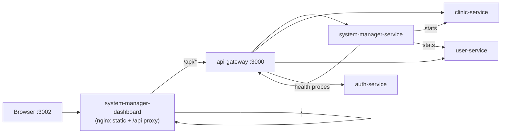

# System Manager Dashboard — Implementation Plan

> **Scope:** Complete the System Manager Dashboard end-to-end for local Docker deployment.  
> **Constraints:** No architecture redesign. Only modify `Frontend/React/system-manager-dashboard` on the frontend. Backend changes limited to what this dashboard requires (`system-manager-service`, `api-gateway`, and existing endpoints in `auth-service`, `clinic-service`, `user-service` as needed).  
> **Date:** 2026-06-22

---

## Phase 1 — Dashboard Requirements Inventory

### Routes & pages

| Route | Page | Nav section | Purpose |
|---|---|---|---|
| `/login` | `LoginPage` | — | System Manager login |
| `/forgot-password` | `ForgotPasswordPage` | — | Placeholder (no backend) |
| `/` | `Overview` | Platform | Platform KPIs |
| `/activation-codes` | `ActivationCodes` | Platform | Generate / check / revoke codes |
| `/clinics` | `Clinics` | Platform | List / create clinics, view staff |
| `/users` | `PlatformUsers` | Platform | List all platform users |
| `/administrators` | `Administrators` | Platform | View self + create system managers |
| `/observability` | `dashboard/index` | Observability | **Mock** APM-style dashboard |
| `/traces`, `/traces/:id` | traces/* | Observability | **Mock** distributed traces |
| `/metrics`, `/metrics/hosts/:id` | metrics/* | Observability | **Mock** infra metrics |
| `/apm` | apm/* | Observability | **Mock** APM |
| `/synthetics` | synthetics/* | Observability | **Mock** synthetic monitors |
| `/alerts`, `/alerts/:id` | alerts/* | Alerting | **Mock** alerts |
| `/incidents`, `/incidents/:id` | incidents/* | Alerting | **Mock** incidents |
| `/integrations` | integrations | Workspace | Static UI (no mock file) |
| `/settings` | settings | Workspace | Local UI preferences |
| `/profile` | profile | — | Local profile UI |
| `/demo` | demo | Developer | **Mock** data loader |
| `/docs` | docs | Developer | Static docs |

### State & data layer

| Layer | Files | Role |
|---|---|---|
| Auth | `src/store/authStore.ts`, `src/lib/auth.ts` | Login, JWT persistence, session expiry |
| Platform data | `src/hooks/usePlatformData.ts` | Loads clinics, users, staff (real APIs) |
| API client | `src/api/client.ts`, `systemManager.ts`, `types.ts`, `errors.ts` | Gateway `/api/*` calls |
| UI stores | `uiStore.ts`, `settingsStore.ts` | Theme/layout (local only) |

### Mock data files (must be eliminated)

| File | Used by |
|---|---|
| `pages/dashboard/mockData.ts` | Overview observability widgets |
| `pages/traces/mockData.ts` | Traces list + detail |
| `pages/metrics/mockData.ts` | Metrics explorer + hosts |
| `pages/apm/mockData.ts` | APM services/errors |
| `pages/alerts/mockData.ts` | Alerts + rules + channels |
| `pages/incidents/mockData.ts` | Incidents list + timeline |
| Inline mocks | `pages/synthetics/index.tsx`, `components/common/NotificationBell.tsx` |

### Feature matrix (required scope vs current state)

| Dashboard feature | Route | Current data source | Required backend API | Status |
|---|---|---|---|---|
| **Login** | `/login` | `POST /api/system-manager/login` | `POST /v1/system-manager/login` | ✅ Done |
| **Token validation** | all protected routes | Gateway JWT cache + `GET /v1/system-manager/validate-token` | Existing gateway middleware | ✅ Done |
| **Role enforcement** | all protected routes | Gateway validates `SYSTEM_MANAGER` JWT | Existing guards on downstream services | ✅ Done |
| **Session handling** | `authStore` | Client JWT expiry + cookie | Existing | ✅ Done (logout API optional) |
| **Platform overview — totals** | `/` | `GET /clinics`, `GET /users` (paginated, client aggregates) | Same | ✅ Done (inefficient for large datasets) |
| **Platform overview — subscriptions** | `/` | Not shown | No subscription model in codebase | ⚠️ Map to **active activation codes** or omit |
| **Platform overview — health summary** | `/` | Not shown | New lightweight health endpoint (see §3) | ❌ Missing |
| **List clinics** | `/clinics` | `GET /clinics` | `GET /v1/clinics` | ✅ Done |
| **Create clinic** | `/clinics` | `POST /clinics` | `POST /v1/clinics` | ✅ Done |
| **Update clinic** | `/clinics` | — | `PUT /v1/clinics/:id` | ❌ UI + API client missing |
| **Suspend / activate clinic** | `/clinics` | — | `PUT /v1/clinics/:id` `{ status: INACTIVE \| ACTIVE }` | ❌ UI + API client missing |
| **View clinic details** | `/clinics` | Partial (table row only) | `GET /v1/clinics/:id`, `GET /v1/clinics/:id/staff` | ⚠️ Partial |
| **List platform users** | `/users` | `GET /users` (client paginates all pages) | `GET /v1/users?page&limit` | ✅ Done |
| **List clinic admins** | `/users` | Client-side role filter | Same `GET /v1/users?role=CLINIC_ADMIN` (filter exists server-side via `filters`) | ⚠️ Filter not wired in UI |
| **Create clinic admin** | — | — | Activation-code flow **or** `POST /v1/system-manager/create-clinic-admin` (Kafka async) | ⚠️ No dedicated UI; activation codes cover onboarding |
| **Assign admin to clinic** | `/clinics` (read-only staff) | — | `POST /v1/clinics/:id/staff` | ❌ UI + API client missing |
| **Activate / deactivate user** | `/users` | — | `PUT /v1/users/:id/status` | ❌ UI + API client missing |
| **Generate activation code** | `/activation-codes` | Real API | `POST /v1/system-manager/activation-code/generate` | ✅ Done |
| **Check / revoke code** | `/activation-codes` | Real API | `GET .../status`, `POST .../revoke` | ✅ Done |
| **List activation codes** | — | — | No list endpoint | ❌ Missing (optional enhancement) |
| **Create system manager** | `/administrators` | Real API | `POST /v1/system-manager/create` | ✅ Done |
| **Service status monitoring** | `/observability` (mock) | Mock | `GET /health`, `GET /health/ready` on gateway + services | ❌ Replace mock page |
| **Database / queue status** | mock pages | Mock | Health `checks.database`, `checks.kafka` from service `/health/ready` | ❌ Replace mock page |
| **Audit logs (read-only)** | — | — | Audit tables exist in `auth-service` but **no read API** for system managers | ⏸️ **Deferred** per scope |

---

## Phase 2 — Backend Gap Analysis

### Existing APIs that can be reused (no backend work)

| Capability | Method | Gateway route | Service |
|---|---|---|---|
| Login | POST | `/api/system-manager/login` | system-manager-service |
| Validate token | GET | (gateway internal) | system-manager-service |
| Create system manager | POST | `/api/system-manager/create` | system-manager-service |
| Generate / revoke / status activation code | POST/GET | `/api/system-manager/activation-code/*` | system-manager-service |
| List / create clinics | GET, POST | `/api/clinics` | clinic-service |
| Get / update clinic | GET, PUT | `/api/clinics/:id` | clinic-service |
| List clinic staff | GET | `/api/clinics/:id/staff` | clinic-service |
| Assign / remove staff | POST, DELETE | `/api/clinics/:id/staff` | clinic-service |
| List users (paginated) | GET | `/api/users?page&limit` | user-service |
| Update user status | PUT | `/api/users/:id/status` | user-service |
| Gateway health | GET | `/health`, `/health/ready` | api-gateway |

Evidence: `system-manager.controller.ts`, `clinic.controller.ts`, `user.controller.ts`, `api-gateway/src/main.ts` route table.

### Existing endpoints needing enhancement

| Gap | Current behaviour | Enhancement | Service |
|---|---|---|---|
| User list pagination | Returns bare array, no `total` | Return `{ data, page, limit, total }` while keeping array shape for backward compat (add `X-Total-Count` header or dual response behind query flag) | user-service |
| Platform stats | Client loads all user pages | Add `GET /v1/system-manager/platform/stats` aggregating counts (clinics, users by role/status, activation codes by status) | system-manager-service |
| Platform health | Gateway `/health` checks only 4 services via stale `GatewayService` | Add `GET /v1/system-manager/platform/health` probing auth, user, clinic, notification, scheduling, appointment, kafka, redis | system-manager-service |
| Docker first boot | Manual `POST /dev/seed-default` | One-shot init container calling seed endpoint after services healthy | docker-compose |
| CORS for dashboard | `ALLOWED_ORIGINS` defaults to `:3000` | Include `http://localhost:3002` in gateway + service env | docker-compose / `.env.example` |

### New endpoints required

| Method | Route | Purpose | Service |
|---|---|---|---|
| GET | `/v1/system-manager/platform/stats` | Overview KPIs without loading all users | system-manager-service |
| GET | `/v1/system-manager/platform/health` | Lightweight service/db/kafka/redis status for Monitoring page | system-manager-service |
| GET | `/v1/system-manager/activation-codes` | Paginated list of activation codes (optional but useful) | system-manager-service |

**Not creating:** duplicate clinic/user CRUD, audit log API (deferred), Prometheus/Grafana integration, subscription billing.

### `create-clinic-admin` note

`POST /v1/system-manager/create-clinic-admin` emits Kafka event only (`system-manager.service.ts` L114–121). The **supported onboarding path** is activation codes → patient/clinic-admin self-registration in auth-service. For dashboard scope:

- **Primary:** keep Activation Codes page as “create clinic admin” flow.
- **Secondary (optional):** add UI that calls `POST /users` with `CLINIC_ADMIN` role + `POST /clinics/:id/staff` if synchronous creation is required — uses existing user-service `POST /v1/users` (SYSTEM_MANAGER role) instead of extending Kafka flow.

---

## 1. Missing Features Checklist

### Authentication & authorization
- [x] Login, JWT validation, role enforcement, session expiry
- [ ] Optional: server-side logout / token revoke (not blocking)

### Clinic management
- [x] List clinics
- [x] Create clinic
- [ ] Update clinic (name, contact fields)
- [ ] Suspend / activate clinic (`status`: `ACTIVE` / `INACTIVE`)
- [ ] Clinic detail drawer/modal (`GET /clinics/:id`)

### User management
- [x] List all users
- [ ] Filter clinic admins (`role=CLINIC_ADMIN`)
- [ ] Activate / deactivate user accounts
- [ ] Assign existing user as clinic staff (`POST /clinics/:id/staff`)
- [ ] Document activation-code flow as primary clinic-admin onboarding (already works)

### Platform overview
- [x] Total clinics / users (client-side aggregation)
- [ ] Platform stats endpoint (avoid loading all users)
- [ ] Health summary widget on Overview

### Monitoring (lightweight only)
- [ ] Replace mock Observability section with **Platform Health** page
- [ ] Remove mock Traces, Metrics, APM, Synthetics, Alerts, Incidents, Demo routes
- [ ] Service + DB + Kafka status from real health probes

### Audit logs
- [ ] **Deferred** — audit data exists in auth-service DB but no system-manager read API

### Docker / ops
- [ ] Dashboard container in `docker compose up -d`
- [ ] Auto-seed default system manager (no manual steps)
- [ ] Dashboard nginx proxies `/api` → `api-gateway:3000`

### Mock data elimination
- [ ] Remove all `mockData.ts` usage (6 files)
- [ ] Remove inline mocks (`NotificationBell`, `synthetics/index.tsx`)

---

## 2. Required Backend Changes

### `system-manager-service`

| File | Change |
|---|---|
| `src/system-manager/controllers/system-manager.controller.ts` | Add `GET platform/stats`, `GET platform/health`, optional `GET activation-codes` |
| `src/system-manager/services/system-manager.service.ts` | Implement stats aggregation; HTTP health probes to peer services |
| `src/system-manager/services/platform-health.service.ts` | **New** — parallel health checks with timeout |
| `src/system-manager/services/user-http.client.ts` | **New** (if missing) — internal user count |
| `src/system-manager/dto/platform.dto.ts` | **New** — response DTOs + Swagger |
| `src/system-manager/system-manager.module.ts` | Register new providers |
| `.env.example` | Document `AUTH_SERVICE_URL`, `USER_SERVICE_URL`, `CLINIC_SERVICE_URL`, etc. |

### `user-service` (minimal enhancement)

| File | Change |
|---|---|
| `src/user/controllers/user.controller.ts` | Return pagination metadata (`total`) on `GET /v1/users` |
| `src/user/services/user.service.ts` | Add `count()` for stats endpoint consumption |

### `api-gateway` (minimal)

| File | Change |
|---|---|
| `src/main.ts` | Ensure `PUBLIC_PATHS` includes any new public health routes if needed (stats/health are protected — no change) |
| `.env.example` | Add `http://localhost:3002` to `ALLOWED_ORIGINS` documentation |

### `auth-service` / `clinic-service` / `notification-service`

**No code changes required** for core scope — existing endpoints suffice. Health endpoints already exist at `/health/ready` with `checks.database`, `checks.kafka`.

---

## 3. Required API Endpoints

### New — system-manager-service

#### `GET /v1/system-manager/platform/stats`

**Auth:** Bearer JWT, role `SYSTEM_MANAGER`

**Response:**
```json
{
  "clinics": { "total": 12, "active": 10, "inactive": 1, "archived": 1 },
  "users": { "total": 340, "active": 310, "byRole": { "PATIENT": 280, "CLINIC_ADMIN": 12, "DOCTOR": 30, "SECRETARY": 15, "SYSTEM_MANAGER": 3 } },
  "activationCodes": { "pending": 4, "used": 8, "expired": 2, "revoked": 1 }
}
```

**Implementation:** Query `system_db.clinic_admin_activations`; HTTP to clinic-service + user-service internal/count endpoints or authorized list with limits.

---

#### `GET /v1/system-manager/platform/health`

**Auth:** Bearer JWT, role `SYSTEM_MANAGER`

**Response:**
```json
{
  "status": "healthy | degraded | down",
  "checkedAt": "2026-06-22T00:00:00.000Z",
  "services": [
    { "name": "api-gateway", "status": "up", "responseTimeMs": 12 },
    { "name": "auth-service", "status": "up", "checks": { "database": "ok", "kafka": "ok" } }
  ],
  "infrastructure": [
    { "name": "kafka", "status": "up" },
    { "name": "redis", "status": "up" }
  ]
}
```

**Implementation:** Parallel `GET http://<service>:<port>/health/ready` with `x-service-token`; derive infra status from representative service checks (auth → redis, any kafka consumer → kafka).

---

#### `GET /v1/system-manager/activation-codes` *(optional)*

**Query:** `page`, `limit`, `status`

**Response:**
```json
{
  "data": [{ "code": "AB12CD34", "phoneNumber": "+963...", "status": "pending", "expiresAt": "...", "createdAt": "..." }],
  "page": 1,
  "limit": 20,
  "total": 45
}
```

---

### Reused — no new backend routes

| Method | Gateway route | Body / notes |
|---|---|---|
| POST | `/api/system-manager/login` | `{ username, password }` |
| POST | `/api/system-manager/create` | Create system manager |
| POST | `/api/system-manager/activation-code/generate` | Generate code |
| GET | `/api/system-manager/activation-code/status?code=` | Lookup |
| POST | `/api/system-manager/activation-code/revoke` | Revoke |
| GET | `/api/clinics` | List clinics |
| POST | `/api/clinics` | Create clinic |
| GET | `/api/clinics/:id` | Clinic detail |
| PUT | `/api/clinics/:id` | Update `{ name?, status?, ... }` |
| GET | `/api/clinics/:id/staff` | Staff list |
| POST | `/api/clinics/:id/staff` | `{ userId, staffRole: "CLINIC_ADMIN" }` |
| GET | `/api/users?page=&limit=&role=` | Paginated users |
| PUT | `/api/users/:id/status` | `{ status: "ACTIVE" \| "INACTIVE" \| ... }` |

---

## 4. Frontend Changes

**Only modify:** `Frontend/React/system-manager-dashboard/`

### API layer

| File | Change |
|---|---|
| `src/api/systemManager.ts` | Add `getPlatformStats`, `getPlatformHealth`, `getClinic`, `updateClinic`, `updateUserStatus`, `assignClinicStaff`, optional `listActivationCodes` |
| `src/api/types.ts` | Add `PlatformStats`, `PlatformHealth`, `PaginatedUsers` types |
| `src/hooks/usePlatformData.ts` | Optional: use stats endpoint for Overview; keep list loaders |

### Platform pages (real data)

| File | Change |
|---|---|
| `src/pages/platform/Overview.tsx` | Add health summary card; use `getPlatformStats` |
| `src/pages/platform/Clinics.tsx` | Detail drawer; edit form; suspend/activate actions |
| `src/pages/platform/PlatformUsers.tsx` | Role filter default; activate/deactivate actions |
| `src/pages/platform/ActivationCodes.tsx` | Optional: codes history table |

### New page

| File | Change |
|---|---|
| `src/pages/platform/PlatformHealth.tsx` | **New** — service/db/kafka grid from `getPlatformHealth` |

### Remove mock observability

| File | Change |
|---|---|
| `src/App.tsx` | Remove mock routes; add `/monitoring` → `PlatformHealth` |
| `src/layout/navConfig.ts` | Replace Observability/Synthetics/Alerting/Developer sections with single **Monitoring** item |
| `src/pages/dashboard/**` | **Delete** after migration (or keep folder unused — prefer delete) |
| `src/pages/traces/**` | **Delete** |
| `src/pages/metrics/**` | **Delete** |
| `src/pages/apm/**` | **Delete** |
| `src/pages/synthetics/**` | **Delete** |
| `src/pages/alerts/**` | **Delete** |
| `src/pages/incidents/**` | **Delete** |
| `src/pages/demo/**` | **Delete** |
| `src/components/common/NotificationBell.tsx` | Remove inline mock notifications → empty state |

### Docker / build

| File | Change |
|---|---|
| `Dockerfile` | **New** — multi-stage: `npm ci && npm run build`, nginx serves `dist/` |
| `nginx.conf` | **New** — SPA fallback + `location /api { proxy_pass http://api-gateway:3000; }` |
| `.env.example` | Add `VITE_API_BASE_URL=/api` for production build |
| `vite.config.ts` | Keep dev proxy; production uses relative `/api` via nginx |
| `README.md` | Update: Docker-first workflow, remove “demo observability” section |

### Keep unchanged (local UI only, no mock files)

- `pages/settings`, `pages/profile`, `pages/integrations`, `pages/docs` — static/local state OK

---

## 5. Docker Changes

All changes in `docker-compose.yml` (+ `.env.example`). **No new databases, Kafka brokers, or monitoring stacks.**

### Add services

```yaml
# One-shot: seed default system manager (dev)
system-manager-seed:
  image: curlimages/curl:latest
  depends_on:
    api-gateway:
      condition: service_healthy
  environment:
    DEFAULT_ADMIN_USERNAME: ${DEFAULT_ADMIN_USERNAME}
    DEFAULT_ADMIN_PASSWORD: ${DEFAULT_ADMIN_PASSWORD}
  entrypoint: ["/bin/sh", "-c"]
  command:
    - |
      curl -sf -X POST http://api-gateway:3000/api/system-manager/dev/seed-default || true
  restart: "no"

# System Manager Dashboard (static + API proxy)
system-manager-dashboard:
  build:
    context: ./Frontend/React/system-manager-dashboard
    dockerfile: Dockerfile
    args:
      VITE_API_BASE_URL: /api
  ports:
    - "3002:80"
  depends_on:
    api-gateway:
      condition: service_healthy
  restart: unless-stopped
```

### Environment updates (`.env.example`)

```env
# Dashboard
DEFAULT_ADMIN_USERNAME=admin
DEFAULT_ADMIN_PASSWORD=change-me-in-production

# Gateway CORS (include dashboard origin)
ALLOWED_ORIGINS=http://localhost:3000,http://localhost:3002,http://localhost:5173
```

### `system-manager-service` compose env

Ensure `DEFAULT_ADMIN_*` vars are passed from root `.env` (already partially present in service `.env`).

### Verification after `docker compose up -d`

| Check | Expected |
|---|---|
| `curl http://localhost:3000/health/ready` | Gateway ready |
| `curl http://localhost:3002/` | Dashboard HTML |
| `curl http://localhost:3002/api/health` | Proxied gateway health |
| Login at `http://localhost:3002/login` | Works with seeded admin |
| Overview loads | Real clinic/user counts |
| Monitoring page | Real service health |

---

## 6. Execution Order

Smallest sequence to a working system:

| Step | Task | Owner |
|---|---|---|
| **1** | Add `GET /platform/stats` + `GET /platform/health` to system-manager-service | Backend |
| **2** | (Optional) Add pagination `total` to user-service `GET /users` | Backend |
| **3** | Extend `src/api/systemManager.ts` + types with new + existing mutation endpoints | Frontend |
| **4** | Implement clinic update/suspend UI on `Clinics.tsx` | Frontend |
| **5** | Implement user activate/deactivate + clinic-admin filter on `PlatformUsers.tsx` | Frontend |
| **6** | Create `PlatformHealth.tsx`; wire Overview health summary | Frontend |
| **7** | Remove mock observability routes, nav items, and `mockData.ts` files | Frontend |
| **8** | Add dashboard `Dockerfile` + `nginx.conf` | Frontend |
| **9** | Add `system-manager-dashboard` + `system-manager-seed` to `docker-compose.yml` | DevOps |
| **10** | Update `ALLOWED_ORIGINS` in env examples | DevOps |
| **11** | Run `docker compose up -d --build`; smoke-test all platform pages | QA |
| **12** | Update `README.md`; delete confirmed mock files | Docs |

**Estimated effort:** 3–5 dev days (1 backend, 2–3 frontend, 0.5 docker/QA).

---

## 7. Definition of Done

| Criterion | Verification |
|---|---|
| No mock data in System Manager dashboard | `rg mockData src/` returns zero imports; no hardcoded demo arrays in pages |
| Dashboard works end-to-end locally | Login → Overview → Clinics CRUD + suspend → Users activate/deactivate → Activation codes → Administrators → Monitoring |
| `docker compose up -d` succeeds | All healthchecks green; dashboard on `:3002` |
| System Manager can perform all required actions | Manual test script below |
| No other frontend modified | Only `Frontend/React/system-manager-dashboard/` changed |
| No unnecessary infrastructure | No Prometheus, Grafana, K8s, or new databases added |

### Smoke test script

1. Open `http://localhost:3002/login` — sign in with seeded admin.
2. **Overview** — stats load; health badge shows real status.
3. **Clinics** — create clinic; open detail; suspend then reactivate.
4. **Users** — filter `CLINIC_ADMIN`; deactivate then activate a test user.
5. **Activation Codes** — generate code; check status; revoke pending code.
6. **Administrators** — create second system manager (dev only).
7. **Monitoring** — all core services show up/down from live probes.
8. Confirm removed routes (`/traces`, `/apm`, etc.) return 404 or redirect to `/`.

---

## Architecture diagram (target state)



---

## Risk notes (keep scope tight)

| Risk | Mitigation |
|---|---|
| Loading all users for Overview breaks at scale | Ship `platform/stats` in step 1 |
| `create-clinic-admin` is async via Kafka | Use activation-code flow; don't block on Kafka consumer for UI |
| Gateway health only checks 4 services | New `platform/health` in system-manager-service bypasses stale `GatewayService` |
| Secrets in committed `.env` files | Use `.env.example` only in repo; document required vars for Docker |
| Forgot-password page has no backend | Hide or show “contact administrator” — out of scope |

---

*This plan is scoped for delivery, not perfection. Defer audit logs, full observability, and subscription billing until a later phase.*
