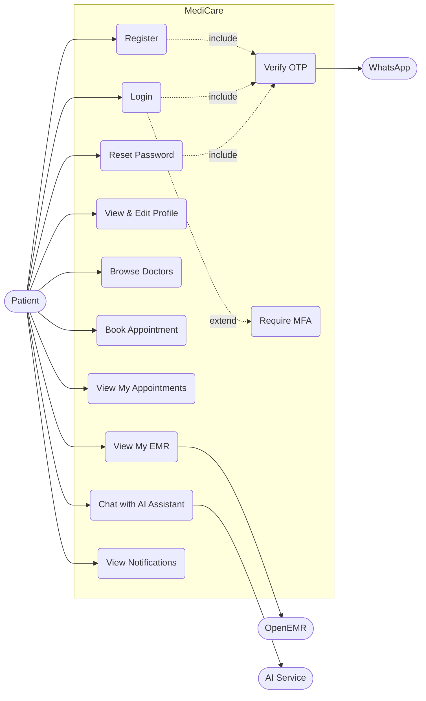
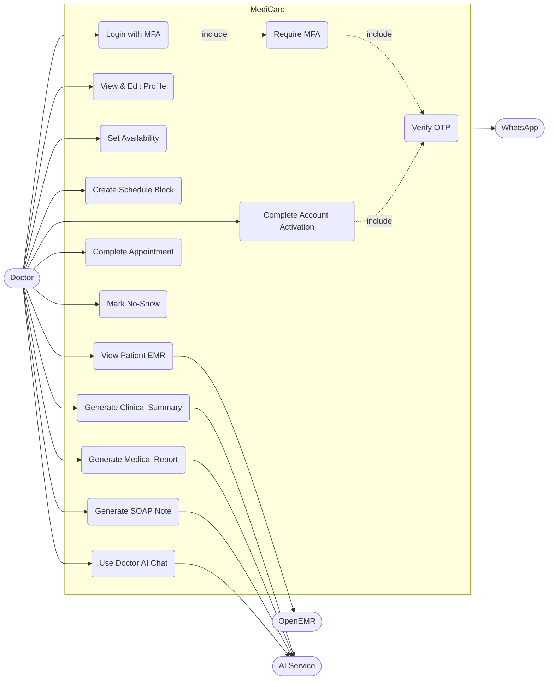
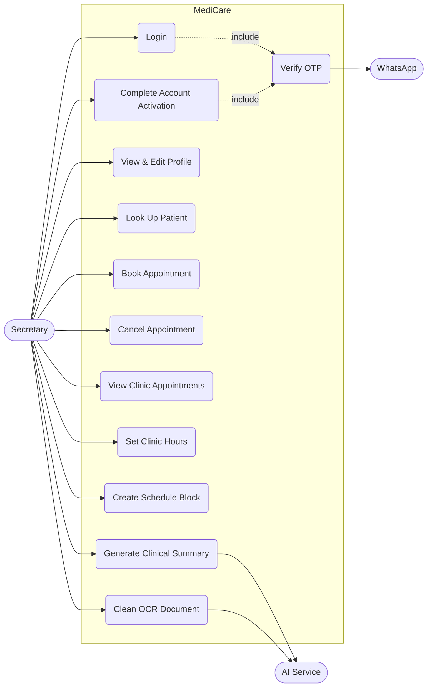
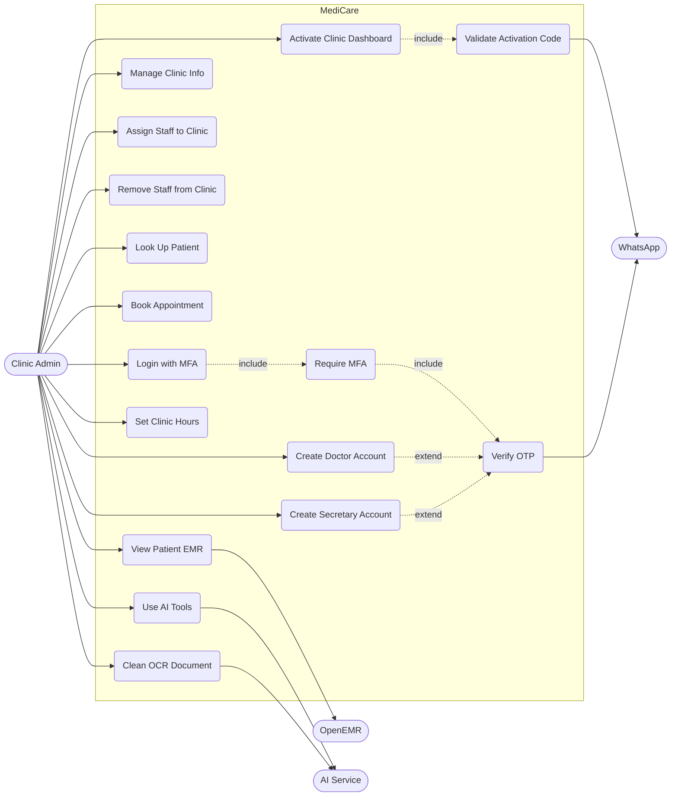
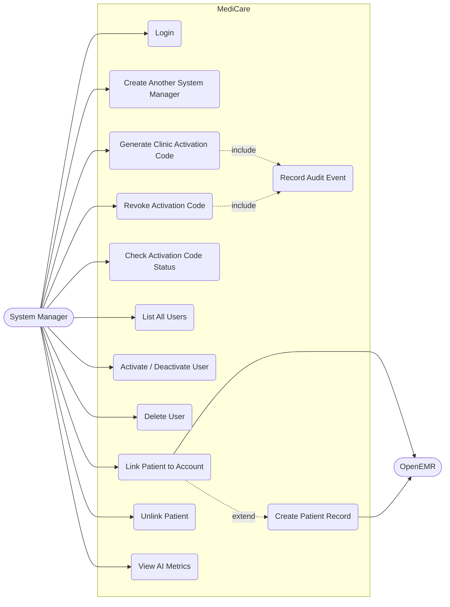

# MediCare — Use Case Diagrams

One diagram per actor group. Simple, business-level goals only.

---

## Actors

| Actor | Role in code | What they do |
|-------|-------------|---------------|
| Patient | `PATIENT` | Register, login, book appointments, view EMR, AI chat |
| Doctor | `DOCTOR` | Login (MFA), manage schedule, view patient EMR, AI tools |
| Secretary | `SECRETARY` | Book appointments, look up patients, manage schedule |
| Clinic Admin | `CLINIC_ADMIN` | Activate clinic, create staff, manage clinic, AI tools |
| System Manager | `SYSTEM_MANAGER` | Platform admin, onboard clinics, manage users |
| WhatsApp | External | Delivers OTP and appointment notifications |
| OpenEMR | External | Clinical records system |
| AI (Ollama/DeepSeek) | External | LLM powering clinical assistance |

---

## 1. Patient

---

## 2. Doctor

---

## 3. Secretary

---

## 4. Clinic Admin

---

## 5. System Manager

---

## 6. Endpoint Reference

| Use case | HTTP endpoint |
|----------|---------------|
| Register | `POST /api/auth/register` |
| Login | `POST /api/auth/login` |
| Verify MFA | `POST /api/auth/verify-mfa` |
| Verify OTP | `POST /api/auth/verify-otp` |
| Reset Password | `POST /api/auth/reset-password` |
| Logout | `POST /api/auth/logout` |
| Complete Activation | `POST /api/auth/staff/complete-activation` |
| Activate Clinic Dashboard | `POST /api/auth/clinic-admin/activate` |
| Create Staff Account | `POST /api/auth/clinic/create-user` |
| View / Edit Profile | `GET/PUT /api/users/:id` |
| Browse Doctors | `GET /api/users/doctors/public` |
| Look Up Patient | `GET /api/users/lookup/patient/:phone` |
| List All Users | `GET /api/users` |
| Link Patient | `POST /api/account-linking/link-patient` |
| Generate Activation Code | `POST /api/system-manager/activation-code/generate` |
| Revoke Activation Code | `POST /api/system-manager/activation-code/revoke` |
| Manage Clinic | `POST/PUT/DELETE /api/clinics` |
| Assign Staff | `POST /api/clinics/:id/staff` |
| Set Clinic Hours | `PUT /api/schedule/clinics/:id/hours` |
| Set Doctor Availability | `POST /api/schedule/availability` |
| Create Schedule Block | `POST /api/schedule/blocked` |
| View Available Slots | `GET /api/schedule/slots` |
| Book Appointment | `POST /api/appointments` |
| View My Appointments | `GET /api/appointments/me` |
| Update Appointment Status | `PATCH /api/appointments/:id/status` |
| View My Notifications | `GET /api/notifications/me` |
| View Own EMR | `GET /api/emr/me` |
| View Patient EMR | `GET /api/emr/patients/:userId` |
| AI Summary | `POST /api/ai/summary` |
| AI Medical Report | `POST /api/ai/report` |
| AI SOAP Note | `POST /api/ai/appointment-note` |
| AI Patient Chat | `POST /api/ai/patient-chat` |
| AI Doctor Chat | `POST /api/ai/doctor-chat` |
| AI OCR Cleanup | `POST /api/ai/ocr-cleanup` |
| AI Metrics | `GET /api/ai/metrics` |

---

*Generated from source controllers. All routes go through the API Gateway at `:3000`.*
