# MediCare Authentication & Authorization — Complete Guide

> **Purpose:** Explain *authentication* (who you are), *authorization* (what you may do), and *how every request is verified* before it reaches clinic data — including the API Gateway, JWT sessions, MFA, internal service HMAC, RBAC, and multi-tenant checks.  
> **Audience:** Software engineers · DevOps / SRE · senior system designers · security reviewers.  
> **Source of truth:** `Backend/NodeJS/api-gateway/`, `auth-service/`, `system-manager-service/`, `shared/internal-auth/`, `shared/tenant/`.  
> **Diagrams:** Mermaid · dark-mode quiet palette (slate / sage / mist) for Cursor & VS Code preview.

---

### Diagram design system (dark preview)

| Token | Hex | Use |
|---|---|---|
| Canvas | `#12171e` | Diagram background |
| Surface | `#1c2633` | Nodes / actors |
| Soft panel | `#161c24` | Subgraphs |
| Mist text | `#c5ced8` | Primary labels |
| Quiet text | `#9aa8b6` | Titles / secondary |
| Edge | `#6b7c8c` | Connectors |
| Sage | `#6d8f7a` | Allow / success |
| Mist-blue | `#5b8a9a` | Gateway / trust boundary |
| Sand | `#8a7d6b` | Challenge / MFA / wait |
| Rose-muted | `#8a7078` | Deny / revoke |

---

## Table of contents

1. [What this document covers](#1-what-this-document-covers)
2. [Authentication vs authorization](#2-authentication-vs-authorization)
3. [Why MediCare needs a strong design](#3-why-medicare-needs-a-strong-design)
4. [Chosen pattern — and why](#4-chosen-pattern--and-why)
5. [System actors & trust boundaries](#5-system-actors--trust-boundaries)
6. [API Gateway — deep dive](#6-api-gateway--deep-dive)
7. [End-to-end request verification](#7-end-to-end-request-verification)
8. [Login & credential flows](#8-login--credential-flows)
9. [JWT, sessions, refresh & revocation](#9-jwt-sessions-refresh--revocation)
10. [MFA & staff activation](#10-mfa--staff-activation)
11. [Authorization layers (RBAC + tenant)](#11-authorization-layers-rbac--tenant)
12. [Internal service-to-service auth](#12-internal-service-to-service-auth)
13. [System Manager vs clinic users](#13-system-manager-vs-clinic-users)
14. [Security controls catalog](#14-security-controls-catalog)
15. [Key files & env vars](#15-key-files--env-vars)
16. [Glossary](#16-glossary)

---

## 1. What this document covers

MediCare is a **multi-tenant clinic platform**. Clients (Flutter apps, dashboards) never talk to microservices directly in production. They talk to the **API Gateway**, which:

1. Decides if the route is **public** or **protected**
2. For protected routes, **validates identity** (JWT + live session)
3. **Strips spoofable headers** and injects trusted identity headers
4. **Signs** the upstream hop with **internal HMAC auth**
5. Proxies to the owning Nest service, which re-checks JWT / roles / tenant

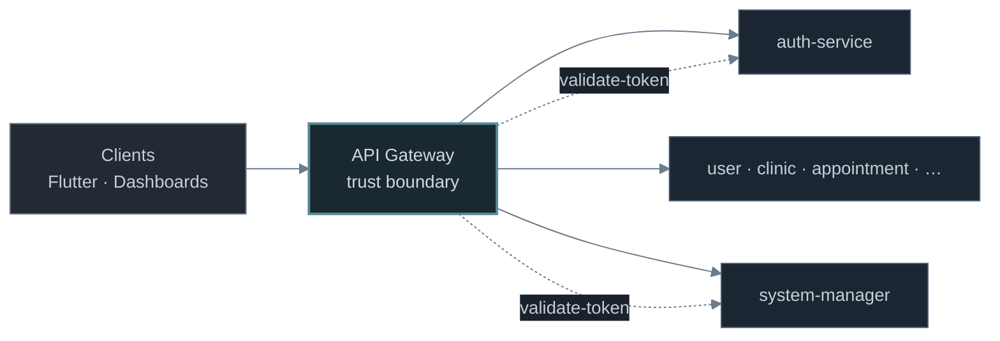

---

## 2. Authentication vs authorization

| Concept | Question | MediCare answer |
|---|---|---|
| **Authentication** | Who is calling? | Bearer JWT issued after login/MFA; backed by an **ACTIVE session** in Postgres; optionally cached at the gateway |
| **Authorization** | What may they do? | **RBAC** (`RolesGuard`) + **tenant membership** (`TenantGuard` / `TenantAuthorizationGuard`) + **internal route allowlists** for service callers |
| **Internal authenticity** | Is this hop really from our mesh? | HMAC-SHA256 headers (`x-internal-service`, signature, timestamp) — clients cannot forge these |

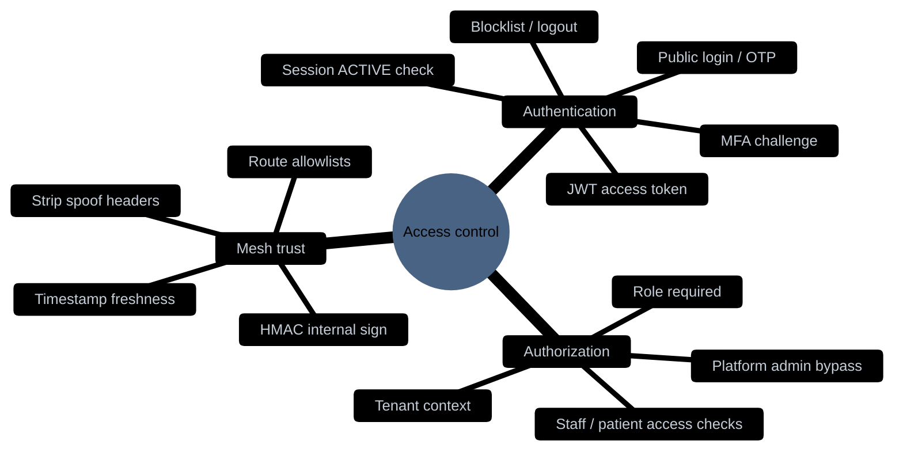

---

## 3. Why MediCare needs a strong design

Healthcare systems handle **PHI** (phone numbers, appointments, clinical links). Requirements that drove the design:

| Need | Why it matters | How MediCare addresses it |
|---|---|---|
| **Revoke access immediately** | Staff leaves / stolen device | Session revoke + JWT `jti` blocklist + gateway cache invalidation |
| **Stop header spoofing** | Client must not claim `x-user-id` | Gateway **strips** internal headers, then re-injects after validation |
| **Limit blast radius** | Compromised service ≠ open all routes | Internal **route allowlists** per caller |
| **Multi-clinic isolation** | Tenant A must not read Tenant B | `tenantId` in JWT + TenantAuthorizationGuard |
| **Staff stronger login** | Clinic admins / doctors | Login MFA (WhatsApp OTP) + trusted devices |
| **Single public entry** | Fewer attack surfaces | API Gateway as only external HTTP front door |

---

## 4. Chosen pattern — and why

### Pattern name (practical)

**Edge authentication + defense-in-depth authorization + signed service mesh**

Not “gateway trusts forever.” Not “every service is its own public OAuth server.”

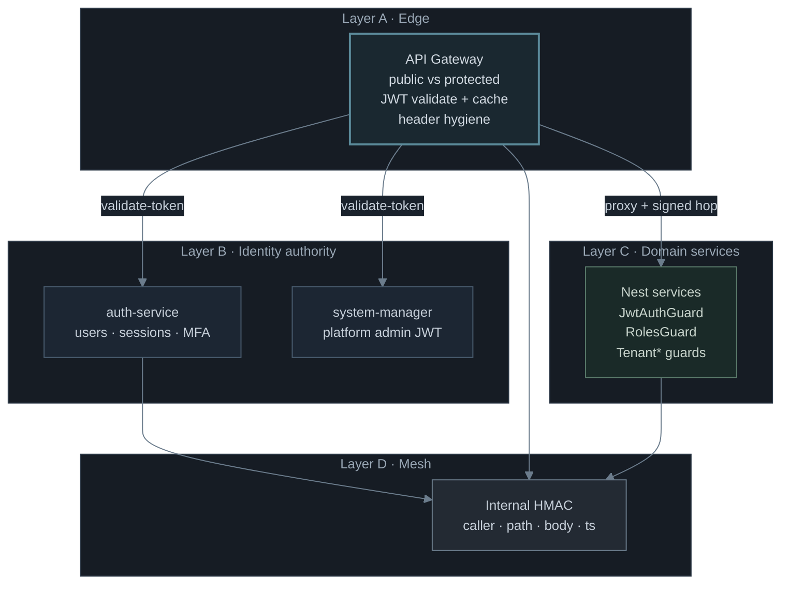

### Why this pattern (decision record)

| Alternative | Why not chosen as primary |
|---|---|
| **Pure JWT, no session DB** | Logout / revoke wait until token expiry — unacceptable for healthcare (auth JWT strategy comments state this explicitly) |
| **Validate JWT only at gateway; services trust `x-user-*`** | If a service is exposed or mis-routed, spoofed headers become catastrophic; services still verify JWT |
| **Validate only inside each service (no gateway auth)** | Clients would hit many ports; inconsistent public routes; harder rate-limit & header hygiene |
| **Mutual TLS only between services** | Valuable, but not the current deploy model; HMAC works across Docker/Railway private networks without mTLS ops cost |
| **API keys for users** | Poor UX for apps; no session/device model; hard MFA |

### Design goals encoded in code

1. **Gateway is the choke point** for external traffic (`api-gateway/src/main.ts`).
2. **Identity truth** lives in auth-service (and system-manager for platform admins).
3. **Sessions are first-class** (Postgres) — JWT carries `sessionId` + `jti`.
4. **Caching is an optimization**, not the source of truth — 5-minute Redis cache with invalidation on logout.
5. **Defense in depth** — even after gateway validation, controllers use `JwtAuthGuard` + role/tenant guards.
6. **Internal calls are signed** — `InternalServiceGuard` rejects unsigned or stale requests.

---

## 5. System actors & trust boundaries

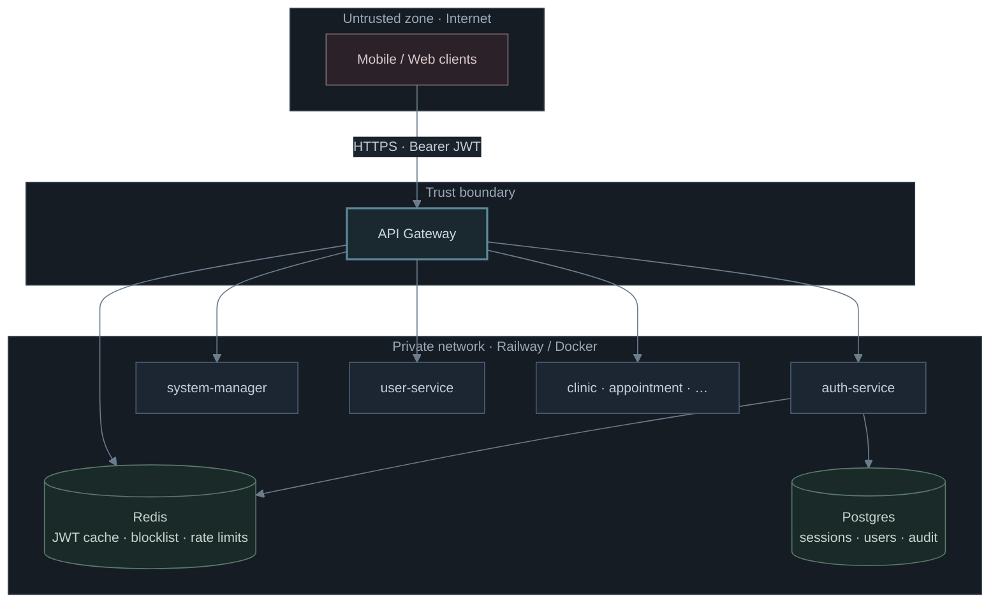

### Roles in the product

| Role | Issuer | Typical surface |
|---|---|---|
| `PATIENT` | auth-service | Patient app |
| `DOCTOR` / `SECRETARY` / `CLINIC_ADMIN` | auth-service | Staff dashboards |
| `SYSTEM_MANAGER` | system-manager-service | Platform control center |

---

## 6. API Gateway — deep dive

The live gateway pipeline is implemented primarily in `Backend/NodeJS/api-gateway/src/main.ts` (Express middleware chain + `http-proxy-middleware`). An older Nest `AuthMiddleware` exists with the same ideas; production path follows `main.ts`.

### 6.1 Pipeline (ordered)

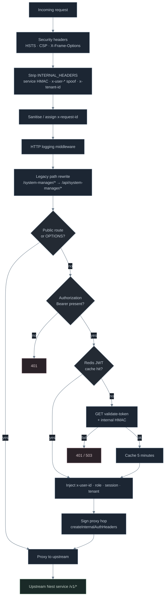

### 6.2 What gets stripped (anti-spoof)

Clients cannot supply these — they are deleted on every request, then re-created by the gateway when appropriate:

- Internal HMAC headers (`SERVICE_NAME`, `SIGNATURE`, `TIMESTAMP`)
- Legacy `x-service-token`
- `x-request-id` (re-sanitised)
- `x-forwarded-for`
- `x-tenant-id` (re-injected only after successful validation for non-patient staff contexts)

### 6.3 Public vs protected routes

**Public** (no Bearer required) examples from `PRODUCTION_PUBLIC_PATHS`:

- `/api/auth/register`, `/login`, `/send-otp`, `/verify-otp`, `/refresh-token`
- Forgot-password + MFA verify + staff activation endpoints
- `/api/system-manager/login`
- Health / metrics
- Push notification public config endpoints

**Protected:** everything else under `/api/*` requires a valid Bearer token.

Dev-only routes (`/api/auth/dev/*`) are **not** public in production (`NODE_ENV !== development` → 404).

### 6.4 Where validate-token is sent

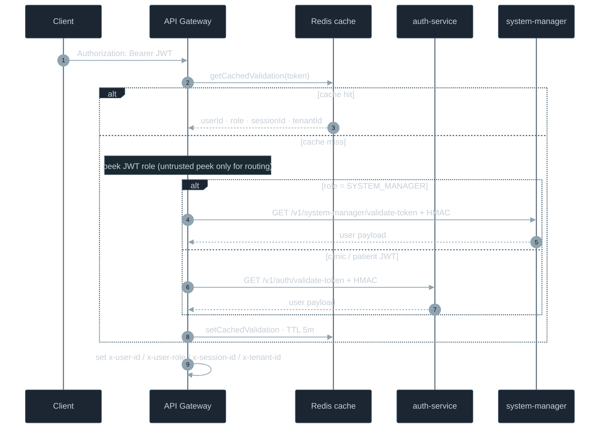

**Why peek the JWT role without full verify?** Only to choose the correct validator host. Full cryptographic validation + session checks happen inside auth-service / system-manager `validate-token` handlers (`InternalServiceGuard` + `JwtAuthGuard` / Passport strategy).

### 6.5 Proxy hop

After auth succeeds, the gateway:

1. Rewrites `/api/<service>/…` → `/v1/…` on the target service
2. Attaches **fresh internal HMAC** for that method + upstream path
3. Forwards `Authorization`, `x-request-id`, client IP, and trusted tenant header
4. Wraps the proxy in a **circuit breaker** (opens after failures → 503 fallback)

---

## 7. End-to-end request verification

### Happy path: patient lists appointments

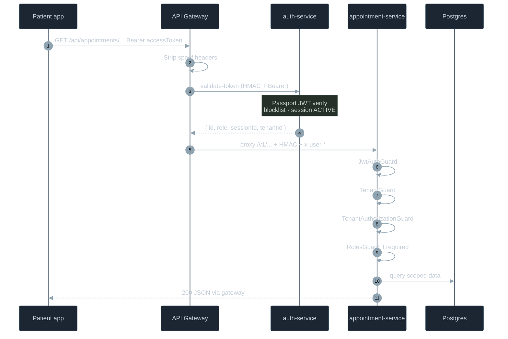

### Verification checklist (every protected request)

| Step | Where | Failure |
|---|---|---|
| TLS / network edge | Platform / reverse proxy | Connection fails |
| Public allowlist | Gateway | Continue without JWT |
| Bearer present | Gateway | 401 |
| Cache or remote validate | Gateway → auth/SM | 401 / 503 |
| Signature + expiry | auth JwtStrategy | 401 |
| Not `mfa_pending` / `activation_pending` | JwtStrategy | 401 |
| `jti` not blocklisted | Redis/DB | 401 |
| Session ACTIVE | Postgres | 401 |
| Internal HMAC on proxy | Upstream InternalServiceGuard (sensitive routes) / always on validate | 401 |
| Local JWT verify | Service JwtAuthGuard | 401 |
| Role allowed | RolesGuard | 403 |
| Tenant present | TenantGuard | 403 |
| Tenant membership | TenantAuthorizationGuard | 403 |

---

## 8. Login & credential flows

### Clinic user login (auth-service)

Credentials are **not** verified inside auth-service’s user table alone for password check — auth calls **user-service** over signed internal HTTP (`userHttp.validateLogin`), then auth owns **sessions / tokens / MFA / audit**.

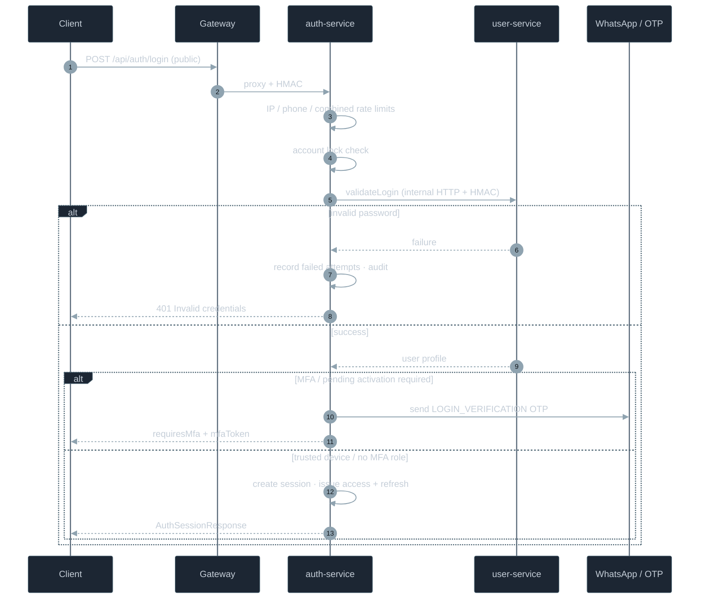

### Why split auth vs user?

| Concern | Owner |
|---|---|
| Password hash / user profile / roles / clinic links | **user-service** |
| OTP, sessions, JWT issue/refresh, MFA tokens, login audit, gateway cache invalidation | **auth-service** |

This keeps identity **credentials** and **security session machinery** in clear bounded contexts (aligned with Kafka `user.login.request` / password-changed events elsewhere).

---

## 9. JWT, sessions, refresh & revocation

### Token contents (access)

Typical access JWT claims (auth-service):

- `sub` — user id  
- `role`  
- `sessionId` — DB session  
- `tenantId` / clinic scope  
- `jti` — unique id for blocklist  
- `permissions` (optional array)  
- Expiry — short-lived (e.g. `JWT_EXPIRES_IN` ≈ 15m)

### Session model

`SessionService` creates an **ACTIVE** session with:

- Device info (UA, IP, …)
- `expiresAt` (default days)
- `tokenFamilyId` for refresh rotation / reuse detection
- `isCurrent` flag

Refresh tokens are stored **hashed** on the session; rotation issues a new refresh and invalidates the old hash.

### Logout / revoke

1. Session marked revoked in Postgres  
2. Access token `jti` added to **Redis blocklist** (+ DB fallback)  
3. Gateway cache invalidated via signed `POST /internal/cache/auth/invalidate` (caller must be `auth-service`)

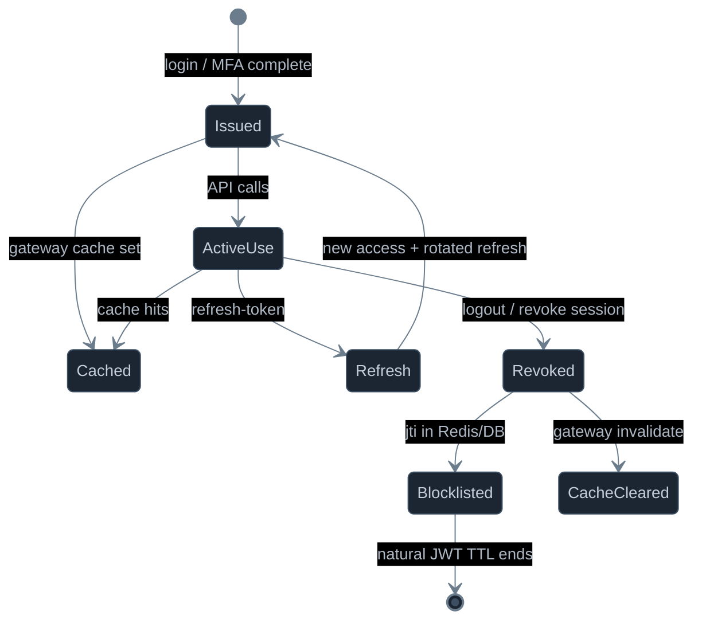

### Auth-service JwtStrategy (authoritative checks)

From `jwt.strategy.ts` (paraphrased):

1. Verify signature + expiry (HS256 or RS256 if keys configured)  
2. Reject malformed payloads (missing `sub` / `sessionId`)  
3. Reject `mfa_pending` and `activation_pending` types as access tokens  
4. Check **blocklist** by `jti`  
5. Check **session still ACTIVE**  
6. Return safe user context (**no phone number** — PHI kept out of request context / logs)

---

## 10. MFA & staff activation

### When MFA triggers on login

For roles that `usesLoginMfa(role)`:

- If device is **not** trusted → OTP via WhatsApp + short-lived `mfaToken` (`type: mfa_pending`)
- Pending activation / `mustChangePassword` also forces OTP then password completion (`staff/complete-activation`)

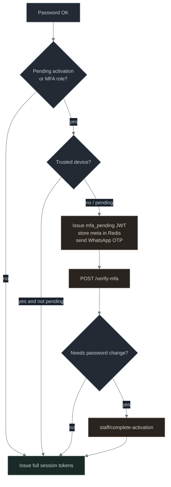

`mfa_pending` tokens **cannot** call normal APIs — JwtStrategy rejects them.

---

## 11. Authorization layers (RBAC + tenant)

### Guard stack (typical domain controller)

Example pattern on appointment / scheduling controllers:

```text
@UseGuards(JwtAuthGuard, TenantGuard, TenantAuthorizationGuard)
// plus per-route:
@UseGuards(RolesGuard)
@Roles(UserRole.DOCTOR, UserRole.CLINIC_ADMIN, ...)
```

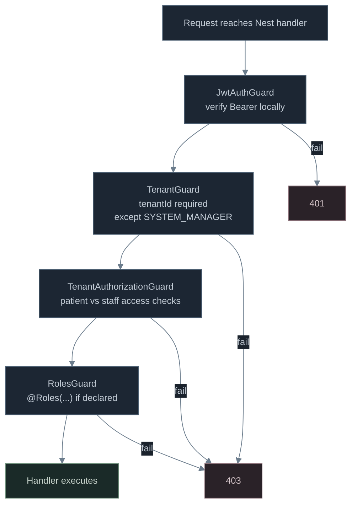

### RBAC (`RolesGuard`)

- Reads metadata from `@Roles(...)`  
- Compares `request.user.role`  
- No roles metadata → allow (authentication still required by JwtAuthGuard)

### Tenant isolation

| Guard | Responsibility |
|---|---|
| `TenantGuard` | Ensure tenant context exists (platform role exempt) |
| `TenantAuthorizationGuard` | **PATIENT** → `assertPatientAccess`; **CLINIC_ADMIN / SECRETARY / DOCTOR** → `assertStaffAccess`; **SYSTEM_MANAGER** → allow |

This is **authorization beyond roles**: same role in clinic A cannot act in clinic B.

---

## 12. Internal service-to-service auth

### Problem

If microservices accept plain HTTP inside the private network, any compromised container could call `validate-token` or admin APIs.

### Solution: HMAC request signing

Shared library: `Backend/NodeJS/shared/internal-auth/`

**Canonical payload:**

```text
METHOD
PATH
CANONICAL_BODY
TIMESTAMP
```

**Signature:** `HMAC-SHA256(secret, payload)` hex  
**Freshness:** ±30 seconds (`isTimestampFresh`)  
**Compare:** timing-safe equality

### Headers

- Service name header (caller identity)  
- Signature  
- Timestamp  

Legacy static `x-service-token` is **rejected**.

### InternalServiceGuard

1. Require headers  
2. Caller must be a **known** service name  
3. Caller secret must exist in `INTERNAL_AUTH_TRUSTED_SECRETS`  
4. Verify signature for method/path/body/timestamp  
5. Enforce **route allowlist** (`isCallerAllowedForRoute` + optional decorator allow list)  
6. Attach `request.internalCaller`

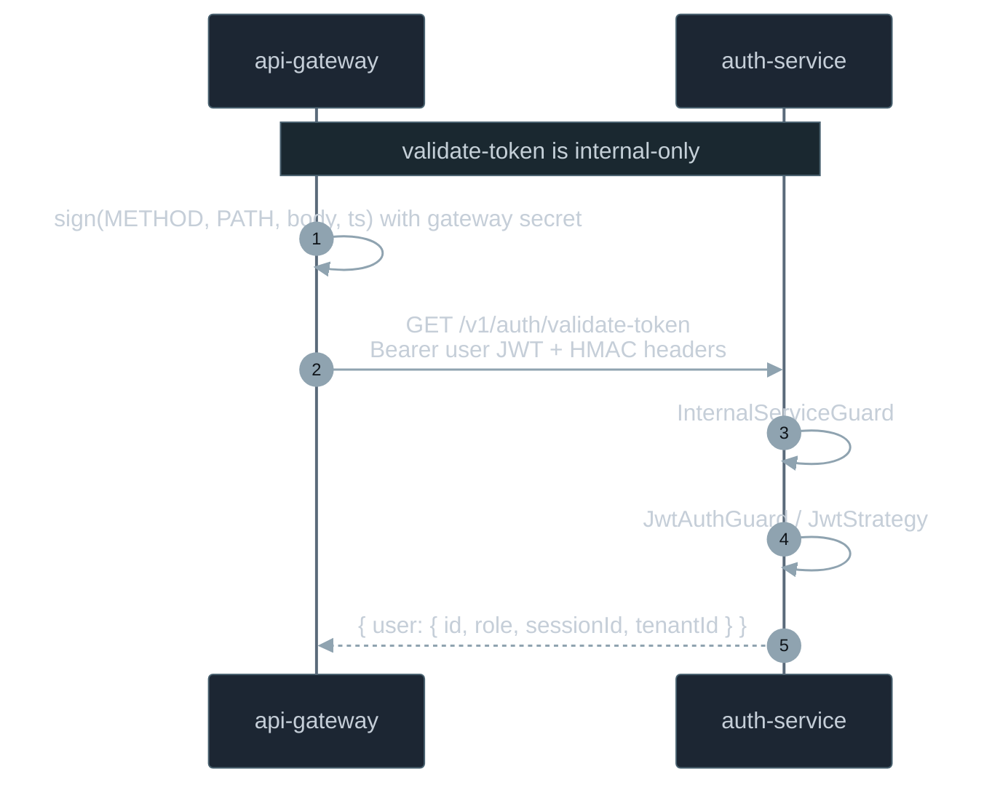

`validate-token` is explicitly guarded with **`InternalServiceGuard` + `JwtAuthGuard`** so browsers cannot call it even if the path leaked.

---

## 13. System Manager vs clinic users

| Aspect | Clinic users | System manager |
|---|---|---|
| Login route | `/api/auth/login` | `/api/system-manager/login` |
| Token issuer | auth-service | system-manager-service |
| Gateway validator | `/v1/auth/validate-token` | `/v1/system-manager/validate-token` |
| Session model | Full auth sessions + refresh | Platform JWT (gateway may synthesize `sm-{id}` cache session key) |
| Tenant rules | Enforced | Platform role bypasses tenant guards |

Gateway chooses validator by path prefix and/or JWT `role === SYSTEM_MANAGER`.

---

## 14. Security controls catalog

| Control | Layer | Notes |
|---|---|---|
| Public route allowlist | Gateway | Explicit set; password-reset hard-coded fallback |
| Header stripping | Gateway | Anti-spoof |
| JWT validation | Gateway + services | Cache at edge; full checks at auth |
| Session ACTIVE | auth-service | Revocation without waiting full JWT TTL |
| JWT blocklist | Redis + DB | Logout / revoke |
| Gateway cache invalidate | Signed internal POST | Only `auth-service` caller |
| MFA | auth-service | Staff / activation |
| Rate limits | auth-service | IP, phone, combined |
| Account lock | auth-service | After repeated failures |
| CSRF / idempotency | Selected auth POSTs | Register etc. |
| RBAC | Services | `@Roles` |
| Tenant authz | Services | Membership checks |
| Internal HMAC | Mesh | Signed hops |
| Circuit breaker | Gateway proxy | Upstream failure isolation |
| Security response headers | Gateway | HSTS, CSP, frame deny, … |
| PHI hygiene | JwtStrategy | Phone not placed on `request.user` |

---

## 15. Key files & env vars

### Files

```text
Backend/NodeJS/api-gateway/src/main.ts
Backend/NodeJS/api-gateway/src/gateway/middleware/auth.middleware.ts
Backend/NodeJS/api-gateway/src/internal-auth/*

Backend/NodeJS/microservices/auth-service/src/auth/controllers/auth.controller.ts
Backend/NodeJS/microservices/auth-service/src/auth/services/auth.service.ts
Backend/NodeJS/microservices/auth-service/src/auth/services/session.service.ts
Backend/NodeJS/microservices/auth-service/src/auth/services/jwt-blocklist.service.ts
Backend/NodeJS/microservices/auth-service/src/auth/strategies/jwt.strategy.ts

Backend/NodeJS/shared/internal-auth/internal-auth.crypto.ts
Backend/NodeJS/shared/internal-auth/internal-service.guard.ts
Backend/NodeJS/shared/tenant/tenant.guard.ts
Backend/NodeJS/shared/tenant/tenant-authorization.guard.ts

Backend/NodeJS/microservices/*/src/**/guards/jwt-auth.guard.ts
Backend/NodeJS/microservices/*/src/**/guards/roles.guard.ts
```

### Important environment variables

| Variable | Role |
|---|---|
| `JWT_SECRET` / `JWT_PUBLIC_KEY` + `JWT_PRIVATE_KEY` | Token crypto |
| `JWT_EXPIRES_IN` | Access token lifetime |
| `AUTH_SERVICE_URL` | Gateway → auth |
| `SYSTEM_MANAGER_SERVICE_URL` | Gateway → platform admin validate |
| `INTERNAL_AUTH_SECRET` | This service’s signing secret |
| `INTERNAL_AUTH_SERVICE_NAME` | This service’s caller name |
| `INTERNAL_AUTH_TRUSTED_SECRETS` | JSON map of peer name → secret (literal secrets; refs inside JSON do not expand) |
| `REDIS_URL` | Gateway JWT cache, blocklist, rate limits |
| `NODE_ENV` | Dev-only public routes |

---

## 16. Glossary

| Term | Meaning |
|---|---|
| **Authentication** | Proving identity (login → JWT + session) |
| **Authorization** | Allowing an action (roles + tenant) |
| **Bearer token** | `Authorization: Bearer <jwt>` |
| **Session** | Server-side ACTIVE record bound to refresh family |
| **jti** | JWT ID used for revocation blocklist |
| **mfa_pending** | Temporary token type; not valid for APIs |
| **Edge auth** | Gateway validates before proxy |
| **Defense in depth** | Services still verify JWT/roles/tenant |
| **Internal HMAC** | Mesh authenticity for service hops |
| **Tenant** | Clinic isolation boundary (`tenantId` / `clinicId`) |

---

## Appendix A — Architecture poster

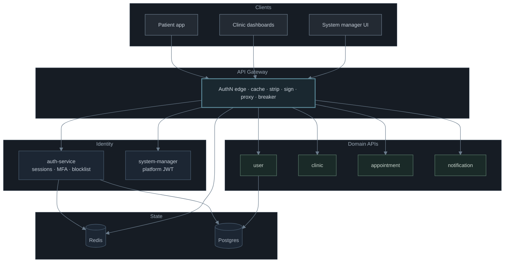

---

## Appendix B — Pattern summary (one page)

| Layer | Authenticates | Authorizes |
|---|---|---|
| **Gateway** | Bearer via auth/SM validate-token (+ cache) | Public allowlist only |
| **auth-service** | Passwords (via user-service), OTP, MFA, sessions | Admin-only auth routes via RolesGuard |
| **Domain services** | JwtAuthGuard | RolesGuard + Tenant* guards |
| **Mesh** | HMAC InternalServiceGuard | Route allowlists per caller |

**Selected pattern:** Edge authentication, session-backed JWTs, defense-in-depth service guards, signed internal mesh — chosen for **revocability**, **anti-spoofing**, **multi-tenant isolation**, and **operational fit** on Docker/Railway without requiring mTLS everywhere.

---

*Document sourced from the MediCare Nest gateway and auth codebase. When public routes, roles, or internal allowlists change, update the corresponding source files first, then revise this guide.*
