# MediCare Clinic Management System — Enterprise Architecture Document

> **Document class:** Production-grade Enterprise Architecture & Technical Design Specification
> **Audience:** Enterprise & Solution Architects · Security & Compliance Reviewers · Hospital Procurement · Investors · Academic Examiners · DevOps/SRE · Engineering
> **System type:** Event-driven, microservice-based, multi-tenant clinic & healthcare management platform with EMR (OpenEMR/FHIR), AI assistance, and WhatsApp messaging.

---

## Document control

| Field | Value |
|---|---|
| Title | MediCare Clinic Management System — Enterprise Architecture Document |
| Version | 2.0 (architecture-grade refactor & expansion) |
| Status | Living document — Review baseline |
| Classification | Internal / Confidential |
| Source of truth | `docker-compose.yml`, `Messaging/Kafka/kafka-config/`, `Backend/NodeJS/**`, `Integrations/**`, service `*.entity.ts`, `*.controller.ts`, `main.ts` |
| Diagram notation | [Mermaid](https://mermaid.js.org/) (renders on GitHub/GitLab + VS Code) and C4 model conventions |
| Compliance posture | HIPAA-adjacent, ISO 27001-aligned controls (see [Security Architecture](#security-architecture)) |

### Conventions used in this document

- **C4 model** — Context (L1), Container (L2), Component (L3), Code (L4) per [c4model.com](https://c4model.com).
- **DFD** — Gane–Sarson style data-flow diagrams, levelled 0 → 1 → 2.
- **UML** — Sequence, Activity, State, Use-Case diagrams expressed in Mermaid.
- Every factual claim is traceable to a file in the repository; file paths are quoted inline.
- Where a capability is *scaffolded but not yet wired*, it is flagged **(planned)** or **(dormant)** rather than presented as live.

### How to read this document

1. **Executives / procurement / investors** → [Executive Summary](#1-executive-summary), [Business Objectives](#3-business-objectives), [Disaster Recovery](#16-disaster-recovery), [Scalability Strategy](#17-scalability-strategy).
2. **Architects** → [High-Level Architecture](#8-high-level-architecture), [Service Catalog](#9-service-catalog), [Integration Architecture](#13-integration-architecture), per-service deep dives.
3. **Security & compliance** → [Security Architecture](#11-security-architecture), [STRIDE](#1131-stride-threat-model), [OWASP](#1138-owasp-top-10-2021-mapping), [HIPAA controls](#1139-hipaa-security-controls-mapping).
4. **Engineers / SRE** → per-service sections, [Kafka Infrastructure](#kafka-infrastructure-service), [Redis Infrastructure](#redis-infrastructure-service), [Testing Strategy](#18-testing-strategy), [Appendices](#19-appendices).

---

## Master table of contents

### Part I — Enterprise architecture

1. [Executive Summary](#1-executive-summary)
2. [System Overview](#2-system-overview)
3. [Business Objectives](#3-business-objectives)
4. [Functional Requirements](#4-functional-requirements)
5. [Non-Functional Requirements](#5-non-functional-requirements)
6. [Architecture Principles](#6-architecture-principles)
7. [Technology Stack](#7-technology-stack)
8. [High-Level Architecture](#8-high-level-architecture)
9. [Service Catalog](#9-service-catalog)
10. [Infrastructure Architecture](#10-infrastructure-architecture)
11. [Security Architecture](#11-security-architecture)
12. [Data Architecture](#12-data-architecture)
13. [Integration Architecture](#13-integration-architecture)
14. [Deployment Architecture](#14-deployment-architecture)
15. [Monitoring & Observability](#15-monitoring--observability)
16. [Disaster Recovery](#16-disaster-recovery)
17. [Scalability Strategy](#17-scalability-strategy)
18. [Testing Strategy](#18-testing-strategy)
19. [Appendices](#19-appendices)

### Part II — Per-service architecture (each with Overview, Responsibilities, Business Rules, Dependencies, Integrations, APIs, Data Ownership, DB Design, Security, Failure, Scaling, Monitoring, Logging, Caching, Deployment + diagram suite)

- [API Gateway Service](#api-gateway-service)
- [Auth Service](#auth-service)
- [User Service](#user-service)
- [System Manager Service](#system-manager-service)
- [Clinic Service](#clinic-service)
- [Scheduling Service](#scheduling-service)
- [Appointment Service](#appointment-service)
- [Notification Service](#notification-service)
- [Reminder Service](#reminder-service)
- [AI Service](#ai-service)
- [EMR Service & OpenEMR Integration](#emr-service--openemr-integration)
- [Kafka Infrastructure (Service)](#kafka-infrastructure-service)
- [Redis Infrastructure (Service)](#redis-infrastructure-service)

### Part III — Cross-cutting domains

- [Consolidated ER Diagrams (every database)](#consolidated-er-diagrams-every-database)
- [EMR / Healthcare Clinical Domain](#emr--healthcare-clinical-domain)
- [Kafka Architecture (deep)](#kafka-architecture-deep)
- [Redis Architecture (deep)](#redis-architecture-deep)
- [Security Section (deep)](#security-section-deep)
- [Testing Section (deep)](#testing-section-deep)

### Part IV — Governance

- [Architecture Decision Records (ADR)](#architecture-decision-records-adr)
- [Risks & Mitigations](#risks--mitigations)
- [Technical Debt Register](#technical-debt-register)
- [Assumptions & Constraints](#assumptions--constraints)
- [Future Architecture Roadmap](#future-architecture-roadmap)

### Annex

- [Annex A — Preserved original documentation (verbatim)](#annex-a--preserved-original-documentation-verbatim)

---

# Part I — Enterprise Architecture

## 1. Executive Summary

**MediCare** is an event-driven, microservices-based clinic and healthcare management platform. It unifies patient identity, clinic administration, doctor scheduling, appointment booking, automated patient messaging (WhatsApp), AI-assisted clinical documentation, and a full Electronic Medical Record (EMR) capability backed by **OpenEMR over HL7 FHIR R4**.

The platform is composed of **eleven first-party microservices** fronted by a single **API Gateway**, communicating through a combination of **synchronous HTTP (internal, token + HMAC-signed)** and **asynchronous Apache Kafka events**. Each service owns its own **PostgreSQL** database (database-per-service), with **Redis** providing distributed caching, rate-limiting, account-locking, and JWT/session security primitives. A third-party **Evolution API** container provides WhatsApp Business connectivity backed by **MongoDB**, and a local **Ollama** LLM runtime (with optional DeepSeek cloud fallback) powers the AI service.

| Dimension | Summary |
|---|---|
| **Architecture style** | Event-driven microservices, database-per-service, API-gateway edge, CQRS-lite (request-reply + domain events) |
| **First-party services** | 11 (gateway, auth, user, system-manager, clinic, scheduling, appointment, notification, reminder, AI, EMR) |
| **Databases** | 9 PostgreSQL instances + 1 MariaDB (OpenEMR) + 1 MongoDB (WhatsApp) + Redis |
| **Messaging** | Apache Kafka (Confluent 7.4, ZooKeeper mode), single dev broker, 46+ pre-provisioned topics, DLT safety net |
| **Healthcare integration** | OpenEMR via FHIR R4 (Patient, Encounter, Observation, MedicationRequest, AllergyIntolerance, Immunization, CarePlan, DocumentReference, Coverage, Procedure, Condition, DiagnosticReport) |
| **AI** | Ollama (`qwen3:4b`, `qwen2.5:3b-instruct`) + DeepSeek fallback; OCR via Tesseract.js |
| **Security posture** | Phone-OTP + password auth, MFA for privileged roles, JWT with `jti` blocklist, refresh-token rotation + family-reuse detection, Redis rate limiting, 3-tier account lockout, audit logging with HIPAA 6-year retention guard |
| **Compliance alignment** | HIPAA-adjacent (PHI minimisation, audit retention, masking), ISO 27001-aligned control families |
| **Delivery** | Docker Compose (dev), container-per-service, resource-bounded, healthcheck-gated startup ordering |

**Value proposition.** MediCare lets a platform operator onboard independent clinics (multi-tenant), each with administrators, doctors, and secretaries, while patients self-register via phone, book appointments against real doctor availability, receive automated WhatsApp confirmations and reminders, and have their clinical record automatically provisioned and surfaced from OpenEMR. AI augments — but never replaces — clinician judgement, producing drafts that are explicitly labelled and disclaimer-wrapped.

**Current maturity.** The codebase is feature-complete for the core booking + identity + EMR-read journeys and is operated as a **single-broker development topology**. Production hardening items (3-broker Kafka, TLS/mTLS, KRaft, external alerting sinks, monitoring stack wiring) are catalogued in [Future Architecture Roadmap](#future-architecture-roadmap) and [Technical Debt Register](#technical-debt-register).

---

## 2. System Overview

MediCare digitises the full operational lifecycle of an outpatient clinic network:

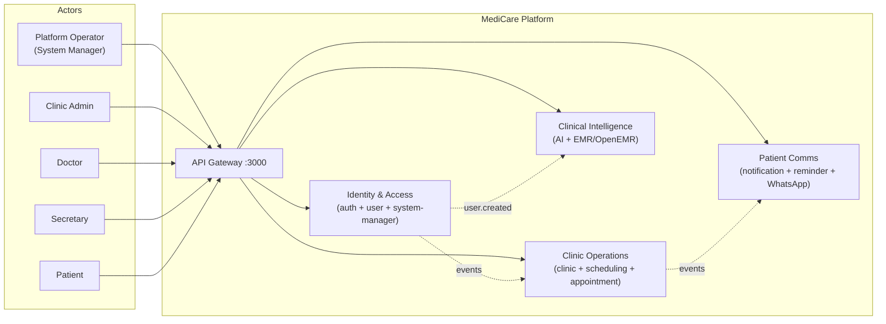

### 2.1 Context boundary

| Inside the system boundary | Outside (external dependencies) |
|---|---|
| API Gateway, 10 NestJS microservices, 9 PostgreSQL DBs, Redis, Kafka + ZooKeeper | Patient/staff browsers & mobile apps |
| EMR service (orchestration) | **OpenEMR** EHR (MariaDB-backed) — clinical system of record |
| AI service (orchestration) | **Ollama** local LLM runtime, **DeepSeek** cloud LLM API |
| Notification service | **Evolution API** (WhatsApp Business gateway) + MongoDB |

### 2.2 Logical capability map

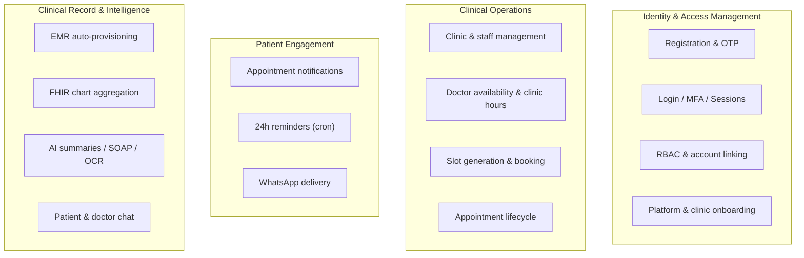

### 2.3 Primary user journeys (high level)

1. **Platform bootstrap** → System Manager seeds platform, issues clinic activation codes.
2. **Clinic onboarding** → Activation code provisions a clinic; clinic admin activates dashboard, creates doctors/secretaries.
3. **Patient onboarding** → Patient registers by phone, verifies OTP (WhatsApp), is auto-provisioned in OpenEMR.
4. **Booking** → Patient/secretary books an appointment validated against doctor availability and clinic hours.
5. **Engagement** → Confirmation + 24h reminder delivered via WhatsApp.
6. **Care** → Doctor reviews FHIR-aggregated chart; AI drafts notes/summaries on demand.

---

## 3. Business Objectives

| # | Objective | Architectural enabler | Success measure |
|---|---|---|---|
| BO-1 | Onboard independent clinics quickly and safely | Activation-code provisioning (`system-manager` → `clinic-service`) | Time-to-clinic-live < 1 business day |
| BO-2 | Frictionless patient acquisition | Phone-only registration + WhatsApp OTP | OTP delivery success rate; registration completion rate |
| BO-3 | Eliminate double-booking & scheduling conflicts | Slot validation (`scheduling-service`) + DB-level conflict check (`appointment-service`) | Zero overlapping confirmed appointments |
| BO-4 | Reduce no-shows | Automated 24h WhatsApp reminders (`reminder-service` cron) | No-show rate reduction |
| BO-5 | Unify clinical records | EMR auto-sync + FHIR chart aggregation (OpenEMR) | % patients with `SYNCED` EMR link |
| BO-6 | Augment clinician productivity | AI summaries, SOAP notes, OCR, chat (`ai-service`) | AI requests served; clinician time saved |
| BO-7 | Protect patient data & meet compliance | Defence-in-depth security + audit retention | Audit completeness; zero PHI in logs |
| BO-8 | Operate cost-efficiently | Resource-bounded containers; local LLM option | Cost per active clinic; infra utilisation |
| BO-9 | Scale horizontally without redesign | Stateless services, Kafka, db-per-service | Linear throughput with replicas |

---

## 4. Functional Requirements

Functional requirements are grouped by capability domain and mapped to the owning service. (FR IDs are referenced throughout the per-service sections.)

### 4.1 Identity & Access (auth, user, system-manager)

| FR | Requirement | Owner |
|---|---|---|
| FR-IAM-01 | Patients register with a phone number; a user record is created | auth → user (HTTP) |
| FR-IAM-02 | OTP generation, delivery (WhatsApp), verification, resend, status check | auth |
| FR-IAM-03 | Password login validated over internal HTTPS (passwords never on Kafka) | auth → user |
| FR-IAM-04 | JWT access + refresh tokens; list/revoke sessions | auth |
| FR-IAM-05 | MFA (second OTP) enforced for `CLINIC_ADMIN`, `DOCTOR` | auth |
| FR-IAM-06 | OTP-backed password reset | auth |
| FR-IAM-07 | Clinic admin dashboard activation via activation code + phone | auth → system-manager |
| FR-IAM-08 | Clinic admins create doctors/secretaries (staff) | auth → user |
| FR-IAM-09 | Role-gated user CRUD + pagination | user |
| FR-IAM-10 | Account linking (system-manager ↔ patient) with events | user → system-manager |
| FR-IAM-11 | Platform admin (system-manager) login + bootstrap additional managers | system-manager |
| FR-IAM-12 | Generate / revoke / status activation codes | system-manager |
| FR-IAM-13 | Idempotent registration via `Idempotency-Key` | auth |
| FR-IAM-14 | Audit logging of all identity events | auth, system-manager |

### 4.2 Clinic operations (clinic, scheduling, appointment)

| FR | Requirement | Owner |
|---|---|---|
| FR-CLN-01 | Create/list/search/update/archive clinics | clinic |
| FR-CLN-02 | Assign/remove clinic staff with role validation | clinic |
| FR-CLN-03 | Provision clinic from activation code (internal) | clinic |
| FR-SCH-01 | Define clinic operating hours per weekday | scheduling |
| FR-SCH-02 | Define doctor availability windows & slot duration | scheduling |
| FR-SCH-03 | Define schedule blocks (doctor-specific or clinic-wide) | scheduling |
| FR-SCH-04 | Generate bookable slots (hours ∩ availability − blocks − booked) | scheduling |
| FR-SCH-05 | Validate a slot for booking (internal) | scheduling |
| FR-APT-01 | Book appointment with full cross-service validation | appointment |
| FR-APT-02 | Reschedule / update appointment | appointment |
| FR-APT-03 | Transition status (confirm/cancel/complete/no-show) | appointment |
| FR-APT-04 | Patient & clinic appointment views | appointment |

### 4.3 Engagement (notification, reminder)

| FR | Requirement | Owner |
|---|---|---|
| FR-NOT-01 | Send WhatsApp on appointment created/cancelled/updated | notification |
| FR-NOT-02 | Send appointment reminder (internal HTTP) | notification |
| FR-NOT-03 | Persist notification log + emit outcome events | notification |
| FR-NOT-04 | Patient notification history | notification |
| FR-REM-01 | Schedule a reminder 24h before appointment | reminder |
| FR-REM-02 | Cancel pending reminders on appointment change | reminder |
| FR-REM-03 | Cron-dispatch due reminders (batch 50/min) | reminder |

### 4.4 Clinical record & intelligence (EMR, AI)

| FR | Requirement | Owner |
|---|---|---|
| FR-EMR-01 | Auto-provision patient in OpenEMR on `user.created` | emr |
| FR-EMR-02 | Aggregate FHIR + DB chart (demographics, allergies, conditions, meds, encounters, vitals, labs, immunizations, care plans, documents, insurance, pharmacy) | emr |
| FR-EMR-03 | Expose patient self-chart + staff chart + sync status | emr |
| FR-AI-01 | Clinical text summary | ai |
| FR-AI-02 | Medical report draft (structured JSON) | ai |
| FR-AI-03 | OCR cleanup + structured extraction | ai |
| FR-AI-04 | Patient health-info chat (LLM/template/hybrid) | ai |
| FR-AI-05 | Doctor documentation chat | ai |
| FR-AI-06 | SOAP appointment note, clinical assessment, recommendations | ai |
| FR-AI-07 | Per-user rate limiting + response caching | ai |

---

## 5. Non-Functional Requirements

| Category | NFR | Target / Mechanism | Evidence in code |
|---|---|---|---|
| **Availability** | Graceful degradation | Circuit breakers (gateway opossum, auth Kafka CB), fail-open rate limit, fail-closed locks | `api-gateway/src/main.ts`, `auth.service.ts` |
| **Availability** | Healthcheck-gated startup | `depends_on: service_healthy` + `wait-for-kafka-broker.sh` | `docker-compose.yml` |
| **Performance** | Low-latency auth | Gateway JWT cache (Redis, 5-min TTL) | `api-gateway/src/main.ts` |
| **Performance** | Avoid N+1 | Bulk `UPDATE … WHERE`, composite indexes | `session.service.ts`, migrations |
| **Performance** | AI responsiveness | Response cache (1h TTL), GPU request serialization | `ai-cache.service.ts`, `ollama.service.ts` |
| **Scalability** | Horizontal scale | Stateless services, Kafka consumer groups, db-per-service | all `main.ts` |
| **Reliability** | No silent message loss | Idempotent producer, `acks=all`, retry→DLT | `kafka-client.module.ts` |
| **Reliability** | Effectively-once processing | `IdempotencyService` + `ProcessedMessage` keyed on partition:offset / message id | `user-service` |
| **Reliability** | Outbox pattern | Transactional outbox → reliable publish | `outbox-publisher.service.ts` |
| **Security** | PHI minimisation | Phone masking in logs, `phoneNumber` excluded from JWT context | `jwt.strategy.ts`, `phone.utils.ts` |
| **Security** | Strong auth | OTP hashing (SHA-256 + salt), CSPRNG, MFA, blocklist | `otp.entity.ts`, `auth.service.ts` |
| **Compliance** | Audit retention | 6-year HIPAA guard, partitioned audit table | `audit-log.service.ts`, migration `…partition-audit-logs.ts` |
| **Maintainability** | Single source of truth for topics | `topics.config.ts` generates `kafka-init.sh` | `kafka-config/topics/topics.config.ts` |
| **Observability** | Liveness/readiness everywhere | `/health/live`, `/health/ready` per service | every `health.controller.ts` |
| **Observability** | Distributed tracing seed | `x-request-id` / correlation id propagation | `correlation-id.middleware.ts` |
| **Cost** | Bounded resources | `deploy.resources.limits` per container | `docker-compose.yml` |
| **Portability** | 12-factor config | `.env` per service, no hard-coded secrets | `.env.example` files |
| **Data integrity** | Per-service isolation | No cross-DB queries; `scram-sha-256` auth | `docker-compose.yml` |

### 5.1 NFR quality-attribute scenarios (sample)

| Quality attribute | Stimulus | Response | Measure |
|---|---|---|---|
| Availability | Kafka broker restarts | Services wait on TCP probe + readiness; no crash loop | 0 crash-loops; auto-recovery < broker `start_period` (45s) |
| Performance | 1,000 authenticated requests | First validates against auth; rest served from JWT cache | p95 added latency ≈ Redis round-trip |
| Security | 20 failed logins on one identifier | Account escalates to `ADMIN_REVIEW` permanent lock | Lock applied within the same request |
| Reliability | Event handler throws | 3 in-broker retries then DLT; offset not lost | Message visible on `<topic>.dlt` |

---

## 6. Architecture Principles

| # | Principle | Rationale | How enforced |
|---|---|---|---|
| AP-1 | **Database per service** | Bounded contexts, independent evolution, blast-radius isolation | 9 separate Postgres containers; no cross-DB connection strings |
| AP-2 | **Asynchronous-first integration** | Decouple producers/consumers, absorb spikes, resilience | Kafka domain events as the default cross-context channel |
| AP-3 | **Synchronous only when an answer is required now** | Booking validation, login credential check need immediate results | Internal HTTP (token + HMAC); Kafka request-reply where reliable |
| AP-4 | **Single public entry point** | Centralised authN, CORS, rate-limit, circuit-breaking | API Gateway is the only host-published app port |
| AP-5 | **Secure by default / fail-closed for security** | Patient data protection trumps availability | JWT blocklist & account-lock fail **closed**; rate-limit fails **open** |
| AP-6 | **No silent data loss** | Healthcare events are material | Idempotent producers, `acks=all`, retry→DLT, outbox |
| AP-7 | **Idempotency everywhere mutations repeat** | At-least-once delivery + client retries | `Idempotency-Key`, `ProcessedMessage`, partition:offset keys |
| AP-8 | **Least privilege & PHI minimisation** | HIPAA-adjacent | RBAC, internal-token gating, phone masking, JWT excludes PHI |
| AP-9 | **Single source of truth for contracts** | Avoid drift | Kafka topic registry generates init script |
| AP-10 | **Observable & health-gated** | Safe orchestration | Liveness/readiness probes; dependency-ordered startup |
| AP-11 | **Stateless compute, stateful backing services** | Horizontal scale | State in Postgres/Redis/Kafka, not in app memory |
| AP-12 | **AI assists, never decides** | Clinical safety & liability | Drafts labelled, disclaimers appended, human-in-the-loop |

### 6.1 Architecture style classification

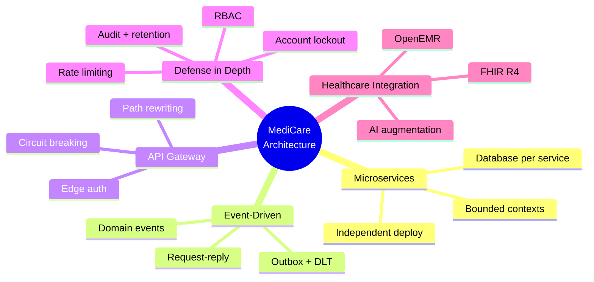

---

## 7. Technology Stack

| Layer | Technology | Version / detail | Where |
|---|---|---|---|
| Runtime | Node.js | 20 (Alpine images) | service Dockerfiles |
| Framework | NestJS | HTTP + Kafka microservice transport | all services |
| Language | TypeScript | strict | all services |
| API | REST + Swagger + Helmet | `/v1/*` controllers, `/api/*` at edge | controllers |
| Gateway | Express + `http-proxy-middleware` + `opossum` | dynamic routes, per-route breaker | `api-gateway` |
| Relational data | PostgreSQL | 15-alpine, `scram-sha-256`, TypeORM | 9 instances |
| Cache / security primitives | Redis | 7-alpine, AOF+RDB, `volatile-lru`, Lua atomics | `redis` |
| Messaging | Apache Kafka (Confluent) + ZooKeeper | 7.4.0, RF=1 (dev) | `kafka-1`, `zookeeper-1` |
| EHR | OpenEMR | `openemr/openemr:latest` + MariaDB 11.8 | OpenEMR stack |
| EHR protocol | HL7 **FHIR R4** + OpenEMR REST | OAuth2 password grant | `emr-service` |
| AI runtime | Ollama | `qwen3:4b`, `qwen2.5:3b-instruct` | `ollama` |
| AI cloud fallback | DeepSeek | `deepseek-chat` | `ai-service` |
| OCR | Tesseract.js | `eng`, ≤5MB images | `ai-service` |
| WhatsApp | Evolution API | `atendai/evolution-api:v1.8.7` (Baileys) + MongoDB 6 | WhatsApp stack |
| Auth | Passport JWT, bcrypt, HMAC-SHA256 | HS256/RS256 configurable | `auth-service` |
| Containers | Docker + Docker Compose | bridge network `clinic_network` | `docker-compose.yml` |
| Scheduling | `@nestjs/schedule` cron | reminder dispatch, auth cleanup | `reminder-service`, `auth-service` |

### 7.1 Port allocation map

| Service | Container | Internal port | Host-published |
|---|---|---|---|
| API Gateway | `api_gateway` | 3000 | ✅ `3000` |
| Auth | `auth_service` | 3001 | ❌ |
| User | `user_service` | 3002 | ❌ |
| System Manager | `system_manager_service` | 3003 | ❌ |
| EMR | `emr_service` | 3004 | ❌ |
| AI | `ai_service` | 3005 | ✅ `3005` |
| Clinic | `clinic_service` | 3006 | ❌ |
| Appointment | `appointment_service` | 3007 | ❌ |
| Scheduling | `scheduling_service` | 3008 | ❌ |
| Notification | `notification_service` | 3009 | ❌ |
| Reminder | `reminder_service` | 3010 | ❌ |
| OpenEMR UI | `openemr` | 80/443 | ✅ `8081`,`8443` |
| Evolution API | `evolution_api` | 8080 | ✅ `8080` |
| Ollama | `ollama` | 11434 | ✅ `11434` |
| Kafka | `kafka_1` | 9092 | ❌ |
| ZooKeeper | `zookeeper_1` | 2181 | ❌ |
| Redis | `redis` | 6379 | ❌ |
| Postgres ×9 | `postgres_*` | 5432 | ❌ |
| MongoDB | `evolution_mongo` | 27017 | ❌ |
| MariaDB (OpenEMR) | `mariadb_openemr` | 3306 | ❌ |

---

## 8. High-Level Architecture

### 8.1 System Context (C4 Level 1 — whole platform)

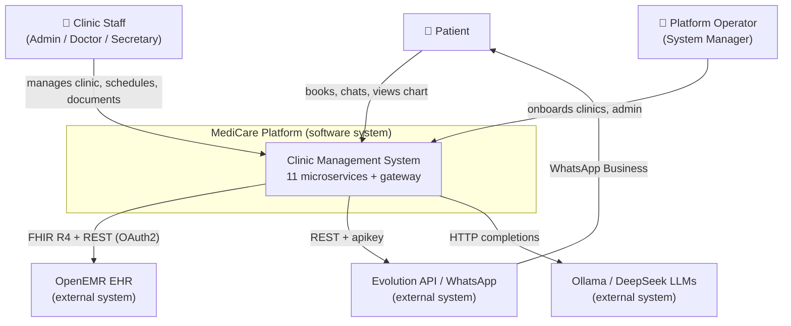

### 8.2 Container diagram (C4 Level 2 — all containers)

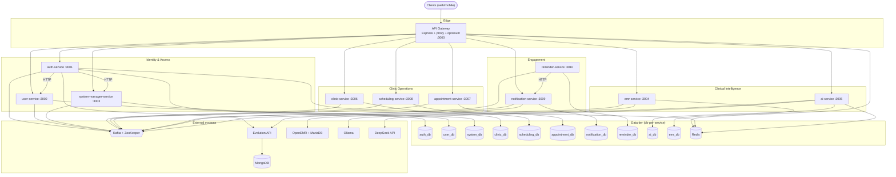

### 8.3 Service dependency graph (runtime call + event direction)

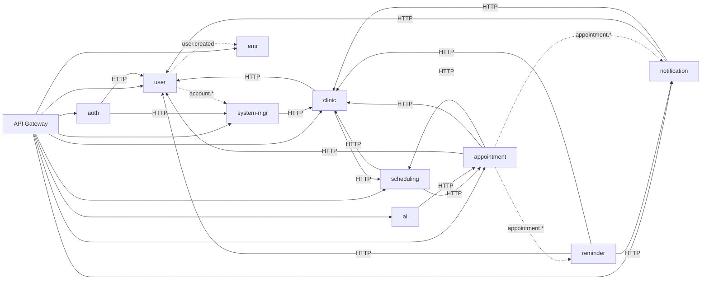

> **Dependency note (startup vs runtime).** `docker-compose.yml` enforces a strict boot order: ZooKeeper → Kafka → `kafka-init` → data stores → identity/clinical services → `system-manager` (waits on `clinic-service`) → `reminder` (waits on `notification`) → `appointment` (waits on `scheduling`) → **API Gateway last** (waits on all). At runtime, cyclic HTTP relationships (e.g. `scheduling ↔ appointment`) are safe because each call is a discrete request guarded by timeouts.

### 8.4 Deployment diagram (C4 — dev topology)

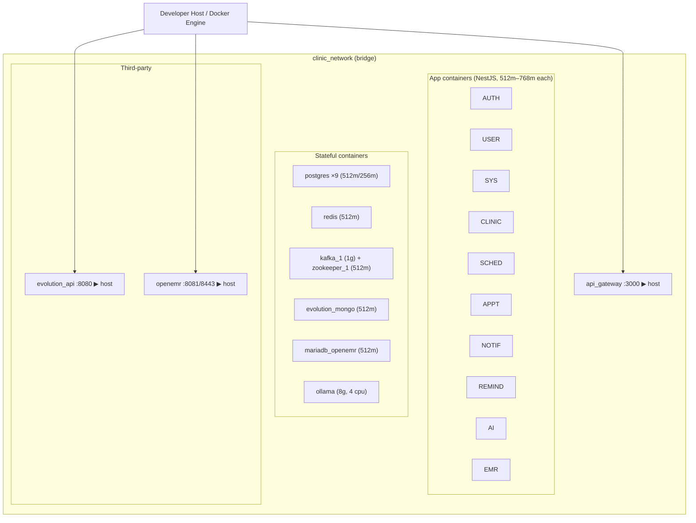

---

## 9. Service Catalog

| Service | Port | DB | Kafka role | Redis | Cron | External deps | Primary responsibility |
|---|---|---|---|---|---|---|---|
| **API Gateway** | 3000 | — | none | JWT cache | — | — | Edge auth, routing, CORS, circuit-breaking, path rewrite |
| **auth-service** | 3001 | `auth_db` | producer + consumer | sessions, rate-limit, locks, blocklist, CB | session cleanup | Evolution API | Identity, OTP, sessions, MFA, password reset |
| **user-service** | 3002 | `user_db` | consumer (RR + events) + producer (outbox) | — | outbox publisher | — | User CRUD, account linking, outbox events |
| **system-manager-service** | 3003 | `system_db` | consumer + producer | — | — | — | Platform admin, activation codes, clinic onboarding |
| **clinic-service** | 3006 | `clinic_db` | producer only | — | — | user, scheduling (HTTP) | Clinics, staff assignment, provisioning |
| **scheduling-service** | 3008 | `scheduling_db` | producer only | — | — | clinic, appointment (HTTP) | Clinic hours, availability, blocks, slot generation |
| **appointment-service** | 3007 | `appointment_db` | producer only | — | — | user, clinic, scheduling (HTTP) | Appointment lifecycle, conflict detection |
| **notification-service** | 3009 | `notification_db` | consumer + producer | — | — | user, clinic, Evolution API | WhatsApp notifications + logs |
| **reminder-service** | 3010 | `reminder_db` | consumer + producer | — | every minute | notification, user, clinic (HTTP) | Reminder scheduling + dispatch |
| **ai-service** | 3005 | `ai_db` | none | cache + rate-limit | — | Ollama, DeepSeek, appointment (HTTP) | LLM/OCR clinical assistance |
| **emr-service** | 3004 | `emr_db` + MySQL `openemr` (read) | consumer only | — | — | OpenEMR (FHIR+REST+MySQL) | EMR provisioning + FHIR chart aggregation |

### 9.1 Communication-style matrix

| From ⟶ To | auth | user | system-mgr | clinic | scheduling | appointment | notification | reminder | ai | emr |
|---|---|---|---|---|---|---|---|---|---|---|
| **auth** | — | HTTP+Kafka(evt) | HTTP | — | — | — | — | — | — | — |
| **user** | Kafka(evt) | — | Kafka(evt) | — | — | — | — | — | — | Kafka(`user.created`) |
| **system-mgr** | — | Kafka(`user.create.clinic.admin`) | — | HTTP | — | — | — | — | — | — |
| **clinic** | — | HTTP | — | — | HTTP | — | — | — | — | — |
| **scheduling** | — | — | — | HTTP | — | HTTP | — | — | — | — |
| **appointment** | — | HTTP | — | HTTP | HTTP | — | Kafka(evt) | Kafka(evt) | — | — |
| **reminder** | — | HTTP | — | HTTP | — | — | HTTP | — | — | — |
| **ai** | — | — | — | — | — | HTTP | — | — | — | — |

*(Kafka(evt) = fire-and-forget domain event consumed asynchronously; not a direct call.)*

### 9.2 Data-ownership matrix

| Domain entity | Owning service | Owning DB | Referenced (by id) from |
|---|---|---|---|
| `User`, `UserAccountLink`, `OutboxEvent`, `PasswordHistory`, `ProcessedMessage` | user | `user_db` | every service (by `userId`) |
| `Session`, `Otp`, `AuditLog`, `AccountLock`, `JwtBlocklistEntry`, `IdempotencyKey` | auth | `auth_db` | — |
| `SystemManager`, `ClinicAdminActivation` | system-manager | `system_db` | clinic (activationCodeId) |
| `Clinic`, `ClinicStaffAssignment` | clinic | `clinic_db` | appointment, scheduling, user (`clinicId`) |
| `ClinicHours`, `DoctorAvailability`, `ScheduleBlock` | scheduling | `scheduling_db` | appointment |
| `Appointment` | appointment | `appointment_db` | notification, reminder |
| `NotificationLog` | notification | `notification_db` | — |
| `ScheduledReminder` | reminder | `reminder_db` | — |
| `AiRequest` | ai | `ai_db` | — |
| `PatientEmrLink`, `OpenEmrOAuthConfig` | emr | `emr_db` | — |
| Clinical resources (Patient, Encounter, …) | OpenEMR | MariaDB `openemr` | emr (read via FHIR/MySQL) |

> **Cross-service referential integrity is intentionally *not* enforced at the database level.** Foreign keys exist only *within* a service's own DB. Cross-service relationships are by UUID string and reconciled via events/HTTP — a deliberate microservice trade-off (see [ADR-002](#adr-002-database-per-service)).

---

## 10. Infrastructure Architecture

All containers attach to a single Docker bridge network, `clinic_network`, and address each other by **service hostname (DNS)**. Only the gateway, AI service, OpenEMR, Evolution API, and Ollama publish ports to the host.

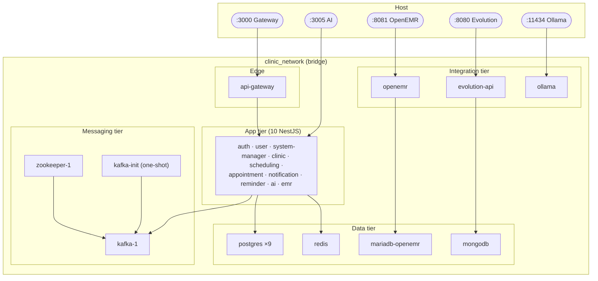

### 10.1 Container resource governance

Every container declares `deploy.resources.limits`. Highlights:

| Container | Memory | CPU | Notes |
|---|---|---|---|
| App services | 512m (AI 768m) | 1.0 | NestJS |
| Postgres (core) | 512m | 1.0 | auth/user/system/clinic/scheduling/appointment/notification/reminder |
| Postgres (ai/emr) | 256m | 0.5 | lower footprint |
| Redis | 512m | 1.0 | `maxmemory 512mb` matches limit |
| Kafka | 1g | 1.0 | heap bounded `-Xms256m -Xmx512m` |
| ZooKeeper | 512m | 0.5 | — |
| Ollama | **8g** | **4.0** | LLM inference, GPU/CPU heavy |
| OpenEMR | 1g | 1.5 | PHP + Apache |
| MariaDB / MongoDB | 512m | 1.0 / 0.5 | — |

### 10.2 Persistent volumes

`redis_data`, `postgres_{auth,user,system,clinic,appointment,scheduling,notification,reminder,ai,emr}_data`, `mariadb_openemr_data`, `openemr_logs`, `openemr_sites`, `mongo_data`, `zookeeper_1_{data,log}`, `kafka_1_data`, `ollama`. Volumes guarantee data survives container recreation.

### 10.3 Startup orchestration (health-gated)

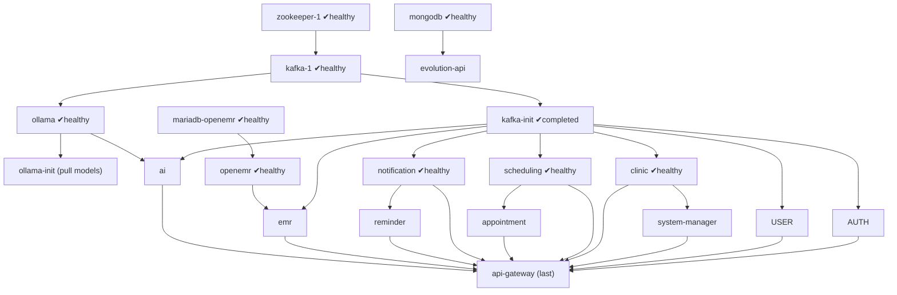

---

## 11. Security Architecture

> Full technique-level detail (with file paths) lives in [Security Section (deep)](#security-section-deep). This section is the architectural overview.

### 11.1 Trust boundaries

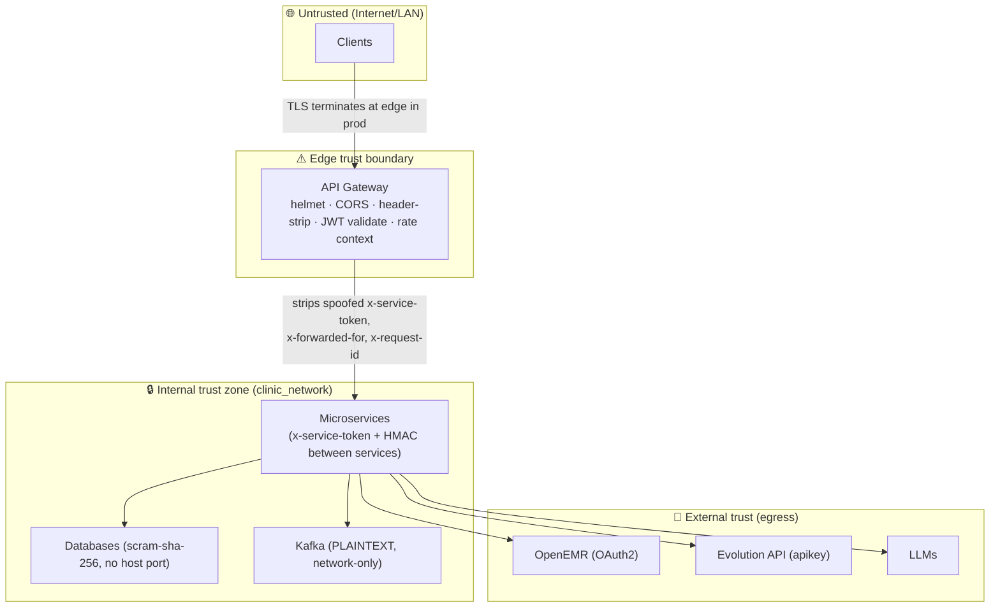

**Key boundary controls:**
- The gateway **strips client-supplied internal headers** (`x-service-token`, `x-request-id`, `x-forwarded-for`) before proxying, preventing identity spoofing.
- Internal service-to-service calls require `x-service-token` (≥24 chars, validated at every service bootstrap) **plus** HMAC-SHA256 on sensitive user endpoints.
- No database, Kafka, Redis, or non-edge service port is published to the host.

### 11.2 Authentication architecture (overview)

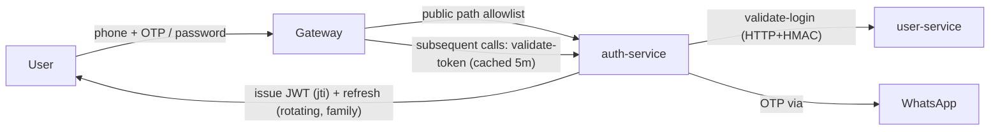

### 11.3 Authorization architecture (RBAC)

Five roles drive role-based access control, enforced by NestJS `RolesGuard` (`@Roles(...)`) and inline checks:

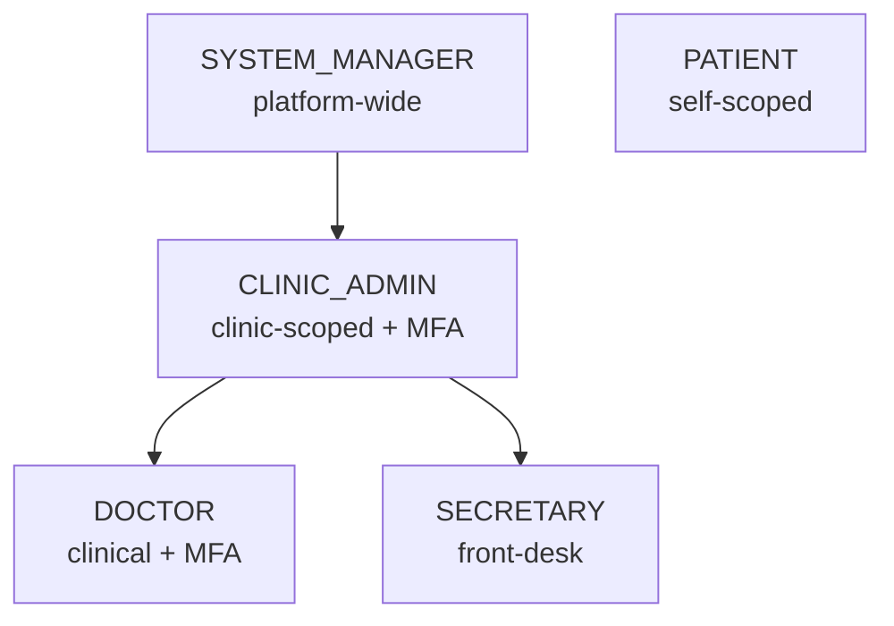

| Capability class | SYSTEM_MANAGER | CLINIC_ADMIN | DOCTOR | SECRETARY | PATIENT |
|---|:--:|:--:|:--:|:--:|:--:|
| Platform admin / activation codes | ✅ | — | — | — | — |
| Clinic CRUD | ✅ | update/delete own | — | — | read active |
| Staff assignment | ✅ | ✅ | — | — | — |
| Schedule mgmt | ✅ | ✅ | — | ✅ | — |
| Book appointment | ✅ | ✅ | — | ✅ | own |
| Complete/no-show appt | ✅ | ✅ | ✅ | ✅ | — |
| EMR chart (any patient) | ✅ | ✅ | ✅ | — | own only |
| AI doctor tools | ✅ | ✅ | ✅ | partial | — |
| AI patient chat | ✅ | — | — | — | ✅ |

### 11.4 Security control families (ISO 27001-aligned)

| Control family | Implementation |
|---|---|
| Access control (A.9) | RBAC, MFA, least-privilege internal tokens, session management |
| Cryptography (A.10) | bcrypt passwords, SHA-256 OTP hashing, HMAC service calls, JWT signing |
| Operations security (A.12) | Audit logging, rate limiting, account lockout, idempotency |
| Communications security (A.13) | Network isolation, header stripping, planned TLS/mTLS |
| Supplier relationships (A.15) | OpenEMR OAuth2, Evolution apikey, LLM egress isolation |
| Compliance (A.18) | HIPAA 6-year audit retention guard, PHI minimisation |

---

## 12. Data Architecture

### 12.1 Polyglot persistence overview

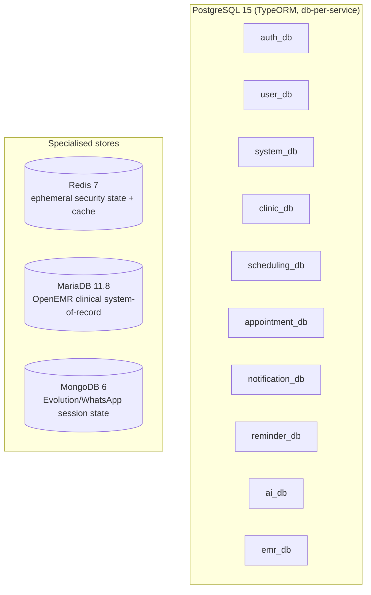

### 12.2 Data classification

| Class | Examples | Stores | Controls |
|---|---|---|---|
| **PHI / sensitive health** | Clinical chart, encounters, meds, allergies | OpenEMR (MariaDB), surfaced read-only by emr-service | OAuth2, RBAC, no caching of PHI, audit |
| **PII** | Phone, name, email, addresses | user_db, clinic_db, system_db | masking in logs, JWT excludes phone, scram-sha-256 |
| **Credentials/secrets** | password hashes, OTP hashes, refresh hashes, tokens | auth_db, Redis | bcrypt/SHA-256/HMAC, blocklist, never plaintext |
| **Operational** | Appointments, schedules, notifications, reminders | respective dbs | RBAC, indexes |
| **Audit** | auth + platform audit logs | auth_db (partitioned), system_db events | 6-year retention guard |
| **AI usage** | request metadata, token counts | ai_db | no prompt PHI persisted beyond cache TTL |

### 12.3 Persistence patterns

- **Database per service** (AP-1) — isolation + independent schema evolution.
- **Transactional Outbox** (`user-service`) — `outbox_events` written in the same transaction as the state change, then published by `OutboxPublisherService`.
- **Idempotent consumer** — `processed_messages` (user) and `IdempotencyService` (partition:offset) prevent duplicate side-effects.
- **Range partitioning** — `audit_logs` partitioned monthly by `created_at` for prune/drop efficiency.
- **Concurrent indexing** — indexes added with `CREATE INDEX CONCURRENTLY` (zero-lock).
- **Soft delete** — `users.deletedAt`, clinic `ARCHIVED` status.

The full set of ER diagrams for every database is in [Consolidated ER Diagrams](#consolidated-er-diagrams-every-database).

---

## 13. Integration Architecture

### 13.1 Integration patterns inventory

| Pattern | Mechanism | Used for |
|---|---|---|
| **Edge proxy** | Gateway `http-proxy-middleware` + path rewrite `/api/* → /v1/*` | All client traffic |
| **Sync internal HTTP** | Axios + `x-service-token` (+ HMAC) | Booking validation, login, enrichment, reminder dispatch, clinic provisioning |
| **Kafka request-reply** | `client.send()` + `@MessagePattern` + `<topic>.reply` + correlationId | user lookups/creation (auth↔user), activation validation (declared) |
| **Kafka domain events** | `client.emit()` + `@EventPattern` | `appointment.*`, `account.*`, `user.created`, `user.verify.otp`, clinic.*, schedule.updated, notification/reminder.* |
| **Outbox → Kafka** | DB outbox row → publisher → topic | reliable `user.created` etc. |
| **DLT** | retry×3 → `<topic>.dlt` → log/alert | every event consumer |
| **External REST** | OAuth2 (OpenEMR), apikey (Evolution), bearer-less local (Ollama) | EHR, WhatsApp, LLM |
| **FHIR R4** | OpenEMR `/fhir/*` | clinical resource read/write |

### 13.2 End-to-end event flow (appointment lifecycle)

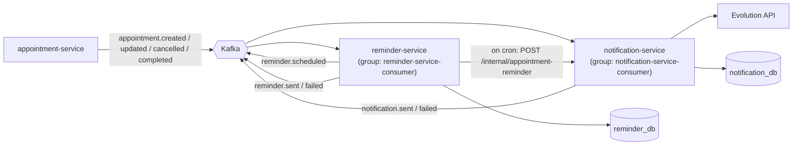

> Both `notification-service` and `reminder-service` consume the **same** `appointment.*` topics in **independent consumer groups**, so each receives every event without competing.

### 13.3 Integration trust & auth per edge

| Integration edge | AuthN | AuthZ |
|---|---|---|
| Client → Gateway | JWT (validated, cached) | public allowlist + role guards downstream |
| Gateway → service | injected `x-user-id/role/session-id` | service-side `RolesGuard` |
| Service → service (HTTP) | `x-service-token` + optional HMAC-SHA256 | `InternalServiceGuard` |
| Service ↔ Kafka | network isolation (PLAINTEXT dev) | topic-scoped consumer groups |
| emr → OpenEMR | OAuth2 password grant (auto-registered client) | FHIR scopes |
| notification/auth → Evolution | `apikey` header | instance-scoped |
| ai → DeepSeek | API key | — |

---

## 14. Deployment Architecture

### 14.1 Current (development) deployment

Single-host Docker Compose, single Kafka broker (RF=1), `synchronize: true` schema management for non-production, host-published edge only. See [Infrastructure Architecture](#10-infrastructure-architecture).

### 14.2 Target (production) deployment — reference

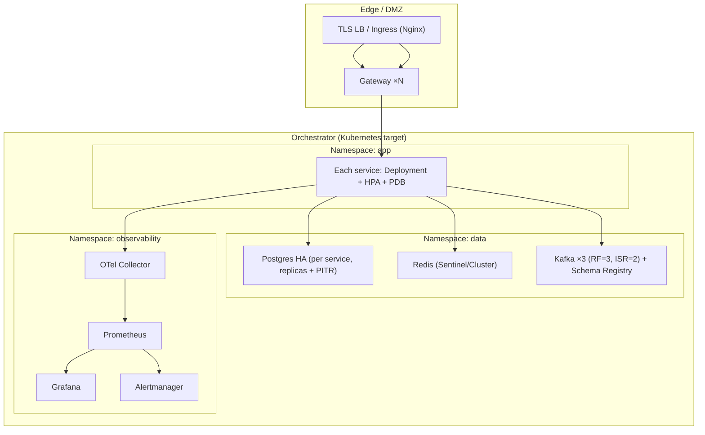

### 14.3 Build & image strategy

- Each service has a dedicated `Dockerfile`; build context is the repo root (to share `Messaging/Kafka/kafka-config` and `common`).
- Microservice entrypoint runs `wait-for-kafka-broker.sh` then `node dist/main`.
- 12-factor: configuration via `.env` + compose `environment`; secrets never baked into images.

### 14.4 CI/CD reference pipeline

```mermaid
flowchart LR
  DEV["Commit / PR"] --> LINT["Lint + typecheck"]
  LINT --> UT["Unit tests"]
  UT --> BUILD["Docker build per service"]
  BUILD --> IT["Integration tests (compose up deps)"]
  IT --> SCAN["SAST + dep scan + image scan"]
  SCAN --> PUSH["Push to registry"]
  PUSH --> DEPLOY_STG["Deploy staging"]
  DEPLOY_STG --> E2E["E2E + smoke (health/ready)"]
  E2E --> APPROVE{"Manual gate"}
  APPROVE -->|approved| DEPLOY_PROD["Rolling deploy prod"]
  DEPLOY_PROD --> VERIFY["Post-deploy health + canary"]
```

> CI/CD is a **reference design** — the repository currently ships compose-based local delivery; the pipeline above is the recommended productionisation path (see [Roadmap](#future-architecture-roadmap)).

---

## 15. Monitoring & Observability

### 15.1 Health model

Every service exposes:

| Endpoint | Semantics | Checks |
|---|---|---|
| `GET /health/live` | Liveness — process is up | always 200 |
| `GET /health/ready` | Readiness — dependencies reachable | DB (`SELECT 1`), Kafka reachability (where applicable), Redis (auth/ai), Ollama (ai), OpenEMR (emr) |
| `GET /health` | Basic/degraded combined | DB-only |
| `GET /api/health` (gateway) | Aggregated upstream health | polls core upstreams |
| `GET /health/metrics` (ai) | In-memory AI metrics | requests, tokens, latency |

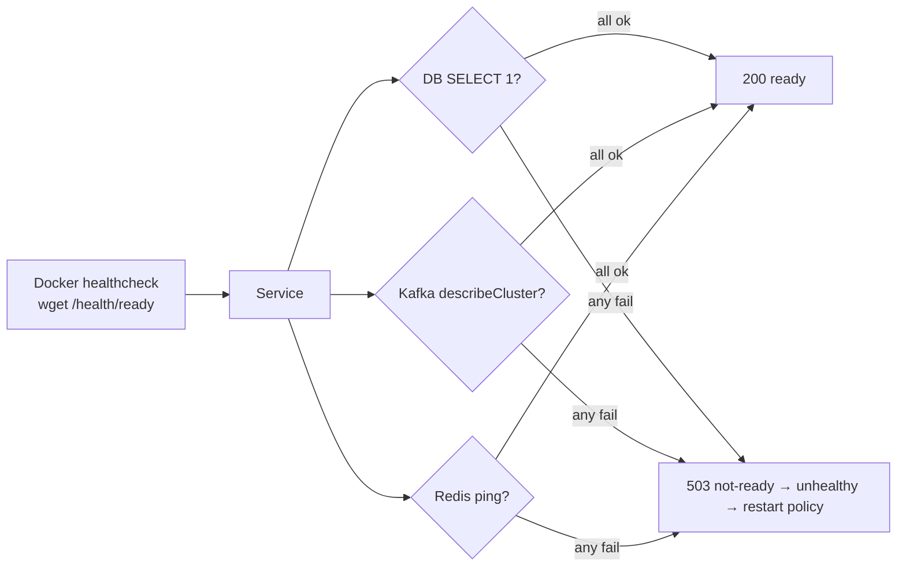

### 15.2 Observability pillars (current vs target)

| Pillar | Current | Target |
|---|---|---|
| **Health** | ✅ liveness/readiness per service + gateway aggregation | unchanged |
| **Metrics** | AI in-memory metrics; container resource limits | Prometheus scrape (configs exist under `DevOps/Docker/prometheus`), Grafana dashboards, Alertmanager |
| **Tracing** | `x-request-id` correlation propagation; OpenTelemetry module scaffolding in user-service | OTel collector + exporter end-to-end |
| **Logging** | structured logs, PHI masking | centralised log aggregation, retention policy |
| **Alerting** | `alertingService.sendDltAlert(...)` logs DLT events | wire to Slack/PagerDuty/SNS |

### 15.3 Target observability topology

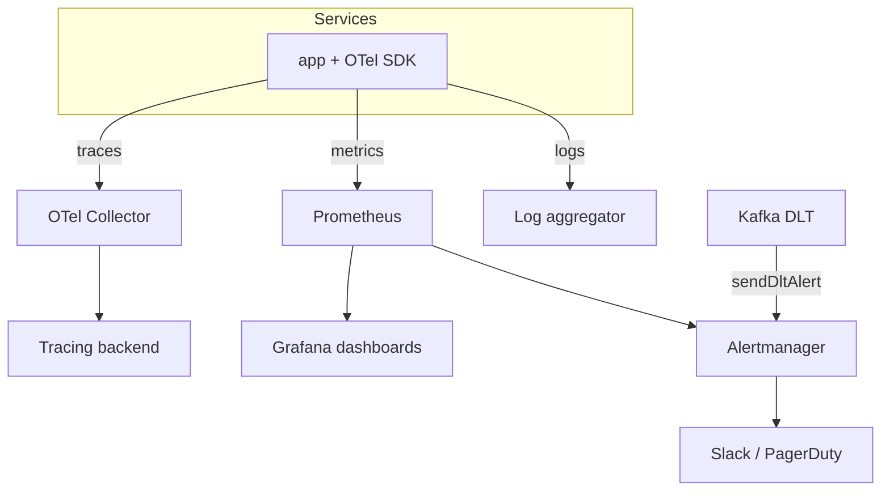

---

## 16. Disaster Recovery

### 16.1 Backup & recovery posture

| Asset | Persistence | Backup approach | RPO target | RTO target |
|---|---|---|---|---|
| PostgreSQL ×9 | named volumes | pgBackRest (config present, container currently commented out) → WAL + full/diff | ≤ 15 min (WAL) | ≤ 1 hr |
| Redis | AOF (`everysec`) + RDB snapshots | volume + AOF replay | ≤ 1 s | minutes |
| Kafka | `kafka_1_data` volume | topic replication (RF=3 in prod) | 0 (replicated) | minutes |
| OpenEMR (MariaDB) | volume | mysqldump / Galera in prod | ≤ 1 hr | ≤ 2 hr |
| MongoDB (Evolution) | volume | mongodump | ≤ 1 hr | session re-pair |
| Object/site files | `openemr_sites`, `openemr_logs` | volume snapshot | ≤ 24 hr | ≤ 1 hr |

### 16.2 DR flow

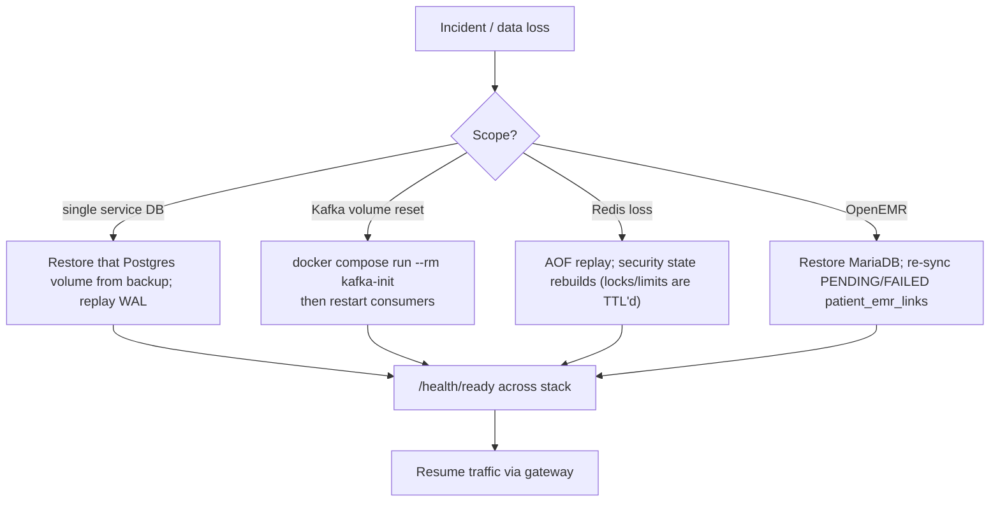

### 16.3 Resilience characteristics that aid DR

- **Idempotent reprocessing** — replaying Kafka events is safe (`processed_messages`, idempotency keys).
- **Outbox** — un-published events survive a crash and publish on recovery.
- **Stateless services** — replace any app container without state migration.
- **EMR re-sync** — `PENDING`/`FAILED` `patient_emr_links` can be re-driven.
- **Reminder self-heal** — pending reminders persist in `reminder_db`; cron resumes dispatch.

---

## 17. Scalability Strategy

### 17.1 Scaling dimensions

| Tier | Scaling approach | Constraint / notes |
|---|---|---|
| Gateway | Horizontal (stateless) behind LB; JWT cache shared in Redis | sticky not required |
| App services | Horizontal replicas; Kafka consumer groups partition work | match topic partition count (3) for parallel consumers |
| Kafka | Add brokers, switch to prod topic profile (RF=3, ISR=2) | no app code change (registry-driven) |
| PostgreSQL | Vertical first; read replicas; per-service sharding already implicit | writes single-primary per service |
| Redis | Sentinel/Cluster; `volatile-lru` protects security keys | — |
| AI | Scale Ollama replicas / GPU nodes; cache offloads repeats | GPU calls serialized per instance |

### 17.2 Throughput levers

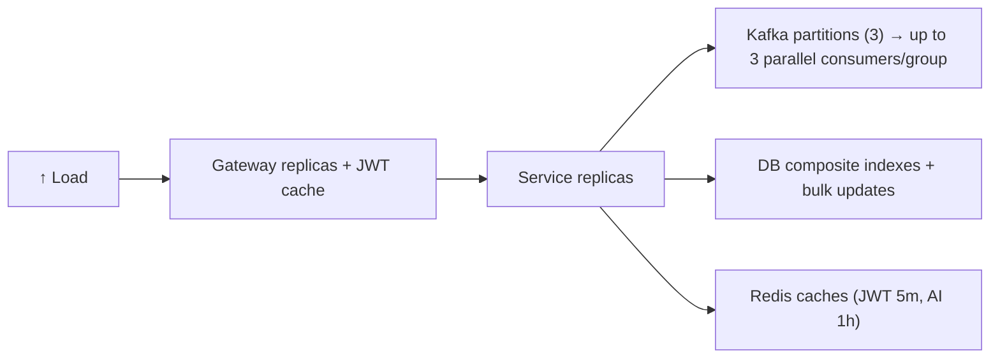

### 17.3 Bottleneck analysis

| Potential bottleneck | Current mitigation | Scale action |
|---|---|---|
| Auth validation on every request | Gateway JWT cache (5m) | more gateway replicas; raise TTL cautiously |
| Single Kafka broker | dev-only | 3-broker cluster, RF=3 |
| AI inference latency | response cache, request serialization | GPU autoscaling, model selection |
| Booking validation fan-out (3 HTTP calls) | timeouts + breakers | colocate, cache availability, async pre-validate |
| Reminder cron batch (50/min) | bounded batch | shard by clinic; increase batch + frequency |

---

## 18. Testing Strategy

> Deep detail and flow diagrams in [Testing Section (deep)](#testing-section-deep).

### 18.1 Test pyramid

```mermaid
flowchart TB
  E2E["E2E / user-journey<br/>(few, high value)"]
  INT["Integration / contract<br/>(service + Kafka + DB)"]
  UNIT["Unit<br/>(many, fast)"]
  E2E --> INT --> UNIT
```

| Layer | Scope | Tooling (recommended) | Examples |
|---|---|---|---|
| Unit | pure logic: slot generation, conflict detection, OTP hashing, state transitions | Jest | `buildSlotsForDay`, `assertNoConflict`, refresh rotation |
| Integration | service + its DB + Kafka + Redis | Jest + Testcontainers / compose | `user.create` RR, outbox publish, account lock escalation |
| Contract | event/topic payload shapes | schema validation, Pact-style | `appointment.created` consumers |
| E2E | cross-service journeys via gateway | Supertest / Playwright | register→OTP→book→reminder |
| Performance | rate limiters, JWT cache, slot gen | k6 / Artillery | login burst, booking load |
| Chaos | broker/Redis/DB outage behaviour | Toxiproxy / fault injection | Kafka down → readiness; Redis down → fail-open/closed |

### 18.2 Critical test scenarios (acceptance)

| Scenario | Expected |
|---|---|
| Duplicate registration (same Idempotency-Key + body) | cached response, single user |
| Double-book same slot | second booking rejected (conflict) |
| 20 failed logins | `ADMIN_REVIEW` permanent lock |
| Refresh-token reuse | entire token family revoked |
| Event handler throws | retry×3 → DLT, no loss |
| Patient created | EMR `SYNCED` link + OpenEMR Patient |
| Appointment cancelled | reminder `CANCELLED`, WhatsApp cancellation sent |

---

## 19. Appendices

Appendices appear in full at the end of the document:
- [Architecture Decision Records](#architecture-decision-records-adr)
- [Risks & Mitigations](#risks--mitigations)
- [Technical Debt Register](#technical-debt-register)
- [Assumptions & Constraints](#assumptions--constraints)
- [Future Architecture Roadmap](#future-architecture-roadmap)
- [Annex A — Preserved original documentation](#annex-a--preserved-original-documentation-verbatim)

Operator quick-reference, environment configuration, quick-start, and the complete Kafka topic catalog are preserved verbatim in **Annex A**.

---

# Part II — Per-Service Architecture

> Each service section follows a fixed template: **Overview · Responsibilities · Business Rules · Dependencies · External & Internal Integrations · APIs · Data Ownership · Database Design · Security Model · Failure Scenarios · Scaling · Monitoring · Logging · Caching · Deployment**, followed by a **diagram suite** (context, C4, component, sequence, activity, use-case, state, DFD, ERD, security, event/Kafka flow, and operational flows as applicable).

---

## API Gateway Service

### Service Overview
The API Gateway (`api-gateway`, port **3000**, the only host-published application port) is the single edge entry point. It is an **Express + `http-proxy-middleware`** reverse proxy (NestJS used for bootstrap/Swagger only — `GatewayController`/`GatewayService` are legacy and not on the live proxy path). It performs centralised authentication, JWT caching, header sanitisation, CORS, security headers, per-route circuit breaking, and `/api/* → /v1/*` path rewriting.

### Responsibilities
- Terminate and route all client traffic to the 10 microservices.
- Validate JWTs centrally (against auth-service or system-manager for SM paths), caching results in Redis.
- Enforce the public-route allowlist (login/register/OTP/etc. bypass JWT).
- Strip spoofed internal headers; assign/sanitise correlation IDs.
- Apply opossum circuit breakers per upstream; return 503/502 fallbacks.
- Expose aggregated health and (dev) Swagger.

### Business Rules
- Only allowlisted paths and `OPTIONS` bypass JWT validation.
- `/api/ai/*` gets a 180s timeout and higher breaker volume threshold (10) vs 60s/5 elsewhere.
- Downstream receives injected `x-user-id`, `x-user-role`, `x-session-id` (never trusts client-supplied ones).
- Cache invalidation endpoint (`POST /internal/cache/auth/invalidate`) requires `x-service-token`.

### Dependencies
- **Redis** (JWT cache + indexes).
- **auth-service** / **system-manager-service** for token validation.
- All 10 services as proxy upstreams; `depends_on` all healthy (AI: started) before boot.

### External Integrations
None directly (egress is to internal services only).

### Internal Integrations
Proxies to: auth, user (+account-linking), system-manager, emr, ai, clinic, appointment, scheduling, notification. Validation calls to auth/system-manager.

### APIs
The gateway exposes no business REST of its own; it proxies prefixes. Routing table:

| Public prefix | Upstream | Rewritten to |
|---|---|---|
| `/api/auth` | auth-service:3001 | `/v1/auth` |
| `/api/users`, `/api/account-linking` | user-service:3002 | `/v1/...` |
| `/api/system-manager` | system-manager-service:3003 | `/v1/system-manager` |
| `/api/emr` | emr-service:3004 | `/v1/emr` |
| `/api/ai` | ai-service:3005 | `/v1/ai` |
| `/api/clinics` | clinic-service:3006 | `/v1/clinics` |
| `/api/appointments` | appointment-service:3007 | `/v1/appointments` |
| `/api/schedule` | scheduling-service:3008 | `/v1/schedule` |
| `/api/notifications` | notification-service:3009 | `/v1/notifications` |
| Local | gateway | `/health`, `/health/live`, `/health/ready`, `/internal/cache/auth/invalidate`, `/api-docs` (dev) |

### Data Ownership
Owns no persistent domain data. Transient state only: Redis JWT cache (`jwt:{sha256(token)}`), session index (`jwt:idx:session:{id}`), user index (`jwt:idx:user:{id}`).

### Database Design
None (no relational DB). See Caching Strategy.

### Security Model
- helmet + extra headers (HSTS, CSP, X-Frame-Options).
- CORS allowlist (`ALLOWED_ORIGINS`).
- **Header stripping** of `x-service-token`, `x-request-id`, `x-forwarded-for` from inbound client requests (anti-spoofing).
- Central JWT validation; public allowlist; per-route breakers limit blast radius.

### Failure Scenarios
| Failure | Behaviour |
|---|---|
| Upstream down/slow | breaker opens → 503 fallback JSON |
| Proxy/connection error | 502 `Bad gateway` |
| Redis (JWT cache) down | cache disabled → validate every request directly |
| auth-service down | protected routes fail auth (401/503); public allowlist still reachable |

### Scaling Strategy
Stateless → horizontal replicas behind an LB; shared Redis cache means any replica serves any user.

### Monitoring Strategy
`/health/ready` checks core upstreams; breaker `open/halfOpen/close` events logged; aggregated `/api/health`.

### Logging Strategy
Correlation-ID assignment + sanitisation; breaker state transitions; auth validation failures.

### Caching Strategy
Redis JWT cache, TTL `JWT_CACHE_TTL` (default 300s), keyed by `sha256(token)`, with session/user index sets enabling targeted invalidation on logout/password-change.

### Deployment Strategy
Boots **last** (after all upstreams healthy), 512m/1cpu, host-published `:3000`, healthcheck `wget /health/ready` (120s start period).

### Diagram suite — API Gateway

**Context (C4 L1)**
```mermaid
flowchart LR
  C["Clients"] --> GW["API Gateway"]
  GW --> SVCS["10 microservices"]
  GW --> RED[("Redis JWT cache")]
  GW --> AUTH["auth-service (validate-token)"]
```

**Component (C4 L3)**
```mermaid
flowchart TB
  REQ["Incoming request"] --> HELMET["helmet + security headers"]
  HELMET --> CORS["CORS"]
  CORS --> STRIP["Strip spoofed internal headers"]
  STRIP --> CID["Correlation-ID middleware"]
  CID --> PUB{"Public path or OPTIONS?"}
  PUB -->|yes| PROXY
  PUB -->|no| JWT["JWT validate middleware"]
  JWT --> CACHE{"Redis cache hit?"}
  CACHE -->|hit| INJECT["Inject x-user-id/role/session-id"]
  CACHE -->|miss| VALIDATE["Call auth/system-mgr validate-token"] --> STORE["Cache result"] --> INJECT
  INJECT --> PROXY["http-proxy-middleware (per-route)"]
  PROXY --> CB["opossum circuit breaker"]
  CB --> UP["Upstream /v1/*"]
  CB -->|open| FB["503 fallback"]
```

**Sequence — authenticated request with cache**
```mermaid
sequenceDiagram
  participant C as Client
  participant GW as Gateway
  participant R as Redis
  participant A as auth-service
  participant U as Upstream
  C->>GW: GET /api/appointments Bearer JWT
  GW->>R: GET jwt:{sha256token}
  alt cache hit
    R-->>GW: {userId, role, sessionId}
  else miss
    GW->>A: GET /v1/auth/validate-token
    A-->>GW: claims
    GW->>R: SET jwt:{...} TTL 300s + index sets
  end
  GW->>U: proxy /v1/appointments +x-user-id/role/session-id
  U-->>GW: 200
  GW-->>C: 200
```

**Activity — request handling**
```mermaid
flowchart TD
  S["Receive request"] --> H["Apply security headers + CORS"]
  H --> ST["Strip internal headers; set correlation id"]
  ST --> P{"Public/OPTIONS?"}
  P -->|yes| PR["Proxy"]
  P -->|no| V["Validate JWT (cache→auth)"]
  V -->|valid| PR
  V -->|invalid| E["401 Unauthorized"]
  PR --> B{"Breaker closed?"}
  B -->|yes| OK["Forward; return upstream response"]
  B -->|open| F["503 fallback"]
```

**State — circuit breaker (opossum)**
```mermaid
stateDiagram-v2
  [*] --> Closed
  Closed --> Open: error rate ≥ 50% volume ≥ 5/10
  Open --> HalfOpen: after resetTimeout 15s
  HalfOpen --> Closed: probe success
  HalfOpen --> Open: probe fail
```

**DFD L0**
```mermaid
flowchart LR
  client(("Client")) -->|request+JWT| GW["1.0 Gateway"]
  GW -->|validation| AUTHDS[("auth-service")]
  GW -->|"cache r/w"| REDIS[("Redis")]
  GW -->|proxied request| SVC[("Upstream service")]
  SVC -->|response| GW --> client
```

**Authentication flow**
```mermaid
flowchart LR
  REQ["Bearer token"] --> SHA["sha256(token) key"] --> LOOKUP{"Redis?"}
  LOOKUP -->|hit & not expired| OK["inject identity headers"]
  LOOKUP -->|miss| CALL["validate-token upstream"]
  CALL -->|200| CACHE["cache + index by session/user"] --> OK
  CALL -->|401| DENY["401"]
```

**Error flow**
```mermaid
flowchart TD
  ERR{"Error type"}
  ERR -->|JWT invalid| E401["401"]
  ERR -->|breaker open| E503["503 Service Unavailable"]
  ERR -->|"proxy/connection"| E502["502 Bad Gateway"]
  ERR -->|CORS reject| ECORS["CORS error"]
```

---

## Auth Service

### Service Overview
`auth-service` (port **3001**, DB `auth_db`) is the identity provider: registration, OTP lifecycle, password & OTP login, MFA, JWT issuance/validation, session management with rotation & reuse detection, password reset, account locking, rate limiting, audit logging, and clinic-admin/staff activation orchestration. It calls **user-service** over internal HTTP (passwords never traverse Kafka) and uses **Redis** heavily for security primitives and a Kafka circuit breaker.

### Responsibilities
- Register users (idempotent), generate/verify/resend OTPs, deliver OTP via WhatsApp (Evolution API).
- Authenticate (password over HTTP to user-service; OTP), enforce MFA for `CLINIC_ADMIN`/`DOCTOR`.
- Issue JWT access (`jti`) + rotating refresh tokens; manage/list/revoke sessions.
- Detect refresh-token reuse → revoke token family; detect session anomalies.
- Maintain JWT blocklist (Redis primary + Postgres fallback, fail-closed).
- Rate-limit and lock accounts; write audit logs; scheduled session cleanup.
- Orchestrate clinic-admin activation (HTTP to system-manager) and staff completion.

### Business Rules
- OTP: 6-digit CSPRNG, 10-min expiry, ≤5 failed attempts, hashed `SHA-256(otp:phone:type)`, invalidated on resend.
- MFA mandatory for `CLINIC_ADMIN`, `DOCTOR`; `mfa_pending` tokens rejected as access tokens.
- Account lock tiers: SHORT (5 fails/15m), MEDIUM (10/1h), ADMIN_REVIEW (20/permanent); counter accumulates 24h.
- Refresh rotation in `SERIALIZABLE` tx + `pessimistic_write` lock; reuse ⇒ family-wide revocation.
- On `user.password.changed` event ⇒ revoke all sessions for user.
- Registration requires `Idempotency-Key`; same key+body ⇒ cached response; same key+different body ⇒ 409.

### Dependencies
- **user-service** (HTTP, `x-service-token` + HMAC): login validation, existence check, create, create-by-admin, verify-phone, staff completion, reset-password.
- **system-manager-service** (HTTP): activation-code validate/check.
- **Redis**: sessions cache, rate-limit, account-lock, JWT blocklist, Kafka circuit-breaker state.
- **Evolution API**: WhatsApp OTP/credential delivery.
- **Kafka**: emits `user.verify.otp`, `user.login.success`; consumes `user.password.changed`.

### External Integrations
Evolution API (WhatsApp) — `sendMessage`, QR/status dev endpoints.

### Internal Integrations
user-service (`/users/internal/*`, `/users/validate-login`), system-manager (`/v1/system-manager/activation-code/*`), gateway (`/internal/cache/auth/invalidate` on logout).

### APIs
`AuthController` (prefix `/v1/auth`, exposed at `/api/auth`):

| Method | Path | Auth | Description |
|---|---|---|---|
| POST | `/register` | Public + Idempotency + CSRF | Register user (idempotent) |
| POST | `/send-otp` | Public | Send OTP |
| POST | `/verify-otp` | Public | Verify OTP (optional auto-login) |
| POST | `/resend-otp` | Public | Resend OTP (invalidates prior) |
| POST | `/check-otp-status` | Public | OTP status |
| POST | `/login` | Public | Password/OTP login |
| POST | `/verify-mfa` | Public + RateLimit | Complete MFA |
| POST | `/refresh-token` | Public | Rotate refresh → new access |
| POST | `/logout` | JWT | Revoke session, blocklist jti, invalidate gateway cache |
| GET | `/sessions` | JWT | List sessions |
| DELETE | `/sessions/:sessionId` | JWT | Revoke one |
| DELETE | `/sessions` | JWT | Revoke all (`?except=`) |
| POST | `/clinic-admin/activate` | Public | Activate clinic admin dashboard |
| POST | `/clinic/create-user` | JWT (CLINIC_ADMIN) | Create staff |
| POST | `/staff/complete-activation` | Public | Complete staff activation |
| POST | `/reset-password` | Public | OTP-backed reset |
| GET | `/validate-token` | Internal + JWT | Token validation (gateway) |
| GET | `/dev/whatsapp-qr` `/dev/whatsapp-status` `/dev/latest-otp` | Dev | Dev helpers |

### Data Ownership
Owns `auth_db`: `sessions`, `otps`, `audit_logs` (partitioned), `account_locks`, `jwt_blocklist`, `idempotency_keys`. (`rate_limits` entity exists but rate limiting is Redis-only — not registered in TypeORM.)

### Database Design
See [auth_db ERD](#erd-auth_db). Key tables: `sessions` (rotation/family/anomaly fields, partial-unique current session), `otps` (hashed, attempt-capped), `audit_logs` (range-partitioned monthly, 6-yr retention guard), `account_locks`, `jwt_blocklist`, `idempotency_keys`.

### Security Model
Defence-in-depth: hashed OTPs, bcrypt passwords, MFA, blocklist (fail-closed), rotation + reuse detection, Redis rate-limit (atomic Lua), 3-tier lock (fail-closed if both stores down), CSRF guard, idempotency guard, helmet, body cap 10kb, PHI masking. Internal token validated at bootstrap (≥24 chars).

### Failure Scenarios
| Failure | Behaviour |
|---|---|
| Redis down | rate-limit fails **open**; locks fall back to Postgres; blocklist falls back to Postgres |
| Both Redis+PG (blocklist) down | token treated **revoked** (fail-closed) |
| user-service down | login/register fail; Kafka CB may open to fast-fail |
| Evolution down | OTP saved in DB; `whatsappSent:false` (+ dev OTP) |
| Kafka down | emits buffered/retried; readiness reflects Kafka reachability |

### Scaling Strategy
Stateless; scale replicas. Shared Redis/Postgres hold all state. Kafka CB state in Redis is shared across replicas.

### Monitoring Strategy
`/health/ready` (DB + Redis + Kafka). Audit log + anomaly entries. Circuit-breaker state in Redis.

### Logging Strategy
Structured; phone numbers masked; `jti`/session ids tracked; anomalies carry severity/risk.

### Caching Strategy
Redis: session lookups, rate-limit counters, lock state, blocklist, CB state. Gateway caches validate-token results (invalidated on logout via callback).

### Deployment Strategy
Depends on postgres-auth, postgres-system, redis, kafka, kafka-init; 512m/1cpu; cleanup interval toggled by `DISABLE_INLINE_CLEANUP`.

### Diagram suite — Auth Service

**Context (C4 L1)**
```mermaid
flowchart LR
  U["User"] --> GW["Gateway"] --> AUTH["auth-service"]
  AUTH --> USER["user-service (HTTP+HMAC)"]
  AUTH --> SM["system-manager (HTTP)"]
  AUTH --> RED[("Redis")]
  AUTH --> PGA[("auth_db")]
  AUTH --> EVO["Evolution API"]
  AUTH -.->|"user.verify.otp / user.login.success"| K{{Kafka}}
  K -.->|"user.password.changed"| AUTH
```

**Container/Component (C4 L2–L3)**
```mermaid
flowchart TB
  subgraph AUTH["auth-service"]
    CTRL["AuthController /v1/auth"]
    SVC["AuthService"]
    SESS["SessionService (rotation/family)"]
    ANOM["SessionAnomalyService"]
    OTP["OTP logic"]
    RL["RateLimitService (Redis Lua)"]
    LOCK["AccountLockService (Redis+PG)"]
    BL["JwtBlocklistService (Redis+PG)"]
    CB["Kafka CircuitBreaker (Redis)"]
    AUD["AuditLogService (partitioned)"]
    JWT["JwtStrategy"]
    WAC["WhatsAppService"]
    UHC["UserHttpClient"]
  end
  CTRL --> SVC --> SESS & OTP & RL & LOCK & BL & AUD & UHC & WAC & CB
  JWT --> BL
  SESS --> ANOM
```

**Use-case diagram**
```mermaid
flowchart LR
  PAT(("Patient")); STAFF(("Staff")); CA(("Clinic Admin")); SYSGW(("Gateway"))
  PAT --- UC1(["Register"]); PAT --- UC2(["Send/Verify OTP"]); PAT --- UC3(["Login"]); PAT --- UC4(["Reset password"])
  STAFF --- UC3; CA --- UC5(["MFA verify"]); CA --- UC6(["Create staff"]); CA --- UC7(["Activate dashboard"])
  PAT --- UC8(["Logout / manage sessions"]); SYSGW --- UC9(["Validate token"])
```

#### Feature: Registration
**Sequence**
```mermaid
sequenceDiagram
  participant C as Client
  participant GW as Gateway
  participant A as auth-service
  participant U as user-service
  participant E as EvolutionWhatsApp
  C->>GW: POST /api/auth/register Idempotency-Key
  GW->>A: /v1/auth/register
  A->>A: Idempotency + CSRF guards, rate-limit REGISTER
  A->>U: GET /users/internal/exists HMAC
  U-->>A: not exists
  A->>U: POST /users/internal/create HMAC
  U-->>A: user PENDING
  U-->>U: outbox user.created
  A->>A: generate OTP CSPRNG, hash, 10m
  A->>E: sendMessagephone, otp
  A-->>C: 201 {whatsappSent, devOtp?}
```
**Activity**
```mermaid
flowchart TD
  S["POST register"] --> IDEM{"Idempotency-Key seen?"}
  IDEM -->|same body| RET["Return cached response"]
  IDEM -->|new| RL{"Rate limit ok?"}
  RL -->|no| B429["429"]
  RL -->|yes| EX{"User exists?"}
  EX -->|yes| C409["409 / existing"]
  EX -->|no| CR["Create user via HTTP"] --> OTP["Generate+hash OTP"] --> WA["Send WhatsApp"] --> DONE["201"]
```
**DFD L1**
```mermaid
flowchart LR
  c(("Client")) --> P1["1 Validate+idempotency"]
  P1 --> P2["2 Create user (HTTP)"] --> UDB[("user_db")]
  P1 --> P3["3 Issue OTP"] --> OTPS[("otps")]
  P3 --> EVO[("WhatsApp")]
```

#### Feature: OTP generation & verification
**State — OTP**
```mermaid
stateDiagram-v2
  [*] --> Issued
  Issued --> Verified: correct code ≤5 attempts
  Issued --> Invalidated: resend OR 5 failed attempts
  Issued --> Expired: 10 min elapsed
  Verified --> [*]
  Invalidated --> [*]
  Expired --> [*]
```
**Sequence — verify (+ auto login + MFA branch)**
```mermaid
sequenceDiagram
  participant C as Client
  participant A as auth-service
  participant U as user-service
  C->>A: POST /verify-otp
  A->>A: rate-limit OTP_VERIFY, hash compare
  alt valid
    A-->>A: mark used, emit user.verify.otp
    A->>U: verify-phone HMAC
    alt role needs MFA
      A-->>C: mfa_pending token
    else
      A-->>C: access + refresh tokens
    end
  else invalid
    A-->>A: failedAttempts++ invalidate at 5
    A-->>C: 400
  end
```

#### Feature: Login + MFA
**Activity**
```mermaid
flowchart TD
  L["POST /login"] --> LOCK{"Account locked?"}
  LOCK -->|yes| D["403 locked"]
  LOCK -->|no| RLc{"Rate limit LOGIN ok?"}
  RLc -->|no| E429["429"]
  RLc -->|yes| VAL["user-service validate-login (HTTP)"]
  VAL -->|bad| FAIL["failedAttempts++ → maybe lock; 401"]
  VAL -->|ok| MFA{"Role in {CLINIC_ADMIN,DOCTOR}?"}
  MFA -->|yes| OTPm["issue mfa_pending + send OTP"]
  MFA -->|no| TOK["issue access+refresh; create session; emit user.login.success"]
```
**Security — login trust**
```mermaid
flowchart LR
  PW["password"] -.never via Kafka.-> X["(blocked)"]
  PW -->|HTTPS + x-service-token + HMAC| U["user-service validate-login"]
  U -->|ok| ISS["JWT jti + refresh family"]
```

#### Feature: Refresh token rotation & reuse detection
**State — session / token family**
```mermaid
stateDiagram-v2
  [*] --> Active
  Active --> Rotated: refresh used SERIALIZABLE + lock
  Rotated --> Active: new token issued rotationCount++
  Active --> Revoked: logout / admin / anomaly
  Rotated --> FamilyRevoked: OLD token reused reuseDetected
  Active --> Expired: expiresAt passed
```
**Sequence — refresh**
```mermaid
sequenceDiagram
  participant C as Client
  participant A as auth-service
  participant DB as auth_db
  C->>A: POST /refresh-token refresh
  A->>DB: BEGIN SERIALIZABLE, SELECT session FOR UPDATE
  alt token matches current hash
    A->>DB: rotate hash, rotationCount++
    A-->>C: new access + refresh
  else already-rotated reuse
    A->>DB: revoke ALL sessions in tokenFamilyId
    A-->>C: 401 reuse detected
  end
  A->>DB: COMMIT
```

#### Feature: Logout / logout-all
**Sequence**
```mermaid
sequenceDiagram
  participant C as Client
  participant A as auth-service
  participant R as Redis
  participant DB as auth_db
  participant GW as Gateway
  C->>A: POST /logout JWT
  A->>DB: session → REVOKED
  A->>R: blocklist jti primary
  A->>DB: blocklist jti fallback OR IGNORE
  A->>GW: POST /internal/cache/auth/invalidate {sessionId} retry x3
  A-->>C: 200
```

#### Feature: Account locking
**State — lock tiers**
```mermaid
stateDiagram-v2
  [*] --> None
  None --> Short: 5 fails 15m
  Short --> Medium: 10 fails 1h
  Medium --> AdminReview: 20 fails permanent
  Short --> None: window elapses
  Medium --> None: window elapses
  AdminReview --> None: admin unlock
```

#### Feature: Rate limiting
**DFD L1**
```mermaid
flowchart LR
  REQ(("request")) --> RL["RateLimitService"]
  RL -->|"EVAL Lua INCR+EXPIRE"| REDIS[("Redis key rl:{type}:{id}")]
  REDIS -->|count>max| BLOCK["block window"]
  REDIS -->|ok| PASS["proceed"]
```

#### Feature: Audit logging
**Audit flow**
```mermaid
flowchart LR
  EVT["auth event (login, otp, lock, anomaly...)"] --> AUD["AuditLogService"]
  AUD --> PART[("audit_logs (monthly partition)")]
  AUD -.->|"setImmediate (non-blocking)"| ASYNC["decoupled write"]
  PART --> GUARD["archiveOldLogs: reject < 6 years (HIPAA)"]
```

#### Feature: JWT validation & internal-service auth
**Authorization flow**
```mermaid
flowchart TD
  TOK["JWT"] --> TYPE{"type == mfa_pending?"}
  TYPE -->|yes| REJ["reject as access token"]
  TYPE -->|no| BL{"jti in blocklist?"}
  BL -->|yes| REJ
  BL -->|no| CTX["build request ctx (no phone) → RolesGuard"]
```

**ERD** — see [auth_db ERD](#erd-auth_db).

---

## User Service

### Service Overview
`user-service` (port **3002**, DB `user_db`) is the system of record for **user identity profiles**, **account linking**, and the **transactional outbox**. It is the primary Kafka **request-reply server** (answers `user.*` commands from auth) and emits domain events. It also exposes internal HTTP endpoints (HMAC-secured) consumed by auth, clinic, appointment, scheduling, notification, and reminder for user enrichment/validation.

### Responsibilities
- User CRUD (role-gated), pagination, phone lookup, status management, password change.
- Internal login validation (HMAC) — the only place passwords are verified.
- Account linking (system-manager ↔ patient) with `account.linked`/`account.unlinked` events.
- Reliable event emission via **outbox** (`user.created` etc.).
- Idempotent Kafka consumption (`processed_messages`) + DLT handlers.
- Publish `user.created` consumed by emr-service for EMR provisioning.

### Business Rules
- `phoneNumber` unique; `email` partial-unique (when not null); `username` unique.
- Roles: `SYSTEM_MANAGER`, `CLINIC_ADMIN`, `DOCTOR`, `PATIENT`, `SECRETARY`; default `PATIENT`.
- Status lifecycle: `PENDING` → `PENDING_ACTIVATION` → `ACTIVE`/`INACTIVE`/`SUSPENDED`/`DELETED` (soft).
- Password history retained (`password_history`) to prevent reuse.
- Outbox row written in same tx as state change; published asynchronously.
- Duplicate Kafka delivery skipped via `(message_id, topic)` PK.

### Dependencies
- **Kafka** (consumer server + producer client/outbox).
- **clinic-service** URL configured (for enrichment in some flows).
- Postgres `user_db`.

### External Integrations
None directly.

### Internal Integrations
Serves: auth (create/exists/validate-login/verify-phone/create-by-admin/complete-staff-activation/reset), clinic & appointment & scheduling & notification & reminder (`/users/internal/by-id`, public-doctors, search-doctor-ids, by-phone).

### APIs
- `UserController` `/v1/users`: POST (SM/CA), GET list (SM), GET `/phone/:phoneNumber` (SM/CA), GET `/:id` (self/SM/CA), PUT `/:id`, PUT `/:id/status` (SM/CA), POST `/:id/change-password` (self), DELETE `/:id` (SM).
- `PublicDoctorController` `/v1/users/doctors`: GET `/public`, GET `/:id/public`.
- `AccountLinkingController` `/v1/account-linking`: POST `/link-patient` (SM), POST `/link` (SM), GET `/linked` (SM), DELETE `/unlink/:userId` (SM), GET `/available-roles`.
- `InternalUserController` `/users/internal/*` + `/users/validate-login` (InternalServiceGuard + HMAC).

### Data Ownership
Owns `user_db`: `users`, `user_account_links`, `outbox_events`, `password_history`, `processed_messages`.

### Database Design
See [user_db ERD](#erd-user_db). `users` (rich profile + role/status enums, soft delete, composite indexes `(status,role)`, `(clinicId,status)`), `outbox_events` (status enum, retry), `processed_messages` (composite PK), `password_history` (FK→users CASCADE), `user_account_links` (unique `(systemManagerId,userId,linkType)`).

### Security Model
Internal endpoints require `x-service-token` + HMAC-SHA256 (`{userId}:{timestamp}`). JWT + RolesGuard for public-facing. Passwords bcrypt-hashed; history checked. PHI minimisation.

### Failure Scenarios
| Failure | Behaviour |
|---|---|
| Kafka consume throws | retry×3 → `<topic>.dlt` (DLT handler logs/alerts) |
| Outbox publish fails | row stays `pending`/`failed`, retried by publisher |
| Duplicate delivery | skipped via `processed_messages` |
| HMAC invalid | 401 from InternalServiceGuard |

### Scaling Strategy
Stateless; consumer-group parallelism up to topic partitions (3). Outbox publisher should run single-writer or with row locking to avoid double publish.

### Monitoring Strategy
`/health/ready` (DB + Kafka). DLT alerts. Outbox backlog is a key SLI.

### Logging Strategy
Structured; DLT `[DLT] … manual intervention` logs; phone masking.

### Caching Strategy
None (no Redis).

### Deployment Strategy
Depends on postgres-user, kafka, kafka-init; 512m/1cpu.

### Diagram suite — User Service

**Context (C4 L1)**
```mermaid
flowchart LR
  GW["Gateway"] --> USER["user-service"]
  AUTH["auth-service"] -->|"HTTP+HMAC / Kafka RR"| USER
  USER -.->|"user.created/updated/..."| K{{Kafka}}
  USER --> PGU[("user_db")]
  K -.->|"user.created"| EMR["emr-service"]
  USER -.->|"account.linked/unlinked"| SYS["system-manager"]
```

**Component (C4 L3)**
```mermaid
flowchart TB
  subgraph USER["user-service"]
    UC["UserController"]; AL["AccountLinkingController"]; PD["PublicDoctorController"]; IU["InternalUserController"]
    US["UserService"]; ALS["AccountLinkingService"]
    KC["KafkaConsumerService (MessagePattern/EventPattern)"]
    OP["OutboxPublisherService (cron)"]
    IDEMP["IdempotencyService"]; SCH["SchemaValidationService"]
  end
  UC & AL & PD & IU --> US
  AL --> ALS
  KC --> US & ALS
  US --> OP
  KC --> IDEMP & SCH
```

**Use-case**
```mermaid
flowchart LR
  SM(("System Manager")); CA(("Clinic Admin")); SELF(("User")); AUTHX(("auth-service"))
  SM --- U1(["List/CRUD users"]); SM --- U2(["Link/unlink accounts"])
  CA --- U3(["Create staff user"]); SELF --- U4(["View/update self"]); SELF --- U5(["Change password"])
  AUTHX --- U6(["Validate login (RR)"]); AUTHX --- U7(["Create user (RR)"])
```

#### Feature: Create User (request-reply + outbox)
**Sequence**
```mermaid
sequenceDiagram
  participant A as auth-service
  participant U as user-service
  participant DB as user_db
  participant K as Kafka
  A->>U: send user.create {profile}
  U->>DB: BEGIN, INSERT users PENDING
  U->>DB: INSERT outbox_events user.created
  U->>DB: COMMIT
  U-->>A: reply user.create.reply {user}
  Note over U,K: OutboxPublisher cron
  U->>DB: SELECT pending outbox
  U->>K: emit user.created
  U->>DB: mark published
  K-->>EMR: user.created → EMR provisioning
```
**Activity — outbox publish**
```mermaid
flowchart TD
  T["State change tx"] --> W["Write outbox row (pending)"]
  W --> C["Commit"]
  C --> P["Publisher polls pending"]
  P --> E{"emit to Kafka ok?"}
  E -->|yes| M["status=published, publishedAt"]
  E -->|no| R["retryCount++, lastError; retry later"]
```

#### Feature: Update / Delete / Change-password / Verification
**State — user status**
```mermaid
stateDiagram-v2
  [*] --> PENDING
  PENDING --> PENDING_ACTIVATION: staff created
  PENDING --> ACTIVE: phone verified / activated
  PENDING_ACTIVATION --> ACTIVE: complete activation
  ACTIVE --> INACTIVE: deactivate
  ACTIVE --> SUSPENDED: admin action
  INACTIVE --> ACTIVE: reactivate
  ACTIVE --> DELETED: soft delete
```
**Event flow — domain events emitted**
```mermaid
flowchart LR
  US["UserService"] -->|emit| E1["user.updated"]
  US -->|emit| E2["user.deleted"]
  US -->|emit| E3["user.status.updated"]
  US -->|emit| E4["user.phone.verified"]
  US -->|emit| E5["user.email.verified"]
  US -->|emit| E6["user.password.changed → auth revokes sessions"]
  US -->|emit| E7["user.dashboard.activation.updated"]
  ALS["AccountLinkingService"] -->|emit| E8["account.linked → system-manager"]
  ALS -->|emit| E9["account.unlinked → system-manager"]
```

#### Feature: Link Patient Account
**Sequence**
```mermaid
sequenceDiagram
  participant SM as System Manager
  participant U as user-service
  participant K as Kafka
  participant S as system-manager-service
  SM->>U: POST /v1/account-linking/link-patient
  U->>U: create UserAccountLink unique sm,user,type
  U->>K: emit account.linked {systemManagerId,userId}
  K->>S: EventPattern account.linked
  S->>S: push userId into linkedUserIds
  alt handler throws
    S-->>K: retry x3 → account.linked.dlt
  end
```

#### Feature: Kafka publishing / synchronization / DFD
**DFD L1**
```mermaid
flowchart LR
  ext(("auth-service")) -->|RR commands| P1["1 Command handlers"]
  P1 --> UDB[("users")]
  P1 --> PM[("processed_messages")]
  P1 --> OE[("outbox_events")]
  OE --> P2["2 Outbox publisher"] --> K[("Kafka topics")]
  P1 -->|EventPattern user.verify.otp| P3["3 Verify phone (idempotent)"]
```
**DLT flow**
```mermaid
flowchart TD
  EVT["EventPattern handler"] -->|throws| RETRY{"retries left?"}
  RETRY -->|yes| EVT
  RETRY -->|no| DLT["user.x.dlt"]
  DLT --> DH["DLT handler → alertingService.sendDltAlert"]
```

**ERD** — see [user_db ERD](#erd-user_db).

---

## System Manager Service

### Service Overview
`system-manager-service` (port **3003**, DB `system_db`) is the **platform-administration** service: platform-admin authentication, bootstrapping additional managers, clinic-admin onboarding, **activation-code** lifecycle, account-link synchronisation, and audit emission. It orchestrates clinic provisioning by emitting `user.create.clinic.admin` and calling `clinic-service` over HTTP.

### Responsibilities
- System-manager login + create additional managers.
- Create clinic admins (pending → activation flow); emit `user.create.clinic.admin`.
- Generate/revoke/check activation codes; validate codes (internal, for auth).
- Sync `linkedUserIds` on `account.linked`/`account.unlinked`.
- Emit `audit.log`, `system.manager.login`, `system.manager.created`.
- Validate clinic-admin activation (Kafka `@MessagePattern` declared; HTTP path is live).

### Business Rules
- Activation code carries `idNumber`, `phoneNumber`, `fullName`, `clinicLocation`, `price`, cash-payment flag, `attemptCount`, expiry.
- Code status: `pending` → `used`/`expired`/`revoked`.
- Activation gated by code validity + phone match.
- Audit emitted on code generated/failed/activated/revoked.

### Dependencies
- **clinic-service** (HTTP, provisioning/link-admin) — `depends_on: clinic-service healthy`.
- **Kafka** (consumer + producer).
- Postgres `system_db` (schema via `synchronize`; no migrations).

### External Integrations
None.

### Internal Integrations
clinic-service (provision-from-activation, link-admin), auth-service (activation-code validate/check via HTTP).

### APIs
`SystemManagerController` `/v1/system-manager`: POST `/login`, GET `/validate-token` (internal+JWT), POST `/create` (SM), POST `/create-clinic-admin` (SM), POST `/activation-code/generate` (SM), GET `/activation-code/check-activated` (internal), POST `/activation-code/validate-internal` (internal), POST `/activation-code/revoke` (SM), GET `/activation-code/status` (JWT), POST `/dev/seed` + `/dev/seed-default` (dev).

### Data Ownership
Owns `system_db`: `system_managers` (`linkedUserIds` jsonb), `clinic_admin_activation_codes`.

### Database Design
See [system_db ERD](#erd-system_db).

### Security Model
JWT + inline SYSTEM_MANAGER checks; internal endpoints via `InternalServiceGuard`. Password `select:false`. Audit emission for sensitive actions.

### Failure Scenarios
| Failure | Behaviour |
|---|---|
| account.* handler throws | retry×3 → `account.*.dlt` (logged) |
| clinic-service down | provisioning/link-admin fails; activation may be deferred |
| Kafka activation RR | dormant — HTTP path used instead (KafkaJS v2 reply issue) |

### Scaling Strategy
Stateless; replicas. `linkedUserIds` jsonb mutation should be done carefully under concurrency (append/remove).

### Monitoring Strategy
`/health/ready`. `audit.log` is a key compliance stream (currently no consumer — candidate sink).

### Logging Strategy
Audit events; DLT logs `[DLT] … manual intervention required`.

### Caching Strategy
None.

### Deployment Strategy
Depends on postgres-system, clinic-service, kafka, kafka-init; 512m/1cpu.

### Diagram suite — System Manager Service

**Context (C4 L1)**
```mermaid
flowchart LR
  SM["System Manager"] --> GW["Gateway"] --> SYS["system-manager-service"]
  SYS --> PGS[("system_db")]
  SYS -->|HTTP| CLINIC["clinic-service"]
  SYS -.->|"user.create.clinic.admin"| K{{Kafka}}
  K -.->|"account.linked/unlinked"| SYS
  SYS -.->|"audit.log / system.manager.*"| K
```

**Component (C4 L3)**
```mermaid
flowchart TB
  subgraph SYS["system-manager-service"]
    CTRL["SystemManagerController"]
    SVC["SystemManagerService"]
    ACT["Activation code logic"]
    KC["KafkaConsumerService"]
    CHC["ClinicHttpClient"]
  end
  CTRL --> SVC --> ACT
  SVC --> CHC
  KC --> SVC
```

**Use-case**
```mermaid
flowchart LR
  SM(("System Manager")); AUTHX(("auth-service")); UX(("user-service"))
  SM --- C1(["Login"]); SM --- C2(["Create manager"]); SM --- C3(["Create clinic admin"])
  SM --- C4(["Generate/revoke activation code"]); SM --- C5(["Check code status"])
  AUTHX --- C6(["Validate activation code (internal)"]); UX --- C7(["account.linked sync"])
```

#### Feature: System Manager Login
**Sequence**
```mermaid
sequenceDiagram
  participant SM as Operator
  participant GW as Gateway
  participant S as system-manager
  participant K as Kafka
  SM->>GW: POST /api/system-manager/login
  GW->>S: /v1/system-manager/login
  S->>S: validate credentials bcrypt
  S->>K: emit system.manager.login audit
  S-->>SM: JWT
```

#### Feature: Activation Code lifecycle
**State — activation code**
```mermaid
stateDiagram-v2
  [*] --> pending: generate
  pending --> used: successful activation
  pending --> expired: expiresAt passed
  pending --> revoked: admin revoke
  used --> [*]
  expired --> [*]
  revoked --> [*]
```
**Sequence — generate + later validate (clinic provisioning)**
```mermaid
sequenceDiagram
  participant SM as System Manager
  participant S as system-manager
  participant C as clinic-service
  participant K as Kafka
  participant A as auth-service
  SM->>S: POST /activation-code/generate
  S->>S: create code pending, emit audit.log
  S->>K: emit user.create.clinic.admin
  K->>USER: provision clinic admin PENDING_ACTIVATION
  S->>C: provision-from-activation HTTP → clinic ACTIVE
  Note over A,S: Later, clinic admin activates
  A->>S: POST /activation-code/validate-internal
  S->>S: validate code+phone, mark used, emit audit.log
  S-->>A: ok
```
**Activity — clinic activation validation**
```mermaid
flowchart TD
  V["validate-internal {code,phone}"] --> EX{"code exists & pending?"}
  EX -->|no| F["fail (expired/used/revoked)"]
  EX -->|yes| PH{"phone matches?"}
  PH -->|no| F2["attemptCount++; fail"]
  PH -->|yes| OK["mark used; activatedAt; audit.log activated"]
```

#### Feature: Clinic administration & role management
**DFD L1**
```mermaid
flowchart LR
  sm(("Operator")) --> P1["1 Auth + RBAC (SM only)"]
  P1 --> P2["2 Manage managers/admins"] --> SMT[("system_managers")]
  P1 --> P3["3 Activation codes"] --> AC[("clinic_admin_activation_codes")]
  P3 -->|emit| K[("user.create.clinic.admin / audit.log")]
  K2[("account.linked/unlinked")] --> P4["4 Sync linkedUserIds"] --> SMT
```

#### Feature: Audit tracking
**Audit flow**
```mermaid
flowchart LR
  ACTSM["SM actions (code gen/fail/activate/revoke, login, create)"] --> EMIT["emit audit.log / system.manager.*"]
  EMIT --> K[("Kafka audit.log topic")]
  K -.->|"currently no consumer"| SINK["(planned audit sink)"]
```

**ERD** — see [system_db ERD](#erd-system_db).

---

## Clinic Service

### Service Overview
`clinic-service` (port **3006**, DB `clinic_db`) owns **clinics** and **clinic-staff assignments**. It is a Kafka **producer-only** service (emits `clinic.*` events; no consumers) and integrates over HTTP with user-service (role validation, doctor enrichment) and scheduling-service (clinic hours for profiles).

### Responsibilities
- Create/list/search/update/archive clinics; expose clinic profile (doctors + hours).
- Assign/remove staff with role validation; provision clinic from activation code; link clinic admin.
- Emit clinic lifecycle events.

### Business Rules
- `status`: `ACTIVE`/`INACTIVE`/`ARCHIVED`; delete = soft (`ARCHIVED`).
- `activationCodeId` and `adminPhoneNumber` unique; provisioning is **idempotent** by either.
- Staff assignment unique per `(clinicId, userId)`; user role must match `StaffRole` (`CLINIC_ADMIN`/`DOCTOR`/`SECRETARY`).
- Access: SYSTEM_MANAGER full; PATIENT reads active clinics; staff scoped to assigned clinics.

### Dependencies
user-service (HTTP+HMAC), scheduling-service (HTTP), Kafka (producer), Postgres `clinic_db`.

### External Integrations
None.

### Internal Integrations
Serves system-manager (provision/link-admin), appointment & scheduling (verify-staff, check-access, get-by-id).

### APIs
- `ClinicController` `/v1/clinics`: POST (SM), GET, GET `/search`, GET `/users/:userId`, GET `/:id/profile`, GET `/:id`, PUT `/:id` (SM/CA), DELETE `/:id` (SM/CA), GET `/:id/staff`, GET `/:id/doctors`, POST `/:id/staff` (SM/CA), DELETE `/:id/staff/:userId` (SM/CA).
- `InternalClinicController` `/v1/clinics/internal`: provision-from-activation, link-admin, verify-staff, check-access, get-by-id/:id (InternalServiceGuard).

### Data Ownership
Owns `clinics`, `clinic_staff_assignments`.

### Database Design
See [clinic_db ERD](#erd-clinic_db).

### Security Model
JWT + RolesGuard; internal endpoints gated by `x-service-token`; outbound HTTP signed (HMAC for user-service).

### Failure Scenarios
| Failure | Behaviour |
|---|---|
| user-service down | staff role validation fails → assignment rejected |
| scheduling down | profile returns clinic without hours (degraded) |
| Kafka emit fails | event retried by client; clinic state still persisted |

### Scaling Strategy
Stateless replicas; read-heavy (search/profile) — add read replicas if needed.

### Monitoring Strategy
`/health/live`, `/health/ready` (DB+Kafka), `/health` (DB).

### Logging Strategy
Structured; provisioning idempotency decisions logged.

### Caching Strategy
None (candidate: cache clinic profile / doctor enrichment).

### Deployment Strategy
Depends on postgres-clinic, kafka, kafka-init; 512m/1cpu; must be healthy before system-manager.

### Diagram suite — Clinic Service

**Context / Component**
```mermaid
flowchart TB
  GW["Gateway"] --> C["clinic-service"]
  SYS["system-manager (HTTP)"] --> C
  APPT["appointment (HTTP)"] --> C
  SCHED["scheduling (HTTP)"] --> C
  C -->|HTTP+HMAC| USER["user-service"]
  C -->|HTTP| SCHED
  C --> PGC[("clinic_db")]
  C -.->|"clinic.created/updated/deleted/staff.*"| K{{Kafka}}
```

**Use-case**
```mermaid
flowchart LR
  SM(("System Manager")); CA(("Clinic Admin")); PAT(("Patient"))
  SM --- U1(["Create clinic"]); CA --- U2(["Update clinic"]); CA --- U3(["Assign/remove staff"])
  PAT --- U4(["Search clinics / view profile"]); SM --- U5(["Provision from activation (internal)"])
```

#### Feature: Clinic provisioning + staff assignment
**Sequence — provision + link admin**
```mermaid
sequenceDiagram
  participant S as system-manager
  participant C as clinic-service
  participant U as user-service
  participant K as Kafka
  S->>C: POST /internal/provision-from-activation
  C->>C: idempotent lookup activationCodeId/adminPhone
  C->>C: create clinic ACTIVE
  C->>K: emit clinic.created source=activation_code
  Note over C: on clinic admin registration
  S->>C: POST /internal/link-admin {phone}
  C->>C: set adminUserId, upsert CLINIC_ADMIN assignment
  C->>K: emit clinic.staff.assigned
```
**Activity — assign staff**
```mermaid
flowchart TD
  A["POST /:id/staff"] --> AUTH{"actor SM or active CA?"}
  AUTH -->|no| D["403"]
  AUTH -->|yes| GETU["GET user (HTTP)"]
  GETU --> RM{"user.role == staffRole?"}
  RM -->|no| E["400 role mismatch"]
  RM -->|yes| UP["upsert assignment (unique clinic,user)"] --> EMIT["emit clinic.staff.assigned"]
```
**State — clinic**
```mermaid
stateDiagram-v2
  [*] --> ACTIVE: create/provision
  ACTIVE --> INACTIVE: deactivate
  INACTIVE --> ACTIVE: reactivate
  ACTIVE --> ARCHIVED: soft delete
  ARCHIVED --> [*]
```
**DFD L1**
```mermaid
flowchart LR
  actor(("SM/CA/Patient")) --> P1["1 AuthZ"]
  P1 --> P2["2 Clinic CRUD"] --> CL[("clinics")]
  P1 --> P3["3 Staff mgmt"] --> SA[("clinic_staff_assignments")]
  P3 -->|verify role| USER[("user-service")]
  P2 -->|emit| K[("clinic.* topics")]
```
**Event flow**
```mermaid
flowchart LR
  C["clinic-service"] -->|emit| E1["clinic.created"]; C -->|emit| E2["clinic.updated"]; C -->|emit| E3["clinic.deleted"]
  C -->|emit| E4["clinic.staff.assigned"]; C -->|emit| E5["clinic.staff.removed"]
  E1 & E2 & E3 & E4 & E5 -.->|"no first-party consumer yet"| SINK["(future: analytics/audit)"]
```

**ERD** — see [clinic_db ERD](#erd-clinic_db).

---

## Scheduling Service

### Service Overview
`scheduling-service` (port **3008**, DB `scheduling_db`) owns **clinic operating hours**, **doctor availability windows**, and **schedule blocks**, and is the authority for **bookable-slot generation** and **slot validation** used by appointment-service. Kafka **producer-only** (`schedule.updated`).

### Responsibilities
- Manage clinic hours per weekday, doctor availability, blocks (doctor or clinic-wide).
- Generate available slots: `clinic hours ∩ availability − blocks − booked`, timezone-aware.
- Validate a specific slot for booking (internal).

### Business Rules
- `clinic_hours` unique `(clinicId, dayOfWeek)`; default 09:00–17:00 when absent; `isClosed` skips day.
- Slots step by `slotDurationMinutes` (default 30); past slots excluded.
- Timezone from clinic (`Asia/Damascus` default, +180m).
- Schedule mgmt: SYSTEM_MANAGER always; CLINIC_ADMIN/SECRETARY require clinic access (verified via clinic-service).

### Dependencies
clinic-service (HTTP: verify-staff, check-access, get-by-id/timezone), appointment-service (HTTP: booked-ranges), Kafka producer, Postgres.

### External Integrations
None.

### Internal Integrations
Serves appointment-service (`validate-slot`, internal clinic hours). Calls clinic + appointment.

### APIs
- `ScheduleController` `/v1/schedule`: GET `/slots`, GET `/availability`, POST `/availability` (CA/SEC/SM), POST `/blocked` (CA/SEC/SM), GET `/clinics/:clinicId/hours`, PUT `/clinics/:clinicId/hours` (CA/SEC/SM).
- `InternalScheduleController` `/v1/schedule/internal`: POST `/validate-slot`, GET `/clinics/:clinicId/hours`.

### Data Ownership
Owns `clinic_hours`, `doctor_availability`, `schedule_blocks`.

### Database Design
See [scheduling_db ERD](#erd-scheduling_db).

### Security Model
JWT + RolesGuard; internal via `InternalServiceGuard`. (Note: `main.ts` here omits CORS/ApiExceptionFilter and bootstrap INTERNAL_SERVICE_TOKEN check — see Technical Debt.)

### Failure Scenarios
| Failure | Behaviour |
|---|---|
| clinic-service down | timezone/verify unavailable → validation fails safe |
| appointment-service down | booked-ranges missing → slots may include booked times (risk) → conflict check at appointment layer still protects |

### Scaling Strategy
Stateless; slot generation is CPU-light; cache candidate for hot clinic/day slot sets.

### Monitoring Strategy
`/health/ready` (DB+Kafka).

### Logging Strategy
Structured; slot/validation decisions.

### Caching Strategy
None (candidate: per-day slot cache invalidated on `schedule.updated`).

### Deployment Strategy
Depends on postgres-scheduling, kafka, kafka-init; must be healthy before appointment-service.

### Diagram suite — Scheduling Service

**Context / Component**
```mermaid
flowchart TB
  GW["Gateway"] --> SC["scheduling-service"]
  APPT["appointment (HTTP validate-slot)"] --> SC
  SC -->|HTTP| CLINIC["clinic-service (hours/timezone/access)"]
  SC -->|HTTP booked-ranges| APPT
  SC --> PGSC[("scheduling_db")]
  SC -.->|"schedule.updated"| K{{Kafka}}
```

**Use-case**
```mermaid
flowchart LR
  CA(("Clinic Admin")); SEC(("Secretary")); SM(("System Manager")); APPTX(("appointment-service"))
  CA --- S1(["Set clinic hours"]); CA --- S2(["Define doctor availability"]); SEC --- S3(["Create block"])
  APPTX --- S4(["Validate slot"]); CA --- S5(["View slots"])
```

#### Feature: Slot generation & validation
**Sequence — generate slots**
```mermaid
sequenceDiagram
  participant Cli as Caller
  participant SC as scheduling
  participant CL as clinic-service
  participant AP as appointment-service
  Cli->>SC: GET /slots?clinicId&doctorId&date
  SC->>CL: get clinic timezone
  SC->>AP: POST booked-ranges {clinic,doctor,date}
  SC->>SC: buildSlotsForDay hours ∩ availability − blocks − booked − past
  SC-->>Cli: [slot ISO times] + timezone
```
**Activity — buildSlotsForDay**
```mermaid
flowchart TD
  ST["date + tz → dayOfWeek"] --> CH{"clinic_hours row?"}
  CH -->|isClosed| EMPTY["no slots"]
  CH -->|open or default 09-17| AV["load doctor_availability windows"]
  AV --> INT["intersect with clinic open/close"]
  INT --> STEP["step slotDurationMinutes"]
  STEP --> EXC["exclude blocks + bookedRanges + past"]
  EXC --> OUT["sorted unique slots"]
```
**Activity — validate-slot**
```mermaid
flowchart TD
  V["validate-slot"] --> DOC{"doctor at clinic?"}
  DOC -->|no| R1["{valid:false, DOCTOR_NOT_AT_CLINIC}"]
  DOC -->|yes| GEN["build slots for day"]
  GEN --> M{"scheduledAt matches a slot?"}
  M -->|no| R2["{valid:false, SLOT_NOT_AVAILABLE}"]
  M -->|yes| OK["{valid:true}"]
```
**DFD L1**
```mermaid
flowchart LR
  actor(("CA/SEC/SM")) --> P1["1 AuthZ (clinic access)"]
  P1 --> P2["2 Manage hours/availability/blocks"]
  P2 --> CHr[("clinic_hours")]; P2 --> DA[("doctor_availability")]; P2 --> SB[("schedule_blocks")]
  P2 -->|emit| K[("schedule.updated")]
  CALL(("appointment")) --> P3["3 validate-slot / slots"]
  P3 --> CHr & DA & SB
  P3 -->|booked| APPTDS[("appointment-service")]
```
**State — schedule entry kinds**
```mermaid
stateDiagram-v2
  [*] --> ClinicHours
  [*] --> DoctorAvailability
  [*] --> Block
  ClinicHours --> Updated: PUT hours → emit schedule.updated
  DoctorAvailability --> Updated: POST availability → emit
  Block --> Updated: POST blocked → emit
```

**ERD** — see [scheduling_db ERD](#erd-scheduling_db).

---

## Appointment Service

### Service Overview
`appointment-service` (port **3007**, DB `appointment_db`) owns the **appointment** aggregate and its lifecycle. It performs the most cross-service validation in the platform — verifying doctor/patient roles (user), clinic access (clinic), slot availability (scheduling) — then a local DB conflict check before persisting. Kafka **producer-only** (`appointment.*`).

### Responsibilities
- Book appointments with full validation; reschedule/update; status transitions.
- Patient + clinic views; enrich with doctor/clinic info.
- Emit lifecycle events consumed by notification + reminder.

### Business Rules
- New appointments created directly as `CONFIRMED` (not `REQUESTED`).
- Status enum: `REQUESTED`, `CONFIRMED`, `CANCELLED`, `COMPLETED`, `NO_SHOW`; active (conflict) statuses: `REQUESTED`, `CONFIRMED`.
- Transitions: `REQUESTED→{CONFIRMED,CANCELLED}`, `CONFIRMED→{CANCELLED,COMPLETED,NO_SHOW}`; cancelled/completed/no-show terminal.
- Cancel: patient(own)/secretary(clinic)/SM; complete/no-show: doctor(assigned)/CA/SEC/SM.
- No overlap with active appointments; `scheduledAt` must be future; slot must validate.

### Dependencies
user-service, clinic-service, scheduling-service (all HTTP), Kafka producer, Postgres.

### External Integrations
None.

### Internal Integrations
Serves scheduling (`booked-ranges`) and AI (`patient-upcoming-summary`); calls user/clinic/scheduling.

### APIs
- `AppointmentController` `/v1/appointments`: POST (PATIENT/SEC/CA/SM), GET `/me` (PATIENT), GET (SEC/SM), GET `/:id`, PUT `/:id`, PATCH `/:id/status`.
- `InternalAppointmentController` `/v1/appointments/internal`: POST `/booked-ranges`, POST `/patient-upcoming-summary`.

### Data Ownership
Owns `appointments`.

### Database Design
See [appointment_db ERD](#erd-appointment_db). Composite indexes on `(clinicId,scheduledAt)`, `(doctorId,scheduledAt)`, `(patientId,scheduledAt)`, `(clinicId,doctorId,scheduledAt)`.

### Security Model
JWT + RolesGuard; status change authorized in service. Internal endpoints gated.

### Failure Scenarios
| Failure | Behaviour |
|---|---|
| scheduling down | booking blocked (cannot validate slot) — safe |
| user/clinic down | role/access validation fails → reject |
| Kafka emit fails | appointment persisted; event retried |
| race double-book | DB conflict check rejects 2nd |

### Scaling Strategy
Stateless; validation fan-out is the cost — consider caching availability and parallelizing checks.

### Monitoring Strategy
`/health/ready` (DB+Kafka).

### Logging Strategy
Structured; conflict + validation outcomes.

### Caching Strategy
None.

### Deployment Strategy
Depends on scheduling-service healthy, postgres-appointment, kafka, kafka-init.

### Diagram suite — Appointment Service

**Context / Component**
```mermaid
flowchart TB
  GW["Gateway"] --> AP["appointment-service"]
  AP -->|HTTP| USER["user-service"]
  AP -->|HTTP| CLINIC["clinic-service"]
  AP -->|HTTP| SCHED["scheduling-service"]
  AP --> PGAP[("appointment_db")]
  AP -.->|"appointment.created/updated/cancelled/completed"| K{{Kafka}}
  AI["ai-service"] -->|patient-upcoming-summary| AP
```

**Use-case**
```mermaid
flowchart LR
  PAT(("Patient")); SEC(("Secretary")); SM(("System Manager")); DOC(("Doctor"))
  PAT --- A1(["Book appointment"]); PAT --- A2(["View my appointments"]); PAT --- A3(["Cancel own"])
  SEC --- A4(["Book for patient"]); SEC --- A5(["Clinic day view"]); DOC --- A6(["Complete / no-show"]); SM --- A5
```

#### Feature: Book appointment
**Sequence**
```mermaid
sequenceDiagram
  participant C as Patient/Staff
  participant AP as appointment
  participant U as user-service
  participant CL as clinic-service
  participant SC as scheduling
  participant K as Kafka
  C->>AP: POST /v1/appointments
  AP->>AP: resolve patientId, assertCanCreate
  AP->>U: verify doctor.role==DOCTOR
  AP->>U: verify patient.role==PATIENT
  AP->>CL: verify-staff doctor at clinic
  AP->>SC: validate-slot
  SC-->>AP: {valid:true}
  AP->>AP: assertNoConflict local DB
  AP->>AP: INSERT status=CONFIRMED
  AP->>K: emit appointment.created
  AP-->>C: 201
```
**Activity**
```mermaid
flowchart TD
  B["POST book"] --> ROLE{"roles valid (doctor/patient)?"}
  ROLE -->|no| E1["400"]
  ROLE -->|yes| ACC{"clinic access / doctor-at-clinic?"}
  ACC -->|no| E2["403"]
  ACC -->|yes| FUT{"scheduledAt future?"}
  FUT -->|no| E3["400"]
  FUT -->|yes| SLOT{"slot valid?"}
  SLOT -->|no| E4["409 slot"]
  SLOT -->|yes| CONF{"no overlap?"}
  CONF -->|no| E5["409 conflict"]
  CONF -->|yes| SAVE["save CONFIRMED → emit appointment.created"]
```
**State — appointment**
```mermaid
stateDiagram-v2
  [*] --> CONFIRMED: book
  REQUESTED --> CONFIRMED
  REQUESTED --> CANCELLED
  CONFIRMED --> CANCELLED: patient/secretary/SM
  CONFIRMED --> COMPLETED: doctor/CA/SEC/SM
  CONFIRMED --> NO_SHOW: doctor/CA/SEC/SM
  CANCELLED --> [*]
  COMPLETED --> [*]
  NO_SHOW --> [*]
```
**DFD L2 — booking validation**
```mermaid
flowchart LR
  c(("client")) --> P1["1.1 resolve patient + authZ"]
  P1 --> P2["1.2 verify roles"] --> USER[("user-service")]
  P1 --> P3["1.3 verify clinic access"] --> CLINIC[("clinic-service")]
  P1 --> P4["1.4 validate slot"] --> SCHED[("scheduling-service")]
  P4 --> P5["1.5 conflict check"] --> ADB[("appointments")]
  P5 --> P6["1.6 persist + emit"] --> K[("appointment.created")]
```
**Event flow — downstream fan-out**
```mermaid
flowchart LR
  AP["appointment-service"] -->|appointment.created| K{{Kafka}}
  AP -->|appointment.updated| K
  AP -->|appointment.cancelled| K
  AP -->|appointment.completed| K
  K --> NOTIF["notification (WhatsApp)"]
  K --> REMIND["reminder (schedule/cancel)"]
```

**ERD** — see [appointment_db ERD](#erd-appointment_db).

---

## Notification Service

### Service Overview
`notification-service` (port **3009**, DB `notification_db`) consumes `appointment.*` events and sends **WhatsApp** messages via Evolution API, persisting a `notification_logs` row and emitting `notification.sent`/`notification.failed`. Also exposes an internal HTTP endpoint used by reminder-service.

### Responsibilities
- On appointment created/cancelled/updated → send confirmed/cancelled/rescheduled WhatsApp.
- Internal reminder send (HTTP); persist logs; emit outcome events; patient history API.

### Business Rules
- Channel = `WHATSAPP` only. If patient has no phone → skip (warn; no log, no emit).
- Single send attempt (no app-level retry); failures logged + emitted to `notification.failed`.
- `NotificationStatus` terminal: `SENT` or `FAILED` (no `PENDING`).
- Resolves patient/doctor (user-service) + clinic (clinic-service) per event.

### Dependencies
Kafka (consumer + producer), Evolution API, user-service, clinic-service, Postgres.

### External Integrations
Evolution API (`/message/sendText`, instance lifecycle, connection state).

### Internal Integrations
Consumes appointment events; serves reminder-service (`/internal/appointment-reminder`).

### APIs
- `NotificationController` `/v1/notifications`: GET `/me` (PATIENT, paginated).
- `InternalNotificationController` `/v1/notifications/internal`: POST `/appointment-reminder` (InternalServiceGuard).

### Data Ownership
Owns `notification_logs`.

### Database Design
See [notification_db ERD](#erd-notification_db).

### Security Model
JWT + RolesGuard (patient history); internal via `x-service-token`. Evolution apikey header.

### Failure Scenarios
| Failure | Behaviour |
|---|---|
| No patient phone | skip (no row) |
| Evolution down/not connected | status=FAILED, errorMessage; emit notification.failed |
| user/clinic enrich fails | partial context; still attempts send |
| Kafka consume throws | retry×3 → DLT (per platform pattern) |

### Scaling Strategy
Stateless; consumer-group scale to partitions; outbound WhatsApp is the throughput limit (single instance/connection).

### Monitoring Strategy
`/health/ready` (DB+Kafka). `notification.failed` rate is a key SLI.

### Logging Strategy
Structured; failures with errorMessage; phone formatting.

### Caching Strategy
None.

### Deployment Strategy
Depends on postgres-notification, kafka, kafka-init; must be healthy before reminder-service.

### Diagram suite — Notification Service

**Context / Component**
```mermaid
flowchart TB
  K{{Kafka appointment.*}} --> N["notification-service"]
  N -->|HTTP| USER["user-service"]
  N -->|HTTP| CLINIC["clinic-service"]
  N -->|sendText apikey| EVO["Evolution API → WhatsApp"]
  N --> PGN[("notification_db")]
  N -.->|"notification.sent/failed"| K2{{Kafka}}
  REMIND["reminder-service"] -->|"/internal/appointment-reminder"| N
  GW["Gateway"] -->|"/me"| N
```

**Use-case**
```mermaid
flowchart LR
  APPTX(("appointment-service")); REMX(("reminder-service")); PAT(("Patient"))
  APPTX --- N1(["Notify on appointment event"]); REMX --- N2(["Send reminder"]); PAT --- N3(["View notification history"])
```

#### Feature: Appointment event → WhatsApp
**Sequence**
```mermaid
sequenceDiagram
  participant K as Kafka
  participant N as notification
  participant U as user-service
  participant CL as clinic-service
  participant W as Evolution
  participant DB as notification_db
  K->>N: EventPattern appointment.created
  par resolve context
    N->>U: GET patient, doctor
    N->>CL: get clinic
  end
  alt patient has phone
    N->>W: POST sendText confirmed
    N->>DB: INSERT log SENT|FAILED
    N->>K: emit notification.sent|failed
  else no phone
    N->>N: skip warn
  end
```
**Activity**
```mermaid
flowchart TD
  E["appointment.* event"] --> CTX["resolve patient/doctor/clinic"]
  CTX --> PH{"phone present?"}
  PH -->|no| SKIP["skip"]
  PH -->|yes| SEND["WhatsApp send"]
  SEND --> OK{"success?"}
  OK -->|yes| LOGS["log SENT; emit notification.sent"]
  OK -->|no| LOGF["log FAILED+error; emit notification.failed"]
```
**State — notification**
```mermaid
stateDiagram-v2
  [*] --> Attempt
  Attempt --> SENT: success
  Attempt --> FAILED: error
  SENT --> [*]
  FAILED --> [*]
```
**DFD L1**
```mermaid
flowchart LR
  K[("appointment.* topics")] --> P1["1 Consume + resolve context"]
  P1 --> USER[("user-service")]; P1 --> CLINIC[("clinic-service")]
  P1 --> P2["2 Send WhatsApp"] --> EVO[("Evolution API")]
  P2 --> LOG[("notification_logs")]
  P2 -->|emit| K2[("notification.sent/failed")]
  PAT(("Patient")) --> P3["3 History (paginated)"] --> LOG
```
**Event flow / message templates**
```mermaid
flowchart LR
  T1["APPOINTMENT_CONFIRMED ✅"]; T2["APPOINTMENT_CANCELLED ❌"]; T3["APPOINTMENT_RESCHEDULED 🔄"]; T4["APPOINTMENT_REMINDER 📅"]
  N["notification-service inline templates"] --> T1 & T2 & T3 & T4
```

**ERD** — see [notification_db ERD](#erd-notification_db).

---

## Reminder Service

### Service Overview
`reminder-service` (port **3010**, DB `reminder_db`) schedules and dispatches **appointment reminders** (default 24h before). It consumes `appointment.*` to schedule/cancel reminders, and a **cron (every minute)** dispatches due reminders by calling notification-service over HTTP. No business REST API (health only).

### Responsibilities
- On `appointment.created`/`updated` → schedule reminder (cancel prior pending first).
- On `appointment.cancelled`/`completed` → cancel pending reminders.
- Cron: dispatch due `PENDING` reminders (batch 50) via notification-service; emit `reminder.*`.

### Business Rules
- `remindAt = appointmentAt − REMINDER_HOURS_BEFORE` (default 24h); if `remindAt ≤ now` → skip.
- `ReminderStatus`: `PENDING`→`SENT`/`CANCELLED`/`FAILED` (all terminal except PENDING).
- No retry of FAILED; cancel-pending is bulk by `appointmentId`.
- Cron default `EVERY_MINUTE` (override `REMINDER_CRON`), batch 50 ordered by `remindAt`.

### Dependencies
Kafka (consumer + producer), notification-service (HTTP), user-service (HTTP), clinic-service (HTTP), Postgres, `@nestjs/schedule`.

### External Integrations
None directly (WhatsApp delegated to notification-service).

### Internal Integrations
Consumes appointment events; calls notification `/internal/appointment-reminder`, user `/by-id`, clinic `/get-by-id`.

### APIs
Health only: `GET /health/live`, `GET /health/ready`. (An `InternalServiceGuard` exists but is not wired to any controller.)

### Data Ownership
Owns `scheduled_reminders`.

### Database Design
See [reminder_db ERD](#erd-reminder_db). Indexes `(appointmentId,status)`, `(status,remindAt)`.

### Security Model
Internal HTTP outbound with `x-service-token`/HMAC. No public business surface (reduced attack surface).

### Failure Scenarios
| Failure | Behaviour |
|---|---|
| No patient phone | status=FAILED, lastError, emit reminder.failed |
| notification-service down | status=FAILED, emit reminder.failed (no auto re-dispatch) |
| Kafka consume throws | retry×3 → DLT |
| Missed cron tick | next tick picks up due (remindAt ≤ now) |

### Scaling Strategy
Cron must be **single-runner** (or use leader election) to avoid duplicate dispatch when scaled; batch tuning by clinic shard.

### Monitoring Strategy
`/health/ready`. FAILED reminder rate + dispatch lag are key SLIs.

### Logging Strategy
Structured; dispatch outcomes; cancellation reasons.

### Caching Strategy
None.

### Deployment Strategy
Depends on notification-service healthy, postgres-reminder, kafka, kafka-init.

### Diagram suite — Reminder Service

**Context / Component**
```mermaid
flowchart TB
  K{{Kafka appointment.*}} --> R["reminder-service"]
  R --> PGR[("reminder_db")]
  R -->|cron dispatch HTTP| N["notification-service"]
  R -->|HTTP| USER["user-service"]
  R -->|HTTP| CLINIC["clinic-service"]
  R -.->|"reminder.scheduled/sent/failed"| K2{{Kafka}}
```

**Use-case**
```mermaid
flowchart LR
  APPTX(("appointment-service")); CRON(("Scheduler"))
  APPTX --- R1(["Schedule reminder on create"]); APPTX --- R2(["Cancel on cancel/complete"])
  CRON --- R3(["Dispatch due reminders"])
```

#### Feature: Schedule + dispatch reminder
**Sequence — schedule on create**
```mermaid
sequenceDiagram
  participant K as Kafka
  participant R as reminder
  participant DB as reminder_db
  K->>R: EventPattern appointment.created
  R->>DB: cancelPendingappointmentId PENDING→CANCELLED
  R->>R: remindAt = appointmentAt - 24h
  alt remindAt > now
    R->>DB: INSERT scheduled_reminders PENDING
    R->>K: emit reminder.scheduled
  else
    R->>R: skip log
  end
```
**Sequence — cron dispatch**
```mermaid
sequenceDiagram
  participant CRON as Cron*/1
  participant R as reminder
  participant DB as reminder_db
  participant U as user-service
  participant CL as clinic-service
  participant N as notification
  CRON->>R: tick
  R->>DB: SELECT PENDING where remindAt<=now LIMIT 50
  loop each
    par enrich
      R->>U: patient + doctor
      R->>CL: clinic name
    end
    alt phone present
      R->>N: POST /internal/appointment-reminder
      alt success
        R->>DB: status=SENT, sentAt
        R->>K: emit reminder.sent
      else
        R->>DB: status=FAILED, lastError
        R->>K: emit reminder.failed
      end
    else
      R->>DB: status=FAILED no phone, emit reminder.failed
    end
  end
```
**State — reminder**
```mermaid
stateDiagram-v2
  [*] --> PENDING: schedule
  PENDING --> CANCELLED: appointment cancel/complete/update
  PENDING --> SENT: cron dispatch success
  PENDING --> FAILED: no phone / notification fail
  SENT --> [*]
  CANCELLED --> [*]
  FAILED --> [*]
```
**Activity — dispatch**
```mermaid
flowchart TD
  T["cron tick"] --> Q["query due PENDING (≤50)"]
  Q --> EN["enrich patient/doctor/clinic"]
  EN --> PH{"phone?"}
  PH -->|no| F1["FAILED + reminder.failed"]
  PH -->|yes| CALL["POST notification /internal/appointment-reminder"]
  CALL --> OK{"success?"}
  OK -->|yes| S["SENT + reminder.sent"]
  OK -->|no| F2["FAILED + reminder.failed"]
```
**DFD L1**
```mermaid
flowchart LR
  K[("appointment.* topics")] --> P1["1 Schedule/cancel"]
  P1 --> SR[("scheduled_reminders")]
  CRON(("cron")) --> P2["2 Dispatch due"]
  P2 --> SR
  P2 --> NOTI[("notification-service")]
  P2 -->|emit| K2[("reminder.sent/failed")]
```

**ERD** — see [reminder_db ERD](#erd-reminder_db).

---

## AI Service

### Service Overview
`ai-service` (port **3005**, host-published, DB `ai_db`) provides LLM-backed clinical assistance: summaries, structured medical reports, OCR cleanup, patient & doctor chat, SOAP notes, clinical assessment, recommendations. It uses **Ollama** (local) with optional **DeepSeek** cloud fallback, **Redis** for response cache + per-user rate limiting, and logs usage to `ai_requests`. **No Kafka.**

### Responsibilities
- Serve role-gated AI endpoints; enforce rate limits; cache responses.
- Build patient context (upcoming appointments via appointment-service).
- Apply prompt templates; clean/validate output; append disclaimers; log usage + metrics.

### Business Rules
- `AiEnabledGuard` requires AI/Ollama availability (patient-chat has provider/mode nuances).
- Patient chat: `PATIENT_CHAT_PROVIDER` (auto/deepseek/ollama), `PATIENT_CHAT_MODE` (llm/template/hybrid); hybrid falls back to FAQ template if LLM answer fails quality check.
- Output is **draft/assistive**; disclaimers appended; AI never finalizes clinical decisions (AP-12).
- Per-user rate limit (default 30/60s) → 429; response cache TTL 3600s keyed by `sha256(endpoint:input)`.

### Dependencies
Ollama, DeepSeek (optional), Redis, appointment-service (HTTP), Postgres, Tesseract.js (OCR).

### External Integrations
Ollama (`/api/generate`, `/api/chat`, `/api/tags`), DeepSeek (`/chat/completions`).

### Internal Integrations
appointment-service (`/internal/patient-upcoming-summary`).

### APIs
- `AiController` `/v1/ai` (JwtAuthGuard + AiEnabledGuard): GET `/status`, GET `/metrics` (SM), POST `/summary`, `/report`, `/ocr-cleanup`, `/patient-chat`, `/doctor-chat`, `/appointment-note`, `/clinical-assessment`, `/recommendations` (role-gated per endpoint).
- `AiInternalController` `/internal/ai/health`.

### Data Ownership
Owns `ai_requests` (usage metadata only — no PHI persisted beyond cache TTL).

### Database Design
See [ai_db ERD](#erd-ai_db).

### Security Model
JWT + RolesGuard per endpoint; AiEnabledGuard; per-user rate limit; internal token bootstrap. PHI not persisted; prompts cached transiently.

### Failure Scenarios
| Failure | Behaviour |
|---|---|
| Ollama down | readiness 503 (ai_model check); endpoints fail/guard blocks |
| DeepSeek down | patient chat `auto` falls back to Ollama |
| Redis down | cache + rate-limit disabled (degraded, still serves) |
| Bad LLM output (hybrid) | FAQ template fallback; (llm mode) 400 |

### Scaling Strategy
Scale Ollama (GPU) + ai-service replicas; cache offloads repeats; GPU calls serialized per instance.

### Monitoring Strategy
`/health/ready` (DB, Ollama, AI model, Redis), `/health/metrics` (requests, tokens, latency).

### Logging Strategy
Request log (`ai_requests`): role, endpoint, tokens, execution time. In-memory metrics.

### Caching Strategy
Redis response cache `ai:cache:{hash}` TTL 3600s; rate-limit `ai:rl:{userId}` Lua INCR+EXPIRE.

### Deployment Strategy
Depends on postgres-ai, redis, ollama (started); host-published `:3005`; 768m/1cpu; 180s timeout for inference.

### Diagram suite — AI Service

**Context / Component**
```mermaid
flowchart TB
  GW["Gateway /api/ai"] --> AI["ai-service"]
  AI --> RED[("Redis cache + RL")]
  AI --> PGAI[("ai_db ai_requests")]
  AI -->|"/api/generate, /api/chat"| OLL["Ollama (qwen3:4b / qwen2.5:3b)"]
  AI -->|"/chat/completions"| DS["DeepSeek (fallback)"]
  AI -->|patient-upcoming-summary| APPT["appointment-service"]
  AI --> OCR["Tesseract.js OCR"]
```

**Use-case**
```mermaid
flowchart LR
  DOC(("Doctor")); SEC(("Secretary")); PAT(("Patient")); SM(("System Manager"))
  DOC --- AI1(["Report / SOAP / assessment / recommendations / doctor-chat"])
  SEC --- AI2(["Summary / OCR cleanup"]); PAT --- AI3(["Patient chat"]); SM --- AI4(["Status / metrics"])
```

#### Feature: Standard AI endpoint
**Sequence**
```mermaid
sequenceDiagram
  participant C as Client
  participant AI as ai-service
  participant R as Redis
  participant O as Ollama
  participant DB as ai_db
  C->>AI: POST /v1/ai/summary JWT
  AI->>AI: JwtAuthGuard + AiEnabledGuard + RolesGuard
  AI->>R: rate-limit check ai:rl:userId
  AI->>R: cache get ai:cache:hash
  alt cache hit
    R-->>AI: cached response
  else miss
    AI->>O: /api/generate prompt template
    O-->>AI: completion
    AI->>AI: transform/clean
    AI->>R: cache set TTL 3600
  end
  AI->>DB: INSERT ai_requests tokens, time
  AI-->>C: response +disclaimer where applicable
```
**Activity — patient chat (hybrid)**
```mermaid
flowchart TD
  PC["POST /patient-chat"] --> CTX["build context (upcoming appts)"]
  CTX --> MODE{"PATIENT_CHAT_MODE"}
  MODE -->|template| FAQ["FAQ template answer"]
  MODE -->|"llm/hybrid"| PROV{"provider auto?"}
  PROV --> LLM["DeepSeek or Ollama chat"]
  LLM --> Q{"answer quality ok?"}
  Q -->|yes| ANS["clean + disclaimer"]
  Q -->|no & hybrid| FAQ
  Q -->|no & llm| ERR["400"]
  FAQ --> ANS
  ANS --> CACHE["cache + log"]
```
**DFD L1**
```mermaid
flowchart LR
  c(("Client")) --> P1["1 AuthZ + rate limit"]
  P1 --> P2["2 Cache lookup"] --> RED[("Redis")]
  P2 -->|miss| P3["3 LLM inference"] --> OLL[("Ollama/DeepSeek")]
  P3 --> P4["4 Log usage"] --> AIDB[("ai_requests")]
  P1 -->|context| APPT[("appointment-service")]
```
**State — AI request**
```mermaid
stateDiagram-v2
  [*] --> RateChecked
  RateChecked --> Limited: over limit 429
  RateChecked --> CacheHit: cached
  RateChecked --> Inferring: miss
  Inferring --> Completed: success cache+log
  Inferring --> Failed: LLM error
  CacheHit --> [*]
  Completed --> [*]
```

**ERD** — see [ai_db ERD](#erd-ai_db).

---

## EMR Service & OpenEMR Integration

### Service Overview
`emr-service` (port **3004**, DB `emr_db` + read access to OpenEMR MariaDB) bridges MediCare identities with the **OpenEMR** EHR over **HL7 FHIR R4** and direct MySQL reads. It auto-provisions patients on `user.created`, and aggregates a unified clinical chart (FHIR + DB merge). Kafka **consumer-only** (`user.created`, `user.created.dlt`).

### Responsibilities
- Auto-provision OpenEMR Patient on patient `user.created`; track sync state.
- Aggregate FHIR + MySQL chart (demographics, allergies, conditions, medications, encounters, vitals, labs, immunizations, care plans, documents, insurance, pharmacy).
- Expose patient self-chart, staff chart, and sync status; auto-register OAuth2 client.

### Business Rules
- Only `PATIENT` role provisioned (others → PENDING with note).
- `EmrSyncStatus`: `PENDING`→`SYNCED`/`FAILED`; idempotent (skip if already SYNCED).
- Chart read requires `SYNCED` link + `openemrPatientId`.
- `EmrDataSource` per section: `openemr`/`medicare`/`mixed`.

### Dependencies
OpenEMR (FHIR + REST + MySQL read), Kafka consumer, Postgres `emr_db`.

### External Integrations
OpenEMR: OAuth2 (`/oauth2/{site}/registration`, `/token`), FHIR R4 (`/fhir/Patient`, AllergyIntolerance, Condition, MedicationRequest, Encounter, Observation, DiagnosticReport, Immunization, CarePlan, DocumentReference, Coverage, Procedure), MySQL read (`patient_data`, `insurance_data`, `pharmacies`, `lists`, `prescriptions`, `form_encounter`, `form_vitals`, `procedure_result`, `form_clinical_notes`, `documents`, `audit_master`).

### Internal Integrations
Consumes `user.created` (published by user-service outbox). Serves `/internal/emr/patient/:userId`.

### APIs
- `EmrController` `/v1/emr`: GET `/me` (PATIENT), GET `/me/sync-status`, GET `/patients/:userId` (staff or own), GET `/patients/:userId/sync-status`.
- `EmrInternalController` `/internal/emr/patient/:userId`.

### Data Ownership
Owns `emr_db`: `patient_emr_links` (unique `userId`), `openemr_oauth_config` (single row). **Clinical data is owned by OpenEMR** (system of record); emr-service only links + reads.

### Database Design
See [emr_db ERD](#erd-emr_db). FHIR mapping detail in [EMR Clinical Domain](#emr--healthcare-clinical-domain).

### Security Model
JWT + RolesGuard (+ own-record check for patients); internal token; OAuth2 access token cached in-memory (10s buffer). **No PHI cached in Redis** (no Redis at all). FHIR scopes least-privilege read + Patient write.

### Failure Scenarios
| Failure | Behaviour |
|---|---|
| OpenEMR down | provisioning → FAILED + lastError (retry on next event); chart read 503 (readiness) |
| user not PATIENT | PENDING link, skip provisioning |
| FHIR section error | section degrades; chart merges available sources |
| Kafka consume throws | retry → `user.created.dlt` (logged) |

### Scaling Strategy
Stateless; OpenEMR is the constraint (single EHR) — cache OAuth token, batch reads, consider read replicas of MariaDB.

### Monitoring Strategy
`/health/ready` (DB, Kafka, OpenEMR `/meta/health/readyz`). `% SYNCED` links and FAILED count are key SLIs.

### Logging Strategy
Structured; sync outcomes; `lastError` (≤2000 chars). FHIR call errors per resource.

### Caching Strategy
In-memory OAuth token cache only.

### Deployment Strategy
Depends on postgres-emr, openemr healthy, kafka, kafka-init; 120s start period (OpenEMR slow boot).

### Diagram suite — EMR Service

**Context / Component (C4 L2–L3)**
```mermaid
flowchart TB
  K{{Kafka user.created}} --> EMR["emr-service"]
  GW["Gateway /api/emr"] --> EMR
  subgraph EMR
    KC["KafkaConsumerService"]
    REC["EmrRecordService"]
    CHART["OpenEmrChartService"]
    FHIR["OpenEmrFhirReader"]
    DBR["OpenEmrDbReader (mysql2)"]
    CLIENT["OpenEmrClient (OAuth2)"]
  end
  EMR --> PGE[("emr_db: patient_emr_links, oauth_config")]
  CLIENT -->|OAuth2 + FHIR| OE["OpenEMR REST/FHIR"]
  DBR -->|read| MARIA[("MariaDB openemr")]
```

**Use-case**
```mermaid
flowchart LR
  USERX(("user-service")); PAT(("Patient")); DOC(("Doctor"))
  USERX --- E1(["Auto-provision patient"]); PAT --- E2(["View own chart / sync status"]); DOC --- E3(["View patient chart"])
```

#### Feature: Patient auto-sync
**Sequence**
```mermaid
sequenceDiagram
  participant US as user-service
  participant K as Kafka
  participant E as emr-service
  participant OE as OpenEMR
  participant DB as emr_db
  US->>K: user.created outbox
  K->>E: EventPattern user.created
  alt role != PATIENT
    E->>DB: PENDING link note
  else already SYNCED
    E->>E: no-op
  else
    E->>OE: POST /fhir/Patient identifiers: user-id, phone
    OE-->>E: openemrPatientId
    E->>DB: link SYNCED
  end
  Note over E,DB: on error → FAILED + lastError, rethrow → retry/DLT
```
**State — EMR sync**
```mermaid
stateDiagram-v2
  [*] --> PENDING
  PENDING --> SYNCED: FHIR Patient created
  PENDING --> FAILED: OpenEMR error
  FAILED --> SYNCED: re-driven next event/retry
  SYNCED --> [*]
```

#### Feature: Chart aggregation
**Sequence**
```mermaid
sequenceDiagram
  participant C as Patient/Staff
  participant E as emr-service
  participant DB as emr_db
  participant OE as OpenEMR FHIR
  participant M as MariaDB
  C->>E: GET /v1/emr/me
  E->>DB: require SYNCED link + openemrPatientId
  par parallel reads
    E->>OE: FHIR search Allergy, Condition, Medication, Encounter, Observation, ...
    E->>M: SQL read patient_data, lists, prescriptions, vitals, ...
  end
  E->>E: merge preferNonEmpty / mergeDemographics
  E-->>C: PatientEmrChart {sections, syncMetadata.sources}
```
**DFD L2 — chart assembly**
```mermaid
flowchart LR
  c(("client")) --> P1["2.1 authZ + link check"]
  P1 --> P2["2.2 FHIR read"] --> OE[("OpenEMR FHIR")]
  P1 --> P3["2.3 MySQL read"] --> MA[("MariaDB")]
  P2 --> P4["2.4 merge sources"]
  P3 --> P4
  P4 --> OUT["chart JSON + EmrDataSource per section"]
```

**ERD** — see [emr_db ERD](#erd-emr_db). FHIR/HL7 architecture in [EMR Clinical Domain](#emr--healthcare-clinical-domain).

---

## Kafka Infrastructure (Service)

### Service Overview
Apache Kafka (Confluent `cp-kafka:7.4.0`, ZooKeeper mode) is the asynchronous backbone. A single broker `kafka-1:9092` (RF=1 dev), ZooKeeper `zookeeper-1`, and a one-shot `kafka-init` provision **46+ topics** from a single source of truth (`topics.config.ts` → `kafka-init.sh`). Auto-topic-creation is disabled broker-wide.

### Responsibilities
- Durable, ordered, partitioned event transport for domain events + request-reply.
- Guarantee no silent loss: idempotent producers, `acks=all`, retry→DLT.
- Decouple producers/consumers across bounded contexts.

### Business Rules / configuration
- Standard topics: 3 partitions, 7-day retention; `system.manager.{login,created}`: 1 partition; DLT: 1 partition, 30-day retention.
- RF=1 dev (prod profile RF=3, min ISR=2 — switch without code change).
- `read_committed` consumers; producer `idempotent + maxInFlight 5`.

### Diagram suite — Kafka

**Broker architecture**
```mermaid
flowchart LR
  ZK["zookeeper-1 :2181<br/>coordination/metadata"] --> K["kafka-1 :9092<br/>broker.id=1, RF=1"]
  INIT["kafka-init (one-shot)<br/>creates 46+ topics"] --> K
  P["Producers (services)"] --> K
  K --> C["Consumer groups (per service)"]
```

**Topic / partition strategy**
```mermaid
flowchart TB
  subgraph T["Topic: appointment.created (3 partitions)"]
    P0["partition 0"]; P1["partition 1"]; P2["partition 2"]
  end
  PROD["appointment-service"] -->|key → hash| P0 & P1 & P2
  P0 & P1 & P2 --> G1["notification-service-consumer (≤3 consumers)"]
  P0 & P1 & P2 --> G2["reminder-service-consumer (≤3 consumers)"]
```

**Producer flow**
```mermaid
flowchart TD
  EMIT["client.emit/send"] --> IDEMP["idempotent producer (no dup on retry)"]
  IDEMP --> ACKS["acks=all (ISR ack)"]
  ACKS --> OK{"ack?"}
  OK -->|yes| DONE["committed"]
  OK -->|retryable| RETRY["retry (bounded)"] --> ACKS
```

**Consumer flow + retry + DLT**
```mermaid
flowchart TD
  POLL["poll partition"] --> H["EventPattern handler"]
  H --> OK{"success?"}
  OK -->|yes| COMMIT["commit offset"]
  OK -->|throws| R{"retries left (3)?"}
  R -->|yes| H
  R -->|no| DLT["route to <topic>.dlt"]
  DLT --> DH["DLT handler: log + sendDltAlert (never throws)"]
```

**Request-reply flow**
```mermaid
sequenceDiagram
  participant A as auth client
  participant K as Kafka
  participant U as user server
  A->>K: send user.login.request correlationId
  K->>U: MessagePattern
  U-->>K: publish user.login.request.reply same correlationId
  K-->>A: matched by correlationId
```

**Outbox pattern flow**
```mermaid
flowchart LR
  TX["service tx: state + outbox row"] --> DB[("outbox_events")]
  PUB["OutboxPublisher (poll)"] --> DB
  PUB --> K[("Kafka topic")]
  K --> CONS["consumers"]
  PUB -->|on fail| RETRY["retryCount++, lastError"]
```

**Dead-letter queue flow**
```mermaid
flowchart LR
  T["topic"] -->|exhausted retries| DLT["topic.dlt (1p, 30d)"]
  DLT --> LOG["log [DLT] manual intervention"]
  DLT --> ALERT["alertingService.sendDltAlert (planned external sink)"]
  DLT -.->|"operator"| REPLAY["inspect + replay"]
```

**Failure recovery flow**
```mermaid
flowchart TD
  F{"failure"}
  F -->|broker restart| WAIT["wait-for-kafka-broker.sh + readiness probe"]
  F -->|volume reset| REINIT["docker compose run --rm kafka-init"]
  F -->|consumer lag| SCALE["add consumers up to partitions"]
  F -->|poison message| DLTX["DLT capture + replay"]
```

**Replication strategy (dev vs prod)**
```mermaid
flowchart LR
  DEV["DEV: RF=1, ISR=1 (single broker)"] -->|switch topic profile| PROD["PROD: RF=3, min.insync.replicas=2 (3 brokers)"]
```

> Full per-topic catalog (46 topics), consumer groups, client IDs, and operator commands are preserved in [Annex A](#annex-a--preserved-original-documentation-verbatim) and detailed in [Kafka Architecture (deep)](#kafka-architecture-deep).

---

## Redis Infrastructure (Service)

### Service Overview
Redis 7 (`redis:7-alpine`, 512m, `volatile-lru`, AOF `everysec` + RDB) provides distributed security primitives and caches. Used by **auth-service** (sessions, rate-limit, account-lock, JWT blocklist, Kafka circuit-breaker), **ai-service** (response cache + rate-limit), and **api-gateway** (JWT validation cache).

### Responsibilities
- Low-latency shared state for rate limiting, locking, blocklist, circuit breaking.
- Caches that reduce load (gateway JWT cache, AI responses).

### Business Rules / configuration
- `requirepass` enforced; `maxmemory 512m`; `volatile-lru` (only TTL'd keys evicted — permanent security keys safe).
- AOF `everysec` (≤1s loss) + RDB snapshots (900/1, 300/10, 60/10000).
- Atomic Lua `INCR + EXPIRE` for rate-limit/lock (eliminates INCR→crash→no-TTL race).
- Fail-open for rate limit; fail-closed for blocklist; `enableOfflineQueue:false` on RL/lock clients; `lazyConnect` on CB client.

### Diagram suite — Redis

**Key-space map**
```mermaid
flowchart TB
  subgraph RED["Redis"]
    RL["rl:{type}:{id} → counter (TTL)"]
    LK["lock:{identifier} → tier (TTL/permanent)"]
    BL["blocklist:{jti} → 1 (TTL=exp)"]
    CB["circuit:{key}:state / :failures"]
    JWT["jwt:{sha256(token)} (+ idx:session/user sets)"]
    AIC["ai:cache:{hash} (TTL 3600)"]
    AIRL["ai:rl:{userId} (TTL window)"]
  end
```

**Rate limiting flow**
```mermaid
flowchart TD
  REQ["sensitive request"] --> LUA["EVAL Lua: INCR; if first EXPIRE"]
  LUA --> CNT{"count > max?"}
  CNT -->|yes| BLK["block window (e.g. LOGIN 5/2m→15m)"]
  CNT -->|no| PASS["proceed"]
  LUA -.->|Redis down| OPEN["fail-OPEN (allow); locks are backstop"]
```

**Account locking flow**
```mermaid
flowchart TD
  FAIL["failed login"] --> INC["INCR lock:{id} (24h accumulation)"]
  INC --> T{"threshold?"}
  T -->|5| SHORT["SHORT 15m"]
  T -->|10| MED["MEDIUM 1h"]
  T -->|20| ADM["ADMIN_REVIEW permanent"]
  INC -.->|Redis down| PG["fallback Postgres account_locks"]
  PG -.->|both down| CLOSED["fail-CLOSED (treat locked)"]
```

**Session cache flow (gateway JWT)**
```mermaid
flowchart LR
  TOK["JWT"] --> KEY["jwt:sha256(token)"]
  KEY --> HIT{"hit?"}
  HIT -->|yes| SERVE["serve cached claims (5m)"]
  HIT -->|no| VAL["validate-token upstream"] --> SET["SET + index by session/user"]
  LOGOUT["logout/password-change"] --> INVAL["invalidate via idx sets"]
```

**JWT blacklist flow**
```mermaid
flowchart TD
  LOGOUT["logout"] --> WR1["Redis blocklist:{jti} (primary)"]
  LOGOUT --> WR2["Postgres jwt_blocklist (fallback, OR IGNORE)"]
  CHECK["request with JWT"] --> Q{"jti blocked?"}
  Q -->|Redis hit| DENY["401"]
  Q -->|Redis miss| QPG{"PG hit & not expired?"}
  QPG -->|yes| DENY
  QPG -->|both unavailable| DENYC["fail-CLOSED → 401"]
```

**OTP cache / security-state flow**
```mermaid
flowchart LR
  OTPV["OTP verify attempts"] --> RLV["rl:otp_verify:{phone} (5/10m→30m)"]
  OTP["OTP issuance"] --> RLI["rl:otp:{phone} (3/5m→15m)"]
  note["OTP codes themselves stored hashed in Postgres otps, not Redis"]
```

> Redis configuration detail and performance patterns are also preserved in [Annex A](#annex-a--preserved-original-documentation-verbatim) and expanded in [Redis Architecture (deep)](#redis-architecture-deep).

---

# Part III — Cross-Cutting Domains

## Consolidated ER Diagrams (every database)

> Each service owns an isolated PostgreSQL database (AP-1). Relationships **across** databases are logical (by UUID) and shown as dashed annotations, not physical foreign keys. Physical FKs (solid) exist only **within** a database.

### Logical cross-database map

```mermaid
erDiagram
  USERS ||..o{ APPOINTMENTS : "patientId/doctorId (logical)"
  CLINICS ||..o{ APPOINTMENTS : "clinicId (logical)"
  CLINICS ||..o{ CLINIC_HOURS : "clinicId (logical)"
  CLINICS ||..o{ DOCTOR_AVAILABILITY : "clinicId (logical)"
  USERS ||..o{ PATIENT_EMR_LINKS : "userId (logical)"
  APPOINTMENTS ||..o{ NOTIFICATION_LOGS : "appointmentId (logical)"
  APPOINTMENTS ||..o{ SCHEDULED_REMINDERS : "appointmentId (logical)"
  ACTIVATION_CODES ||..o{ CLINICS : "activationCodeId (logical)"
  USERS {
    uuid id PK
    string phoneNumber
    enum role
  }
  CLINICS {
    uuid id PK
    string name
  }
  APPOINTMENTS {
    uuid id PK
    uuid patientId
    uuid doctorId
    uuid clinicId
  }
  CLINIC_HOURS { uuid id PK }
  DOCTOR_AVAILABILITY { uuid id PK }
  NOTIFICATION_LOGS { uuid id PK }
  SCHEDULED_REMINDERS { uuid id PK }
  PATIENT_EMR_LINKS { uuid id PK }
  ACTIVATION_CODES { uuid id PK }
```

### ERD: `auth_db`

```mermaid
erDiagram
  SESSIONS ||--o{ AUDIT_LOGS : "session_id (FK SET NULL)"
  SESSIONS {
    uuid id PK
    varchar sessionId UK "64-hex CSPRNG"
    varchar userId "indexed"
    varchar refreshTokenHash "indexed"
    jsonb deviceInfo
    enum status "active|revoked|expired"
    timestamp expiresAt
    timestamp revokedAt
    timestamp lastActivityAt
    int tokenRotationCount
    varchar tokenFamilyId "indexed"
    boolean reuseDetected
    boolean isSuspicious
    varchar suspiciousReason
    boolean isCurrent "partial-unique per user"
    timestamp createdAt
    timestamp updatedAt
  }
  OTPS {
    uuid id PK
    varchar code_hash "SHA-256(otp:phone:type)"
    varchar phoneNumber
    enum type "phone_verification|password_reset|login_verification"
    boolean isUsed
    int failedAttempts "cap 5"
    timestamp expiresAt
    timestamp createdAt
  }
  AUDIT_LOGS {
    uuid id PK
    varchar userId
    varchar sessionId FK
    enum action
    enum resource
    varchar ip
    varchar risk
    jsonb metadata
    varchar severity
    boolean success
    timestamp createdAt "range-partition key (monthly)"
  }
  ACCOUNT_LOCKS {
    uuid id PK
    varchar identifier UK
    timestamptz locked_until
    varchar tier "none|short|medium|admin_review"
    int failed_attempts
    timestamptz created_at
    timestamptz updated_at
  }
  JWT_BLOCKLIST {
    varchar jti PK
    timestamptz expires_at "indexed"
    timestamptz created_at
  }
  IDEMPOTENCY_KEYS {
    uuid id PK
    varchar key UK
    varchar requestHash
    varchar endpoint
    jsonb response
    int statusCode
    timestamp expiresAt
    timestamp createdAt
  }
```

### ERD: `user_db`

```mermaid
erDiagram
  USERS ||--o{ PASSWORD_HISTORY : "user_id (FK CASCADE)"
  USERS {
    uuid id PK
    varchar phoneNumber UK
    varchar username UK
    varchar firstName
    varchar lastName
    varchar email "partial-unique"
    varchar password "bcrypt"
    enum role "SYSTEM_MANAGER|CLINIC_ADMIN|DOCTOR|PATIENT|SECRETARY"
    enum status "PENDING|PENDING_ACTIVATION|ACTIVE|INACTIVE|SUSPENDED|DELETED"
    boolean isPhoneVerified
    boolean isEmailVerified
    boolean isDashboardActivated
    boolean mustChangePassword
    timestamptz activationExpiresAt
    varchar linkedSystemManagerId
    varchar clinicId
    simple_array permissions
    varchar specialization
    varchar licenseNumber
    jsonb profileData
    timestamp createdAt
    timestamp updatedAt
    timestamp deletedAt "soft delete"
  }
  PASSWORD_HISTORY {
    uuid id PK
    uuid user_id FK
    varchar password_hash
    timestamptz created_at
  }
  OUTBOX_EVENTS {
    uuid id PK
    varchar aggregateId
    varchar aggregateType
    varchar eventType
    jsonb payload
    enum status "pending|published|failed"
    int retryCount
    varchar lastError
    timestamp createdAt
    timestamp publishedAt
  }
  USER_ACCOUNT_LINKS {
    uuid id PK
    varchar systemManagerId
    varchar userId
    varchar linkType
    boolean isActive
    timestamp createdAt
  }
  PROCESSED_MESSAGES {
    varchar message_id PK
    varchar topic PK
    timestamptz processed_at
  }
```

### ERD: `system_db`

```mermaid
erDiagram
  SYSTEM_MANAGERS {
    uuid id PK
    varchar username UK
    varchar password "select:false"
    varchar firstName
    varchar lastName
    varchar email UK
    varchar phoneNumber UK
    boolean isActive
    jsonb linkedUserIds
    timestamp createdAt
    timestamp updatedAt
  }
  CLINIC_ADMIN_ACTIVATION_CODES {
    uuid id PK
    varchar code UK
    varchar idNumber
    varchar phoneNumber
    varchar fullName
    enum status "pending|used|expired|revoked"
    timestamp expiresAt
    timestamp usedAt
    timestamp revokedAt
    varchar generatedBy
    varchar clinicLocation
    decimal price
    boolean isCashPaymentDone
    jsonb metadata
    int attemptCount
    timestamp createdAt
    timestamp updatedAt
    timestamp activatedAt
  }
```

### ERD: `clinic_db`

```mermaid
erDiagram
  CLINICS ||--o{ CLINIC_STAFF_ASSIGNMENTS : "clinicId (FK CASCADE)"
  CLINICS {
    uuid id PK
    varchar name
    text description
    varchar address
    varchar city
    varchar governorate
    varchar phone
    varchar email
    varchar timezone "default Asia/Damascus"
    enum status "ACTIVE|INACTIVE|ARCHIVED"
    uuid activationCodeId UK
    varchar adminPhoneNumber UK
    uuid adminUserId
    timestamp createdAt
    timestamp updatedAt
  }
  CLINIC_STAFF_ASSIGNMENTS {
    uuid id PK
    uuid clinicId FK
    uuid userId
    enum staffRole "CLINIC_ADMIN|DOCTOR|SECRETARY"
    enum status "ACTIVE|INACTIVE"
    uuid assignedBy
    timestamp assignedAt
    timestamp updatedAt
  }
```

### ERD: `scheduling_db`

```mermaid
erDiagram
  CLINIC_HOURS {
    uuid id PK
    uuid clinicId
    smallint dayOfWeek "0=Sun..6=Sat"
    varchar openTime "HH:mm"
    varchar closeTime "HH:mm"
    boolean isClosed
  }
  DOCTOR_AVAILABILITY {
    uuid id PK
    uuid clinicId
    uuid doctorId
    smallint dayOfWeek
    varchar startTime
    varchar endTime
    int slotDurationMinutes
  }
  SCHEDULE_BLOCKS {
    uuid id PK
    uuid clinicId
    uuid doctorId "null = clinic-wide"
    timestamptz startsAt
    timestamptz endsAt
    text reason
    uuid createdBy
  }
```

*(Unique `(clinicId,dayOfWeek)` on `clinic_hours`; logical join on `clinicId`/`doctorId` — no physical FKs, separate aggregates.)*

### ERD: `appointment_db`

```mermaid
erDiagram
  APPOINTMENTS {
    uuid id PK
    uuid clinicId
    uuid doctorId
    uuid patientId
    timestamptz scheduledAt
    int durationMinutes
    enum status "REQUESTED|CONFIRMED|CANCELLED|COMPLETED|NO_SHOW"
    text reason
    text notes
    uuid createdBy
    uuid cancelledBy
    timestamptz cancelledAt
    text cancellationReason
    timestamp createdAt
    timestamp updatedAt
  }
```

### ERD: `notification_db`

```mermaid
erDiagram
  NOTIFICATION_LOGS {
    uuid id PK
    varchar appointmentId
    varchar patientId
    enum type "APPOINTMENT_CONFIRMED|CANCELLED|RESCHEDULED|REMINDER"
    enum channel "WHATSAPP"
    varchar recipientPhone
    enum status "SENT|FAILED"
    jsonb payload
    text errorMessage
    timestamp createdAt
  }
```

### ERD: `reminder_db`

```mermaid
erDiagram
  SCHEDULED_REMINDERS {
    uuid id PK
    varchar appointmentId
    varchar clinicId
    varchar patientId
    varchar doctorId
    timestamptz appointmentAt
    timestamptz remindAt "appointmentAt - 24h"
    enum status "PENDING|SENT|CANCELLED|FAILED"
    timestamptz sentAt
    text lastError
    timestamp createdAt
    timestamp updatedAt
  }
```

### ERD: `ai_db`

```mermaid
erDiagram
  AI_REQUESTS {
    uuid id PK
    uuid user_id "indexed"
    varchar role
    varchar endpoint
    int prompt_tokens
    int completion_tokens
    int execution_time "ms"
    timestamptz created_at "indexed"
  }
```

### ERD: `emr_db`

```mermaid
erDiagram
  PATIENT_EMR_LINKS {
    uuid id PK
    uuid userId UK
    varchar openemrPatientId "OpenEMR PID"
    enum syncStatus "PENDING|SYNCED|FAILED"
    text lastError
    varchar phoneNumber
    timestamp createdAt
    timestamp updatedAt
  }
  OPENEMR_OAUTH_CONFIG {
    int id PK "fixed row id=1"
    varchar clientId
    varchar clientSecret
    timestamp registeredAt
  }
```

### ERD: OpenEMR (MariaDB `openemr`) — clinical system of record (read by emr-service)

```mermaid
erDiagram
  PATIENT_DATA ||--o{ INSURANCE_DATA : "pid"
  PATIENT_DATA ||--o{ FORM_ENCOUNTER : "pid"
  FORM_ENCOUNTER ||--o{ FORM_VITALS : "encounter"
  FORM_ENCOUNTER ||--o{ FORM_CLINICAL_NOTES : "encounter"
  PATIENT_DATA ||--o{ LISTS : "pid (allergies/problems/meds/immun)"
  PATIENT_DATA ||--o{ PRESCRIPTIONS : "patient_id"
  PATIENT_DATA ||--o{ PROCEDURE_RESULT : "via procedure_order"
  PATIENT_DATA ||--o{ DOCUMENTS : "foreign_id"
  PATIENT_DATA ||--o{ PHARMACIES : "preferred"
  PATIENT_DATA {
    int pid PK
    string uuid
    string fname
    string lname
    date DOB
    string sex
    string phone_cell
  }
  INSURANCE_DATA { int id PK }
  FORM_ENCOUNTER { int id PK }
  FORM_VITALS { int id PK }
  FORM_CLINICAL_NOTES { int id PK }
  LISTS { int id PK }
  PRESCRIPTIONS { int id PK }
  PROCEDURE_RESULT { int procedure_result_id PK }
  DOCUMENTS { int id PK }
  PHARMACIES { int id PK }
```

> OpenEMR's schema is large and externally owned; the above is a **simplified read-projection** of the tables `emr-service` consumes. The authoritative clinical model is OpenEMR's, accessed primarily via FHIR R4 (see next section).

---

## EMR / Healthcare Clinical Domain

The EMR domain integrates MediCare with **OpenEMR** as the clinical **system of record**, communicating over **HL7 FHIR R4** (read + Patient write) and direct MySQL reads for sections not cleanly exposed via FHIR. `emr-service` is an **anti-corruption layer**: it never lets OpenEMR's data model leak into other MediCare services and exposes a normalised `PatientEmrChart`.

### HL7 / FHIR architecture

```mermaid
flowchart TB
  subgraph MEDICARE["MediCare"]
    US["user-service"] -->|user.created| EMR["emr-service (ACL)"]
    EMR --> LINK[("patient_emr_links")]
  end
  subgraph OPENEMR["OpenEMR (EHR)"]
    OAUTH["OAuth2 server"]
    FHIRAPI["FHIR R4 API"]
    REST["REST API"]
    DB[("MariaDB clinical schema")]
  end
  EMR -->|register + password grant| OAUTH
  EMR -->|"POST /fhir/Patient"| FHIRAPI
  EMR -->|search resources| FHIRAPI
  EMR -->|read sections| DB
  FHIRAPI --- DB
```

### FHIR resource mapping

| Clinical concept | FHIR R4 resource | Scope | MediCare chart section |
|---|---|---|---|
| Patient identity | `Patient` | `user/Patient.crs/.rs` | demographics |
| Allergies | `AllergyIntolerance` | `.rs` | allergies |
| Problems/diagnoses | `Condition` | `.rs` | conditions |
| Medications | `MedicationRequest` | `.rs` | medications |
| Visits | `Encounter` | `.rs` | encounters |
| Vitals & observations | `Observation` | `.rs` | vitals, labs |
| Lab/diagnostic | `DiagnosticReport` | `.rs` | labs, clinical notes |
| Immunizations | `Immunization` | `.rs` | immunizations |
| Care plans | `CarePlan` | `.rs` | care plans |
| Documents | `DocumentReference` | `.rs` | documents |
| Insurance | `Coverage` | `.rs` | insurance |
| Related person | `RelatedPerson` | `.rs` | guarantor/contacts |
| Procedures | `Procedure` | `.rs` | procedures |

### Clinical workflow — patient onboarding → chart availability

```mermaid
sequenceDiagram
  participant P as Patient
  participant A as auth-service
  participant U as user-service
  participant K as Kafka
  participant E as emr-service
  participant OE as OpenEMR
  P->>A: register phone
  A->>U: create user PATIENT
  U->>K: user.created outbox
  K->>E: EventPattern user.created
  E->>OE: OAuth2 token + POST /fhir/Patient
  OE-->>E: openemrPatientId
  E->>E: link SYNCED
  Note over P,E: later
  P->>E: GET /v1/emr/me
  E->>OE: FHIR search parallel + MySQL read
  E-->>P: unified PatientEmrChart
```

### Clinical data flow (DFD)

```mermaid
flowchart LR
  EVT[("user.created")] --> P1["1 Provision (FHIR Patient)"]
  P1 --> OE[("OpenEMR")]
  P1 --> LK[("patient_emr_links")]
  REQ(("staff/patient")) --> P2["2 Authorize"]
  P2 --> P3["3 Aggregate FHIR + DB"]
  P3 --> OE
  P3 --> MA[("MariaDB")]
  P3 --> OUT["normalised chart"]
```

### EMR encounter / medication / allergy / lab management (read views)

```mermaid
flowchart TB
  CHART["PatientEmrChart"] --> DEM["Demographics (Patient + patient_data)"]
  CHART --> ALG["Allergies (AllergyIntolerance + lists)"]
  CHART --> CON["Conditions/Problems (Condition + lists)"]
  CHART --> MED["Medications (MedicationRequest + prescriptions)"]
  CHART --> ENC["Encounters (Encounter + form_encounter)"]
  CHART --> VIT["Vitals (Observation + form_vitals)"]
  CHART --> LAB["Labs (Observation/DiagnosticReport + procedure_result)"]
  CHART --> IMM["Immunizations (Immunization + lists)"]
  CHART --> CP["Care plans (CarePlan)"]
  CHART --> DOC["Documents (DocumentReference + documents)"]
  CHART --> INS["Insurance (Coverage + insurance_data)"]
  CHART --> PH["Pharmacy (pharmacies)"]
```

> **Pharmacy integration** is surfaced read-only from OpenEMR `pharmacies`; e-prescribing/pharmacy dispensing is **out of scope** in the current build (see [Roadmap](#future-architecture-roadmap)).

### Healthcare compliance notes

- **PHI never cached** in Redis by emr-service (no Redis dependency); OAuth token cached in-memory only.
- Chart access is RBAC-gated (patient → own; staff → role-scoped) with own-record checks.
- OpenEMR is the **authoritative record**; MediCare keeps only a thin link (`patient_emr_links`).
- Audit of clinical access should be extended to a dedicated EMR audit stream (see Technical Debt).

---

## Kafka Architecture (deep)

This deep section complements the [Kafka Infrastructure (Service)](#kafka-infrastructure-service) section. The complete 46-topic catalog, consumer-group/client-ID tables, resilience guarantees, and operator commands are preserved verbatim in [Annex A](#annex-a--preserved-original-documentation-verbatim) (sections “Kafka & event architecture”).

### Platform-wide event flow (all producers/consumers)

```mermaid
flowchart LR
  AUTH["auth"]; USER["user"]; SYS["system-mgr"]; CLINIC["clinic"]
  SCHED["scheduling"]; APPT["appointment"]; NOTIF["notification"]; REMIND["reminder"]; EMR["emr"]

  AUTH -->|emit user.verify.otp| USER
  AUTH -->|"send user.create/login/check/create-by-admin"| USER
  USER -->|emit user.created| EMR
  USER -->|"emit account.linked/unlinked"| SYS
  USER -->|emit user.password.changed| AUTH
  SYS -->|emit user.create.clinic.admin| USER
  CLINIC -->|emit clinic.*| BUS{{"(no first-party consumer yet)"}}
  SCHED -->|emit schedule.updated| BUS
  APPT -->|emit appointment.*| NOTIF
  APPT -->|emit appointment.*| REMIND
  NOTIF -->|"emit notification.sent/failed"| BUS
  REMIND -->|"emit reminder.scheduled/sent/failed"| BUS
```

### Consumer-group strategy

| Topic family | Groups consuming | Parallelism |
|---|---|---|
| `user.*` (RR + events) | `user-service-consumer` | up to 3 (partitions) |
| `account.*` | `system-manager-service-consumer` | up to 3 |
| `user.password.changed` | `auth-service-consumer` | up to 3 |
| `appointment.*` | `notification-service-consumer` **and** `reminder-service-consumer` (independent) | up to 3 each |
| `user.created` | `emr-service-consumer` | up to 3 |
| `*.dlt` | owning service (log/alert) | 1 |

### Partition & ordering strategy

```mermaid
flowchart TB
  KEY["message key (e.g. userId/appointmentId)"] --> HASH["partitioner: hash(key) % 3"]
  HASH --> P0 & P1 & P2
  note["Same key → same partition → per-key ordering preserved.<br/>Idempotent producer + maxInFlight=5 keeps order under retry."]
```

### Replication strategy (dev → prod)

```mermaid
flowchart LR
  subgraph dev["DEV (current)"]
    B1["broker 1 (RF=1, ISR=1)"]
  end
  subgraph prod["PROD (target)"]
    PB1["broker 1"]; PB2["broker 2"]; PB3["broker 3"]
    PB1 ---|RF=3, min ISR=2| PB2 --- PB3
  end
  dev -->|"switch to TopicConfigurations (RF=3) + add brokers"| prod
```

### Outbox + DLT combined reliability picture

```mermaid
flowchart TD
  STATE["user-service state change"] --> OUT["outbox_events (same tx)"]
  OUT --> PUB["publisher → Kafka"]
  PUB --> TOPIC["topic"]
  TOPIC --> CONS["consumer handler"]
  CONS -->|ok| COMMIT["commit"]
  CONS -->|throw x3| DLT["topic.dlt"]
  DLT --> ALERT["log + sendDltAlert"]
  CONS --> IDEMP["processed_messages (skip dup)"]
```

---

## Redis Architecture (deep)

Complements [Redis Infrastructure (Service)](#redis-infrastructure-service). Redis configuration and performance patterns are also preserved in [Annex A](#annex-a--preserved-original-documentation-verbatim).

### Failure-mode policy matrix

| Primitive | Redis available | Redis down | Both Redis+PG down |
|---|---|---|---|
| Rate limiting | enforced (Lua atomic) | **fail-open** (allow) | n/a (no PG) |
| Account lock | enforced | fallback **Postgres** | **fail-closed** (locked) |
| JWT blocklist | enforced | fallback **Postgres** | **fail-closed** (revoked) |
| Gateway JWT cache | served from cache | cache disabled (validate each) | validate each |
| AI cache / RL | enforced | disabled (degraded) | n/a |
| Kafka circuit breaker | shared state | per-instance behaviour | per-instance |

### Distributed circuit-breaker state (shared across replicas)

```mermaid
stateDiagram-v2
  [*] --> CLOSED
  CLOSED --> OPEN: failures ≥ threshold 20
  OPEN --> HALF_OPEN: resetTimeout 30s
  HALF_OPEN --> CLOSED: probe success
  HALF_OPEN --> OPEN: probe fail
  note right of OPEN : state stored in Redis key circuit-key-state — survives restarts, shared by all replicas
```

---

## Security Section (deep)

> The complete technique-by-technique security catalogue (token lifecycle, OTP, sessions, rate limiting, account locking, input/output hardening, internal-service security, HTTP idempotency) **with file paths** is preserved verbatim in [Annex A → Security](#annex-a--preserved-original-documentation-verbatim). This section adds enterprise threat-modelling artefacts.

### 11.3.1 STRIDE threat model

| Threat (STRIDE) | Example against MediCare | Mitigation |
|---|---|---|
| **Spoofing** | Forged internal `x-service-token`; impersonating a user | Gateway strips client internal headers; `InternalServiceGuard` + HMAC; JWT `jti` + blocklist |
| **Tampering** | Modifying payload between services; replaying messages | HMAC-signed internal calls; Kafka idempotent producer; `processed_messages` |
| **Repudiation** | User denies an action | Audit logs (partitioned, 6-yr retention), correlation IDs |
| **Information disclosure** | PHI/phone leakage in logs/tokens | Phone masking; phone excluded from JWT context; no PHI cached; TLS in prod |
| **Denial of service** | Credential stuffing, OTP/SMS flooding | Redis rate limiting (multi-key), account lockout, body-size caps, circuit breakers |
| **Elevation of privilege** | Patient accessing staff endpoints | RBAC `RolesGuard`, own-record checks, MFA for privileged roles |

```mermaid
flowchart TB
  ATT["Attacker"] --> S["Spoofing → header strip + HMAC + JWT"]
  ATT --> T["Tampering → idempotent + signed"]
  ATT --> R["Repudiation → audit + correlation"]
  ATT --> I["Info disclosure → masking + no PHI cache"]
  ATT --> D["DoS → rate limit + lockout + breakers"]
  ATT --> E["EoP → RBAC + MFA + own-record"]
```

### 11.3.2 Attack surface diagram

```mermaid
flowchart LR
  subgraph external["External attack surface"]
    GW[":3000 Gateway (JWT, CORS, helmet)"]
    AI[":3005 AI (JWT)"]
    OE[":8081/:8443 OpenEMR"]
    EVO[":8080 Evolution"]
    OLL[":11434 Ollama"]
  end
  subgraph internal["Internal-only (no host port)"]
    SVC["auth/user/system/clinic/scheduling/appointment/notification/reminder/emr"]
    DATA["Postgres ×9, Redis, Kafka, Mongo, MariaDB"]
  end
  NET["Internet"] --> GW & AI & OE & EVO & OLL
  GW --> SVC --> DATA
```

> **Hardening note:** AI (`:3005`), Ollama (`:11434`), Evolution (`:8080`), and OpenEMR (`:8081/:8443`) are host-published in the dev compose. In production these should sit behind the gateway/ingress and not be directly exposed (see [Risks](#risks--mitigations)).

### 11.3.3 Authentication architecture (detailed)

```mermaid
sequenceDiagram
  participant U as User
  participant GW as Gateway
  participant A as auth
  participant US as user-service
  U->>GW: login phone+password
  GW->>A: /v1/auth/login public
  A->>US: validate-login HTTP + x-service-token + HMAC
  US-->>A: ok + role
  alt privileged role
    A-->>U: mfa_pending + OTP sent
    U->>GW: verify-mfa
    GW->>A: /v1/auth/verify-mfa
    A-->>U: access jti + refresh family
  else
    A-->>U: access + refresh
  end
```

### 11.3.4 Authorization architecture (detailed)

```mermaid
flowchart TD
  REQ["request + JWT"] --> GWV["Gateway: validate + inject x-user-role"]
  GWV --> RG["Service RolesGuard Roles(...)"]
  RG -->|role ok| OWN{"own-resource rule?"}
  OWN -->|self or privileged| ALLOW["handler executes"]
  OWN -->|violation| DENY403["403"]
  RG -->|role missing| DENY403
```

### 11.3.5 Session / JWT / refresh-token security (architecture)

```mermaid
flowchart LR
  ISSUE["issue: access(jti, 15m) + refresh(7d, family)"] --> USEAGE
  USEAGE["use"] --> ROT["rotate refresh (SERIALIZABLE + lock)"]
  ROT --> REUSE{"old token reused?"}
  REUSE -->|yes| KILL["revoke entire family"]
  REUSE -->|no| OK["new tokens"]
  LOGOUT["logout"] --> BL["blocklist jti (Redis+PG)"] --> CACHEINV["gateway cache invalidate"]
```

### 11.3.6 Secrets management & internal-service security

```mermaid
flowchart TB
  ENV[".env per service (gitignored)"] --> BOOT["bootstrap validation: INTERNAL_SERVICE_TOKEN ≥24 chars, no weak patterns"]
  BOOT -->|fail| EXIT["process exits"]
  BOOT -->|ok| RUN["service runs"]
  RUN --> S2S["service→service: x-service-token (+ HMAC userId:timestamp)"]
```

### 11.3.7 mTLS future architecture

```mermaid
flowchart LR
  subgraph now["Now (dev)"]
    P1["PLAINTEXT internal, token+HMAC app-layer"]
  end
  subgraph future["Target"]
    MESH["Service mesh / mTLS (SPIFFE identities)"]
    KTLS["Kafka TLS + SASL"]
    DBSSL["Postgres TLS"]
  end
  now -->|harden| future
```

### 11.3.8 OWASP Top 10 (2021) mapping

| OWASP | Risk | MediCare control |
|---|---|---|
| A01 Broken Access Control | privilege escalation | RBAC, own-record checks, MFA, gateway auth |
| A02 Cryptographic Failures | weak/missing crypto | bcrypt, SHA-256 OTP, HMAC, JWT signing; TLS (prod) |
| A03 Injection | SQLi/NoSQLi | TypeORM parameterised queries, ValidationPipe whitelist |
| A04 Insecure Design | missing controls | defence-in-depth, idempotency, DLT, threat-model |
| A05 Security Misconfiguration | exposed services/headers | helmet, CORS allowlist, header stripping; (prod: close extra ports) |
| A06 Vulnerable Components | outdated deps | dependency/image scanning (CI roadmap) |
| A07 Auth Failures | brute force, weak sessions | rate limit, lockout, MFA, rotation, reuse detection |
| A08 Integrity Failures | tampered events/builds | idempotent producers, signed internal calls; (image signing roadmap) |
| A09 Logging/Monitoring Failures | undetected breach | audit logs, anomaly detection, health/readiness; (alerting roadmap) |
| A10 SSRF | server-side request forgery | constrained egress targets; validate external URLs |

### 11.3.9 HIPAA security controls (mapping)

| HIPAA safeguard | Control |
|---|---|
| Access control (§164.312(a)) | RBAC, unique user IDs, MFA, auto session expiry |
| Audit controls (§164.312(b)) | partitioned audit logs, 6-yr retention guard, anomaly logging |
| Integrity (§164.312(c)) | idempotency, outbox, no silent loss |
| Transmission security (§164.312(e)) | network isolation now; TLS/mTLS roadmap |
| Person/entity authentication | OTP + password + MFA |
| Minimum necessary | PHI minimisation, masking, no PHI in tokens/AI cache |

---

## Testing Section (deep)

Complements [Testing Strategy](#18-testing-strategy).

### Test architecture

```mermaid
flowchart TB
  subgraph ci["CI environment"]
    UT["Unit (Jest)"]
    IT["Integration (Testcontainers: PG/Kafka/Redis)"]
    CT["Contract (event payloads)"]
    E2E["E2E (gateway via Supertest/Playwright)"]
    PERF["Performance (k6)"]
    CHAOS["Chaos (Toxiproxy)"]
  end
  UT --> IT --> CT --> E2E --> PERF --> CHAOS
```

### E2E user journey — register → book → reminder

```mermaid
sequenceDiagram
  participant T as Test runner
  participant GW as Gateway
  participant A as auth
  participant AP as appointment
  participant R as reminder
  participant N as notification
  T->>GW: register + verify OTP dev OTP
  T->>GW: login → JWT
  T->>GW: GET /api/schedule/slots
  T->>GW: POST /api/appointments book
  GW->>AP: validate + create → appointment.created
  AP-->>R: schedule reminder
  AP-->>N: send confirmation
  T->>GW: GET /api/notifications/me → assert SENT
```

### Authentication testing flow

```mermaid
flowchart TD
  TC["Auth test cases"] --> T1["valid login → tokens"]
  TC --> T2["wrong password ×5 → SHORT lock"]
  TC --> T3["×20 → ADMIN_REVIEW"]
  TC --> T4["refresh reuse → family revoked"]
  TC --> T5["mfa role → mfa_pending then verify"]
  TC --> T6["expired/blocklisted jti → 401"]
```

### EMR testing flow

```mermaid
flowchart TD
  E["EMR test cases"] --> E1["user.created PATIENT → SYNCED link + OpenEMR Patient"]
  E --> E2["non-PATIENT → PENDING skip"]
  E --> E3["OpenEMR down → FAILED + lastError"]
  E --> E4["chart read → merged FHIR+DB sections"]
  E --> E5["patient accesses other patient → 403"]
```

### Test-case → diagram traceability (sample matrix)

| Feature | Unit | Integration | E2E | Diagram ref |
|---|---|---|---|---|
| Slot generation | ✅ buildSlotsForDay | ✅ with DB | ✅ booking | scheduling activity |
| Booking conflict | ✅ assertNoConflict | ✅ DB race | ✅ double-book | appointment DFD L2 |
| Refresh rotation | ✅ | ✅ SERIALIZABLE | ✅ reuse | auth state |
| Outbox publish | ✅ | ✅ Kafka | ✅ user.created→EMR | user outbox flow |
| Reminder dispatch | ✅ remindAt calc | ✅ cron+HTTP | ✅ reminder sent | reminder sequence |
| DLT routing | — | ✅ throw→DLT | — | Kafka consumer flow |

### Chaos engineering scenarios

```mermaid
flowchart LR
  C1["Kafka down"] --> R1["services stay up; readiness 503; recover on broker"]
  C2["Redis down"] --> R2["RL fail-open; locks→PG; blocklist→PG"]
  C3["user-service down"] --> R3["auth CB opens; login fast-fails"]
  C4["OpenEMR down"] --> R4["EMR sync FAILED; re-drive later"]
  C5["notification down"] --> R5["reminder FAILED; emit reminder.failed"]
```

---

# Part IV — Governance

## Architecture Decision Records (ADR)

> Lightweight ADRs capturing the load-bearing decisions evident in the codebase.

### ADR-001: Event-driven microservices with an API Gateway
- **Status:** Accepted (implemented)
- **Context:** Multiple bounded contexts (identity, clinic ops, engagement, clinical) with independent scaling/ownership needs.
- **Decision:** Microservices behind a single API Gateway; async Kafka events as default integration; internal HTTP for synchronous needs.
- **Consequences:** + independent deploy/scale, resilience, clear ownership; − operational complexity, eventual consistency, distributed debugging.

### ADR-002: Database per service
- **Status:** Accepted (implemented)
- **Context:** Avoid shared-DB coupling; HIPAA blast-radius isolation.
- **Decision:** 9 isolated PostgreSQL DBs; no cross-DB queries; cross-service refs by UUID via events/HTTP.
- **Consequences:** + isolation, independent schema evolution; − no cross-service FK integrity, requires sagas/eventual consistency, data duplication.

### ADR-003: Kafka request-reply for some commands, HTTP for others
- **Status:** Accepted with caveat
- **Context:** Some operations need an immediate answer (login, user lookup); clinic-admin activation reply over Kafka hit a KafkaJS v2 metadata bug.
- **Decision:** Use Kafka request-reply for `user.*` lookups; use **HTTP** (with token+HMAC) for login credential validation and clinic-admin activation. Activation Kafka topics remain provisioned but **dormant**.
- **Consequences:** + reliability now; − two integration styles; revisit when KafkaJS upgraded (see Tech Debt).

### ADR-004: Transactional Outbox for reliable event publication
- **Status:** Accepted (implemented in user-service)
- **Decision:** Write `outbox_events` in the same DB transaction as the state change; a publisher emits to Kafka and marks published.
- **Consequences:** + no lost events on crash; − publisher must be single-writer/locked to avoid duplicates; added table + latency.

### ADR-005: Fail-closed for security primitives, fail-open for rate limiting
- **Status:** Accepted (implemented)
- **Decision:** JWT blocklist & account-lock fail **closed** (deny) when both stores are down; rate limiting fails **open** (allow) to preserve availability, with lockout as backstop.
- **Consequences:** + correct security/availability trade-off; − a Redis+PG dual outage denies all auth (acceptable: security > availability).

### ADR-006: Single-broker Kafka (dev) with production profile ready
- **Status:** Accepted (dev), planned (prod)
- **Decision:** RF=1 single broker for dev; `topics.config.ts` carries a prod profile (RF=3, ISR=2) switchable without code change.
- **Consequences:** + low dev footprint; − no HA in dev; prod requires broker scale-out + TLS/SASL.

### ADR-007: OpenEMR as clinical system of record via FHIR; emr-service as ACL
- **Status:** Accepted (implemented)
- **Decision:** Do not re-implement an EHR; integrate OpenEMR over FHIR R4 + MySQL reads; `emr-service` normalises into `PatientEmrChart`.
- **Consequences:** + standards-based, mature clinical model; − coupling to OpenEMR availability/perf; FHIR/DB merge complexity.

### ADR-008: Local-first AI (Ollama) with cloud fallback (DeepSeek), assistive-only
- **Status:** Accepted (implemented)
- **Decision:** Default to local Ollama for privacy/cost; optional DeepSeek; all outputs are drafts with disclaimers.
- **Consequences:** + data locality, cost control, clinical safety; − local inference latency/resource (8g/4cpu), quality variance handled via hybrid fallback.

### ADR-009: Gateway-centralised authN with Redis JWT cache
- **Status:** Accepted (implemented)
- **Decision:** Validate JWTs at the edge and cache results in Redis (5m) with session/user index for targeted invalidation.
- **Consequences:** + fewer auth round-trips; − cache invalidation complexity on logout/password change (handled via index sets + invalidation callback).

---

## Risks & Mitigations

| ID | Risk | Likelihood | Impact | Mitigation | Owner |
|---|---|---|---|---|---|
| R-1 | Single Kafka broker = no HA (dev) | High (dev) | High | Prod profile RF=3/ISR=2 + 3 brokers; `kafka-init` re-run runbook | Platform |
| R-2 | No TLS/mTLS on internal traffic | High | High | Network isolation now; service mesh / Kafka TLS + Postgres SSL roadmap | Security |
| R-3 | Host-exposed AI/Ollama/Evolution/OpenEMR ports | Medium | High | Put behind gateway/ingress; firewall; auth on all | Security |
| R-4 | `audit.log`, `user.login.success`, etc. have no consumer | Medium | Medium | Add audit/analytics consumer or prune (see Tech Debt) | Eng |
| R-5 | `user.password.changed` consumer wired but never produced | Low | Medium | Emit on password change to enable session revocation | Eng (user) |
| R-6 | Reminder cron duplicates if service scaled | Medium | Medium | Single-runner / leader election / row locking | Eng (reminder) |
| R-7 | scheduling-service missing CORS/exception filter/token check at bootstrap | Medium | Medium | Align bootstrap with other services | Eng (scheduling) |
| R-8 | DLT alerts only logged (no external sink) | High | Medium | Wire `sendDltAlert` to Slack/PagerDuty/SNS | SRE |
| R-9 | OpenEMR availability bottleneck for EMR reads | Medium | Medium | OAuth token cache, MariaDB read replica, retries | Eng (emr) |
| R-10 | `synchronize:true` schema management (non-prod) | Medium | High if leaked to prod | Enforce migrations in prod; guard `NODE_ENV` | Eng |
| R-11 | pgBackRest backup container commented out | Medium | High | Enable automated backups before prod | SRE |
| R-12 | Migration/entity mismatch (FK checks referencing absent `user_id` cols) | Low | Medium | Reconcile migration `…foreign-key-constraints.ts` with entities | Eng (auth) |
| R-13 | AI hallucination in clinical context | Medium | High | Assistive-only, disclaimers, human-in-loop, quality checks | Clinical/Eng |
| R-14 | Slot generation degrades if appointment-service down (booked-ranges) | Low | Medium | Appointment-layer conflict check is the hard guard | Eng |

---

## Technical Debt Register

| ID | Item | Evidence | Recommended action |
|---|---|---|---|
| TD-1 | Two clinic-admin-activation paths (Kafka dormant + HTTP live) | activation RR topics provisioned, unused | Re-enable Kafka path after KafkaJS upgrade or remove dormant topics |
| TD-2 | Producer-only topics with no consumers | `clinic.*`, `schedule.*`, `notification.*`, `reminder.*` (cross-service), `audit.log`, `system.manager.*`, several `user.*` | Add consumers (analytics/audit) or prune |
| TD-3 | `user.password.changed` not emitted | auth consumer exists; no producer | Emit on password change |
| TD-4 | `RateLimit` entity not registered in TypeORM | auth `rate-limit.entity.ts` | Remove dead entity or wire DB-backed limiter |
| TD-5 | scheduling-service bootstrap inconsistency | `main.ts` lacks CORS/filter/token check | Standardise service bootstrap |
| TD-6 | system-manager-service has no migrations | relies on `synchronize` | Add migrations for prod parity |
| TD-7 | Legacy gateway code (`GatewayController/Service`, `JwtCacheService`, `auth.middleware.ts`) unused | superseded by `main.ts` inline proxy | Remove to avoid confusion |
| TD-8 | DLT alerting is log-only | `sendDltAlert` | Integrate external alerting |
| TD-9 | Monitoring stack not wired in compose | configs under `DevOps/Docker/*` | Wire Prometheus/Grafana/Alertmanager |
| TD-10 | OpenTelemetry only scaffolded (user-service) | `telemetry/opentelemetry.module.ts` | Complete tracing across services |
| TD-11 | EMR clinical-access audit not first-class | emr reads chart | Add EMR access audit stream |
| TD-12 | Notification single-attempt (no retry) | notification-service | Add retry/backoff or DLT-driven retry |

---

## Assumptions & Constraints

### Assumptions
- Single-region, single-host development deployment; production targets an orchestrator (Kubernetes).
- WhatsApp is the sole notification channel today; patients have WhatsApp-capable numbers.
- OpenEMR is reachable and provisioned with REST + FHIR + OAuth password grant enabled.
- Timezone defaults to `Asia/Damascus` unless a clinic overrides it.
- Phone number is the primary patient identifier; emails optional.
- AI outputs are advisory and reviewed by clinicians before clinical use.

### Constraints
- Dev Kafka is a single broker (RF=1); no cross-broker HA until productionised.
- Internal traffic is PLAINTEXT within the Docker bridge network (no TLS yet).
- Resource limits cap each container (e.g., Kafka heap 512m, Ollama 8g).
- `synchronize:true` is used for non-production schema management; migrations exist for auth/user.
- No host port for databases/Kafka/Redis (network-only) — by design.
- LLM latency bounded by `AI_TIMEOUT=180000ms`; GPU calls serialized per AI instance.

---

## Future Architecture Roadmap

```mermaid
flowchart LR
  subgraph P1["Phase 1 — Production hardening"]
    A1["3-broker Kafka RF=3/ISR=2"]; A2["TLS/SASL + Postgres SSL"]; A3["Enable pgBackRest backups"]; A4["Migrations in prod (no synchronize)"]
  end
  subgraph P2["Phase 2 — Observability & ops"]
    B1["Wire Prometheus/Grafana/Alertmanager"]; B2["OpenTelemetry tracing all services"]; B3["DLT → Slack/PagerDuty"]; B4["Centralised logging"]
  end
  subgraph P3["Phase 3 — Platform"]
    C1["Kubernetes + HPA/PDB"]; C2["Service mesh / mTLS"]; C3["Kafka KRaft (drop ZooKeeper)"]; C4["Schema Registry"]
  end
  subgraph P4["Phase 4 — Product"]
    D1["Audit/analytics consumers"]; D2["Notification channels (SMS/email/push)"]; D3["E-prescribing / pharmacy"]; D4["Billing/tenant service"]
  end
  P1 --> P2 --> P3 --> P4
```

| Theme | Item | Driver |
|---|---|---|
| Resilience | 3-broker Kafka, RF=3, KRaft | HA, drop ZooKeeper |
| Security | mTLS, Kafka TLS/SASL, close host ports | compliance, zero-trust |
| Observability | Prometheus/Grafana/OTel/alerting | operability |
| Data | enable backups, prod migrations, Schema Registry | durability, contracts |
| Product | extra notification channels, e-prescribing, billing/tenant, audit consumers | feature growth |
| AI | model governance, eval harness, RAG over EMR (with strict PHI controls) | quality/safety |

---

# Annex A — Preserved original documentation (verbatim)

> The following is the **complete original `README.md`** content, preserved unchanged for traceability and to guarantee no information was removed during this refactor. All diagrams, tables, file references, the full 46-topic Kafka catalog, security technique catalogue, performance/resilience notes, database internals, configuration, quick-start, and roadmap below are the original authoritative reference. Where the enterprise sections above summarise or restructure this material, **this annex remains the source-of-record for the original claims.**

<a id="annex-original-start"></a>

## (Original) MediCare Clinic Management System

Event-driven clinic platform built with **NestJS microservices**, a centralized **API Gateway**, **Apache Kafka** for async workflows, and **PostgreSQL** (database-per-service). Supports multi-role access—from platform administrators to clinic staff and patients—with phone OTP authentication and WhatsApp delivery.

> Navigation note: the original document's internal anchor links (e.g. “[Features](#features)”) are preserved textually below; some may resolve to the original headings now nested inside this annex.

---

### (Original) Features

#### Identity & authentication (`auth-service`)

| Capability | Description |
|------------|-------------|
| **Phone registration** | Register with phone number; user record created via Kafka request-reply to User Service |
| **OTP login** | Send, resend, and verify OTP; optional auto-login after verification |
| **Password login** | Credential validation over **HTTPS** to User Service (passwords not sent on Kafka) |
| **JWT sessions** | Access + refresh tokens, session listing, revoke one or all sessions |
| **MFA** | Extra OTP step for `CLINIC_ADMIN` and `DOCTOR` after login (`verify-mfa`) |
| **Password reset** | OTP-backed reset flow |
| **Clinic admin activation** | Activate dashboard with activation code + phone (Kafka → System Manager) |
| **Staff creation** | Clinic admins create doctors/secretaries via admin API |
| **WhatsApp OTP** | Evolution API integration for message delivery |
| **Rate limiting** | Redis-backed limits on sensitive endpoints |
| **Account lockout** | Brute-force protection |
| **JWT blocklist** | Revoked token tracking |
| **Idempotent registration** | `Idempotency-Key` header prevents duplicate signups |
| **Audit logging** | Auth events persisted to `auth_db` |
| **Scheduled cleanup** | Expired session maintenance |

#### User management (`user-service`)

| Capability | Description |
|------------|-------------|
| **User CRUD** | Create, read, update, delete (role-gated) |
| **Pagination** | List users with page/limit (system managers) |
| **Profile access** | Users read own profile; admins/managers broader access |
| **Status management** | Activate/deactivate accounts |
| **Password change** | Authenticated password updates |
| **Internal login validation** | HMAC-signed service calls from Auth Service |
| **Domain events** | `user.updated`, `user.deleted`, `user.password.changed`, etc. via Kafka |
| **Outbox publisher** | Reliable event emission pattern |
| **DLT handlers** | Dead-letter topic consumers for failed messages |
| **Schema validation** | Kafka payload validation |

#### Account linking (`user-service`)

| Capability | Description |
|------------|-------------|
| **Link patient** | System managers link patient accounts to their workspace |
| **Link accounts** | General account linking between users |
| **List linked accounts** | View active links (safe projection, no secrets) |
| **Unlink** | Remove account associations |
| **Available roles** | Query roles available for linked context |
| **Events** | `account.linked` / `account.unlinked` → System Manager sync |

#### Platform administration (`system-manager-service`)

| Capability | Description |
|------------|-------------|
| **System manager login** | Platform-level authentication |
| **Create system managers** | Bootstrap additional platform admins |
| **Create clinic admins** | Onboard clinic owners (pending → activation flow) |
| **Activation codes** | Generate, revoke, and check status of clinic activation codes |
| **Phone activation check** | Internal API for registration gating |
| **Linked user sync** | Kafka consumers update linked user IDs on link/unlink |
| **Audit events** | `audit.log` emission (platform actions) |
| **Dev seeding** | `dev/seed` and `dev/seed-default` for local bootstrap |

#### API Gateway (`api-gateway`)

| Capability | Description |
|------------|-------------|
| **Single entry point** | Public port **3000** |
| **Dynamic routing** | `GATEWAY_ROUTES` JSON or env-based service URLs |
| **JWT validation** | Centralized token check via Auth Service before proxy |
| **Circuit breaker** | Opossum breakers per upstream service |
| **CORS** | Configurable allowed origins |
| **Request ID** | Sanitized `x-request-id` propagation |
| **Public route allowlist** | Login/register/OTP paths skip JWT |
| **Aggregated health** | Gateway + upstream service status |
| **Swagger** | API documentation at gateway (when enabled) |
| **Path versioning** | Rewrites `/api/*` → `/v1/*` on microservices |

#### Infrastructure (Docker Compose)

| Component | Purpose |
|-----------|---------|
| **postgres-auth / user / system** | Isolated databases per service |
| **redis** | Sessions, rate limits, gateway cache |
| **kafka-1 + zookeeper-1** | Single-broker dev event bus |
| **kafka-init** | Idempotent topic creation (46 topics) |
| **mongodb + evolution-api** | WhatsApp Business API backend |
| **Resource limits** | CPU/memory caps per container |

> Monitoring configs exist under `docker/prometheus`, `docker/grafana`, and `docker/nginx` but are **not** started by default `docker-compose.yml`.

---

### (Original) Architecture

```mermaid
flowchart LR
  Client[Clients] --> GW[API Gateway :3000]
  GW --> Auth[Auth Service]
  GW --> User[User Service]
  GW --> Sys[System Manager]
  Auth --> K[(Kafka)]
  User --> K
  Sys --> K
  Auth --> PA[(postgres-auth)]
  Auth --> Redis[(Redis)]
  User --> PU[(postgres-user)]
  Sys --> PS[(postgres-system)]
  Auth --> Evo[Evolution API]
  Evo --> Mongo[(MongoDB)]
```

**Integration patterns**

- **Sync HTTP** — Client → Gateway → microservice; Auth → User (login/password) via internal HTTPS  
- **Async Kafka** — Registration, login user lookup, clinic activation, account linking, domain events  
- **Request-reply** — NestJS `.send()` with `*.reply` topics  
- **Fire-and-forget** — `.emit()` for notifications and cross-context updates  

---

### (Original) System diagrams

> All diagrams are [Mermaid](https://mermaid.js.org/) and render natively on GitHub/GitLab and in the VS Code Markdown preview. They are generated from `docker-compose.yml`, `scripts/kafka-init.sh`, and the NestJS `@MessagePattern` / `@EventPattern` / `.emit()` / `.send()` usage.

#### 1. Docker & services topology

Every container, its image, published vs internal ports, healthcheck endpoint, and attached volume.

```mermaid
flowchart TB
  host([Host / Developer machine])

  subgraph compose["docker-compose project: clinic-management-system"]
    direction TB

    subgraph edge["Edge"]
      GW["api_gateway<br/>build: api-gateway<br/>PUBLISHED 3000:3000<br/>health: /health/ready"]
    end

    subgraph app["Application tier (NestJS)"]
      AUTH["auth_service<br/>expose 3001<br/>health: /health/ready"]
      USER["user_service<br/>expose 3002<br/>health: /health/ready"]
      SYS["system_manager_service<br/>expose 3003<br/>health: /health/ready"]
    end

    subgraph msg["Messaging tier (Confluent 7.4)"]
      ZK["zookeeper_1<br/>expose 2181/2888/3888<br/>vol: zookeeper_1_data, _log"]
      K1["kafka_1<br/>expose 9092<br/>health: kafka-broker-api-versions<br/>vol: kafka_1_data"]
      KINIT["kafka_init<br/>one-shot, restart: no<br/>creates 46 topics"]
    end

    subgraph data["Data tier"]
      PGA[("postgres_auth<br/>auth_db · 5432<br/>vol: postgres_auth_data")]
      PGU[("postgres_user<br/>user_db · 5432<br/>vol: postgres_user_data")]
      PGS[("postgres_system<br/>system_db · 5432<br/>vol: postgres_system_data")]
      RED[("redis · 6379<br/>AOF · vol: redis_data")]
      MON[("evolution_mongo<br/>27017 · vol: mongo_data")]
    end

    subgraph wa["WhatsApp"]
      EVO["evolution_api<br/>expose 8080"]
    end
  end

  host -->|"localhost:3000"| GW
  GW --> AUTH & USER & SYS
  GW --> RED

  AUTH --> PGA & PGS & RED & EVO
  USER --> PGU
  SYS  --> PGS

  AUTH & USER & SYS --> K1
  K1 --> ZK
  KINIT --> K1
  EVO --> MON
```

| Service | Image / Build | Published | Internal | Volume |
|---------|---------------|-----------|----------|--------|
| api_gateway | build `api-gateway` | **3000** | 3000 | — |
| auth_service | build `auth-service` | — | 3001 | — |
| user_service | build `user-service` | — | 3002 | — |
| system_manager_service | build `system-manager-service` | — | 3003 | — |
| kafka_1 | `confluentinc/cp-kafka:7.4.0` | — | 9092 | `kafka_1_data` |
| zookeeper_1 | `confluentinc/cp-zookeeper:7.4.0` | — | 2181/2888/3888 | `zookeeper_1_data`, `zookeeper_1_log` |
| postgres_auth | `postgres:15-alpine` | — | 5432 | `postgres_auth_data` |
| postgres_user | `postgres:15-alpine` | — | 5432 | `postgres_user_data` |
| postgres_system | `postgres:15-alpine` | — | 5432 | `postgres_system_data` |
| redis | `redis:7-alpine` | — | 6379 | `redis_data` |
| evolution_mongo | `mongo:6` | — | 27017 | `mongo_data` |
| evolution_api | `atendai/evolution-api:v1.8.7` | — | 8080 | — |

#### 2. System network

Single Docker bridge network `clinic_network`. Containers reach each other by **service hostname** (DNS). Only the gateway is exposed to the host.

```mermaid
flowchart LR
  internet([Internet / LAN client])

  subgraph net["clinic_network (bridge)"]
    direction TB
    GW["api-gateway:3000"]
    AUTH["auth-service:3001"]
    USER["user-service:3002"]
    SYS["system-manager-service:3003"]
    K["kafka-1:9092"]
    ZK["zookeeper-1:2181"]
    PGA[("postgres-auth:5432")]
    PGU[("postgres-user:5432")]
    PGS[("postgres-system:5432")]
    RED[("redis:6379")]
    MON[("mongodb:27017")]
    EVO["evolution-api:8080"]
  end

  internet -->|"published :3000 only"| GW

  GW -->|HTTP| AUTH
  GW -->|HTTP| USER
  GW -->|HTTP| SYS
  GW -->|"redis://redis:6379"| RED

  AUTH -->|"validate-login (HTTPS+HMAC)"| USER
  AUTH -->|"DATABASE_HOST=postgres-auth"| PGA
  AUTH -->|"system_db ctx"| PGS
  AUTH -->|"redis://redis:6379"| RED
  AUTH -->|"http://evolution-api:8080"| EVO

  USER -->|"DATABASE_HOST=postgres-user"| PGU
  SYS  -->|"DATABASE_HOST=postgres-system"| PGS

  AUTH -->|"KAFKA_BROKERS=kafka-1:9092"| K
  USER -->|"KAFKA_BROKERS=kafka-1:9092"| K
  SYS  -->|"KAFKA_BROKERS=kafka-1:9092"| K
  K -->|"zookeeper-1:2181"| ZK
  EVO -->|"mongodb://mongodb:27017"| MON
```

| Hostname (DNS) | Port | Reachable from | Host-published |
|----------------|------|----------------|----------------|
| `api-gateway` | 3000 | host + network | ✅ `:3000` |
| `auth-service` | 3001 | network only | ❌ |
| `user-service` | 3002 | network only | ❌ |
| `system-manager-service` | 3003 | network only | ❌ |
| `kafka-1` | 9092 | network only | ❌ |
| `zookeeper-1` | 2181 | network only | ❌ |
| `postgres-auth/user/system` | 5432 | network only | ❌ |
| `redis` | 6379 | network only | ❌ |
| `mongodb` | 27017 | network only | ❌ |
| `evolution-api` | 8080 | network only | ❌ |

> **Note (preserved):** The original topology diagrams above predate the clinical/engagement/AI/EMR services. The current full stack (11 services, 9 Postgres DBs, OpenEMR/MariaDB, Ollama) is documented in [Part I §8 High-Level Architecture](#8-high-level-architecture) and [§10 Infrastructure Architecture](#10-infrastructure-architecture). Both are retained intentionally.

#### 3. Kafka full diagram — topics, partitions, producers, consumers

Single broker `kafka-1:9092`, replication factor **1**, auto-create **disabled** (topics provisioned by `kafka-init`). Partitions: standard topics **3**, `system.manager.*` **1**, all DLT **1**.

**Consumer groups**

| Service | Consumer (server) group | Producer reply (client) group |
|---------|--------------------------|-------------------------------|
| auth-service | `auth-service-consumer` | `auth-service-producer` |
| user-service | `user-service-consumer` | — |
| system-manager-service | `system-manager-service-consumer` | — |

##### 3a. Request-reply (commands via `.send()`)

```mermaid
flowchart LR
  AUTH["auth-service<br/>producer / client"]
  USER["user-service<br/>group: user-service-consumer"]
  SYS["system-manager-service<br/>group: system-manager-service-consumer"]

  subgraph tU["User command topics - 3 partitions"]
    t1["user.create"]
    t2["user.login.request"]
    t3["user.check.exists"]
    t4["user.create.by.admin"]
    t5["user.link.patient.account"]
    t6["user.get.linked.accounts"]
    t7["user.unlink.account"]
  end

  subgraph rU["Reply topics - 3 partitions"]
    r1["user.create.reply"]
    r2["user.login.request.reply"]
    r3["user.check.exists.reply"]
    r4["user.create.by.admin.reply"]
  end

  subgraph tS["System Manager command + reply - 3 partitions"]
    s1["system.manager.activate.clinic.admin"]
    s1r["system.manager.activate.clinic.admin.reply"]
  end

  AUTH -->|"send"| t1
  AUTH -->|"send"| t2
  AUTH -->|"send"| t3
  AUTH -->|"send"| t4

  t1 -->|"MessagePattern"| USER
  t2 -->|"MessagePattern"| USER
  t3 -->|"MessagePattern"| USER
  t4 -->|"MessagePattern"| USER
  t5 -->|"MessagePattern"| USER
  t6 -->|"MessagePattern"| USER
  t7 -->|"MessagePattern"| USER

  USER -.->|"reply"| r1
  USER -.->|"reply"| r2
  USER -.->|"reply"| r3
  USER -.->|"reply"| r4
  r1 -.->|"correlationId"| AUTH
  r2 -.->|"correlationId"| AUTH
  r3 -.->|"correlationId"| AUTH
  r4 -.->|"correlationId"| AUTH

  AUTH -->|"send"| s1
  s1 -->|"MessagePattern"| SYS
  SYS -.->|"reply"| s1r
  s1r -.->|"correlationId"| AUTH
```

##### 3b. Domain events (`.emit()` fire-and-forget) + DLT

```mermaid
flowchart LR
  AUTH["auth-service"]
  USER["user-service"]
  SYS["system-manager-service"]
  NONE(["NO CONSUMER<br/>producer-only topics"])

  subgraph evU["User events - 3 partitions"]
    e_upd["user.updated"]
    e_del["user.deleted"]
    e_st["user.status.updated"]
    e_ph["user.phone.verified"]
    e_em["user.email.verified"]
    e_pw["user.password.changed"]
    e_dash["user.dashboard.activation.updated"]
    e_cre["user.created"]
  end

  subgraph evAuth["Auth events - 3 partitions"]
    e_otp["user.verify.otp"]
    e_ls["user.login.success"]
  end

  subgraph evLink["Linking events - 3 partitions"]
    e_link["account.linked"]
    e_unlink["account.unlinked"]
  end

  subgraph evSys["System events"]
    e_smlogin["system.manager.login - 1p"]
    e_smcre["system.manager.created - 1p"]
    e_uca["user.create.clinic.admin - 3p"]
    e_audit["audit.log - 3p"]
  end

  subgraph dlt["Dead-letter topics - 1p, 30d"]
    d1["account.linked.dlt"]
    d2["account.unlinked.dlt"]
    d3["user.x.dlt - 10 topics"]
  end

  USER -->|"emit"| e_upd
  USER -->|"emit"| e_del
  USER -->|"emit"| e_st
  USER -->|"emit"| e_ph
  USER -->|"emit"| e_em
  USER -->|"emit"| e_pw
  USER -->|"emit"| e_dash
  USER -->|"emit"| e_cre
  USER -->|"emit"| e_link
  USER -->|"emit"| e_unlink

  AUTH -->|"emit"| e_otp
  AUTH -->|"emit"| e_ls

  SYS -->|"emit"| e_smlogin
  SYS -->|"emit"| e_smcre
  SYS -->|"emit"| e_uca
  SYS -->|"emit"| e_audit

  e_pw -->|"EventPattern"| AUTH
  e_otp -->|"EventPattern"| USER
  e_uca -->|"EventPattern"| USER
  e_link -->|"EventPattern"| SYS
  e_unlink -->|"EventPattern"| SYS

  d1 -->|"EventPattern"| SYS
  d2 -->|"EventPattern"| SYS
  d3 -->|"EventPattern"| USER

  e_smlogin -.-> NONE
  e_smcre -.-> NONE
  e_audit -.-> NONE
  e_cre -.-> NONE
  e_ls -.-> NONE
```

> **`NO CONSUMER`** = produced but not consumed in the current codebase (`audit.log`, `system.manager.login`, `system.manager.created`, `user.created`, `user.login.success`, and the other broadcast `user.*` events). These are candidates for an audit/notification consumer or removal — see [Roadmap](#future-architecture-roadmap). (Original note. Caveat: `user.created` **is** now consumed by `emr-service` — see [EMR Service](#emr-service--openemr-integration).)

#### 3c. Topic catalog

| Topic | Partitions | Retention | Producer | Consumer (group) |
|-------|-----------|-----------|----------|------------------|
| `user.create` (+`.reply`) | 3 | 7d | auth | user-service-consumer |
| `user.login.request` (+`.reply`) | 3 | 7d | auth | user-service-consumer |
| `user.check.exists` (+`.reply`) | 3 | 7d | auth | user-service-consumer |
| `user.create.by.admin` (+`.reply`) | 3 | 7d | auth | user-service-consumer |
| `user.link.patient.account` (+`.reply`) | 3 | 7d | user | user-service-consumer |
| `user.get.linked.accounts` (+`.reply`) | 3 | 7d | user | user-service-consumer |
| `user.unlink.account` (+`.reply`) | 3 | 7d | user | user-service-consumer |
| `system.manager.activate.clinic.admin` (+`.reply`) | 3 | 7d | auth | system-manager-service-consumer |
| `user.verify.otp` | 3 | 7d | auth | user-service-consumer |
| `user.login.success` | 3 | 7d | auth | _(none)_ |
| `user.password.changed` | 3 | 7d | user | auth-service-consumer |
| `user.created` / `user.updated` / `user.deleted` / `user.status.updated` | 3 | 7d | user | _(none / emr for user.created)_ |
| `user.phone.verified` / `user.email.verified` | 3 | 7d | user | _(none)_ |
| `user.dashboard.activation.updated` | 3 | 7d | user | _(none)_ |
| `user.create.clinic.admin` | 3 | 7d | system-manager | user-service-consumer |
| `account.linked` / `account.unlinked` | 3 | 7d | user | system-manager-service-consumer |
| `system.manager.login` / `system.manager.created` | 1 | 7d | system-manager | _(none)_ |
| `audit.log` | 3 | 7d | system-manager | _(none)_ |
| `*.dlt` (12 topics) | 1 | 30d | Kafka retry | user / system-manager (log only) |

> Additional topics provisioned by the current registry (`topics.config.ts`) for clinical/engagement domains: `clinic.created/updated/deleted/staff.assigned/staff.removed`, `appointment.created/updated/cancelled/completed`, `schedule.updated`, `notification.sent/failed`, `reminder.scheduled/sent/failed`, `user.created.dlt`. See [Kafka Architecture (deep)](#kafka-architecture-deep).

#### 4. Startup & dependency order

Compose `depends_on` conditions, plus the entrypoint `wait-for-kafka-broker.sh` guard in each microservice.

```mermaid
flowchart TD
  ZK["zookeeper-1<br/>(healthy)"] --> K1["kafka-1<br/>(healthy)"]
  K1 --> KINIT["kafka-init<br/>(completed_successfully)"]

  PGA["postgres-auth (healthy)"] --> AUTH
  PGS["postgres-system (healthy)"] --> AUTH
  RED["redis (healthy)"] --> AUTH
  K1 --> AUTH
  KINIT --> AUTH["auth-service"]

  PGU["postgres-user (healthy)"] --> USER
  K1 --> USER
  KINIT --> USER["user-service"]

  PGS --> SYS
  K1 --> SYS
  KINIT --> SYS["system-manager-service"]

  AUTH --> GW["api-gateway"]
  USER --> GW
  SYS  --> GW
```

> Each microservice container additionally runs `wait-for-kafka-broker.sh` before `node dist/main`, so a Kafka-only restart no longer races the app (`ECONNREFUSED kafka-1:9092`). After restarting Kafka alone, re-run topic init: `docker compose run --rm kafka-init`.

---

### (Original) Tech stack

| Layer | Technologies |
|-------|----------------|
| Runtime | Node.js 20, NestJS |
| API | REST, Swagger, Helmet |
| Data | PostgreSQL 15, TypeORM, Redis 7, MongoDB 6 |
| Messaging | Apache Kafka 7.4 (Confluent), ZooKeeper |
| Gateway | Express proxy, http-proxy-middleware, Opossum |
| Auth | Passport JWT, bcrypt, phone validation |
| WhatsApp | Evolution API v1.8.7 |
| Containers | Docker, Docker Compose |

---

### (Original) Quick start

#### Prerequisites

- Docker Desktop (or Docker Engine + Compose v2)
- Git

#### 1. Clone and configure

```bash
cd clinic-management-system
cp .env.example .env
# Edit .env — set POSTGRES_PASSWORD, REDIS_PASSWORD, MONGO_PASSWORD, EVOLUTION_API_KEY
```

Copy and fill service env files:

```bash
cp Backend/NodeJS/microservices/auth-service/.env.example Backend/NodeJS/microservices/auth-service/.env
cp Backend/NodeJS/microservices/user-service/.env.example Backend/NodeJS/microservices/user-service/.env
cp Backend/NodeJS/microservices/system-manager-service/.env.example Backend/NodeJS/microservices/system-manager-service/.env
cp Integrations/OpenEMR/emr-service/.env.example Integrations/OpenEMR/emr-service/.env
cp Backend/NodeJS/api-gateway/.env.example Backend/NodeJS/api-gateway/.env
```

Align `JWT_SECRET` and `INTERNAL_SERVICE_TOKEN` across gateway and all microservices.

#### 2. Start the stack

```bash
docker compose up -d --build
```

Wait until core services are healthy:

```bash
docker compose ps
```

#### 3. Verify

| Check | URL / command |
|-------|----------------|
| Gateway health | `http://localhost:3000/health/ready` |
| Auth ready | `docker exec auth_service wget -qO- http://localhost:3001/health/ready` |
| Kafka topics | `docker exec kafka_1 kafka-topics --bootstrap-server localhost:9092 --list` |

#### 4. Seed platform admin (development)

```bash
curl -X POST http://localhost:3000/api/system-manager/dev/seed-default
```

#### 5. Connect WhatsApp (required for OTP delivery)

Registration and OTP always save a code in the database, but **WhatsApp only sends when Evolution API is connected**.

1. Check status: `GET http://localhost:3000/api/auth/dev/whatsapp-status`
2. Get QR code: `GET http://localhost:3000/api/auth/dev/whatsapp-qr` — open `qrImage` in a browser or paste into an image viewer
3. On your phone: WhatsApp → Linked devices → Link a device → scan the QR
4. When `connected` is `true`, register again or call `POST /api/auth/send-otp`

If WhatsApp is not connected, register returns `whatsappSent: false` and (in development) `devOtp` with the code for testing.

Ensure root `.env` and `Backend/NodeJS/microservices/auth-service/.env` use the same `EVOLUTION_API_KEY`.

#### 6. API testing

Import `MediCare-Clinic-API.postman_collection.json` into Postman. Base URL: `http://localhost:3000`.

#### Kafka-only restart

If you restart Kafka without the full stack:

```bash
docker compose run --rm kafka-init
docker compose restart auth-service user-service system-manager-service
```

---

### (Original) Project structure

```
clinic-management-system/
├── Frontend/
│   ├── React/                    # clinic-admin, system-manager, secretary (planned)
│   └── Flutter/                  # patient-app, doctor-app (planned)
├── Backend/NodeJS/
│   ├── api-gateway/              # Edge proxy, JWT, routing (:3000)
│   └── microservices/
│       ├── auth-service/         # Identity, OTP, sessions (:3001)
│       ├── user-service/         # Users, linking (:3002)
│       └── system-manager-service/  # Platform admin (:3003)
├── Database/                     # PostgreSQL, Redis docs
├── Auth/                         # Auth overview → auth-service
├── Messaging/Kafka/
│   ├── kafka-config/             # Topic registry & shared Kafka modules
│   └── scripts/                  # kafka-init.sh, wait-for-kafka-broker.sh
├── Integrations/
│   ├── OpenEMR/                  # emr-service, OpenEMR DBs, FHIR sync
│   └── WhatsApp/                 # Evolution API client, MongoDB, OTP
├── DevOps/Docker/                # Prometheus, Grafana, Nginx (optional)
├── Monitoring/                   # Observability pointers
├── docker-compose.yml            # Full dev stack
├── MediCare-Clinic-API.postman_collection.json
└── README.md                     # This file
```

Repository layout diagrams: [`../struct/`](../struct/)  
Runtime C4 diagrams: [`../medicare-c4-diagrams/`](../medicare-c4-diagrams/) (if present)

---

### (Original) API overview

All public routes go through **`http://localhost:3000`**. The gateway maps `/api/...` to microservice `/v1/...` controllers.

#### Authentication — `/api/auth`

| Method | Path | Auth | Description |
|--------|------|------|-------------|
| POST | `/register` | Public + CSRF + Idempotency | Register new user |
| POST | `/send-otp` | Public | Send OTP |
| POST | `/verify-otp` | Public | Verify OTP |
| POST | `/resend-otp` | Public | Resend OTP |
| POST | `/check-otp-status` | Public | OTP status |
| POST | `/login` | Public | Login (password / OTP flow) |
| POST | `/verify-mfa` | Public | Complete MFA step |
| POST | `/refresh-token` | Public | Refresh JWT |
| POST | `/logout` | JWT | Logout |
| GET | `/sessions` | JWT | List sessions |
| DELETE | `/sessions/:sessionId` | JWT | Revoke session |
| DELETE | `/sessions` | JWT | Revoke all (optional `?except=`) |
| POST | `/clinic-admin/activate` | Public | Activate clinic admin |
| POST | `/clinic/create-user` | JWT (Clinic Admin) | Create staff user |
| POST | `/reset-password` | Public | Password reset |

#### Users — `/api/users`

| Method | Path | Auth | Description |
|--------|------|------|-------------|
| POST | `/` | JWT (Manager/Admin) | Create user |
| GET | `/` | JWT (System Manager) | List users (paginated) |
| GET | `/:id` | JWT | Get user |
| GET | `/phone/:phoneNumber` | JWT (Manager/Admin) | Lookup by phone |
| PUT | `/:id` | JWT | Update user |
| PUT | `/:id/status` | JWT (Manager/Admin) | Update status |
| POST | `/:id/change-password` | JWT | Change password |
| DELETE | `/:id` | JWT (System Manager) | Delete user |

#### Account linking — `/api/account-linking`

| Method | Path | Auth | Description |
|--------|------|------|-------------|
| POST | `/link-patient` | JWT (System Manager) | Link patient |
| POST | `/link` | JWT (System Manager) | Link accounts |
| GET | `/linked` | JWT (System Manager) | List links |
| DELETE | `/unlink/:userId` | JWT (System Manager) | Unlink |
| GET | `/available-roles` | JWT | Available roles |

#### System manager — `/api/system-manager`

| Method | Path | Auth | Description |
|--------|------|------|-------------|
| POST | `/login` | Public | Platform login |
| POST | `/create` | JWT (System Manager) | Create manager |
| POST | `/create-clinic-admin` | JWT (System Manager) | Create clinic admin |
| POST | `/activation-code/generate` | JWT (System Manager) | Generate code |
| POST | `/activation-code/revoke` | JWT (System Manager) | Revoke code |
| GET | `/activation-code/status` | JWT | Code status |
| POST | `/dev/seed` | Dev only | Custom seed |
| POST | `/dev/seed-default` | Dev only | Default seed |

#### Health

| Path | Description |
|------|-------------|
| `GET /health/live` | Liveness (per service + gateway) |
| `GET /health/ready` | Readiness (DB, Redis, Kafka where applicable) |
| `GET /api/health` | Gateway aggregated upstream health |

---

### (Original) User roles

| Role | Typical capabilities |
|------|----------------------|
| `SYSTEM_MANAGER` | Platform admin, activation codes, user list, account linking |
| `CLINIC_ADMIN` | Clinic dashboard, create staff, MFA login |
| `DOCTOR` | Clinical user, MFA login |
| `SECRETARY` | Clinic staff |
| `PATIENT` | End-user registration and login |

---

### (Original) Kafka & event architecture

> **Scope:** every Kafka feature actually implemented in this repository — brokers, topics, producers, consumers, request‑reply, fire‑and‑forget events, dead‑letter topics (DLT), resilience, health, and startup ordering — with file references so claims can be verified against the source.
>
> All facts below are derived directly from `docker-compose.yml`, `scripts/kafka-init.sh`, `kafka-config/` (topic registry + shared client/health/readiness modules), and `microservices/{auth,user,system-manager}-service/src/**`.

#### Kafka executive summary

MediCare is an **event‑driven microservices** platform. The three NestJS microservices never call each other's databases directly; they communicate through **Apache Kafka** using two patterns:

| Pattern | NestJS API | Kafka mechanics | Used for |
|---|---|---|---|
| **Request‑reply** (synchronous over async) | `client.send(topic, data)` + `@MessagePattern` | command topic + `<topic>.reply` topic + `correlationId` | Reads/commands that need an answer (login, user lookup, create user) |
| **Domain events** (fire‑and‑forget) | `client.emit(topic, data)` + `@EventPattern` | single topic, no reply | Broadcasting facts that already happened (account linked, OTP requested, audit log) |

Key characteristics of the current implementation:

- **Single broker** (`kafka-1:9092`), **ZooKeeper‑based**, replication factor **1** — a development/lower‑memory topology.
- **Topics are pre‑provisioned** by a one‑shot `kafka-init` job; **auto‑topic‑creation is disabled** broker‑wide.
- **46 topics**: 34 functional + 12 dead‑letter topics.
- **Producer idempotence + `acks=all`**, **consumer `read_committed`**, **3‑retry** then **DLT** routing.
- App‑level resilience: a **Redis‑backed circuit breaker** and RxJS **timeout/retry** wrap every request‑reply call in `auth-service`.
- **Strict startup ordering** (`zookeeper → kafka → kafka-init → services`) plus a **TCP wait script** and a **broker‑reachability readiness probe** to eliminate the `ECONNREFUSED kafka-1:9092` startup race.

#### Broker topology

```mermaid
flowchart LR
  subgraph net["Docker network: clinic_network"]
    ZK["zookeeper-1<br/>cp-zookeeper 7.4.0<br/>:2181"]
    K1["kafka-1<br/>cp-kafka 7.4.0<br/>broker.id = 1<br/>:9092"]
    INIT["kafka-init<br/>one-shot topic creator (46 topics)"]

    AUTH["auth-service :3001"]
    USER["user-service :3002"]
    SYS["system-manager-service :3003"]

    ZK -->|"metadata / coordination"| K1
    INIT -->|"creates 46 topics"| K1
    AUTH -->|"produce + consume"| K1
    USER -->|"produce + consume"| K1
    SYS -->|"produce + consume"| K1
  end
```

##### ZooKeeper — `zookeeper-1`

| Setting | Value | Source |
|---|---|---|
| Image | `confluentinc/cp-zookeeper:7.4.0` | `docker-compose.yml` |
| Client port | `2181` | `ZOOKEEPER_CLIENT_PORT` |
| Tick time | `2000 ms` | `ZOOKEEPER_TICK_TIME` |
| Healthcheck | `echo ruok \| nc localhost 2181` | `docker-compose.yml` |
| Persistence | `zookeeper_1_data`, `zookeeper_1_log` volumes | `docker-compose.yml` |

##### Broker — `kafka-1`

| Setting | Value | Meaning |
|---|---|---|
| Image | `confluentinc/cp-kafka:7.4.0` | Confluent Kafka (ZooKeeper mode) |
| `KAFKA_BROKER_ID` | `1` | Single broker |
| `KAFKA_LISTENERS` | `PLAINTEXT://0.0.0.0:9092` | Bind address |
| `KAFKA_ADVERTISED_LISTENERS` | `PLAINTEXT://kafka-1:9092` | Hostname clients connect to (DNS name on `clinic_network`) |
| `KAFKA_LISTENER_SECURITY_PROTOCOL_MAP` | `PLAINTEXT:PLAINTEXT` | **No TLS / no SASL** |
| `KAFKA_DEFAULT_REPLICATION_FACTOR` | `1` | Single‑broker dev topology |
| `KAFKA_MIN_INSYNC_REPLICAS` | `1` | One in‑sync replica required |
| `KAFKA_OFFSETS_TOPIC_REPLICATION_FACTOR` | `1` | Internal `__consumer_offsets` RF |
| `KAFKA_TRANSACTION_STATE_LOG_REPLICATION_FACTOR` | `1` | Internal txn log RF |
| `KAFKA_TRANSACTION_STATE_LOG_MIN_ISR` | `1` | Txn log min ISR |
| `KAFKA_AUTO_CREATE_TOPICS_ENABLE` | `"false"` | Topics must be created explicitly by `kafka-init` |
| `KAFKA_LOG_RETENTION_HOURS` | `168` | 7‑day default segment retention |
| `KAFKA_LOG_RETENTION_BYTES` | `1073741824` | 1 GB per‑partition cap |
| `KAFKA_MESSAGE_MAX_BYTES` | `1048576` | 1 MB max message size |
| `KAFKA_CONSUMER_MAX_POLL_INTERVAL_MS` | `300000` | 5‑min max processing time before rebalance |
| `KAFKA_CONSUMER_SESSION_TIMEOUT_MS` | `30000` | 30‑s consumer liveness window |
| `KAFKA_HEAP_OPTS` | `-Xms256m -Xmx512m` | JVM heap; container limit `1g` |
| Healthcheck | `kafka-broker-api-versions --bootstrap-server kafka-1:9092` | Probes the **advertised** listener (same path clients use), not `localhost` |
| Persistence | `kafka_1_data` volume | Log data survives restarts |

> **Production note.** `kafka-config/topics/topics.config.ts` also defines a *production* profile (`replicationFactor: 3`, `min.insync.replicas: 2`). The Docker Compose stack intentionally uses the single‑broker dev profile (`replicationFactor: 1`). Moving to a 3‑broker cluster only requires switching to the production topic profile and adding brokers — no application code changes.

#### Topic provisioning — `kafka-init`

Topics are **not** auto‑created. A dedicated one‑shot container provisions them and then exits.

```mermaid
flowchart LR
  K1["kafka-1 (healthy)"] --> INIT["kafka-init"]
  INIT -->|"wait: kafka-broker-api-versions"| LOOP{"broker up?"}
  LOOP -->|"no, sleep 5s"| LOOP
  LOOP -->|"yes"| CREATE["kafka-topics --create --if-not-exists x46"]
  CREATE --> DONE["exit 0 = service_completed_successfully"]
  DONE --> SVCS["microservices allowed to start"]
```

- **Definition:** `scripts/kafka-init.sh` (generated from `kafka-config/topics/topics.config.ts`).
- **Idempotent:** uses `--create --if-not-exists`, so re‑running never errors.
- **Gate:** every microservice declares `kafka-init: condition: service_completed_successfully` in `depends_on`, so no service starts before all topics exist.
- **Single source of truth:** the registry in `kafka-config/topics/topics.config.ts` (`KafkaTopics` enum + `DockerComposeTopicConfigurations`) generates the shell script. Regenerate with:

```bash
cd kafka-config && npm run generate:kafka-init-sh
```

> **Operational tip.** After `docker compose restart kafka-1` *alone* (which can wipe the dev volume in some setups), re‑run topic creation: `docker compose run --rm kafka-init`.

##### Partition & retention rules

| Topic class | Partitions | Replication | Retention |
|---|---|---|---|
| Standard functional topics | **3** | 1 (dev) / 3 (prod) | **7 days** (`604800000 ms`) |
| `system.manager.login`, `system.manager.created` | **1** | 1 / 3 | 7 days |
| Dead‑letter topics (`*.dlt`) | **1** | 1 / 3 | **30 days** (`2592000000 ms`) |

#### Clients, connections & consumer groups

Each microservice opens **two** Kafka connections:

1. **Producer/client** (`ClientKafka`, DI token `KAFKA_CLIENT`) — created by `KafkaClientModule.register(...)`. Used for `.emit()` and `.send()`. For request‑reply, NestJS spins up a reply consumer under the configured group.
2. **Consumer server** (`app.connectMicroservice(...)` in `main.ts`) — handles inbound `@MessagePattern` / `@EventPattern` decorators under its own group.

| Service | Producer clientId | Producer/reply group | Consumer‑server clientId | Consumer‑server group |
|---|---|---|---|---|
| **auth-service** | `auth-service` | `auth-service-producer` | `auth-service-consumer` | `auth-service-consumer` |
| **user-service** | `user-service-producer` | `user-service-consumer` | `user-service-consumer` | `user-service-consumer` |
| **system-manager-service** | `system-manager-service` | `system-manager-service-producer` | `system-manager-service-consumer` | `system-manager-service-consumer` |

Source: `*/src/**/*.module.ts` (`KafkaClientModule.register`) and `*/src/main.ts` (`connectMicroservice` + `KafkaOptionsFactory.createConsumerOptions`).

> **The API Gateway does not use Kafka.** `api-gateway` is an HTTP reverse proxy (`api-gateway/src/gateway/gateway.service.ts` uses Axios). All Kafka traffic is east‑west between the microservices.

##### Producer configuration (`kafka-config/shared/kafka-client.module.ts`)

```text
producer:
  allowAutoTopicCreation: false
  idempotent:             true     # no duplicate writes on retry
  acks:                   -1       # all in-sync replicas must ack
  maxInFlightRequests:    5        # ordering preserved via idempotence
consumer (reply side):
  groupId:                <producer group>
  allowAutoTopicCreation: false
  isolationLevel:         read_committed   # only committed records
  retry: { retries: 3 }
client:
  retry: { initialRetryTime: 300ms, retries: KAFKA_RETRY_COUNT (12) }
  connectionTimeout: KAFKA_CONNECTION_TIMEOUT (15000ms)
  requestTimeout:    30000ms
```

##### Consumer‑server configuration (`kafka-config/shared/kafka-options.factory.ts`)

```text
client:   { retry: { initialRetryTime: 300, retries: 8 }, connectionTimeout: 10000, requestTimeout: 30000 }
consumer: { groupId, allowAutoTopicCreation: false, retry: { retries: 3 } }
producer: { idempotent: true, maxInFlightRequestsPerConnection: 5 }
```

`KAFKA_RETRY_COUNT=12` and `KAFKA_CONNECTION_TIMEOUT=15000` are injected per service in `docker-compose.yml` to tolerate broker warm‑up.

#### Communication patterns

##### Request‑reply (commands via `.send()`)

`auth-service` is the only request‑reply **client**. It registers reply topics in `onModuleInit` (`subscribeToResponseOf(...)`) before connecting, then issues calls through a circuit‑breaker‑wrapped helper (`kafkaSend`). `user-service` answers with `@MessagePattern` handlers that **return a value** (NestJS publishes that value to `<topic>.reply` keyed by `correlationId`).

```mermaid
flowchart LR
  AUTH["auth-service<br/>client - group auth-service-producer"]
  USER["user-service<br/>server - group user-service-consumer"]

  subgraph cmd["Command topics - 3 partitions"]
    c1["user.create"]
    c2["user.login.request"]
    c3["user.check.exists"]
    c4["user.create.by.admin"]
  end

  subgraph rep["Reply topics - 3 partitions"]
    r1["user.create.reply"]
    r2["user.login.request.reply"]
    r3["user.check.exists.reply"]
    r4["user.create.by.admin.reply"]
  end

  AUTH -->|"send"| c1
  AUTH -->|"send"| c2
  AUTH -->|"send"| c3
  AUTH -->|"send"| c4

  c1 -->|"MessagePattern"| USER
  c2 -->|"MessagePattern"| USER
  c3 -->|"MessagePattern"| USER
  c4 -->|"MessagePattern"| USER

  USER -.->|"return value"| r1
  USER -.->|"return value"| r2
  USER -.->|"return value"| r3
  USER -.->|"return value"| r4

  r1 -.->|"correlationId"| AUTH
  r2 -.->|"correlationId"| AUTH
  r3 -.->|"correlationId"| AUTH
  r4 -.->|"correlationId"| AUTH
```

**Reply topics registered by auth-service** (`auth.service.ts onModuleInit`): `user.login.request`, `user.check.exists`, `user.create`, `user.create.by.admin`.

**Request‑reply call sites** in `auth.service.ts` (all via `kafkaSend`):

| Topic | Caller scenario |
|---|---|
| `user.check.exists` | registration pre‑check |
| `user.create` | self‑registration |
| `user.create.by.admin` | admin‑initiated user creation |
| `user.login.request` | login, password reset, token refresh (fetch user) |

> **Important nuance — clinic‑admin activation uses HTTP, not Kafka.** Topics `system.manager.activate.clinic.admin` and its `.reply` exist, and `system-manager-service` has a `@MessagePattern` handler for it, **but** `auth-service.activateClinicAdmin()` deliberately calls `system-manager-service` over **HTTP/Axios**. The code comment explains why: *"Kafka request‑reply (ClientKafka.send) has known metadata fetch issues in KafkaJS v2 that cause UNKNOWN_TOPIC_OR_PARTITION on reply topics."* These topics are therefore **provisioned but currently dormant** on the Kafka path.

##### Domain events (`.emit()` fire‑and‑forget) + DLT

Events are produced with `.emit()` (no reply) and consumed with `@EventPattern`. If a handler **throws**, the offset is **not committed**, KafkaJS retries (3×); once retries are exhausted the message is routed to the topic's **`.dlt`**, where a dedicated DLT handler logs and alerts.

```mermaid
flowchart LR
  AUTH["auth-service"]
  USER["user-service"]
  SYS["system-manager-service"]
  NONE(["NO CONSUMER<br/>producer-only topics"])

  subgraph linking["Account linking events"]
    e_link["account.linked"]
    e_unlink["account.unlinked"]
  end
  subgraph userev["Triggered user events"]
    e_otp["user.verify.otp"]
    e_uca["user.create.clinic.admin"]
    e_pw["user.password.changed"]
  end
  subgraph sysev["System / audit events"]
    e_login["system.manager.login"]
    e_created["system.manager.created"]
    e_audit["audit.log"]
    e_lsuccess["user.login.success"]
  end
  subgraph dlt["Dead-letter topics"]
    d_link["account.linked.dlt"]
    d_unlink["account.unlinked.dlt"]
    d_user["user.x.dlt - 8 topics"]
  end

  USER -->|"emit"| e_link
  USER -->|"emit"| e_unlink
  AUTH -->|"emit"| e_otp
  AUTH -->|"emit"| e_lsuccess
  SYS -->|"emit"| e_uca
  SYS -->|"emit"| e_login
  SYS -->|"emit"| e_created
  SYS -->|"emit"| e_audit

  e_link -->|"EventPattern"| SYS
  e_unlink -->|"EventPattern"| SYS
  e_otp -->|"EventPattern"| USER
  e_uca -->|"EventPattern"| USER
  e_pw -->|"EventPattern"| AUTH

  d_link -->|"EventPattern"| SYS
  d_unlink -->|"EventPattern"| SYS
  d_user -->|"EventPattern"| USER

  e_login -.-> NONE
  e_created -.-> NONE
  e_audit -.-> NONE
  e_lsuccess -.-> NONE
```

**Who emits / who consumes (verified in source):**

| Event topic | Producer (`.emit`) | Consumer (`@EventPattern`) |
|---|---|---|
| `account.linked` | user-service (`account-linking.service.ts`) | system-manager-service |
| `account.unlinked` | user-service (`account-linking.service.ts`) | system-manager-service |
| `user.verify.otp` | auth-service (`auth.service.ts`) | user-service |
| `user.create.clinic.admin` | system-manager-service (`system-manager.service.ts`) | user-service |
| `user.password.changed` | *(not currently emitted in code)* | auth-service (revokes sessions) |
| `user.login.success` | auth-service | — (no consumer) |
| `system.manager.login` | system-manager-service | — (no consumer) |
| `system.manager.created` | system-manager-service | — (no consumer) |
| `audit.log` | system-manager-service | — (no consumer) |

#### Dead‑letter topics (DLT)

DLT is the platform's **safety net**: no message is silently lost. The retry‑then‑DLT lifecycle:

```mermaid
flowchart TD
  P["producer .emit(topic)"] --> T["topic"]
  T --> H["EventPattern handler"]
  H -->|"success"| C["offset committed"]
  H -->|"throws"| R{"retries left? (3)"}
  R -->|"yes"| H
  R -->|"no"| D["topic.dlt"]
  D --> DH["EventPattern DLT handler"]
  DH --> L["log.error + alertingService.sendDltAlert(...)"]
```

**DLT consumers in `user-service`** (`user/services/kafka.consumer.service.ts`) — each logs and calls `alertingService.sendDltAlert(topic, partition, offset, data)`:

`user.verify.otp.dlt`, `user.create.dlt`, `user.login.request.dlt`, `user.check.exists.dlt`, `user.link.patient.account.dlt`, `user.unlink.account.dlt`, `user.get.linked.accounts.dlt`, `user.create.by.admin.dlt`.

**DLT consumers in `system-manager-service`** (`system-manager/services/kafka.consumer.service.ts`):

`account.linked.dlt`, `account.unlinked.dlt` — log `[DLT] … manual intervention required`.

**DLT design rules enforced in code:**

- Business handlers **re‑throw** on failure so the offset is not committed and Kafka retries (see `handleAccountLinked` / `handleVerifyOtp`).
- DLT handlers **never throw** — they are the terminal sink (log + alert), so the DLT offset always commits.
- DLT topics use **1 partition** and **30‑day** retention to give operators time to inspect and replay.

> **Provisioned DLTs without a consumer yet:** `user.create.clinic.admin.pending.dlt`, `clinic.admin.activate.dlt`. These exist for forward‑compatibility with flows that are presently HTTP‑based.

#### Resilience & delivery guarantees

| Layer | Mechanism | Where |
|---|---|---|
| **Producer** | Idempotent producer + `acks=all` → no duplicate, no silent loss | `kafka-client.module.ts` |
| **Consumer** | `read_committed` isolation → never reads aborted/uncommitted records | `kafka-client.module.ts` |
| **Idempotent processing** | `IdempotencyService` keys on `partition:offset` so re‑delivered events are skipped | `user-service` consumers (`user.verify.otp`, `user.create.clinic.admin`) |
| **Message validation** | `SchemaValidationService` rejects malformed payloads before processing | `user-service` consumers |
| **Retry + DLT** | 3 in‑broker retries, then route to `.dlt` | all `@EventPattern` handlers |
| **Circuit breaker** | `CLOSED → OPEN (fast‑fail) → HALF_OPEN → probe`, state persisted in **Redis** so it survives restarts | `auth.service.ts` `kafkaSend` |
| **Client timeout/retry** | RxJS `timeout()` + `retry()` with backoff around every `.send()` | `auth.service.ts` |
| **Graceful shutdown** | `onApplicationShutdown` + SIGTERM/SIGINT handlers drain consumers and commit offsets | `kafka-client.module.ts`, `main.ts` |

**Effective delivery semantics:** *at‑least‑once* delivery (Kafka) made *effectively‑once* at the application layer through producer idempotence + consumer‑side idempotency keys. Cross‑service exactly‑once (Kafka transactions) is scaffolded but intentionally disabled in the single‑broker dev profile (commented `transactional` block in `kafka-client.module.ts`).

#### Health, readiness & startup ordering

##### Startup sequence

```mermaid
flowchart LR
  ZK["zookeeper-1<br/>service_healthy"] --> K1["kafka-1<br/>service_healthy"]
  K1 --> INIT["kafka-init<br/>service_completed_successfully"]
  INIT --> AUTH["auth-service<br/>service_healthy"]
  INIT --> USER["user-service<br/>service_healthy"]
  INIT --> SYS["system-manager-service<br/>service_healthy"]
  AUTH --> GW["api-gateway"]
  USER --> GW
  SYS --> GW
```

Each microservice's `depends_on` requires: its Postgres `service_healthy`, `kafka-1: service_healthy`, and `kafka-init: service_completed_successfully` (auth also requires `postgres-system` and `redis`).

##### Three layers that defeat the `ECONNREFUSED kafka-1:9092` race

1. **Broker healthcheck on the advertised listener** — `kafka-broker-api-versions --bootstrap-server kafka-1:9092` (not `localhost`), so "healthy" means "reachable the way clients reach it".
2. **TCP wait entrypoint** — `scripts/wait-for-kafka-broker.sh` blocks each container's start with `nc -z` until the broker port accepts connections. The script uses `KAFKA_HOST`/`KAFKA_PORT` only (never shell `PORT`/`HOST`, which would overwrite each service's HTTP `PORT` env when `exec` runs Node).
3. **Application readiness probe** — `kafka-config/shared/kafka-readiness.probe.ts` (`isKafkaBrokerReachable`) uses a KafkaJS admin `describeCluster()` against the real broker hostnames; it backs the `/health/ready` endpoint used by the Docker healthcheck.

##### Health endpoints

- **`/health/ready`** (readiness) — checks DB, Redis (auth), and **Kafka reachability** via `kafka-config/shared/kafka-readiness.probe.ts` (`isKafkaBrokerReachable`). Docker `healthcheck` polls this; `start_period` is 90s for services, 120s for the gateway.

#### Complete topic catalog (46 topics)

> Legend — **RR** = request‑reply command, **RPLY** = reply topic, **EVT** = domain event, **DLT** = dead‑letter. Partitions/retention reflect the Docker Compose (dev) profile.

##### Functional topics (34) — 7‑day retention

| # | Topic | Kind | Part. | Producer | Consumer |
|--:|---|---|:--:|---|---|
| 1 | `user.create` | RR | 3 | auth | user |
| 2 | `user.create.reply` | RPLY | 3 | user | auth |
| 3 | `user.created` | EVT | 3 | — | — |
| 4 | `user.updated` | EVT | 3 | — | — |
| 5 | `user.deleted` | EVT | 3 | — | — |
| 6 | `user.status.updated` | EVT | 3 | — | — |
| 7 | `user.phone.verified` | EVT | 3 | — | — |
| 8 | `user.email.verified` | EVT | 3 | — | — |
| 9 | `user.password.changed` | EVT | 3 | — | auth |
| 10 | `user.login.request` | RR | 3 | auth | user |
| 11 | `user.login.request.reply` | RPLY | 3 | user | auth |
| 12 | `user.login.success` | EVT | 3 | auth | — |
| 13 | `user.verify.otp` | EVT | 3 | auth | user |
| 14 | `account.linked` | EVT | 3 | user | system-manager |
| 15 | `account.unlinked` | EVT | 3 | user | system-manager |
| 16 | `user.link.patient.account` | RR | 3 | (caller) | user |
| 17 | `user.link.patient.account.reply` | RPLY | 3 | user | (caller) |
| 18 | `user.get.linked.accounts` | RR | 3 | (caller) | user |
| 19 | `user.get.linked.accounts.reply` | RPLY | 3 | user | (caller) |
| 20 | `user.unlink.account` | RR | 3 | (caller) | user |
| 21 | `user.unlink.account.reply` | RPLY | 3 | user | (caller) |
| 22 | `user.create.clinic.admin.pending` | EVT | 3 | — | — |
| 23 | `user.create.clinic.admin` | EVT | 3 | system-manager | user |
| 24 | `clinic.admin.activate` | EVT | 3 | — | — |
| 25 | `system.manager.activate.clinic.admin` | RR | 3 | *(HTTP today)* | system-manager |
| 26 | `system.manager.activate.clinic.admin.reply` | RPLY | 3 | system-manager | *(HTTP today)* |
| 27 | `user.dashboard.activation.updated` | EVT | 3 | — | — |
| 28 | `system.manager.login` | EVT | **1** | system-manager | — |
| 29 | `system.manager.created` | EVT | **1** | system-manager | — |
| 30 | `user.create.by.admin` | RR | 3 | auth | user |
| 31 | `user.create.by.admin.reply` | RPLY | 3 | user | auth |
| 32 | `user.check.exists` | RR | 3 | auth | user |
| 33 | `user.check.exists.reply` | RPLY | 3 | user | auth |
| 34 | `audit.log` | EVT | 3 | system-manager | — |

> The current registry additionally provisions clinic/appointment/schedule/notification/reminder topics and `user.created.dlt`; see [Kafka Architecture (deep)](#kafka-architecture-deep) and `topics.config.ts`.

##### Dead‑letter topics (12) — 1 partition, 30‑day retention

| Topic | DLT consumer |
|---|---|
| `account.linked.dlt` | system-manager |
| `account.unlinked.dlt` | system-manager |
| `user.create.dlt` | user |
| `user.verify.otp.dlt` | user |
| `user.login.request.dlt` | user |
| `user.check.exists.dlt` | user |
| `user.link.patient.account.dlt` | user |
| `user.unlink.account.dlt` | user |
| `user.get.linked.accounts.dlt` | user |
| `user.create.by.admin.dlt` | user |
| `user.create.clinic.admin.pending.dlt` | — (provisioned) |
| `clinic.admin.activate.dlt` | — (provisioned) |

#### Per‑service Kafka responsibilities

```mermaid
flowchart TB
  subgraph AUTH["auth-service"]
    a1["PRODUCES send: user.create, user.login.request,<br/>user.check.exists, user.create.by.admin"]
    a2["PRODUCES emit: user.verify.otp, user.login.success"]
    a3["CONSUMES: user.password.changed"]
  end
  subgraph USER["user-service"]
    u1["CONSUMES MessagePattern: user.create, user.login.request,<br/>user.check.exists, user.create.by.admin,<br/>user.link - unlink - get.linked.accounts"]
    u2["CONSUMES EventPattern: user.verify.otp, user.create.clinic.admin"]
    u3["PRODUCES emit: account.linked, account.unlinked"]
    u4["CONSUMES: 8 user.x.dlt topics"]
  end
  subgraph SYS["system-manager-service"]
    s1["CONSUMES EventPattern: account.linked, account.unlinked"]
    s2["CONSUMES MessagePattern: system.manager.activate.clinic.admin"]
    s3["PRODUCES emit: system.manager.login, system.manager.created,<br/>user.create.clinic.admin, audit.log"]
    s4["CONSUMES: account.linked.dlt, account.unlinked.dlt"]
  end
```

#### Quick reference — operator commands

```bash
# List all topics
docker compose exec kafka-1 kafka-topics --bootstrap-server kafka-1:9092 --list

# Describe a topic (partitions / ISR / config)
docker compose exec kafka-1 kafka-topics --bootstrap-server kafka-1:9092 --describe --topic user.create

# Re-create topics after a broker volume reset
docker compose run --rm kafka-init

# Inspect consumer-group lag
docker compose exec kafka-1 kafka-consumer-groups --bootstrap-server kafka-1:9092 \
  --describe --group user-service-consumer

# Tail a dead-letter topic
docker compose exec kafka-1 kafka-console-consumer --bootstrap-server kafka-1:9092 \
  --topic account.linked.dlt --from-beginning

# Service readiness (includes Kafka reachability)
curl -s http://localhost:3000/health/ready
```

---

### (Original) Security

> Every technique below is implemented in source — file paths are given so claims can be verified directly.

#### Authentication & token lifecycle

| Technique | What it does | Source |
|---|---|---|
| **JWT (HS256 / RS256)** | Configurable algorithm via `JWT_PRIVATE_KEY` / `JWT_PUBLIC_KEY`. Falls back to HS256 symmetric. | `auth/strategies/jwt.strategy.ts` |
| **JWT Token ID (`jti`)** | Every issued token carries a unique `jti` used for blocklist lookups. | `auth.service.ts` |
| **JWT type enforcement** | `mfa_pending` tokens are rejected in the JWT strategy — cannot be used as access tokens. | `jwt.strategy.ts:46` |
| **JWT blocklist (dual-write)** | On logout, `jti` is written to **Redis** (primary, O(1) lookup) and **PostgreSQL** (fallback). If both fail, token is treated as **revoked** (fail-CLOSED). | `jwt-blocklist.service.ts` |
| **Refresh token rotation** | Runs inside a `SERIALIZABLE` transaction with a `pessimistic_write` lock on the session row. Prevents two concurrent refresh requests from both succeeding. New token issued, old hash invalidated atomically. | `session.service.ts:rotateRefreshToken` |
| **Token family tracking** | Each session carries a `tokenFamilyId`. If an **already-rotated** refresh token is presented, the service detects reuse and **revokes every session in the entire family**. | `session.service.ts:185-196` |
| **Rotation counter** | `tokenRotationCount` increments on every rotation; tracked in audit log. | `session.entity.ts:53` |
| **Short-lived access tokens** | Default `JWT_EXPIRES_IN` — 15 minutes. Refresh tokens are long-lived (7 days). | `.env.example` |
| **MFA enforcement** | `CLINIC_ADMIN` and `DOCTOR` roles must complete a second OTP step after password login (`verify-mfa`). | `auth.service.ts:29` |
| **Session revocation on password change** | Auth service consumes `user.password.changed` Kafka event and immediately revokes all sessions for the user. | `auth.service.ts:86-94` |

#### OTP security

| Technique | What it does | Source |
|---|---|---|
| **OTPs never stored plaintext** | Raw OTP is discarded immediately. Only `SHA-256(otp + ':' + phone + ':' + type)` is stored. A DB breach cannot expose active codes. | `otp.entity.ts:17-51` |
| **Phone + type salt** | The same 6-digit code for a different phone number or a different OTP type produces a completely different hash. | `otp.entity.ts:hashCode` |
| **CSPRNG generation** | `crypto.randomInt(100000, 999999)` — not `Math.random()`. | `auth.service.ts:291` |
| **10-minute expiry** | `expiresAt = now + 10 min` on every OTP. | `auth.service.ts:293` |
| **OTP invalidation on resend** | All un-used OTPs for the same `phoneNumber + type` are invalidated via a bulk UPDATE before issuing a new one. | `auth.service.ts:351-358` |
| **Failed-attempt cap** | OTP is invalidated after **5 wrong guesses** — a defence-in-depth backstop independent of the rate limiter. | `otp.entity.ts:32-34` |
| **Rate limit on OTP verify** | Separate `OTP_VERIFY` limiter: 5 attempts / 10 min window, 30-min block. | `rate-limit.service.ts:14` |

#### Session management

| Technique | What it does | Source |
|---|---|---|
| **CSPRNG session IDs** | 64-character hex string from `crypto.randomBytes(64)`. `Math.random()` is explicitly rejected in comment. | `session.entity.ts:85` |
| **`isCurrent` flag** | Only one session is marked `isCurrent` per user. Creating a new session clears the previous current session in one bulk UPDATE — no N+1. | `session.service.ts:39-48` |
| **Device fingerprint (JSONB)** | `deviceInfo` (IP, user-agent, device type, browser, OS) stored as `JSONB` on the session row. | `session.entity.ts:28-35` |
| **Anomaly detection — impossible travel** | If a new session comes from a different country less than 2 minutes after the last session, it is flagged and immediately **revoked**. | `session-anomaly.service.ts:54-66` |
| **Anomaly detection — IP change in same family** | IP change within the same `tokenFamilyId` triggers a warning flag. | `session-anomaly.service.ts:68-76` |
| **Anomaly detection — device type switch** | Desktop → mobile (or vice versa) within the same user's sessions is flagged. | `session-anomaly.service.ts:78-85` |
| **Audit on every anomaly** | Anomalies write structured audit log entries with `severity`, `risk`, `anomalies[]`, and the previous/new context. | `session-anomaly.service.ts:104-125` |
| **Bulk session revocation** | `revokeAllUserSessions` issues a single `UPDATE … WHERE userId = ? AND status = ACTIVE` — no N+1. Supports `exceptSessionId` to keep current session. | `session.service.ts:122-135` |
| **Scheduled cleanup** | Hourly `setInterval` marks expired sessions `EXPIRED` via a single bulk UPDATE. | `main.ts:88-93`, `session.service.ts:145-157` |

#### Rate limiting

All limiters are backed by **Redis** with an atomic **Lua script** (`INCR` then `EXPIRE` only on first call), eliminating the classic `INCR → crash → no TTL` race condition.

| Limiter (`RateLimitType`) | Max requests | Window | Block duration |
|---|:---:|:---:|:---:|
| `LOGIN` | 5 | 2 min | 15 min |
| `OTP` (send) | 3 | 5 min | 15 min |
| `OTP_VERIFY` | 5 | 10 min | 30 min |
| `REGISTER` | 3 | 15 min | 1 hr |
| `API` (general) | 100 | 1 min | 5 min |
| `PASSWORD_RESET` | 3 | 15 min | 1 hr |
| `REFRESH` | 20 | 5 min | 10 min |

Source: `rate-limit.service.ts:11-18`

Additional techniques:

- **IP-only limiter** — `checkRateLimitByIp` for endpoints that don't yet have a phone number.
- **Combined IP + phone limiter** — 3 attempts / 5 min, 30-min block. Prevents an attacker from rotating IPs to bypass the per-phone limiter. (`checkCombinedRateLimit`)
- **Fail-OPEN when Redis is down** — rate limiting degrades gracefully; account locking is the hard security backstop.

#### Account locking

Three-tier escalating lock backed by **Redis** with **PostgreSQL dual-write** fallback:

| Tier | Trigger | Lock duration |
|---|:---:|---|
| `SHORT` | 5 failed logins | 15 min |
| `MEDIUM` | 10 failed logins | 1 hr |
| `ADMIN_REVIEW` | 20 failed logins | **Permanent** (manual unlock required) |

Key properties:

- Fail counter accumulates for **24 hours** across lock windows — a second wave of failures can escalate the tier.
- If Redis is unavailable, falls back to **PostgreSQL** — non-locked users can still log in during a Redis outage (fail-OPEN for legitimate users).
- If **both** Redis and PostgreSQL are unavailable, fails **CLOSED** — treats account as locked (security > availability).
- Admin unlock clears both the Redis keys and the DB record.

Source: `account-lock.service.ts`

#### Input & output hardening

| Technique | Detail | Source |
|---|---|---|
| **Helmet** | Sets security headers (X-Frame-Options, CSP, HSTS, etc.) | `main.ts:40` |
| **CORS** | Allowed origins list from `ALLOWED_ORIGINS` env; rejects unknown origins. | `main.ts:44-51` |
| **Body size cap** | `express.json({ limit: '10kb' })` — prevents payload flooding. | `main.ts:41` |
| **ValidationPipe** | `whitelist: true, forbidNonWhitelisted: true, transform: true` — unknown fields are rejected, not silently stripped. | `main.ts:54` |
| **Phone normalisation** | `PhoneUtils.validateAndFormat` ensures canonical format before any storage or lookup. | `phone.utils.ts` |
| **PHI masking in logs** | `PhoneUtils.maskPhoneNumber` — logs never emit full phone numbers. `phoneNumber` is intentionally excluded from the JWT request context object. | `jwt.strategy.ts:63` |
| **CSRF guard** | Defence-in-depth `CsrfGuard` validates `x-csrf-token` on state-changing operations. Skips JWT-only requests (low CSRF risk) but still validates if the header is provided. | `csrf.guard.ts` |
| **Kafka schema validation** | `SchemaValidationService` validates every inbound Kafka command payload before processing — rejects malformed messages without throwing (returns error response). | `schema-validation.service.ts` |

#### Internal service security

| Technique | Detail | Source |
|---|---|---|
| **`INTERNAL_SERVICE_TOKEN`** | Required at bootstrap — minimum 24 chars, no weak patterns (`changeme`, `replace-me`, etc.), no whitespace. Service refuses to start without it. | `main.ts:9-28` |
| **`x-service-token` header** | All internal HTTP calls (auth→user, auth→system-manager, gateway→auth) pass this header. | `auth.service.ts`, `auth.middleware.ts` |
| **Trust proxy** | `app.set('trust proxy', 1)` so the real client IP is extracted correctly behind the gateway. | `main.ts:38` |
| **Secrets in `.env`** | All `.env` files are gitignored. `.env.example` files contain only placeholder values. | `.gitignore` |

#### HTTP idempotency

`IdempotencyGuard` + `IdempotencyService` on write endpoints:

1. Client sends `Idempotency-Key: <uuid>` header.
2. First call executes normally and stores `{ statusCode, response, payloadHash }`.
3. A **retry** with the **same key + same body** gets the cached response immediately — handler never runs twice.
4. A retry with the **same key + different body** returns `409 Conflict` — prevents silently-changed payloads.
5. Key must be a valid UUID (validated by regex).

Source: `idempotency.guard.ts`, `idempotency.service.ts`

---

### (Original) Performance & resilience

#### Gateway JWT cache

The API gateway caches JWT validation results in Redis for **5 minutes** (`JWT_CACHE_TTL`). This eliminates the round-trip to auth-service for every request after the first.

| Aspect | Detail |
|---|---|
| Cache key | `SHA-256(token)` — the raw token never touches Redis as a key |
| Invalidation | On logout, auth-service calls `POST /internal/cache/auth/invalidate` (retried up to 3× with exponential backoff) |
| Invalidation by user | `invalidateByUserId` scans and removes all cache entries for a given user (e.g. after password change) |
| Fail-safe | If Redis is unavailable, cache is disabled — every request is validated against auth-service directly |

Source: `api-gateway/src/gateway/services/jwt-cache.service.ts`, `api-gateway/src/gateway/middleware/auth.middleware.ts`

#### Circuit breaker

Two independent circuit-breaker implementations protect the system:

**1. Auth-service per-topic Kafka circuit breaker** (`auth.service.ts`)

State machine: `CLOSED → OPEN (fast-fail, 30s) → HALF_OPEN (one probe) → CLOSED`.
State is stored in **Redis** so it survives service restarts. Parameters: `FAILURE_THRESHOLD=20`, `RESET_TIMEOUT_MS=30000`.
Every `.send()` call also wraps the observable with `timeout(8000)` + `retry(2, 500ms backoff)`.

**2. Distributed Redis-backed circuit breaker** (`redis-circuit-breaker.service.ts`)

Generic service used across the platform. Stores state as `circuit:<key>:state` (TTL = timeout) and `circuit:<key>:failures` in Redis. Multiple service instances share the same circuit state — one instance's failures protect all replicas.

```mermaid
flowchart LR
  CL["CLOSED\n(normal)"] -->|"fails >= threshold"| OP["OPEN\n(fast-fail)"]
  OP -->|"timeout expires"| HO["HALF_OPEN\n(one probe)"]
  HO -->|"success"| CL
  HO -->|"fail"| OP
```

#### Database performance

| Technique | Where | Why |
|---|---|---|
| **Bulk UPDATE** (no N+1) | `revokeAllUserSessions`, `cleanupExpiredSessions` | Replaces `load all → for each → save` with a single `UPDATE … WHERE` |
| **`SERIALIZABLE` transaction + `pessimistic_write` lock** | `rotateRefreshToken` | Prevents two concurrent refresh requests from both succeeding and issuing two valid tokens |
| **`setImmediate` for audit logs** | After token rotation | Audit log writes are decoupled from the rotation transaction — a log failure cannot roll back the rotation |
| **`createQueryBuilder().update()` for cascades** | Session `isCurrent` reset | Clears the old current-session flag in one query inside the create-session transaction |
| **`OR IGNORE` insert** | JWT blocklist DB write | Prevents unique-constraint errors on duplicate blocklist entries |

#### Redis performance patterns

| Pattern | Detail |
|---|---|
| **Atomic Lua `INCR + EXPIRE`** | Used in both `RateLimitService` and `AccountLockService`. Single round-trip, eliminates `INCR → crash → no TTL` race. |
| **`volatile-lru` eviction** | Redis only evicts keys that have a TTL — permanent keys (circuit breaker state, admin-review locks) are never evicted under memory pressure. |
| **AOF + RDB persistence** | `appendonly yes`, `appendfsync everysec`, RDB snapshots at 900/1, 300/10, 60/10000 thresholds. Redis data survives restarts. |
| **`enableOfflineQueue: false`** | Rate-limit and account-lock Redis clients reject commands immediately when disconnected — they do not queue up and flood Redis on reconnect. |
| **`lazyConnect: true`** on circuit-breaker Redis | Only connects when first used — does not block startup. |

#### Application-level patterns

| Pattern | Detail | Source |
|---|---|---|
| **Graceful shutdown** | SIGTERM/SIGINT handlers call `app.close()` — in-flight requests drain (up to 15s) before exit. | `main.ts:75-82` |
| **`trust proxy`** | Correct real IP behind the gateway — required for IP-based rate limiting to work correctly. | auth/user/sys `main.ts:38` |
| **Request ID propagation** | `x-request-id` sanitised and forwarded to microservices for distributed tracing. | `correlation-id.middleware.ts` |
| **Resource limits** | Every container in Compose has `deploy.resources.limits` (CPU + memory). Kafka heap is bounded to 512 MB. | `docker-compose.yml` |
| **`DISABLE_INLINE_CLEANUP`** | Session cleanup interval can be disabled via env var when a Kubernetes CronJob handles it externally. | `main.ts:87` |

---

### (Original) Database internals

#### PostgreSQL per-service isolation

| Database | Service | Schema |
|---|---|---|
| `auth_db` | auth-service | `sessions`, `otps`, `audit_logs`, `rate_limits`, `account_locks`, `jwt_blocklist`, `idempotency_keys` |
| `user_db` | user-service | `users`, `account_links`, `processed_messages` |
| `system_db` | system-manager-service | `system_managers`, `clinic_admin_activations` |

Each service has its own Postgres container (`postgres-auth`, `postgres-user`, `postgres-system`) on a private Docker network. No service can query another service's database. Cross-service reads go over Kafka or internal HTTP.

Authentication: `POSTGRES_HOST_AUTH_METHOD: scram-sha-256` — MD5 is disabled.

#### Indexes & query optimisation

All indexes were added via **TypeORM migrations** using `CREATE INDEX CONCURRENTLY IF NOT EXISTS` — zero table lock in production.

**`sessions` table**

| Index | Columns | Purpose |
|---|---|---|
| `@Index` (entity) | `userId` | List sessions per user |
| `@Index` (entity) | `sessionId` | Token validation lookup |
| `@Index` (entity) | `refreshTokenHash` | Token rotation lookup |
| `@Index` (entity) | `tokenFamilyId` | Family-revocation queries |
| `@Index` (entity) | `(status, expiresAt)` | Cleanup query filter |
| `idx_sessions_userid_status` | `(user_id, status)` | `revokeAllUserSessions` composite |
| `partial unique` | `(userId) WHERE isCurrent = true` | One current session per user — enforced at DB level |

**`otps` table**

| Index | Columns | Purpose |
|---|---|---|
| `@Index` (entity) | `(phoneNumber, type, isUsed)` | OTP lookup on verify |
| `@Index` (entity) | `expiresAt` | Cleanup of expired OTPs |
| `idx_otps_phone_createdat` | `(phone_number, created_at DESC)` | Latest OTP lookup |

**`jwt_blocklist` table**

Unique on `jti`. Queried with `WHERE jti = ? AND expires_at > NOW()` so expired entries are invisible without a separate cleanup job.

**`audit_logs` table**

Indexes on `user_id`, `action`, `created_at` are created on the **partitioned parent** — PostgreSQL inherits them on every partition automatically.

Source: `migrations/20250525000001-add-composite-indexes.ts`, `session.entity.ts`, `otp.entity.ts`

#### Audit log table partitioning

`audit_logs` is a **range-partitioned** table (partitioned by `created_at`, monthly granularity).

Benefits:
- **Partition pruning** — queries scoped to a date range only scan the relevant partition(s).
- **Fast partition drop** — archiving a month of logs is a `DROP TABLE audit_logs_YYYY_MM` (instant), not a `DELETE` scan.
- **Smaller indexes per partition** — B-tree indexes on each partition are much smaller than a single global index.

A scheduled `CleanupTasks.createNextMonthPartition` cron job creates the next month's partition before it is needed.

Source: `migrations/20250525000004-partition-audit-logs.ts`

#### HIPAA compliance guard

```typescript
const HIPAA_RETENTION_DAYS = 2190; // 6 years

async archiveOldLogs(daysToKeep = HIPAA_RETENTION_DAYS): Promise<void> {
  if (daysToKeep < HIPAA_RETENTION_DAYS) {
    throw new Error(`Cannot delete audit logs newer than ${HIPAA_RETENTION_DAYS} days — HIPAA violation`);
  }
  // ... export to cold storage before deletion
}
```

`archiveOldLogs` enforces a **hard minimum of 6 years** retention. A misconfigured cron job cannot accidentally delete recent audit logs — the method throws immediately if called with a shorter window.

Source: `audit-log.service.ts:23-135`

#### Redis configuration

| Setting | Value | Purpose |
|---|---|---|
| `requirepass` | `${REDIS_PASSWORD}` | Authentication required for all connections |
| `maxmemory` | `512m` | Hard memory cap |
| `maxmemory-policy` | `volatile-lru` | Only evict keys that have a TTL — permanent security keys are safe |
| `appendonly yes` | — | AOF write-ahead log for durability |
| `appendfsync everysec` | — | 1-second max data loss window (balance of durability vs perf) |
| `save 900 1` | — | RDB snapshot if ≥1 key changed in 15 min |
| `save 300 10` | — | RDB snapshot if ≥10 keys changed in 5 min |
| `save 60 10000` | — | RDB snapshot if ≥10 000 keys changed in 1 min |

Source: `docker-compose.yml:8`

---

### (Original) Health & observability

| Service | Liveness | Readiness |
|---------|----------|-----------|
| api-gateway | `/health/live` | `/health/ready` |
| auth-service | `/health/live` | `/health/ready` (DB, Redis, Kafka) |
| user-service | `/health/live` | `/health/ready` |
| system-manager-service | `/health/live` | `/health/ready` |

Optional config (not in default Compose): Prometheus, Grafana, Alertmanager, Nginx under `docker/`.

User Service includes OpenTelemetry module scaffolding (`telemetry/opentelemetry.module.ts`).

---

### (Original) Configuration

#### Root `.env` (Compose)

| Variable | Used by |
|----------|---------|
| `POSTGRES_USER` / `POSTGRES_PASSWORD` | All Postgres containers + services |
| `REDIS_PASSWORD` | Redis, gateway, auth |
| `MONGO_USER` / `MONGO_PASSWORD` | MongoDB, Evolution API |
| `EVOLUTION_API_KEY` | Evolution API |

#### Per-service `.env`

See `.env.example` in each service folder. Critical shared values:

- `JWT_SECRET` — must match across auth + gateway  
- `INTERNAL_SERVICE_TOKEN` — gateway + all services + internal HTTP  
- `KAFKA_BROKERS=kafka-1:9092` — Docker network hostname  

---

### (Original) Development

#### Run a single service locally (without Docker)

```bash
cd microservices/auth-service
npm install
npm run start:dev
```

Requires local Postgres, Redis, Kafka, and matching `.env`.

#### Rebuild one service

```bash
docker compose build auth-service
docker compose up -d auth-service
```

#### Logs

```bash
docker compose logs -f auth-service
docker compose logs -f api-gateway
```

#### Generate Postman collection

```bash
node DevOps/Scripts/generate-postman-collection.mjs
```

---

### (Original) Documentation

| Resource | Location |
|----------|----------|
| Postman collection | `MediCare-Clinic-API.postman_collection.json` |
| API Gateway details | `Backend/NodeJS/api-gateway/README.md` |
| Repository structure (C4) | `../struct/` |
| Runtime architecture (C4) | `../medicare-c4-diagrams/` |
| Kafka event architecture (deep-dive) | [Kafka & event architecture](#original-kafka--event-architecture) in this file |
| Kafka topic registry (source of truth) | `Messaging/Kafka/kafka-config/topics/topics.config.ts` |
| Kafka init script (generated) | `Messaging/Kafka/scripts/kafka-init.sh` |
| Kafka shared modules | `Messaging/Kafka/kafka-config/shared/` |
| Security techniques (deep-dive) | [Security](#original-security) in this file |
| Performance & resilience techniques | [Performance & resilience](#original-performance--resilience) in this file |
| Database internals | [Database internals](#original-database-internals) in this file |

---

### (Original) Roadmap & known gaps

**Infrastructure**
- [ ] Wire Prometheus / Grafana / Alertmanager in Compose  
- [ ] Nginx TLS termination in front of gateway  
- [ ] Clinic / tenant service (`clinic_db` referenced in backup config only)  
- [ ] Dedicated notification service (decouple WhatsApp from auth)  

**Kafka**
- [ ] Production Kafka cluster (≥3 brokers), switch to production topic profile (`replicationFactor: 3`, `min.insync.replicas: 2`), add TLS/SASL  
- [ ] Add consumers for producer‑only topics (`audit.log`, `system.manager.login`, `system.manager.created`, `user.login.success`) or prune unused ones  
- [ ] Add consumers for orphan broadcast events (`user.created`, `user.updated`, `user.deleted`, `user.status.updated`, `user.phone.verified`, `user.email.verified`, `user.dashboard.activation.updated`)  
- [ ] Emit `user.password.changed` in user-service — the auth-service consumer (session revocation) is wired but no producer triggers it yet  
- [ ] Wire `alertingService.sendDltAlert` / system-manager DLT handlers to a real channel (Slack/PagerDuty/SNS) before production  
- [ ] Migrate from ZooKeeper mode to KRaft (Confluent 7.4+ supports it) — eliminates the ZooKeeper dependency  
- [ ] Move clinic‑admin activation from HTTP back onto Kafka once the KafkaJS v2 reply‑metadata issue is resolved or the client is upgraded  
- [ ] Add Kafka Schema Registry for payload contract enforcement  

---

### (Original) License

Private / internal — confirm licensing with project owners before distribution.

<!-- END OF DOCUMENT -->


---

# MediCare Platform — Enterprise Architecture Knowledge Base

> **Document class:** Principal / Enterprise Architecture artefact
> **Audience:** Enterprise Architecture, Security, Compliance (HIPAA-adjacent), Platform/DevOps, Clinical Systems, and Engineering teams.
> **Scale target:** 100,000+ patients across multiple clinics.
> **Status legend:** ✅ *Implemented* · 🟡 *Partially implemented / declared* · 🔵 *Planned Architecture (future-state)*

This knowledge base augments the service-level documentation in the sections above with **platform-wide** security, domain (DDD), event, data, operability, and future-state architecture. **No existing content is removed**; the original Integrations catalogue is preserved verbatim in [§0](#0-integration-catalogue-preserved).

All diagrams use [Mermaid](https://mermaid.js.org/) and render natively on GitHub/GitLab and the VS Code Markdown preview. Every diagram carries a title and a short explanation. Future-state components are explicitly tagged **🔵 Planned**.

---

## 0. Integration Catalogue (preserved)

*The following is the original content of this file, retained verbatim.*

# Integrations

Third-party systems connected to the MediCare platform.

| Integration | Folder | Description |
|-------------|--------|-------------|
| OpenEMR | `OpenEMR/` | EHR — emr-service, MariaDB, FHIR sync, patient links |
| WhatsApp | `WhatsApp/` | Evolution API client, MongoDB, OTP delivery |
| AI (Ollama) | `AI/` | Local LLM — ai-service, qwen3:4b, clinical docs & assistants |

---

## Table of Contents

**Platform inventory**
- [0. Integration Catalogue (preserved)](#0-integration-catalogue-preserved)
- [Service inventory — current vs future](#service-inventory--current-vs-future)

**Part I — Security Architecture**
- [1. Security Architecture Diagram](#1-security-architecture-diagram)
- [2. Trust Boundary Diagram](#2-trust-boundary-diagram)
- [3. Threat Model Diagram (STRIDE)](#3-threat-model-diagram-stride)
- [4. Attack Surface Diagram](#4-attack-surface-diagram)
- [5. Authentication Flow Diagrams](#5-authentication-flow-diagrams)
- [6. Authorization Matrix](#6-authorization-matrix)

**Part II — Domain & Events (DDD + EDA)**
- [7. Event Storming Model](#7-event-storming-model)
- [8. Event Flow Diagram](#8-event-flow-diagram)
- [9. Saga Diagrams](#9-saga-diagrams)
- [10. Domain Model Diagram](#10-domain-model-diagram)
- [11. Bounded Context Diagram](#11-bounded-context-diagram)
- [12. Service Dependency Diagram](#12-service-dependency-diagram)
- [13. Service Communication Diagram](#13-service-communication-diagram)
- [14. Message Flow Diagram](#14-message-flow-diagram)

**Part III — State & Data**
- [15. State Machine Diagrams](#15-state-machine-diagrams)
- [16. OTP State Machine](#16-otp-state-machine)
- [17. User State Machine](#17-user-state-machine)
- [18. Data Lineage Diagram](#18-data-lineage-diagram)
- [19. Data Ownership Diagram](#19-data-ownership-diagram)
- [20. Data Lifecycle Diagram](#20-data-lifecycle-diagram)

**Part IV — Operability (mostly 🔵 Future-state)**
- [21. Audit Flow Diagram](#21-audit-flow-diagram)
- [22. Observability Diagram](#22-observability-diagram)
- [23. Monitoring Architecture Diagram](#23-monitoring-architecture-diagram)
- [24. CI/CD Pipeline Diagram](#24-cicd-pipeline-diagram)
- [25. Disaster Recovery Diagram](#25-disaster-recovery-diagram)
- [26. Chaos Engineering Diagram](#26-chaos-engineering-diagram)

**Part V — C4 & Per-service**
- [27. C4 Models](#27-c4-models)
- [28. Per-Service Documentation](#28-per-service-documentation)

**Part VI — Governance & Roadmaps**
- [Architecture Decision Records (ADR)](#architecture-decision-records-adr)
- [Future Roadmap Architecture](#future-roadmap-architecture)
- [Production Readiness](#production-readiness)
- [Security Roadmap](#security-roadmap)
- [Scalability Roadmap](#scalability-roadmap)

---

## Service inventory — current vs future

The platform follows a **database-per-service**, **event-driven** microservice topology orchestrated today via Docker Compose, with a **Kubernetes-ready** target state.

| # | Service / Component | Status | Primary store | Sync API | Async (Kafka) |
|---|---|---|---|---|---|
| 1 | API Gateway | ✅ | — | HTTP/REST | — |
| 2 | Auth Service | ✅ | PostgreSQL (`auth_db`) | HTTP + Kafka RR | producer |
| 3 | User Service | ✅ | PostgreSQL (`user_db`) | Kafka RR | producer + consumer |
| 4 | System Manager Service | ✅ | PostgreSQL (`sysmgr_db`) | HTTP + Kafka RR | producer + consumer |
| 5 | Kafka Cluster (+ ZooKeeper) | ✅ | broker logs | — | backbone |
| 6 | Redis | ✅ | in-memory | — | — |
| 7 | PostgreSQL (per service) | ✅ | disk volumes | — | — |
| 8 | OpenEMR Integration | ✅ | MariaDB | FHIR R4 / REST | — |
| 9 | Evolution API (WhatsApp) | ✅ | MongoDB | HTTP webhook | — |
| 10 | AI Service (Ollama) | 🟡 | Redis cache | HTTP/REST | — |
| 11 | Notification Service | 🔵 | PostgreSQL | HTTP | consumer |
| 12 | Audit Service | 🔵 | append-only store | HTTP | consumer |
| 13 | EMR Service | 🔵 | PostgreSQL + FHIR | HTTP | consumer |
| 14 | Appointment Service | 🔵 | PostgreSQL | HTTP | producer + consumer |
| 15 | Billing Service | 🔵 | PostgreSQL | HTTP | producer + consumer |
| 16 | Laboratory Service | 🔵 | PostgreSQL | HTTP/HL7 | producer + consumer |
| 17 | Pharmacy Service | 🔵 | PostgreSQL | HTTP | producer + consumer |
| 18 | Analytics Service | 🔵 | columnar / lake | gRPC/HTTP | consumer |
| 19 | Reporting Service | 🔵 | read replicas | HTTP | consumer |
| 20 | Monitoring + Observability Stack | 🔵 | Prometheus/Loki/Tempo | — | scrape/push |
| 21 | Identity Provider (OIDC) | 🔵 | IdP store | OIDC/OAuth2 | — |
| 22 | File Storage Service | 🔵 | S3-compatible | HTTP | — |
| 23 | Kubernetes Platform Layer | 🔵 | etcd | API server | — |
| 24 | CI/CD Platform | 🔵 | Git + registry | webhooks | — |

```mermaid
flowchart LR
  subgraph NOW["✅ Current platform"]
    direction TB
    GW["API Gateway"]
    AUTH["Auth Service"]
    USER["User Service"]
    SYS["System Manager"]
    K["Kafka + ZooKeeper"]
    R["Redis"]
    PG[("PostgreSQL per service")]
    OE["OpenEMR + MariaDB"]
    WA["Evolution API + MongoDB"]
    AI["AI Service + Ollama"]
  end
  subgraph FUT["🔵 Planned platform"]
    direction TB
    NOTIF["Notification"]
    AUD["Audit"]
    EMR["EMR"]
    APPT["Appointment"]
    BILL["Billing"]
    LAB["Laboratory"]
    PHARM["Pharmacy"]
    ANALYTICS["Analytics + Reporting"]
    OBS["Observability Stack"]
    IDP["Identity Provider"]
  end
  NOW ==> FUT
  classDef now fill:#e6f4ea,stroke:#34a853,color:#0b3d1f;
  classDef fut fill:#e8f0fe,stroke:#4285f4,color:#0b2a6b;
  class GW,AUTH,USER,SYS,K,R,PG,OE,WA,AI now;
  class NOTIF,AUD,EMR,APPT,BILL,LAB,PHARM,ANALYTICS,OBS,IDP fut;
```

*Explanation.* The platform today runs nine production components plus a partially-wired AI service. The roadmap (Part VI) incrementally adds clinical, financial, and operability services — each retaining the database-per-service and event-first principles so the future-state remains horizontally scalable to the 100k-patient target.

---

# Part I — Security Architecture

## 1. Security Architecture Diagram

Defence-in-depth across seven concentric zones. Each hop **drops privilege** and **re-authenticates**: the public edge is JWT-bearer, the internal mesh is HMAC service-token, and data stores are network-isolated with credential-scoped access.

### 1.1 Layered security zones (✅ current + 🔵 future)

```mermaid
flowchart TB
  subgraph Z0["Zone 0 — Internet (UNTRUSTED)"]
    U["Patient / Staff browser"]
    M["Mobile app (planned)"]
    TP["Third-party callbacks"]
  end
  subgraph Z1["Zone 1 — DMZ / Edge (LOW TRUST)"]
    WAF["WAF + TLS termination (planned)"]
    LB["Load Balancer / Ingress (planned)"]
  end
  subgraph Z2["Zone 2 — API Gateway (CONTROLLED)"]
    GW["API Gateway"]
    GWJWT["JWT verify + jti blocklist"]
    GWRL["Rate limiting (Redis)"]
    GWHDR["Strip client internal headers"]
  end
  subgraph Z3["Zone 3 — Internal Services (TRUSTED MESH)"]
    AUTH["Auth Service"]
    USER["User Service"]
    SYS["System Manager"]
    ISG["InternalServiceGuard + HMAC x-service-token"]
  end
  subgraph Z4["Zone 4 — Data Plane (RESTRICTED)"]
    PGA[("auth_db")]
    PGU[("user_db")]
    PGS[("sysmgr_db")]
    RED[("Redis")]
  end
  subgraph Z5["Zone 5 — Messaging (RESTRICTED)"]
    K["Kafka + ZooKeeper"]
  end
  subgraph Z6["Zone 6 — External integrations (BROKERED)"]
    OE["OpenEMR + MariaDB"]
    WA["Evolution API (WhatsApp)"]
    AI["AI Service + Ollama"]
  end
  subgraph ZF["🔵 Future security components"]
    IDP["OIDC Identity Provider"]
    VAULT["Secrets Vault"]
    MTLS["Service-mesh mTLS"]
    SIEM["SIEM + Audit Service"]
  end

  U --> WAF
  M --> WAF
  TP --> WAF
  WAF --> LB --> GW
  GW --> GWJWT --> GWRL --> GWHDR
  GWHDR -->|"bearer JWT"| AUTH
  GWHDR -->|"bearer JWT"| USER
  GWHDR -->|"bearer JWT"| SYS
  AUTH --- ISG
  USER --- ISG
  SYS --- ISG
  ISG -->|"HMAC service-token"| USER
  AUTH --> PGA
  USER --> PGU
  SYS --> PGS
  AUTH --> RED
  GW --> RED
  AUTH --> K
  USER --> K
  SYS --> K
  USER -.->|"FHIR sync"| OE
  AUTH -.->|"OTP delivery"| WA
  USER -.->|"clinical assist"| AI
  IDP -.-> GW
  VAULT -.-> AUTH
  MTLS -.-> ISG
  SIEM -.-> K

  classDef untrust fill:#fdecea,stroke:#d93025,color:#5c1b16;
  classDef low fill:#fef7e0,stroke:#f9ab00,color:#5f4400;
  classDef ctrl fill:#e8f0fe,stroke:#4285f4,color:#0b2a6b;
  classDef trust fill:#e6f4ea,stroke:#34a853,color:#0b3d1f;
  classDef data fill:#f3e8fd,stroke:#a142f4,color:#3d1466;
  classDef fut fill:#eceff1,stroke:#607d8b,color:#263238,stroke-dasharray:4 3;
  class U,M,TP untrust;
  class WAF,LB low;
  class GW,GWJWT,GWRL,GWHDR ctrl;
  class AUTH,USER,SYS,ISG trust;
  class PGA,PGU,PGS,RED,K data;
  class OE,WA,AI ctrl;
  class IDP,VAULT,MTLS,SIEM fut;
```

*Explanation.* Requests cross five trust transitions before touching data. The Gateway is the only component reachable from Zone 0; it verifies the JWT, enforces Redis-backed rate limits, and **strips any client-supplied internal headers** so a caller cannot forge `x-service-token`. Internal calls between services are authenticated with an HMAC service token validated by `InternalServiceGuard`. Data stores and Kafka are never internet-routable. Dashed future components (OIDC IdP, secrets vault, mesh mTLS, SIEM) slot in without changing the zone model.

### 1.2 Security control map

| Control | Mechanism (✅/🔵) | Zone | Reference |
|---|---|---|---|
| TLS termination | 🔵 Ingress/WAF TLS 1.2+ | Z1 | [Security Roadmap](#security-roadmap) |
| JWT authentication | ✅ short-lived access JWT with `jti` | Z2 | [§5.4](#54-login) |
| Refresh-token rotation | ✅ rotating family, reuse-detection | Z3 | [§5.5](#55-refresh-token) |
| Internal service auth | ✅ HMAC `x-service-token` + guard | Z3 | [§5.9](#59-internal-service-authentication) |
| RBAC authorization | ✅ role guards | Z2/Z3 | [§6](#6-authorization-matrix) |
| Rate limiting | ✅ Redis sliding window | Z2 | [§4](#4-attack-surface-diagram) |
| Account locking | ✅ Redis counter + lock TTL | Z3 | [§17](#17-user-state-machine) |
| Session management | ✅ server-side session rows + Redis | Z3 | [§15](#15-state-machine-diagrams) |
| Secrets management | 🟡 env today → 🔵 Vault | Z3 | [ADR-006](#adr-006-secrets-management) |
| Audit logging | ✅ per-service → 🔵 central Audit Service | Z3 | [§21](#21-audit-flow-diagram) |
| mTLS service mesh | 🔵 future | Z3 | [§1.3](#13-mtls-future-architecture) |

### 1.3 mTLS future architecture 🔵

```mermaid
flowchart LR
  subgraph MESH["🔵 Service mesh (mTLS everywhere)"]
    direction LR
    A["Auth sidecar"]
    B["User sidecar"]
    C["SysMgr sidecar"]
    CA["Mesh CA / SPIFFE issuer"]
  end
  CA -->|"issues short-lived workload certs"| A
  CA -->|"issues short-lived workload certs"| B
  CA -->|"issues short-lived workload certs"| C
  A <-->|"mTLS + SPIFFE identity"| B
  B <-->|"mTLS + SPIFFE identity"| C
  classDef m fill:#e8f0fe,stroke:#4285f4,color:#0b2a6b;
  class A,B,C,CA m;
```

*Explanation.* Today inter-service trust relies on a shared HMAC token over the internal network. The planned mesh replaces ambient trust with **per-workload cryptographic identity** (SPIFFE/SPIRE), short-lived certificates, and mutual TLS — eliminating the static shared secret and enabling fine-grained, identity-aware authorization.

---

## 2. Trust Boundary Diagram

Trust boundaries are the lines where data changes ownership or trust level and therefore must be **validated, authenticated, and logged**.

```mermaid
flowchart TB
  EU["External users (patients/staff)"]
  MA["Mobile applications (planned)"]
  FE["Frontend SPA"]
  GW["API Gateway"]
  SVC["Internal services (Auth/User/SysMgr)"]
  DB[("PostgreSQL databases")]
  KFK["Kafka"]
  RDS[("Redis")]
  OEMR["OpenEMR"]
  TPP["Third-party providers (WhatsApp/AI)"]

  EU --> FE
  MA --> GW
  FE --> GW
  GW --> SVC
  SVC --> DB
  SVC --> KFK
  SVC --> RDS
  SVC --> OEMR
  SVC --> TPP

  subgraph B1["Boundary 1 — Public edge (Internet to Gateway)"]
    GW
  end
  subgraph B2["Boundary 2 — Service mesh (Gateway to Services)"]
    SVC
  end
  subgraph B3["Boundary 3 — Data plane (Services to stores/bus)"]
    DB
    KFK
    RDS
  end
  subgraph B4["Boundary 4 — External integration (Services to 3rd party)"]
    OEMR
    TPP
  end

  classDef bd fill:#fff,stroke:#d93025,stroke-width:2px,stroke-dasharray:6 4;
  class B1,B2,B3,B4 bd;
```

### 2.1 Boundary crossing controls & attack points

| Boundary | Crossing | Primary attacks (⚠) | Controls |
|---|---|---|---|
| **B1** Public edge | Internet → Gateway | ⚠ credential stuffing, token theft, DoS, injection | TLS, JWT verify, rate limit, input validation, header stripping |
| **B2** Service mesh | Gateway → Services | ⚠ SSRF, internal-header forgery, lateral movement | HMAC service-token, `InternalServiceGuard`, network policy, (🔵 mTLS) |
| **B3** Data plane | Services → DB/Kafka/Redis | ⚠ SQL injection, data exfiltration, topic poisoning | parameterised ORM, least-privilege creds, network isolation, ACLs (🔵) |
| **B4** External | Services → OpenEMR/WhatsApp/AI | ⚠ replay, webhook spoofing, PHI leakage | signed/verified webhooks, scoped API keys, egress allow-list (🔵) |

*Explanation.* The four dashed boundaries mark where the platform must never trust the input implicitly. The highest-risk crossing is **B1** (anyone on the Internet) and **B2** (the point an attacker would target after a foothold to move laterally). Boundary **B4** is where Protected Health Information (PHI) leaves the platform’s control and therefore demands the strongest egress governance.

---

## 3. Threat Model Diagram (STRIDE)

STRIDE applied per component. The diagram maps each asset to its dominant threat categories; the table provides concrete threats and mitigations.

```mermaid
flowchart LR
  subgraph ASSETS["Assets under analysis"]
    GW["API Gateway"]
    AUTH["Auth Service"]
    USER["User Service"]
    SYS["System Manager"]
    K["Kafka"]
    R["Redis"]
    PG[("PostgreSQL")]
    OE["OpenEMR Integration"]
  end
  subgraph STRIDE["STRIDE categories"]
    S["Spoofing"]
    T["Tampering"]
    Rp["Repudiation"]
    I["Information Disclosure"]
    D["Denial of Service"]
    E["Elevation of Privilege"]
  end
  GW --> S & D & I
  AUTH --> S & E & Rp
  USER --> T & I
  SYS --> E & Rp
  K --> T & I & D
  R --> D & I
  PG --> I & T
  OE --> I & Rp
  classDef a fill:#e8f0fe,stroke:#4285f4,color:#0b2a6b;
  classDef s fill:#fdecea,stroke:#d93025,color:#5c1b16;
  class GW,AUTH,USER,SYS,K,R,PG,OE a;
  class S,T,Rp,I,D,E s;
```

### 3.1 STRIDE threat register

| Component | Threat (STRIDE) | Scenario | Mitigation |
|---|---|---|---|
| API Gateway | **S** Spoofing | forged JWT / replayed token | signature verify, `jti` blocklist, short TTL |
| API Gateway | **D** DoS | request flood | Redis rate limit, connection caps, (🔵 WAF) |
| API Gateway | **I** Info disclosure | verbose errors leak internals | normalized error envelopes, no stack traces |
| Auth Service | **S** Spoofing | impersonation via stolen refresh token | rotating refresh family + reuse detection → revoke family |
| Auth Service | **E** Elevation | privilege escalation on role claim | server-side role resolution, signed claims |
| Auth Service | **R** Repudiation | user denies action | append-only audit log with actor + timestamp |
| User Service | **T** Tampering | mutate profile via crafted event | request-reply validation, idempotency keys, outbox |
| User Service | **I** Info disclosure | PII over-exposure | field-level DTO projection, RBAC |
| System Manager | **E** Elevation | unauthorized clinic activation | SM-only guard, activation-code validation |
| System Manager | **R** Repudiation | disputed clinic admin assignment | audit log of assignments |
| Kafka | **T/I/D** | message injection / eavesdrop / partition flood | network isolation, (🔵 ACLs + TLS), DLT + retry |
| Redis | **D/I** | cache poisoning / data leak | isolated network, no public bind, key namespacing |
| PostgreSQL | **I/T** | SQL injection, exfiltration | parameterised ORM, least-privilege roles, backups |
| OpenEMR | **I/R** | PHI disclosure across boundary | scoped FHIR access, audit, egress control |

*Explanation.* Spoofing and Elevation concentrate on the identity services (Auth/SysMgr); Information Disclosure dominates any component touching PHI (User, PostgreSQL, OpenEMR). Each row’s mitigation is either implemented today or earmarked in the [Security Roadmap](#security-roadmap).

---

## 4. Attack Surface Diagram

Every externally- or internally-reachable entry point, with its authentication, authorization, and residual risk.

```mermaid
flowchart TB
  subgraph PUB["Public attack surface"]
    P1["/api/auth/* (login, register, refresh)"]
    P2["/api/users/* (profile)"]
    P3["/api/system-manager/*"]
  end
  subgraph INT["Internal attack surface"]
    I1["HMAC service endpoints"]
    I2["Kafka request-reply topics"]
  end
  subgraph DATA["Data/infra surface"]
    D1[("PostgreSQL :5432")]
    D2[("Redis :6379")]
    D3["Kafka :9092"]
  end
  subgraph EXT["External integration surface"]
    E1["OpenEMR :8081 / :8443 (FHIR/REST)"]
    E2["WhatsApp Evolution :8080 (webhook)"]
    E3["AI :3005 / Ollama :11434"]
  end
  GW["API Gateway"] --> P1 & P2 & P3
  P1 --> I1 & I2
  I1 --> D1 & D2
  I2 --> D3
  P2 -.-> E1
  P1 -.-> E2
  P2 -.-> E3
  classDef pub fill:#fdecea,stroke:#d93025,color:#5c1b16;
  classDef int fill:#fef7e0,stroke:#f9ab00,color:#5f4400;
  classDef data fill:#f3e8fd,stroke:#a142f4,color:#3d1466;
  classDef ext fill:#e8f0fe,stroke:#4285f4,color:#0b2a6b;
  class P1,P2,P3 pub;
  class I1,I2 int;
  class D1,D2,D3 data;
  class E1,E2,E3 ext;
```

### 4.1 Attack-surface register

| Surface | Entry point | AuthN | AuthZ | Risk |
|---|---|---|---|---|
| Public API | `/api/auth/login`, `/register`, `/refresh-token` | none → issues JWT | public/self | **High** |
| Public API | `/api/users/*` | JWT bearer | RBAC + ownership | **Medium** |
| Public API | `/api/system-manager/*` | JWT bearer | SM role only | **High** |
| Internal API | HMAC service endpoints | `x-service-token` HMAC | `InternalServiceGuard` | **Medium** |
| Kafka | request-reply + event topics | network trust (🔵 ACL/TLS) | topic scope | **Medium** |
| DB | PostgreSQL `:5432` | DB credentials | role grants | **High** (isolate) |
| Cache | Redis `:6379` | (🔵 AUTH/ACL) | namespace | **Medium** |
| External | OpenEMR `:8081/:8443` | FHIR OAuth2/creds | scoped | **High** (PHI) |
| External | WhatsApp `:8080` | API key + webhook verify | scoped | **Medium** |
| External | AI `:3005`, Ollama `:11434` | internal only | scoped | **Medium** |

> **Hardening note.** In the development compose, AI, Ollama, Evolution, and OpenEMR are host-published for convenience. In production these MUST sit behind the gateway/ingress on a private network and never be directly internet-exposed (see [Risks](#production-readiness)).

*Explanation.* The unauthenticated auth endpoints and the PHI-bearing OpenEMR surface are the two highest-risk areas. Public surfaces are JWT-guarded; the internal HMAC surface is the lateral-movement target hardened by the service guard and (in future) mTLS.

---

## 5. Authentication Flow Diagrams

Detailed sequence diagrams for the full identity lifecycle. Participants: **C** Client, **GW** Gateway, **A** Auth Service, **U** User Service, **R** Redis, **DB** auth_db, **WA** WhatsApp/Evolution.

### 5.1 Registration

```mermaid
sequenceDiagram
  autonumber
  participant C as Client
  participant GW as Gateway
  participant A as Auth Service
  participant U as User Service
  participant DB as auth_db
  C->>GW: POST /api/auth/register
  GW->>A: forward (rate-limited)
  A->>A: validate payload + CSRF + idempotency
  A->>U: Kafka RR user.check (phone unique?)
  U-->>A: reply not-exists
  A->>U: Kafka RR user.create PENDING
  U-->>A: reply userId
  A->>DB: persist registration intent
  A-->>C: 201 registered, OTP required
  Note over A,U: User created in PENDING state, awaiting OTP verification
```

*Explanation.* Registration is a request-reply choreography: Auth validates and delegates user creation to User Service over Kafka, leaving the account in `PENDING` until OTP verification (see [§17](#17-user-state-machine)).

### 5.2 OTP Generation

```mermaid
sequenceDiagram
  autonumber
  participant C as Client
  participant A as Auth Service
  participant R as Redis
  participant WA as WhatsApp
  C->>A: POST /api/auth/otp/request
  A->>A: rate-limit OTP_REQUEST per phone
  A->>A: generate 6-digit code + hash
  A->>R: SET otp hash key, TTL 300s
  A->>WA: send OTP message
  WA-->>C: WhatsApp delivery
  A-->>C: 200 otp sent
  Note over A,R: Only the salted hash is stored, never the plaintext OTP
```

*Explanation.* The OTP plaintext is sent out-of-band via WhatsApp; only a salted hash is cached in Redis with a short TTL, so a Redis compromise does not reveal usable codes.

### 5.3 OTP Verification

```mermaid
sequenceDiagram
  autonumber
  participant C as Client
  participant A as Auth Service
  participant R as Redis
  participant U as User Service
  C->>A: POST /api/auth/otp/verify code
  A->>A: rate-limit OTP_VERIFY (max 5 attempts)
  A->>R: GET otp hash + attempt counter
  alt code matches and not expired
    A->>R: DEL otp key, mark used
    A->>U: Kafka emit user.verify.otp
    U->>U: transition user to ACTIVE
    A-->>C: 200 verified
  else invalid or expired
    A->>R: INCR attempt counter
    A-->>C: 400 invalid or expired
  end
  Note over A,R: After 5 failed attempts the code is revoked and a new request is required
```

### 5.4 Login

```mermaid
sequenceDiagram
  autonumber
  participant C as Client
  participant GW as Gateway
  participant A as Auth Service
  participant U as User Service
  participant R as Redis
  participant DB as auth_db
  C->>GW: POST /api/auth/login
  GW->>A: forward (rate-limited)
  A->>R: check account-lock counter
  A->>U: Kafka RR validate-login (credentials)
  U-->>A: reply valid + role
  alt credentials valid
    A->>DB: create session row + tokenFamilyId
    A->>A: issue access JWT (jti) + refresh token
    A-->>C: 200 access + refresh
  else invalid
    A->>R: INCR failure counter
    A-->>C: 401 invalid credentials
  end
  Note over A,R: 5 consecutive failures lock the account for a cooldown TTL
```

### 5.5 Refresh Token

```mermaid
sequenceDiagram
  autonumber
  participant C as Client
  participant A as Auth Service
  participant DB as auth_db
  C->>A: POST /api/auth/refresh-token
  A->>DB: BEGIN SERIALIZABLE, SELECT session FOR UPDATE
  alt token matches current hash
    A->>DB: rotate refresh hash, increment rotationCount
    A-->>C: new access + refresh
  else already-rotated reuse detected
    A->>DB: revoke ALL sessions in tokenFamilyId
    A-->>C: 401 reuse detected, re-login required
  end
  A->>DB: COMMIT
  Note over A,DB: Reuse detection invalidates the entire token family, defeating stolen-token replay
```

### 5.6 Logout

```mermaid
sequenceDiagram
  autonumber
  participant C as Client
  participant A as Auth Service
  participant R as Redis
  participant DB as auth_db
  C->>A: POST /api/auth/logout
  A->>DB: revoke current session
  A->>R: add jti to blocklist, TTL = remaining access lifetime
  A-->>C: 204 logged out
  opt logout-all
    A->>DB: revoke ALL sessions for user
    A->>R: blocklist all active jtis
  end
```

### 5.7 Password Reset

```mermaid
sequenceDiagram
  autonumber
  participant C as Client
  participant A as Auth Service
  participant R as Redis
  participant WA as WhatsApp
  participant DB as auth_db
  C->>A: POST /api/auth/password/forgot
  A->>R: store reset token hash, TTL 600s
  A->>WA: send reset code
  C->>A: POST /api/auth/password/reset code + newPassword
  A->>R: validate reset token hash
  alt valid
    A->>DB: update password hash, bump credential version
    A->>DB: revoke ALL existing sessions
    A-->>C: 200 password updated
  else invalid or expired
    A-->>C: 400 invalid or expired token
  end
  Note over A,DB: A successful reset force-logs-out every active session
```

### 5.8 Session Validation

```mermaid
sequenceDiagram
  autonumber
  participant C as Client
  participant GW as Gateway
  participant R as Redis
  participant A as Auth Service
  C->>GW: request + bearer JWT
  GW->>GW: verify signature + expiry
  GW->>R: is jti blocklisted?
  alt valid and not blocklisted
    GW->>A: validate-token (cached 5m)
    A-->>GW: ok + claims
    GW-->>C: forward to target service
  else invalid or revoked
    GW-->>C: 401 unauthorized
  end
```

### 5.9 Internal Service Authentication

```mermaid
sequenceDiagram
  autonumber
  participant U as User Service
  participant SYS as System Manager
  participant G as InternalServiceGuard
  U->>SYS: HTTP + header x-service-token (HMAC)
  SYS->>G: validate HMAC over canonical request
  alt HMAC valid and timestamp fresh
    G-->>SYS: accept
    SYS-->>U: 200 response
  else invalid or stale
    G-->>SYS: reject
    SYS-->>U: 403 forbidden
  end
  Note over U,SYS: Gateway strips any client-supplied x-service-token so it cannot be forged from outside
```

*Explanation.* Internal calls are authenticated with a keyed HMAC over a canonical representation of the request plus a freshness timestamp, blocking both forgery (the secret is server-only) and replay (stale timestamps are rejected). The 🔵 future mesh replaces this with mTLS + SPIFFE identities.

---

## 6. Authorization Matrix

Role-Based Access Control across the platform’s resources and actions. Legend: **C** Create · **R** Read · **U** Update · **D** Delete · **Ap** Approve · **Act** Activate · **De** Deactivate · **—** no access · **(o)** own records only · 🔵 future resource.

| Role \ Resource | Patient Records | Encounters 🔵 | Prescriptions 🔵 | Labs 🔵 | Billing 🔵 | Users | Clinics | System Settings |
|---|---|---|---|---|---|---|---|---|
| **Patient** | R(o) | R(o) | R(o) | R(o) | R(o) | R/U(o) | — | — |
| **Doctor** | C R U | C R U Ap | C R U | C R U Ap | R | R(o) | R | — |
| **Nurse** | R U | C R U | R | C R U | — | R(o) | R | — |
| **Receptionist** | C R U | R | — | R | C R U | R(o) | R | — |
| **Clinic Admin** | C R U D | R | R | R | C R U Ap | C R U De | R U | R |
| **System Manager** | R | R | R | R | R | C R U D De | C R U D Act De | C R U |
| **Internal Service** | R U | C R U | C R U | C R U | C R U | R U | R | R |

### 6.1 Authorization decision flow

```mermaid
flowchart TD
  REQ["Authenticated request + claims"] --> A1{"Valid JWT and not revoked?"}
  A1 -->|no| DENY["403 / 401"]
  A1 -->|yes| A2{"Role permitted for resource+action?"}
  A2 -->|no| DENY
  A2 -->|yes| A3{"Ownership / clinic scope satisfied?"}
  A3 -->|no| DENY
  A3 -->|yes| ALLOW["Allow + write audit log"]
  classDef ok fill:#e6f4ea,stroke:#34a853,color:#0b3d1f;
  classDef no fill:#fdecea,stroke:#d93025,color:#5c1b16;
  class ALLOW ok;
  class DENY no;
```

*Explanation.* Authorization is a three-gate decision: authentication validity → role-permission on the resource/action → contextual scope (own records, or the caller’s clinic). Every allow/deny is audit-logged, satisfying HIPAA access-accounting expectations. The matrix is intentionally least-privilege: patients only ever reach their own records, and only the System Manager can activate clinics.

---

# Part II — Domain & Events (DDD + EDA)

## 7. Event Storming Model

Event Storming notation used throughout this section:

```mermaid
flowchart LR
  CMD["Command"]:::cmd --> AGG["Aggregate"]:::agg --> EVT["Domain Event"]:::evt
  EVT --> POL["Policy / Reaction"]:::pol
  EVT --> RM["Read Model"]:::rm
  classDef cmd fill:#e8f0fe,stroke:#4285f4,color:#0b2a6b;
  classDef evt fill:#fef7e0,stroke:#f9ab00,color:#5f4400;
  classDef pol fill:#f3e8fd,stroke:#a142f4,color:#3d1466;
  classDef agg fill:#fff4e5,stroke:#e8710a,color:#5f3000;
  classDef rm fill:#e6f4ea,stroke:#34a853,color:#0b3d1f;
```

*Blue = command (intent), Orange = domain event (fact), Purple = policy (reactive rule), Amber = aggregate (consistency boundary), Green = read model (projection).*

### 7.1 Patient Registration (✅)

```mermaid
flowchart LR
  C1["RegisterPatient"]:::cmd --> A1["User Aggregate"]:::agg
  A1 --> E1["UserCreated PENDING"]:::evt
  E1 --> P1["Policy: require OTP"]:::pol
  P1 --> C2["RequestOTP"]:::cmd
  C2 --> A2["OTP Aggregate"]:::agg
  A2 --> E2["OtpGenerated"]:::evt
  E2 --> C3["VerifyOTP"]:::cmd
  C3 --> E3["UserVerified ACTIVE"]:::evt
  E3 --> RM1["Active Users read model"]:::rm
  classDef cmd fill:#e8f0fe,stroke:#4285f4,color:#0b2a6b;
  classDef evt fill:#fef7e0,stroke:#f9ab00,color:#5f4400;
  classDef pol fill:#f3e8fd,stroke:#a142f4,color:#3d1466;
  classDef agg fill:#fff4e5,stroke:#e8710a,color:#5f3000;
  classDef rm fill:#e6f4ea,stroke:#34a853,color:#0b3d1f;
```

### 7.2 Authentication (✅)

```mermaid
flowchart LR
  C1["Login"]:::cmd --> A1["Session Aggregate"]:::agg
  A1 --> E1["LoginSucceeded"]:::evt
  A1 --> E2["LoginFailed"]:::evt
  E2 --> P1["Policy: lock after 5 failures"]:::pol
  P1 --> E3["AccountLocked"]:::evt
  E1 --> RM1["Active Sessions read model"]:::rm
  E1 --> C2["IssueTokens"]:::cmd
  C2 --> E4["RefreshTokenIssued"]:::evt
  classDef cmd fill:#e8f0fe,stroke:#4285f4,color:#0b2a6b;
  classDef evt fill:#fef7e0,stroke:#f9ab00,color:#5f4400;
  classDef pol fill:#f3e8fd,stroke:#a142f4,color:#3d1466;
  classDef agg fill:#fff4e5,stroke:#e8710a,color:#5f3000;
  classDef rm fill:#e6f4ea,stroke:#34a853,color:#0b3d1f;
```

### 7.3 EMR Creation 🔵

```mermaid
flowchart LR
  E0["UserVerified"]:::evt --> P0["Policy: provision EMR"]:::pol
  P0 --> C1["CreateEmrRecord"]:::cmd
  C1 --> A1["Patient Aggregate"]:::agg
  A1 --> E1["EmrRecordCreated"]:::evt
  E1 --> C2["SyncToOpenEMR"]:::cmd
  C2 --> E2["PatientSynced FHIR"]:::evt
  E2 --> RM1["Clinical Summary read model"]:::rm
  classDef cmd fill:#e8f0fe,stroke:#4285f4,color:#0b2a6b;
  classDef evt fill:#fef7e0,stroke:#f9ab00,color:#5f4400;
  classDef pol fill:#f3e8fd,stroke:#a142f4,color:#3d1466;
  classDef agg fill:#fff4e5,stroke:#e8710a,color:#5f3000;
  classDef rm fill:#e6f4ea,stroke:#34a853,color:#0b3d1f;
```

### 7.4 Appointment Booking 🔵

```mermaid
flowchart LR
  C1["BookAppointment"]:::cmd --> A1["Appointment Aggregate"]:::agg
  A1 --> P1["Policy: check slot availability"]:::pol
  P1 --> E1["AppointmentBooked"]:::evt
  E1 --> P2["Policy: schedule reminder"]:::pol
  P2 --> E2["ReminderScheduled"]:::evt
  E1 --> RM1["Clinic Calendar read model"]:::rm
  classDef cmd fill:#e8f0fe,stroke:#4285f4,color:#0b2a6b;
  classDef evt fill:#fef7e0,stroke:#f9ab00,color:#5f4400;
  classDef pol fill:#f3e8fd,stroke:#a142f4,color:#3d1466;
  classDef agg fill:#fff4e5,stroke:#e8710a,color:#5f3000;
  classDef rm fill:#e6f4ea,stroke:#34a853,color:#0b3d1f;
```

### 7.5 Prescription Management 🔵

```mermaid
flowchart LR
  C1["PrescribeMedication"]:::cmd --> A1["Prescription Aggregate"]:::agg
  A1 --> P1["Policy: drug-interaction check"]:::pol
  P1 --> E1["PrescriptionIssued"]:::evt
  E1 --> C2["DispenseAtPharmacy"]:::cmd
  C2 --> E2["MedicationDispensed"]:::evt
  E1 --> RM1["Medication History read model"]:::rm
  classDef cmd fill:#e8f0fe,stroke:#4285f4,color:#0b2a6b;
  classDef evt fill:#fef7e0,stroke:#f9ab00,color:#5f4400;
  classDef pol fill:#f3e8fd,stroke:#a142f4,color:#3d1466;
  classDef agg fill:#fff4e5,stroke:#e8710a,color:#5f3000;
  classDef rm fill:#e6f4ea,stroke:#34a853,color:#0b3d1f;
```

### 7.6 Laboratory Workflow 🔵

```mermaid
flowchart LR
  C1["OrderLabTest"]:::cmd --> A1["LabOrder Aggregate"]:::agg
  A1 --> E1["LabOrdered"]:::evt
  E1 --> C2["CollectSpecimen"]:::cmd
  C2 --> E2["SpecimenCollected"]:::evt
  E2 --> C3["PublishResult"]:::cmd
  C3 --> E3["LabResultReady"]:::evt
  E3 --> P1["Policy: notify clinician"]:::pol
  E3 --> RM1["Lab Results read model"]:::rm
  classDef cmd fill:#e8f0fe,stroke:#4285f4,color:#0b2a6b;
  classDef evt fill:#fef7e0,stroke:#f9ab00,color:#5f4400;
  classDef pol fill:#f3e8fd,stroke:#a142f4,color:#3d1466;
  classDef agg fill:#fff4e5,stroke:#e8710a,color:#5f3000;
  classDef rm fill:#e6f4ea,stroke:#34a853,color:#0b3d1f;
```

*Explanation.* Each storming model exposes the consistency boundaries (aggregates) and the reactive policies that turn one bounded context’s events into another’s commands — the seams along which the future services in §0 are carved.

---

## 8. Event Flow Diagram

Kafka topology: producers, topics, consumer groups, retry, and dead-letter topics. Resilience uses 3 in-broker retries then routes to a `.dlt` topic with a dedicated handler.

### 8.1 Current event flow (✅)

```mermaid
flowchart LR
  AUTH["Auth Service"] -->|"produce"| T1["user.verify.otp"]
  USER["User Service"] -->|"produce"| T2["user.created"]
  USER -->|"produce"| T3["account.linked"]
  SYS["System Manager"] -->|"produce"| T4["system.manager.activate.clinic.admin"]
  T1 --> CG1["user-service-consumer"]
  T2 --> CG2["downstream consumers"]
  T3 --> CG3["system-manager-consumer"]
  CG1 -->|"handler throws 3x"| RT["retry (in-broker)"]
  RT -->|"exhausted"| DLT1["user.verify.otp.dlt"]
  DLT1 --> DH["DLT handler: log + alert"]
  classDef p fill:#e8f0fe,stroke:#4285f4,color:#0b2a6b;
  classDef t fill:#fef7e0,stroke:#f9ab00,color:#5f4400;
  classDef c fill:#e6f4ea,stroke:#34a853,color:#0b3d1f;
  classDef d fill:#fdecea,stroke:#d93025,color:#5c1b16;
  class AUTH,USER,SYS p;
  class T1,T2,T3,T4 t;
  class CG1,CG2,CG3,DH c;
  class RT,DLT1 d;
```

### 8.2 Future event flow 🔵

```mermaid
flowchart LR
  USER["User Service"] -->|"user.created"| BUS["Kafka topic bus"]
  APPT["Appointment 🔵"] -->|"appointment.*"| BUS
  BILL["Billing 🔵"] -->|"billing.*"| BUS
  LAB["Laboratory 🔵"] -->|"lab.*"| BUS
  BUS --> EMR["EMR Service 🔵"]
  BUS --> NOTIF["Notification 🔵"]
  BUS --> AUD["Audit Service 🔵"]
  BUS --> ANALYTICS["Analytics 🔵"]
  NOTIF -->|"on failure"| DLT["*.dlt + retry topics"]
  classDef p fill:#e8f0fe,stroke:#4285f4,color:#0b2a6b;
  classDef t fill:#fef7e0,stroke:#f9ab00,color:#5f4400;
  classDef c fill:#e6f4ea,stroke:#34a853,color:#0b3d1f;
  classDef d fill:#fdecea,stroke:#d93025,color:#5c1b16;
  class USER,APPT,BILL,LAB p;
  class BUS t;
  class EMR,NOTIF,AUD,ANALYTICS c;
  class DLT d;
```

*Explanation.* The future-state introduces a fan-out backbone where every clinical/financial fact lands on the bus and is independently consumed by EMR, Notification, Audit, and Analytics — each with its own retry and DLT, so a slow consumer never blocks producers.

---

## 9. Saga Diagrams

Distributed transactions use the **Saga** pattern (orchestration) with explicit compensations, because no cross-service 2-phase commit exists in a database-per-service topology.

### 9.1 Patient Registration Saga (✅ core, 🔵 EMR step)

```mermaid
flowchart TD
  S0["Start: RegisterPatient"] --> S1["Step 1: Create User PENDING"]
  S1 --> S2["Step 2: Generate OTP"]
  S2 --> S3["Step 3: Verify OTP"]
  S3 --> S4["Step 4: Create EMR Record 🔵"]
  S4 --> S5["Step 5: Activate User"]
  S5 --> DONE["Saga complete"]

  S3 -. "fail" .-> CC2["Compensate: Invalidate OTP"]
  S4 -. "fail" .-> CC3["Compensate: Rollback EMR"]
  S5 -. "fail" .-> CC1["Compensate: Delete User"]
  CC3 --> CC2
  CC2 --> CC1
  CC1 --> ABORT["Saga aborted, clean state"]

  classDef step fill:#e8f0fe,stroke:#4285f4,color:#0b2a6b;
  classDef comp fill:#fdecea,stroke:#d93025,color:#5c1b16;
  classDef done fill:#e6f4ea,stroke:#34a853,color:#0b3d1f;
  class S0,S1,S2,S3,S4,S5 step;
  class CC1,CC2,CC3 comp;
  class DONE,ABORT done;
```

*Explanation.* Forward steps execute in order; any failure triggers compensations in reverse order (Rollback EMR → Invalidate OTP → Delete User), guaranteeing the system returns to a consistent state with no orphaned PENDING accounts.

### 9.2 Appointment Saga 🔵

```mermaid
flowchart TD
  A0["BookAppointment"] --> A1["Reserve slot"]
  A1 --> A2["Create appointment"]
  A2 --> A3["Schedule reminder"]
  A3 --> AD["Confirmed"]
  A2 -. "fail" .-> AC1["Release slot"]
  A3 -. "fail" .-> AC2["Cancel appointment"]
  AC2 --> AC1
  AC1 --> AAB["Aborted"]
  classDef step fill:#e8f0fe,stroke:#4285f4,color:#0b2a6b;
  classDef comp fill:#fdecea,stroke:#d93025,color:#5c1b16;
  class A0,A1,A2,A3 step;
  class AC1,AC2 comp;
```

### 9.3 Billing Saga 🔵

```mermaid
flowchart TD
  B0["GenerateInvoice"] --> B1["Create invoice"]
  B1 --> B2["Authorize payment"]
  B2 --> B3["Capture payment"]
  B3 --> B4["Post to ledger"]
  B4 --> BD["Settled"]
  B3 -. "fail" .-> BC2["Void authorization"]
  B4 -. "fail" .-> BC1["Refund payment"]
  BC1 --> BC2
  BC2 --> BAB["Aborted"]
  classDef step fill:#e8f0fe,stroke:#4285f4,color:#0b2a6b;
  classDef comp fill:#fdecea,stroke:#d93025,color:#5c1b16;
  class B0,B1,B2,B3,B4 step;
  class BC1,BC2 comp;
```

### 9.4 Prescription Saga 🔵

```mermaid
flowchart TD
  P0["PrescribeMedication"] --> P1["Validate interactions"]
  P1 --> P2["Issue prescription"]
  P2 --> P3["Reserve pharmacy stock"]
  P3 --> P4["Dispense"]
  P4 --> PD["Completed"]
  P3 -. "fail" .-> PC2["Cancel prescription"]
  P4 -. "fail" .-> PC1["Release stock"]
  PC1 --> PC2
  PC2 --> PAB["Aborted"]
  classDef step fill:#e8f0fe,stroke:#4285f4,color:#0b2a6b;
  classDef comp fill:#fdecea,stroke:#d93025,color:#5c1b16;
  class P0,P1,P2,P3,P4 step;
  class PC1,PC2 comp;
```

*Explanation.* Every future saga follows the same orchestration contract: idempotent forward steps, idempotent compensations, and a terminal “aborted, clean state” node — making the workflows safe to retry under the at-least-once delivery guarantees of Kafka.

---

## 10. Domain Model Diagram

DDD tactical model across domains. Stereotypes: `<<Aggregate Root>>`, `<<Entity>>`, `<<Value Object>>`, `<<Repository>>`, `<<Domain Service>>`.

### 10.1 Identity Domain (✅)

```mermaid
classDiagram
  class User {
    <<Aggregate Root>>
    +UUID id
    +PhoneNumber phone
    +Role role
    +UserStatus status
    +verify()
    +lock()
    +deactivate()
  }
  class Session {
    <<Entity>>
    +UUID id
    +UUID tokenFamilyId
    +int rotationCount
    +rotate()
    +revoke()
  }
  class Otp {
    <<Value Object>>
    +string hash
    +DateTime expiresAt
    +int attempts
  }
  class PhoneNumber {
    <<Value Object>>
    +string e164
  }
  class IUserRepository {
    <<Repository>>
    +findById(id)
    +save(user)
  }
  class AuthDomainService {
    <<Domain Service>>
    +authenticate(creds)
    +rotateRefresh(session)
  }
  User "1" o-- "many" Session
  User "1" *-- "1" PhoneNumber
  User "1" ..> Otp : issues
  AuthDomainService ..> User
  AuthDomainService ..> Session
  IUserRepository ..> User
```

### 10.2 Patient / EMR / Clinic / Appointment / Billing domains (🔵 mostly)

```mermaid
classDiagram
  class Patient {
    <<Aggregate Root>>
    +UUID id
    +UUID userId
    +MRN mrn
    +Demographics demographics
  }
  class EmrRecord {
    <<Aggregate Root>>
    +UUID id
    +UUID patientId
    +FhirId fhirId
    +sync()
  }
  class Encounter {
    <<Entity>>
    +UUID id
    +DateTime date
    +string type
  }
  class Clinic {
    <<Aggregate Root>>
    +UUID id
    +string name
    +ClinicStatus status
    +activate()
  }
  class Appointment {
    <<Aggregate Root>>
    +UUID id
    +UUID patientId
    +UUID clinicId
    +Slot slot
    +book()
    +cancel()
  }
  class Invoice {
    <<Aggregate Root>>
    +UUID id
    +Money total
    +InvoiceStatus status
  }
  Patient "1" o-- "1" EmrRecord
  EmrRecord "1" *-- "many" Encounter
  Clinic "1" o-- "many" Appointment
  Patient "1" o-- "many" Appointment
  Appointment "1" ..> Invoice : generates
```

*Explanation.* Aggregate roots (`User`, `Patient`, `Clinic`, `Appointment`, `Invoice`) own their invariants and are the only objects referenced across contexts — and only by ID, never by hard foreign key — preserving service autonomy.

---

## 11. Bounded Context Diagram

Context map with relationship patterns: **CS** Customer/Supplier, **ACL** Anti-Corruption Layer, **OHS** Open Host Service, **PL** Published Language, **SK** Shared Kernel.

```mermaid
flowchart TB
  IDC["Identity Context (✅)"]
  PC["Patient Context (🔵)"]
  CC["Clinic Context (✅)"]
  EC["EMR Context (🔵)"]
  SC["Scheduling Context (🔵)"]
  BC["Billing Context (🔵)"]
  AC["Analytics Context (🔵)"]
  OE["OpenEMR (external)"]

  IDC -->|"OHS: user.created (PL)"| PC
  IDC -->|"CS"| CC
  PC -->|"ACL → FHIR"| OE
  PC -->|"CS"| EC
  CC -->|"CS"| SC
  SC -->|"CS"| BC
  EC -->|"events (PL)"| AC
  BC -->|"events (PL)"| AC
  EC -->|"ACL"| OE

  classDef impl fill:#e6f4ea,stroke:#34a853,color:#0b3d1f;
  classDef fut fill:#e8f0fe,stroke:#4285f4,color:#0b2a6b;
  classDef ext fill:#eceff1,stroke:#607d8b,color:#263238;
  class IDC,CC impl;
  class PC,EC,SC,BC,AC fut;
  class OE ext;
```

*Explanation.* Identity is the upstream Open Host Service publishing a shared event language (`user.created`). The Patient and EMR contexts wrap OpenEMR behind an **Anti-Corruption Layer** so external FHIR/HL7 idioms never leak into the domain. Analytics is purely downstream, consuming the published event language of EMR and Billing.

---

## 12. Service Dependency Diagram

Synchronous (solid) vs asynchronous (dashed) dependencies. **Critical** dependencies (red, on the request-blocking path) must be guarded by timeouts, retries, and circuit breakers.

### 12.1 Current dependencies (✅)

```mermaid
flowchart LR
  GW["API Gateway"] -->|"HTTP"| AUTH["Auth"]
  GW -->|"HTTP"| USER["User"]
  GW -->|"HTTP"| SYS["System Manager"]
  AUTH -->|"Kafka RR (critical)"| USER
  AUTH -->|"HTTP (critical)"| SYS
  AUTH -->|"cache"| R[("Redis")]
  GW -->|"cache"| R
  AUTH -.->|"events"| K["Kafka"]
  USER -.->|"events"| K
  SYS -.->|"events"| K
  AUTH --> DBA[("auth_db")]
  USER --> DBU[("user_db")]
  SYS --> DBS[("sysmgr_db")]
  linkStyle 3 stroke:#d93025,stroke-width:2px;
  linkStyle 4 stroke:#d93025,stroke-width:2px;
  classDef s fill:#e8f0fe,stroke:#4285f4,color:#0b2a6b;
  class GW,AUTH,USER,SYS s;
```

### 12.2 Future dependencies 🔵

```mermaid
flowchart LR
  GW["API Gateway"] --> AUTH["Auth"] & APPT["Appointment"] & BILL["Billing"] & EMR["EMR"]
  APPT -->|"HTTP (critical)"| CLINIC["Clinic"]
  APPT -.->|"events"| BUS["Kafka"]
  BILL -.->|"events"| BUS
  EMR -.->|"events"| BUS
  BUS -.-> NOTIF["Notification"]
  BUS -.-> AUD["Audit"]
  BUS -.-> ANALYTICS["Analytics"]
  EMR -->|"ACL FHIR (critical)"| OE["OpenEMR"]
  classDef s fill:#e8f0fe,stroke:#4285f4,color:#0b2a6b;
  classDef f fill:#eceff1,stroke:#607d8b,color:#263238;
  class GW,AUTH s;
  class APPT,BILL,EMR,CLINIC,NOTIF,AUD,ANALYTICS f;
```

*Explanation.* Critical synchronous edges (Auth→User login validation, Appointment→Clinic, EMR→OpenEMR) sit on the user-blocking path and therefore carry the strictest resilience SLOs. Everything else is asynchronous and tolerant of consumer lag.

---

## 13. Service Communication Diagram

Each edge is labelled with its transport so operators can reason about latency, retries, and failure semantics.

```mermaid
flowchart LR
  C["Client"] -->|"HTTPS/REST"| GW["API Gateway"]
  GW -->|"HTTP"| AUTH["Auth"]
  GW -->|"HTTP"| USER["User"]
  AUTH -->|"Kafka request-reply"| USER
  AUTH -->|"Redis commands"| R[("Redis")]
  AUTH -->|"Kafka emit"| K["Kafka"]
  USER -->|"FHIR/REST"| OE["OpenEMR"]
  AUTH -->|"Webhook out"| WA["WhatsApp Evolution"]
  WA -->|"Webhook in"| GW
  USER -->|"HTTP"| AI["AI Service"]
  AI -->|"HTTP"| OLL["Ollama"]
  classDef http fill:#e8f0fe,stroke:#4285f4,color:#0b2a6b;
  class C,GW,AUTH,USER,OE,WA,AI,OLL http;
```

| Transport | Used between | Semantics | Failure handling |
|---|---|---|---|
| HTTPS/REST | Client ↔ Gateway ↔ Services | synchronous | timeout + retry + circuit breaker |
| Kafka RR | Auth ↔ User, Auth ↔ SysMgr | sync-over-async | correlationId + reply topic + breaker |
| Kafka events | producers → consumers | async at-least-once | retry 3x → DLT |
| Redis | Auth/Gateway → Redis | sync, sub-ms | fail-open/closed per policy |
| Webhooks | WhatsApp ↔ platform | async callback | signature verify + idempotency |
| OpenEMR API | User/EMR → OpenEMR | sync FHIR/REST | ACL + retry + audit |

*Explanation.* Mixing transports is deliberate: latency-sensitive reads use HTTP or Kafka request-reply, while fire-and-forget facts use Kafka events. Webhooks and FHIR are brokered through verification and anti-corruption layers respectively.

---

## 14. Message Flow Diagram

End-to-end flow for the five canonical messages, including producer, topic, consumers, and DLT.

```mermaid
flowchart LR
  subgraph P["Producers"]
    A["Auth Service"]
    U["User Service"]
  end
  A -->|"emit"| T_OTP["otp.generated"]
  A -->|"emit"| T_VER["user.verify.otp"]
  A -->|"emit"| T_LOG["user.login.success"]
  U -->|"emit"| T_CRE["user.created"]
  U -->|"emit"| T_UVR["user.verified"]

  T_OTP --> C1["Notification consumer 🔵"]
  T_VER --> C2["User Service consumer"]
  T_LOG --> C3["Audit consumer 🔵"]
  T_CRE --> C4["EMR provisioning 🔵"]
  T_UVR --> C5["Analytics consumer 🔵"]

  C2 -.->|"on failure 3x"| DLT["user.verify.otp.dlt"]
  C4 -.->|"on failure 3x"| DLT2["user.created.dlt"]
  classDef p fill:#e8f0fe,stroke:#4285f4,color:#0b2a6b;
  classDef t fill:#fef7e0,stroke:#f9ab00,color:#5f4400;
  classDef c fill:#e6f4ea,stroke:#34a853,color:#0b3d1f;
  classDef d fill:#fdecea,stroke:#d93025,color:#5c1b16;
  class A,U p;
  class T_OTP,T_VER,T_LOG,T_CRE,T_UVR t;
  class C1,C2,C3,C4,C5 c;
  class DLT,DLT2 d;
```

| Message | Producer | Topic | Consumer(s) | DLT |
|---|---|---|---|---|
| `user.created` | User | `user.created` | EMR 🔵, Analytics 🔵 | `user.created.dlt` |
| `user.verified` | User | `user.verified` | Analytics 🔵 | `user.verified.dlt` |
| `user.login.success` | Auth | `user.login.success` | Audit 🔵 | `user.login.success.dlt` |
| `otp.generated` | Auth | `otp.generated` | Notification 🔵 | `otp.generated.dlt` |
| `otp.verified` | Auth | `user.verify.otp` | User Service | `user.verify.otp.dlt` |

*Explanation.* Each message is single-producer, multi-consumer. Consumers are independent groups so a failure in (say) Analytics never affects EMR provisioning; failed messages drain to a per-topic `.dlt` after three retries for human or automated replay.

---

# Part III — State & Data

## 15. State Machine Diagrams

Lifecycle state machines for the core identity aggregates.

### 15.1 Session

```mermaid
stateDiagram-v2
  [*] --> Active : login succeeds
  Active --> Active : token rotated
  Active --> Revoked : logout or password reset
  Active --> Expired : idle timeout
  Active --> Compromised : reuse detected
  Compromised --> Revoked : revoke token family
  Expired --> [*]
  Revoked --> [*]
```

### 15.2 Refresh Token

```mermaid
stateDiagram-v2
  [*] --> Issued
  Issued --> Rotated : used once and replaced
  Rotated --> Rotated : subsequent valid rotation
  Issued --> Reused : old token replayed
  Rotated --> Reused : superseded token replayed
  Reused --> FamilyRevoked : revoke entire token family
  Rotated --> Expired : ttl elapsed
  FamilyRevoked --> [*]
  Expired --> [*]
  note right of Reused
    Reuse detection is the core defence against stolen refresh tokens
  end note
```

### 15.3 Account Lock

```mermaid
stateDiagram-v2
  [*] --> Unlocked
  Unlocked --> Unlocked : successful login resets counter
  Unlocked --> Counting : failed attempt increments counter
  Counting --> Unlocked : success before threshold
  Counting --> Locked : counter reaches 5
  Locked --> Unlocked : lock ttl expires
  Locked --> Unlocked : admin manual unlock
```

### 15.4 User (summary — see §17 for full machine)

```mermaid
stateDiagram-v2
  [*] --> Pending
  Pending --> Active : OTP verified
  Active --> Locked : security lock
  Locked --> Active : unlocked
  Active --> Deactivated : admin disables
  Deactivated --> [*]
```

*Explanation.* These machines encode the security-critical invariants: a refresh token may be used exactly once (rotation), reuse poisons the whole family, and five failed logins lock the account for a cooldown.

---

## 16. OTP State Machine

```mermaid
stateDiagram-v2
  [*] --> Created : code generated
  Created --> Stored : hash persisted to Redis
  Stored --> Sent : handed to WhatsApp
  Sent --> Delivered : provider ack
  Delivered --> Verified : correct code within ttl
  Delivered --> Failed : wrong code
  Failed --> Failed : retry under attempt limit
  Failed --> Revoked : 5 attempts exceeded
  Sent --> Expired : ttl elapsed
  Delivered --> Expired : ttl elapsed
  Verified --> [*]
  Expired --> [*]
  Revoked --> [*]
  note right of Verified
    On success the key is deleted and the user transitions to ACTIVE
  end note
```

*Explanation.* The OTP can only be verified from `Delivered` within its TTL. Wrong codes increment an attempt counter; exceeding five revokes the code (requiring a fresh request), defeating brute force.

---

## 17. User State Machine

```mermaid
stateDiagram-v2
  [*] --> PendingRegistration : register
  PendingRegistration --> OtpPending : OTP requested
  OtpPending --> Active : OTP verified
  OtpPending --> PendingRegistration : OTP expired, re-request
  Active --> Locked : 5 failed logins
  Locked --> Active : lock ttl or admin unlock
  Active --> Suspended : admin or compliance hold
  Suspended --> Active : reinstated
  Active --> Deactivated : user or admin disables
  Suspended --> Deactivated : escalated
  Deactivated --> Deleted : retention period elapses
  Deleted --> [*]
  note right of Deleted
    Deletion is logical first (PHI retained per HIPAA retention) then purged
  end note
```

*Explanation.* The user lifecycle distinguishes **security** states (Locked), **administrative** states (Suspended/Deactivated), and **compliance** states (Deleted, gated by retention). No state skips OTP verification on the way to Active.

---

## 18. Data Lineage Diagram

Tracks a patient datum from capture to analytics, marking transformations and the boundary where it becomes PHI.

```mermaid
flowchart LR
  P["Patient input (raw)"] -->|"TLS"| GW["Gateway: validate + normalize"]
  GW --> AUTH["Auth: identity binding"]
  AUTH --> USER["User Service: canonical profile"]
  USER -->|"map → FHIR Patient"| OE["OpenEMR (PHI of record)"]
  USER -.->|"user.created event"| EMR["EMR Service 🔵"]
  OE -->|"de-identify / aggregate"| REP["Reporting 🔵"]
  REP --> AN["Analytics 🔵 (aggregates only)"]
  classDef raw fill:#fef7e0,stroke:#f9ab00,color:#5f4400;
  classDef phi fill:#fdecea,stroke:#d93025,color:#5c1b16;
  classDef agg fill:#e6f4ea,stroke:#34a853,color:#0b3d1f;
  class P,GW raw;
  class AUTH,USER,OE,EMR phi;
  class REP,AN agg;
```

| Stage | Transformation | Classification |
|---|---|---|
| Patient input | raw capture over TLS | Sensitive |
| Gateway | validation + normalization | Sensitive |
| User Service | canonical profile (UUID) | PII |
| OpenEMR | mapped to FHIR Patient | **PHI (system of record)** |
| Reporting 🔵 | de-identification / aggregation | De-identified |
| Analytics 🔵 | aggregates only | Non-identifying |

*Explanation.* PHI is concentrated in OpenEMR and the clinical services. The lineage enforces that analytics consumes only de-identified/aggregated data, never raw PHI — a core HIPAA minimum-necessary control.

---

## 19. Data Ownership Diagram

Single-writer ownership per data category (database-per-service). Other services hold **read replicas/projections**, never authoritative copies.

```mermaid
flowchart TB
  subgraph OWN["Authoritative owners"]
    USER["User Service → Patient/User data"]
    AUTH["Auth Service → Authentication data"]
    EMR["EMR Service 🔵 / OpenEMR → EMR data"]
    AUD["Audit Service 🔵 → Audit data"]
    BILL["Billing Service 🔵 → Billing data"]
  end
  USER -.->|"projection"| EMR
  AUTH -.->|"events"| AUD
  EMR -.->|"events"| AUD
  BILL -.->|"events"| AUD
  classDef o fill:#e8f0fe,stroke:#4285f4,color:#0b2a6b;
  class USER,AUTH,EMR,AUD,BILL o;
```

| Data category | Authoritative owner | Replicas / consumers |
|---|---|---|
| Patient / User | User Service | EMR (projection), Analytics |
| Authentication | Auth Service | none (security isolated) |
| EMR / clinical | OpenEMR + EMR Service 🔵 | Reporting, Analytics |
| Audit | Audit Service 🔵 | Compliance archive |
| Billing | Billing Service 🔵 | Reporting, Analytics |

*Explanation.* Exactly one service may write each category; everyone else subscribes to events. This prevents write conflicts and makes the audit trail authoritative and tamper-evident.

---

## 20. Data Lifecycle Diagram

Generic create→update→archive→delete lifecycle, instantiated per entity with retention policy.

```mermaid
stateDiagram-v2
  [*] --> Created
  Created --> Updated : mutation
  Updated --> Updated : further mutations (versioned)
  Updated --> Archived : inactive or closed
  Created --> Archived : closed without update
  Archived --> Deleted : retention window elapses
  Deleted --> [*]
  note right of Archived
    Archived data is read-only and retained for the regulatory window
  end note
```

| Entity | Retention before archive | Retention before delete | Notes |
|---|---|---|---|
| Patient Record | active lifetime | 6+ years after last activity | HIPAA-aligned |
| EMR Record | active lifetime | 6+ years (or per jurisdiction) | system of record in OpenEMR |
| Audit Log | online 90 days | 6 years (cold archive) | append-only, immutable |
| Session | until expiry/logout | purged on expiry | short-lived |

*Explanation.* Clinical and audit data follow long regulatory retention (archive, not delete), whereas sessions are ephemeral. Deletion is always preceded by an archival/retention gate to satisfy compliance.

---

# Part IV — Operability (mostly 🔵 Future-state)

## 21. Audit Flow Diagram

Today each service writes structured audit entries to its own store. The 🔵 target is a centralized, append-only **Audit Service** with HIPAA-compliant retention.

```mermaid
flowchart LR
  subgraph SRC["Event sources (✅)"]
    AUTH["Auth (login, logout, reset)"]
    USER["User (profile changes)"]
    SYS["System Manager (activations)"]
    GW["Gateway (access decisions)"]
  end
  AUTH -->|"audit event"| BUS["Kafka audit topic 🔵"]
  USER --> BUS
  SYS --> BUS
  GW --> BUS
  BUS --> AUD["Audit Service 🔵"]
  AUD --> STORE[("Append-only store 🔵")]
  STORE --> RET["Retention engine (6 yr) 🔵"]
  RET --> ARCH[("Compliance cold archive 🔵")]
  AUD -.-> SIEM["SIEM / anomaly detection 🔵"]
  classDef now fill:#e6f4ea,stroke:#34a853,color:#0b3d1f;
  classDef fut fill:#e8f0fe,stroke:#4285f4,color:#0b2a6b;
  class AUTH,USER,SYS,GW now;
  class BUS,AUD,STORE,RET,ARCH,SIEM fut;
```

| Property | Current (✅) | Future (🔵) |
|---|---|---|
| Write model | per-service rows | central append-only |
| Immutability | DB constraints | WORM storage |
| Retention | per-service guard | 6-yr policy engine + archive |
| Detection | log inspection | SIEM + anomaly rules |

*Explanation.* Centralizing audit decouples retention/immutability from each service and yields a single tamper-evident trail for HIPAA §164.312(b) audit controls, feeding a SIEM for proactive detection.

---

## 22. Observability Diagram 🔵

Three pillars (metrics, logs, traces) on an OpenTelemetry backbone.

```mermaid
flowchart LR
  subgraph SVC["Instrumented services"]
    S1["Auth"]
    S2["User"]
    S3["System Manager"]
    S4["Gateway"]
  end
  S1 & S2 & S3 & S4 -->|"OTLP"| OTEL["OpenTelemetry Collector"]
  OTEL -->|"metrics"| PROM["Prometheus"]
  OTEL -->|"logs"| LOKI["Loki"]
  OTEL -->|"traces"| TEMPO["Tempo"]
  PROM --> GRAF["Grafana dashboards"]
  LOKI --> GRAF
  TEMPO --> GRAF
  classDef f fill:#e8f0fe,stroke:#4285f4,color:#0b2a6b;
  class S1,S2,S3,S4,OTEL,PROM,LOKI,TEMPO,GRAF f;
```

*Explanation.* All telemetry is emitted via OTLP to a single collector, which fans out to Prometheus (metrics), Loki (logs), and Tempo (traces). Grafana correlates the three pillars so an operator can pivot from a latency spike to the exact trace and log line.

---

## 23. Monitoring Architecture Diagram 🔵

Exporter-based metrics collection with alerting.

```mermaid
flowchart LR
  subgraph EXP["Exporters"]
    NE["Node Exporter"]
    KE["Kafka Exporter"]
    PE["Postgres Exporter"]
    RE["Redis Exporter"]
    APP["App /metrics endpoints"]
  end
  NE & KE & PE & RE & APP -->|"scrape"| PROM["Prometheus"]
  PROM --> AM["AlertManager"]
  PROM --> GRAF["Grafana"]
  AM -->|"page / notify"| ONCALL["On-call (PagerDuty/Slack)"]
  classDef f fill:#e8f0fe,stroke:#4285f4,color:#0b2a6b;
  class NE,KE,PE,RE,APP,PROM,AM,GRAF,ONCALL f;
```

| Signal | Exporter | Example alert |
|---|---|---|
| Host CPU/mem/disk | Node Exporter | disk > 85% |
| Kafka lag | Kafka Exporter | consumer lag > 10k |
| DB health | Postgres Exporter | connections > 90% pool |
| Cache | Redis Exporter | evictions rising, hit-rate < 80% |
| App SLO | `/metrics` | p99 latency > 500ms, 5xx rate > 1% |

*Explanation.* Prometheus scrapes every layer; AlertManager routes threshold breaches to on-call. SLO-based alerts (latency, error rate) catch user-facing regressions before saturation alerts fire.

---

## 24. CI/CD Pipeline Diagram 🔵

GitHub Actions, trunk-based with protected `main` and gated promotions.

```mermaid
flowchart LR
  DEV["Developer push / PR"] --> GH["GitHub"]
  GH --> PR["Pull Request"]
  PR --> CR["Code review (required)"]
  CR --> UT["Unit tests"]
  UT --> IT["Integration tests"]
  IT --> SEC["Security scans (SAST, deps, secrets)"]
  SEC --> BUILD["Docker build"]
  BUILD --> REG["Image registry (signed)"]
  REG --> STG["Deploy to Staging"]
  STG --> E2E["E2E + smoke tests"]
  E2E --> GATE{"Manual approval"}
  GATE -->|"approved"| PROD["Deploy to Production"]
  GATE -->|"rejected"| GH
  classDef f fill:#e8f0fe,stroke:#4285f4,color:#0b2a6b;
  classDef g fill:#fef7e0,stroke:#f9ab00,color:#5f4400;
  class DEV,GH,PR,CR,UT,IT,SEC,BUILD,REG,STG,E2E,PROD f;
  class GATE g;
```

*Explanation.* Every change passes review, unit/integration tests, and security scanning before an immutable signed image is built once and promoted across environments. Production deploys require explicit human approval after staging E2E passes.

---

## 25. Disaster Recovery Diagram

Backup and restore architecture with recovery objectives.

```mermaid
flowchart LR
  subgraph PRIMARY["Primary region"]
    PG[("PostgreSQL")]
    K["Kafka"]
    R[("Redis")]
    OE["OpenEMR / MariaDB"]
  end
  PG -->|"WAL + nightly base backup"| BPG[("Backup store")]
  K -->|"topic mirror / tiered storage"| BK[("Backup store")]
  R -->|"AOF everysec + RDB snapshots"| BR[("Backup store")]
  OE -->|"DB dump + file backup"| BOE[("Backup store")]
  BPG & BK & BR & BOE -->|"replicate"| DR["🔵 DR region / cold standby"]
  DR -->|"restore on failover"| RESTORE["Recovered platform"]
  classDef now fill:#e6f4ea,stroke:#34a853,color:#0b3d1f;
  classDef fut fill:#e8f0fe,stroke:#4285f4,color:#0b2a6b;
  class PG,K,R,OE,BPG,BK,BR,BOE now;
  class DR,RESTORE fut;
```

| Asset | Backup method | RPO | RTO |
|---|---|---|---|
| PostgreSQL | WAL archiving + nightly base | ≤ 5 min | ≤ 1 hr |
| Kafka | mirror / tiered storage | ≤ 1 min | ≤ 2 hr |
| Redis | AOF everysec + RDB | ≤ 1 sec (cache, rebuildable) | ≤ 15 min |
| OpenEMR (PHI) | encrypted DB + file backup | ≤ 15 min | ≤ 2 hr |

*Explanation.* RPO/RTO are tiered by criticality: identity/clinical data (PostgreSQL, OpenEMR) get the tightest objectives, while Redis is treated as rebuildable cache. The 🔵 DR region provides cross-region resilience for the production target.

---

## 26. Chaos Engineering Diagram

Steady-state hypotheses and expected recovery for injected failures.

```mermaid
flowchart TB
  subgraph EXP["Chaos experiments"]
    F1["Redis failure"]
    F2["Kafka broker failure"]
    F3["Database failure"]
    F4["Service instance failure"]
    F5["Network partition"]
  end
  F1 -->|"expected"| R1["Fail-open rate-limit OR fail-closed auth, no crash"]
  F2 -->|"expected"| R2["Producers buffer / breaker opens, consumers resume after recovery"]
  F3 -->|"expected"| R3["Health check fails, traffic drained, restore from replica"]
  F4 -->|"expected"| R4["Load balancer reroutes, replica handles, auto-restart"]
  F5 -->|"expected"| R5["Timeouts + circuit breakers prevent cascade"]
  classDef f fill:#fdecea,stroke:#d93025,color:#5c1b16;
  classDef r fill:#e6f4ea,stroke:#34a853,color:#0b3d1f;
  class F1,F2,F3,F4,F5 f;
  class R1,R2,R3,R4,R5 r;
```

| Experiment | Steady-state hypothesis | Recovery path |
|---|---|---|
| Redis failure | auth still functions (policy-defined) | reconnect; cache repopulates |
| Kafka failure | no event loss | breaker + buffered producers; replay from offset |
| DB failure | no data loss | failover to replica; restore from WAL |
| Service failure | no user-visible outage | reroute to healthy replica; auto-restart |
| Network partition | no cascade | timeouts + breakers isolate the fault |

*Explanation.* Each experiment asserts a steady-state hypothesis and a bounded recovery. The platform’s existing resilience primitives (circuit breakers, retries, DLT, health checks) are the controls under test; chaos validates they behave as designed before real incidents occur.

---

# Part V — C4 & Per-service

## 27. C4 Models

Following the C4 model: Level 1 System Context, Level 2 Containers, Level 3 Components (per service). Rendered as Mermaid flowcharts.

### 27.1 Level 1 — System Context

```mermaid
flowchart TB
  patient["Patient (person)"]
  staff["Clinic Staff (person)"]
  sm["System Manager (person)"]
  sys["MediCare Platform"]
  wa["WhatsApp / Evolution (external)"]
  oe["OpenEMR (external EHR)"]
  ai["Ollama LLM (external)"]
  patient -->|"register, login, view records (HTTPS)"| sys
  staff -->|"manage patients, clinics (HTTPS)"| sys
  sm -->|"activate clinics, administer (HTTPS)"| sys
  sys -->|"send OTP / notifications"| wa
  sys -->|"sync clinical data (FHIR)"| oe
  sys -->|"clinical assistance"| ai
  classDef p fill:#fff4e5,stroke:#e8710a,color:#5f3000;
  classDef s fill:#e8f0fe,stroke:#4285f4,color:#0b2a6b;
  classDef e fill:#eceff1,stroke:#607d8b,color:#263238;
  class patient,staff,sm p;
  class sys s;
  class wa,oe,ai e;
```

### 27.2 Level 2 — Container Diagram

```mermaid
flowchart TB
  spa["Web SPA (browser)"]
  gw["API Gateway (NestJS)"]
  auth["Auth Service (NestJS)"]
  user["User Service (NestJS)"]
  sysm["System Manager (NestJS)"]
  k["Kafka + ZooKeeper"]
  redis[("Redis")]
  dba[("auth_db Postgres")]
  dbu[("user_db Postgres")]
  dbs[("sysmgr_db Postgres")]
  oe["OpenEMR + MariaDB"]
  wa["Evolution API + MongoDB"]

  spa -->|"HTTPS/REST"| gw
  gw -->|"HTTP"| auth & user & sysm
  auth -->|"Kafka RR"| user
  auth -->|"Redis"| redis
  gw -->|"Redis"| redis
  auth --> dba
  user --> dbu
  sysm --> dbs
  auth & user & sysm -->|"emit/consume"| k
  user -->|"FHIR"| oe
  auth -->|"OTP"| wa
  classDef c fill:#e8f0fe,stroke:#4285f4,color:#0b2a6b;
  classDef d fill:#f3e8fd,stroke:#a142f4,color:#3d1466;
  class spa,gw,auth,user,sysm c;
  class redis,dba,dbu,dbs,k,oe,wa d;
```

### 27.3 Level 3 — Component: API Gateway

```mermaid
flowchart TB
  IN["HTTP server / router"] --> JWTG["JWT guard"]
  JWTG --> RLG["Rate-limit guard (Redis)"]
  RLG --> HDR["Header sanitizer"]
  HDR --> PROXY["Reverse proxy / forwarder"]
  PROXY --> AUTHc["→ Auth Service"]
  PROXY --> USERc["→ User Service"]
  PROXY --> SYSc["→ System Manager"]
  ERR["Error normalizer"] --> IN
  classDef c fill:#e8f0fe,stroke:#4285f4,color:#0b2a6b;
  class IN,JWTG,RLG,HDR,PROXY,AUTHc,USERc,SYSc,ERR c;
```

### 27.4 Level 3 — Component: Auth Service

```mermaid
flowchart TB
  CTRL["Auth Controller"] --> AUTHS["Auth Service (domain)"]
  AUTHS --> TOK["Token Service (JWT + refresh rotation)"]
  AUTHS --> OTPS["OTP Service"]
  AUTHS --> SESS["Session Service"]
  AUTHS --> RL["Rate-limit + lock (Redis)"]
  AUTHS --> KAFKA["Kafka client (RR + emit)"]
  AUTHS --> REPO["Session/Credential repository"]
  REPO --> DBA[("auth_db")]
  OTPS --> WA["WhatsApp client"]
  classDef c fill:#e8f0fe,stroke:#4285f4,color:#0b2a6b;
  class CTRL,AUTHS,TOK,OTPS,SESS,RL,KAFKA,REPO,WA c;
```

### 27.5 Level 3 — Component: User Service

```mermaid
flowchart TB
  CTRL["User Controller / Kafka handlers"] --> SVC["User Service (domain)"]
  SVC --> CMD["Command handlers (create/update)"]
  SVC --> IDEMP["Idempotency / processed_messages"]
  SVC --> OUTBOX["Outbox writer"]
  OUTBOX --> PUB["Outbox publisher (cron)"]
  PUB --> KAFKA["Kafka producer"]
  SVC --> REPO["User repository"]
  REPO --> DBU[("user_db")]
  SVC --> FHIR["FHIR mapper → OpenEMR"]
  classDef c fill:#e8f0fe,stroke:#4285f4,color:#0b2a6b;
  class CTRL,SVC,CMD,IDEMP,OUTBOX,PUB,KAFKA,REPO,FHIR c;
```

### 27.6 Level 3 — Component: System Manager Service

```mermaid
flowchart TB
  CTRL["SysMgr Controller"] --> SVC["System Manager Service (domain)"]
  SVC --> RBAC["SM-only RBAC guard"]
  SVC --> ACT["Activation-code service"]
  SVC --> CLIN["Clinic admin assignment"]
  SVC --> AUD["Audit writer"]
  SVC --> KAFKA["Kafka client (RR + emit)"]
  SVC --> REPO["Repository"]
  REPO --> DBS[("sysmgr_db")]
  classDef c fill:#e8f0fe,stroke:#4285f4,color:#0b2a6b;
  class CTRL,SVC,RBAC,ACT,CLIN,AUD,KAFKA,REPO c;
```

*Explanation.* The C4 stack zooms from people-and-systems (L1) to deployable containers (L2) to the internal components of each NestJS service (L3). Note recurring patterns: every service has a controller → domain service → repository spine, with cross-cutting Kafka and Redis adapters.

---

## 28. Per-Service Documentation

For each of the four current services: component view (see §27), key sequence, activity, state, DFD L1, use cases, security view, dependencies, and external integrations.

### 28.1 API Gateway

**Sequence — request authorization & proxy**

```mermaid
sequenceDiagram
  autonumber
  participant C as Client
  participant GW as Gateway
  participant R as Redis
  participant S as Target Service
  C->>GW: HTTPS request + bearer JWT
  GW->>GW: verify signature + expiry
  GW->>R: rate-limit check + jti blocklist
  alt allowed
    GW->>GW: strip client internal headers
    GW->>S: forward request
    S-->>GW: response
    GW-->>C: response
  else blocked
    GW-->>C: 401 or 429
  end
```

**Activity — request handling**

```mermaid
flowchart TD
  A["Receive request"] --> B{"Has valid JWT?"}
  B -->|no| E1["401"]
  B -->|yes| C{"Under rate limit?"}
  C -->|no| E2["429"]
  C -->|yes| D["Sanitize headers"]
  D --> F["Forward to service"]
  F --> G["Return response"]
```

**State — connection**

```mermaid
stateDiagram-v2
  [*] --> Idle
  Idle --> Authenticating : request received
  Authenticating --> Forwarding : authorized
  Authenticating --> Rejected : denied
  Forwarding --> Idle : response sent
  Rejected --> Idle
```

**DFD Level 1**

```mermaid
flowchart LR
  c(("Client")) -->|"request+JWT"| P1["1 Verify token"]
  P1 --> P2["2 Rate limit"]
  P2 --> P3["3 Sanitize + route"]
  P3 --> svc[("Internal services")]
  P1 -.-> R[("Redis")]
  P2 -.-> R
  classDef p fill:#e8f0fe,stroke:#4285f4,color:#0b2a6b;
  class P1,P2,P3 p;
```

**Use cases**

```mermaid
flowchart LR
  actor(("Client")) --> UC1["Authenticate request"]
  actor --> UC2["Access protected API"]
  admin(("Operator")) --> UC3["Observe traffic / limits"]
  classDef u fill:#e6f4ea,stroke:#34a853,color:#0b3d1f;
  class UC1,UC2,UC3 u;
```

**Security view.** Edge authentication (JWT), Redis rate limiting, jti blocklist, internal-header stripping, normalized errors. **Dependencies:** Redis (critical), Auth (token validation). **External integrations:** inbound WhatsApp webhooks (verified).

### 28.2 Auth Service

**Sequence — login (summary; full flows in §5)**

```mermaid
sequenceDiagram
  autonumber
  participant C as Client
  participant A as Auth
  participant U as User
  participant DB as auth_db
  C->>A: POST /login
  A->>U: Kafka RR validate-login
  U-->>A: valid + role
  A->>DB: create session + issue tokens
  A-->>C: access + refresh
```

**Activity — token issuance**

```mermaid
flowchart TD
  A["Validate credentials"] --> B{"Valid?"}
  B -->|no| L["Increment lock counter"]
  B -->|yes| C["Create session row"]
  C --> D["Issue access JWT + refresh"]
  D --> E["Return tokens"]
```

**State — session** (see [§15.1](#151-session)).

**DFD Level 1**

```mermaid
flowchart LR
  c(("Client")) -->|"credentials"| P1["1 Authenticate"]
  P1 --> P2["2 Issue tokens"]
  P2 --> DB[("auth_db sessions")]
  P1 -.-> R[("Redis lock/rate")]
  P1 -.->|"RR"| U[("User Service")]
  classDef p fill:#e8f0fe,stroke:#4285f4,color:#0b2a6b;
  class P1,P2 p;
```

**Use cases**

```mermaid
flowchart LR
  u(("User")) --> UC1["Register"]
  u --> UC2["Login / logout"]
  u --> UC3["Reset password"]
  u --> UC4["Refresh token"]
  classDef uc fill:#e6f4ea,stroke:#34a853,color:#0b3d1f;
  class UC1,UC2,UC3,UC4 uc;
```

**Security view.** JWT with jti, rotating refresh family + reuse detection, OTP hashing, account lock, rate limiting, audit logging. **Dependencies:** User Service (critical, Kafka RR), Redis (critical), auth_db. **External integrations:** WhatsApp (OTP delivery).

### 28.3 User Service

**Sequence — create user (request-reply + outbox)**

```mermaid
sequenceDiagram
  autonumber
  participant A as Auth
  participant U as User
  participant DB as user_db
  participant K as Kafka
  A->>U: Kafka RR user.create
  U->>DB: BEGIN, INSERT users PENDING
  U->>DB: INSERT outbox_events user.created
  U->>DB: COMMIT
  U-->>A: reply userId
  U->>K: outbox publisher emits user.created
```

**Activity — outbox publish**

```mermaid
flowchart TD
  A["State change in tx"] --> B["Write outbox row pending"]
  B --> C["Commit tx"]
  C --> D["Cron reads pending"]
  D --> E["Emit to Kafka"]
  E --> F["Mark published"]
```

**State — user** (see [§17](#17-user-state-machine)).

**DFD Level 1**

```mermaid
flowchart LR
  ext(("Auth Service")) -->|"RR commands"| P1["1 Command handlers"]
  P1 --> UDB[("users")]
  P1 --> OE[("outbox_events")]
  OE --> P2["2 Outbox publisher"] --> K[("Kafka")]
  P1 -.->|"idempotency"| PM[("processed_messages")]
  classDef p fill:#e8f0fe,stroke:#4285f4,color:#0b2a6b;
  class P1,P2 p;
```

**Use cases**

```mermaid
flowchart LR
  sys(("Auth / Admin")) --> UC1["Create user"]
  sys --> UC2["Update user"]
  sys --> UC3["Link patient account"]
  self(("User")) --> UC4["View / update own profile"]
  classDef uc fill:#e6f4ea,stroke:#34a853,color:#0b3d1f;
  class UC1,UC2,UC3,UC4 uc;
```

**Security view.** Request-reply validation, idempotency keys, transactional outbox (no lost events), field-level DTO projection. **Dependencies:** user_db, Kafka. **External integrations:** OpenEMR (FHIR patient sync).

### 28.4 System Manager Service

**Sequence — generate code, then activate clinic admin**

```mermaid
sequenceDiagram
  autonumber
  participant SM as Operator
  participant S as System Manager
  participant DB as sysmgr_db
  participant K as Kafka
  SM->>S: request activation code
  S->>S: create code pending, emit audit.log
  S->>DB: persist code
  Note over S,DB: Later, clinic admin activates with the code
  S->>K: emit system.manager.activate.clinic.admin
```

**Activity — clinic activation**

```mermaid
flowchart TD
  A["Receive activation code"] --> B{"Code valid and unused?"}
  B -->|no| R["Reject"]
  B -->|yes| C["Mark code used"]
  C --> D["Assign clinic admin role"]
  D --> E["Write audit log"]
  E --> F["Emit activation event"]
```

**State — activation code**

```mermaid
stateDiagram-v2
  [*] --> Generated
  Generated --> Sent : delivered to operator
  Sent --> Used : validated at activation
  Sent --> Expired : ttl elapsed
  Used --> [*]
  Expired --> [*]
```

**DFD Level 1**

```mermaid
flowchart LR
  op(("Operator / Clinic Admin")) --> P1["1 Auth + SM RBAC"]
  P1 --> P2["2 Validate activation code"]
  P2 --> DB[("sysmgr_db")]
  P2 --> P3["3 Assign admin + audit"]
  P3 --> K[("Kafka")]
  classDef p fill:#e8f0fe,stroke:#4285f4,color:#0b2a6b;
  class P1,P2,P3 p;
```

**Use cases**

```mermaid
flowchart LR
  sm(("System Manager")) --> UC1["Generate activation code"]
  sm --> UC2["Activate clinic"]
  sm --> UC3["Manage clinic admins"]
  sm --> UC4["Review audit trail"]
  classDef uc fill:#e6f4ea,stroke:#34a853,color:#0b3d1f;
  class UC1,UC2,UC3,UC4 uc;
```

**Security view.** SM-only RBAC, activation-code validation, audit tracking of all privileged actions. **Dependencies:** Clinic Service (HTTP), sysmgr_db, Kafka. **External integrations:** none directly (brokered via platform events).

---

# Part VI — Governance & Roadmaps

## Architecture Decision Records (ADR)

Each ADR captures context, decision, and consequences. Status: ✅ Accepted · 🔵 Proposed.

### ADR-001: Microservices with database-per-service ✅
**Context.** Multiple clinical/identity concerns with independent scaling and compliance needs.
**Decision.** Decompose into autonomous NestJS services, each owning its own PostgreSQL schema; no shared database.
**Consequences.** (+) independent deploy/scale, fault isolation, clear ownership. (−) cross-service joins forbidden — reconciliation via events; eventual consistency.

### ADR-002: Database-per-service, no cross-service foreign keys ✅
**Context.** Service autonomy vs referential integrity.
**Decision.** Foreign keys only within a service; cross-service relationships are by UUID and reconciled via events/HTTP.
**Consequences.** (+) loose coupling, independent migrations. (−) application-level integrity; requires idempotency + outbox.

### ADR-003: JWT access tokens + rotating refresh token family ✅
**Context.** Stateless edge auth with strong session security.
**Decision.** Short-lived access JWT with `jti`; refresh tokens rotate per use within a `tokenFamilyId`, with reuse detection revoking the family.
**Consequences.** (+) stolen-token replay defeated, fast edge checks. (−) refresh path needs serializable transaction + Redis blocklist.

### ADR-004: HMAC internal service auth, mTLS as target ✅→🔵
**Context.** Internal calls need authentication without a full mesh yet.
**Decision.** Shared-secret HMAC `x-service-token` validated by `InternalServiceGuard`; gateway strips client-supplied internal headers. Target state is service-mesh mTLS + SPIFFE.
**Consequences.** (+) simple, effective now. (−) shared secret rotation burden until mTLS lands.

### ADR-005: Sync-over-async via Kafka request-reply ✅
**Context.** Some commands (login validation, user lookup) need an answer but benefit from the bus.
**Decision.** Use Kafka request-reply (`send` + `<topic>.reply` + correlationId) wrapped in a circuit breaker.
**Consequences.** (+) decoupled, resilient. (−) reply-topic metadata edge cases (clinic-admin activation deliberately uses HTTP — see root README).

### ADR-006: Secrets Management ✅→🔵
**Context.** Secrets currently provided via environment variables.
**Decision.** Short term: env injection with least exposure. Target: centralized **Vault** with dynamic, short-lived credentials and audit.
**Consequences.** (+) immediate simplicity. (−) env secrets are static and broadly readable until Vault adoption; tracked as a security-roadmap item.

### ADR-007: Anti-Corruption Layer for OpenEMR ✅
**Context.** External EHR uses FHIR/HL7 idioms.
**Decision.** Wrap OpenEMR behind an ACL that maps domain models to/from FHIR; domain never depends on FHIR types.
**Consequences.** (+) domain purity, swappable EHR. (−) mapping maintenance.

### ADR-008: Saga orchestration for cross-service transactions 🔵
**Context.** No distributed 2PC across database-per-service.
**Decision.** Use orchestrated sagas with idempotent steps and explicit compensations.
**Consequences.** (+) consistent multi-service workflows. (−) compensation logic complexity; requires idempotency everywhere.

---

## Future Roadmap Architecture

```mermaid
flowchart LR
  subgraph P1["Phase 1 — Operability"]
    A1["Observability (OTel/Prom/Grafana)"]
    A2["Central Audit Service"]
    A3["Secrets Vault"]
  end
  subgraph P2["Phase 2 — Clinical expansion"]
    B1["EMR Service"]
    B2["Appointment Service"]
    B3["Notification Service"]
  end
  subgraph P3["Phase 3 — Financial & ancillary"]
    C1["Billing"]
    C2["Laboratory"]
    C3["Pharmacy"]
  end
  subgraph P4["Phase 4 — Scale & intelligence"]
    D1["Kubernetes platform + mTLS mesh"]
    D2["Analytics + Reporting"]
    D3["OIDC Identity Provider"]
  end
  P1 --> P2 --> P3 --> P4
  classDef ph fill:#e8f0fe,stroke:#4285f4,color:#0b2a6b;
  class A1,A2,A3,B1,B2,B3,C1,C2,C3,D1,D2,D3 ph;
```

*Explanation.* The roadmap front-loads operability and security (so later services are observable and auditable from day one), then expands clinically, then financially, and finally invests in platform scale (Kubernetes, mesh) and intelligence (analytics, federated identity).

---

## Production Readiness

| Dimension | Status | Gap to production |
|---|---|---|
| **Security edge** | 🟡 | add WAF + managed TLS; remove host-published internal ports |
| **Secrets** | 🟡 | migrate env → Vault, enable rotation |
| **Observability** | 🔵 | deploy OTel/Prometheus/Grafana/Loki/Tempo |
| **Auditing** | 🟡 | centralize to Audit Service, WORM retention |
| **Resilience** | ✅ | circuit breakers, retries, DLT, health checks present |
| **Backups/DR** | 🟡 | automate WAL archiving + cross-region restore drills |
| **Scalability** | 🟡 | move to Kubernetes HPA; partition strategy review |
| **CI/CD** | 🔵 | implement gated GitHub Actions + image signing |
| **Compliance** | 🟡 | formalize HIPAA controls, BAAs, access reviews |

**Go-live checklist (abridged):** TLS everywhere · no public internal ports · Vault secrets · centralized audit with retention · dashboards + alerts · tested restore · load test to 100k-patient profile · pen-test sign-off.

*Explanation.* The core application patterns are production-grade; the remaining gaps are operational hardening (edge, secrets, observability, DR automation) rather than architectural rework.

---

## Security Roadmap

```mermaid
flowchart LR
  S0["Now: JWT + HMAC + Redis limits"] --> S1["Managed TLS + WAF"]
  S1 --> S2["Vault secrets + rotation"]
  S2 --> S3["Central audit + SIEM"]
  S3 --> S4["Service mesh mTLS + SPIFFE"]
  S4 --> S5["OIDC IdP + fine-grained ABAC"]
  classDef s fill:#e8f0fe,stroke:#4285f4,color:#0b2a6b;
  class S0,S1,S2,S3,S4,S5 s;
```

| Milestone | Outcome |
|---|---|
| Managed TLS + WAF | encrypted edge, L7 filtering |
| Vault | dynamic short-lived secrets, no static env secrets |
| Central audit + SIEM | tamper-evident trail, anomaly detection |
| mTLS mesh | per-workload identity, no shared secret |
| OIDC + ABAC | federated identity, attribute-based access |

---

## Scalability Roadmap

```mermaid
flowchart LR
  N0["Docker Compose (single host)"] --> N1["Kubernetes + HPA"]
  N1 --> N2["Kafka partition + replica tuning"]
  N2 --> N3["Read replicas + CQRS projections"]
  N3 --> N4["Multi-region active-active"]
  classDef n fill:#e6f4ea,stroke:#34a853,color:#0b3d1f;
  class N0,N1,N2,N3,N4 n;
```

| Lever | Action | Target benefit |
|---|---|---|
| Compute | Kubernetes + Horizontal Pod Autoscaler | elastic scale to demand |
| Messaging | increase partitions, RF=3, tune consumer groups | higher event throughput |
| Data | read replicas + CQRS read models | offload read-heavy clinical queries |
| Geography | multi-region active-active | latency + resilience at 100k+ patients |

*Explanation.* Scaling is staged from the current single-host compose to Kubernetes elasticity, then data-tier scaling (replicas/CQRS), and ultimately multi-region for the 100,000+ patient target with regional data residency options.

---

> **Document end.** This knowledge base is a living artefact — update the ADRs and roadmaps as decisions land, and keep future-state diagrams tagged 🔵 until the corresponding service ships.


