# MediCare Kafka — Complete Deep Dive Guide

> **Purpose:** Explain *everything* about Apache Kafka in this clinic-management system: brokers, Zookeeper, topics, partitions, producers/consumers, request–reply vs events, security, DLTs, startup races, and why Kafka was chosen instead of HTTP-only or other brokers.  
> **Audience:** Engineers learning the stack, architects, SRE, reviewers.  
> **Source of truth:** `Messaging/Kafka/`, `docker-compose.yml`, Nest microservice `main.ts` / `*kafka*.ts`, `Backend/NodeJS/shared/kafka-security/`.  
> **Diagrams:** Mermaid · dark-mode palette · soft slate / sage / mist (optimized for Cursor & VS Code preview).

---

### Diagram design system (dark preview)

All charts below use a **quiet night palette** — muted slate surfaces, soft sage accents, mist text — so they sit calmly on a dark IDE without neon glow.

| Token | Hex | Use |
|---|---|---|
| Canvas | `#12171e` | Diagram background |
| Surface | `#1c2633` | Nodes / actors |
| Soft panel | `#161c24` | Subgraphs |
| Mist text | `#c5ced8` | Primary labels |
| Quiet text | `#9aa8b6` | Titles / secondary |
| Edge | `#6b7c8c` | Connectors |
| Sage | `#6d8f7a` | Healthy / success paths |
| Mist-blue | `#5b7c8a` | Broker / Kafka focus |
| Sand | `#8a7d6b` | Caution / wait / DLT |

---

## Table of contents

1. [Executive mental model](#1-executive-mental-model)
2. [How Kafka is divided in this project](#2-how-kafka-is-divided-in-this-project)
3. [Brokers — how many, and why each exists](#3-brokers--how-many-and-why-each-exists)
4. [Zookeeper & kafka-init](#4-zookeeper--kafka-init)
5. [Topics — how many, why, and the catalog](#5-topics--how-many-why-and-the-catalog)
6. [Partitions — how many, and why](#6-partitions--how-many-and-why)
7. [What if there are none?](#7-what-if-there-are-none)
8. [Client libraries & Nest wiring](#8-client-libraries--nest-wiring)
9. [Two messaging styles: emit vs send](#9-two-messaging-styles-emit-vs-send)
10. [Service communication map](#10-service-communication-map)
11. [Why Kafka instead of HTTP / Redis / gRPC](#11-why-kafka-instead-of-http--redis--grpc)
12. [Security, envelopes, idempotency, audit](#12-security-envelopes-idempotency-audit)
13. [Dead-letter topics (DLT)](#13-dead-letter-topics-dlt)
14. [Startup order, health, and the cold-start race](#14-startup-order-health-and-the-cold-start-race)
15. [Local Docker vs Railway production](#15-local-docker-vs-railway-production)
16. [Key file map](#16-key-file-map)
17. [Glossary](#17-glossary)

---

## 1. Executive mental model

MediCare is a **multi-tenant clinic platform**. HTTP (via the API gateway) is used for **request/response from clients**. Kafka is used for **service-to-service domain events and some async request–reply** so services stay loosely coupled, can fan-out one event to many consumers, and can survive temporary downtime of a downstream service.

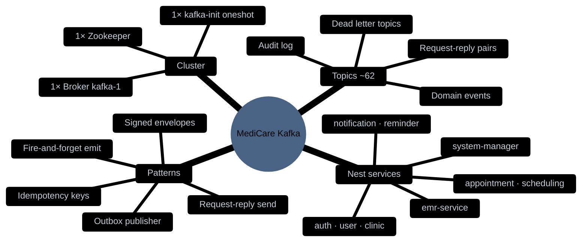
```mermaid
---
config:
  theme: base
  themeVariables:
    darkMode: true
    background: "#12171e"
    primaryColor: "#1c2633"
    primaryTextColor: "#c5ced8"
    primaryBorderColor: "#3d4f63"
    secondaryColor: "#1a2a28"
    secondaryTextColor: "#c5ced8"
    secondaryBorderColor: "#3d5a52"
    tertiaryColor: "#232a33"
    tertiaryTextColor: "#aeb8c4"
    tertiaryBorderColor: "#455364"
    lineColor: "#6b7c8c"
    textColor: "#aeb8c4"
    mainBkg: "#1c2633"
    clusterBkg: "#161c24"
    clusterBorder: "#2e3a48"
    titleColor: "#9aa8b6"
    fontFamily: "ui-sans-serif, system-ui, Segoe UI, sans-serif"
    fontSize: "15px"
---
mindmap
  root((MediCare Kafka))
    Cluster
      1× Zookeeper
      1× Broker kafka-1
      1× kafka-init oneshot
    Topics ~62
      Domain events
      Request-reply pairs
      Audit log
      Dead letter topics
    Nest services
      auth · user · clinic
      system-manager
      appointment · scheduling
      notification · reminder
      emr-service
    Patterns
      Fire-and-forget emit
      Request-reply send
      Signed envelopes
      Idempotency keys
      Outbox publisher
```

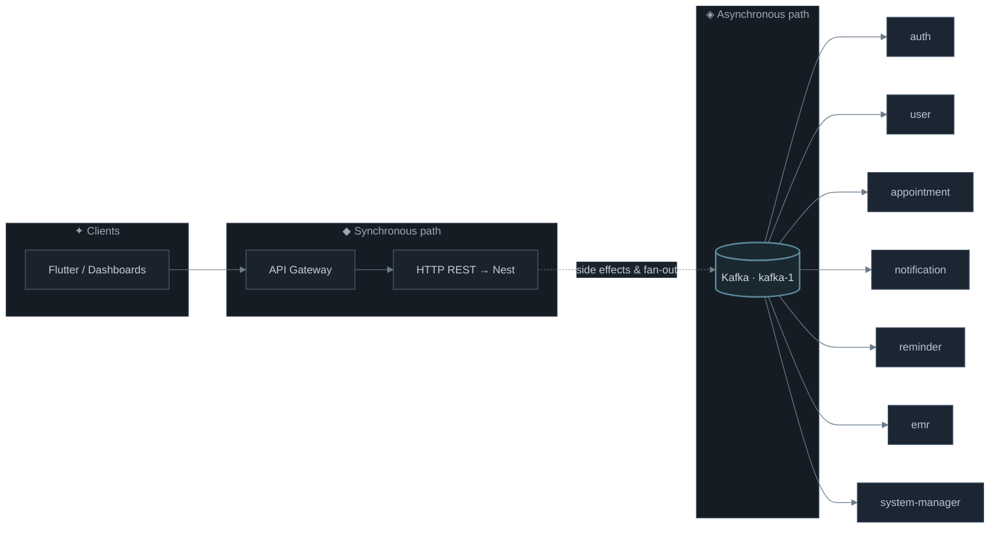
```mermaid
---
config:
  theme: base
  themeVariables:
    darkMode: true
    background: "#12171e"
    primaryColor: "#1c2633"
    primaryTextColor: "#c5ced8"
    primaryBorderColor: "#3d4f63"
    secondaryColor: "#1a2830"
    secondaryTextColor: "#c5ced8"
    secondaryBorderColor: "#4a6270"
    tertiaryColor: "#232a33"
    tertiaryTextColor: "#aeb8c4"
    tertiaryBorderColor: "#455364"
    lineColor: "#6b7c8c"
    textColor: "#aeb8c4"
    mainBkg: "#1c2633"
    clusterBkg: "#161c24"
    clusterBorder: "#2e3a48"
    titleColor: "#9aa8b6"
    edgeLabelBackground: "#1a222c"
    fontFamily: "ui-sans-serif, system-ui, Segoe UI, sans-serif"
    fontSize: "14px"
---
flowchart LR
  subgraph Clients["✦ Clients"]
    Apps["Flutter / Dashboards"]
  end

  subgraph Sync["◆ Synchronous path"]
    GW["API Gateway"]
    HTTP["HTTP REST → Nest"]
  end

  subgraph Async["◈ Asynchronous path"]
    K[("Kafka · kafka-1")]
  end

  Apps --> GW --> HTTP
  HTTP -.->|side effects & fan-out| K
  K --> Auth["auth"]
  K --> User["user"]
  K --> Appt["appointment"]
  K --> Notif["notification"]
  K --> Rem["reminder"]
  K --> EMR["emr"]
  K --> SM["system-manager"]

  classDef edge fill:#1c2633,stroke:#4a5d70,color:#c5ced8,rx:8,ry:8
  classDef bus fill:#1a2830,stroke:#5b8a9a,stroke-width:2px,color:#d0d8e0
  classDef svc fill:#1c2633,stroke:#3d4f63,color:#b8c4d0
  classDef sync fill:#1a222c,stroke:#4a5d70,color:#c5ced8
  class Apps,GW,HTTP sync
  class K bus
  class Auth,User,Appt,Notif,Rem,EMR,SM svc
```

**Rule of thumb in this codebase**

| Concern | Transport |
|---|---|
| Login/register/CRUD from UI | HTTP → Gateway → Nest |
| “User was created → create OpenEMR patient” | Kafka event |
| “Appointment booked → WhatsApp + reminder + EMR” | Kafka fan-out |
| PHI / security audit trail | Kafka `audit.log` → auth-service consumer |
| Auth needs user validation without owning user DB | Kafka request–reply (`user.login.request`) |

---

## 2. How Kafka is divided in this project

Kafka is organized as **layers**, not as “many broker services.”

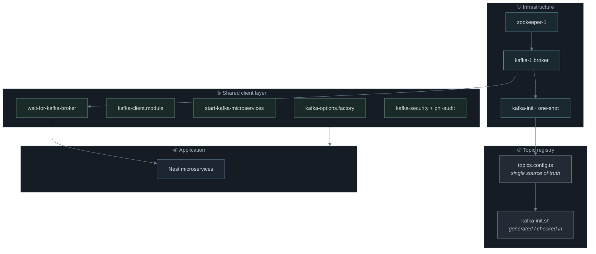
```mermaid
---
config:
  theme: base
  themeVariables:
    darkMode: true
    background: "#12171e"
    primaryColor: "#1c2633"
    primaryTextColor: "#c5ced8"
    primaryBorderColor: "#3d4f63"
    secondaryColor: "#1a2a28"
    secondaryTextColor: "#c5ced8"
    secondaryBorderColor: "#3d5a52"
    tertiaryColor: "#232a33"
    tertiaryTextColor: "#aeb8c4"
    tertiaryBorderColor: "#455364"
    lineColor: "#6b7c8c"
    textColor: "#aeb8c4"
    mainBkg: "#1c2633"
    clusterBkg: "#161c24"
    clusterBorder: "#2e3a48"
    titleColor: "#9aa8b6"
    edgeLabelBackground: "#1a222c"
    fontFamily: "ui-sans-serif, system-ui, Segoe UI, sans-serif"
    fontSize: "14px"
---
flowchart TB
  subgraph Infra["① Infrastructure"]
    ZK["zookeeper-1"]
    B["kafka-1 broker"]
    INIT["kafka-init · one-shot"]
    ZK --> B
    B --> INIT
  end

  subgraph Registry["② Topic registry"]
    TC["topics.config.ts<br/><i>single source of truth</i>"]
    SH["kafka-init.sh<br/><i>generated / checked in</i>"]
    TC --> SH
  end

  subgraph Shared["③ Shared client layer"]
    KOF["kafka-options.factory"]
    KCM["kafka-client.module"]
    START["start-kafka-microservices"]
    WAIT["wait-for-kafka-broker"]
    SEC["kafka-security + phi-audit"]
  end

  subgraph Apps["④ Application"]
    MS["Nest microservices"]
  end

  INIT --> TC
  Shared --> Apps
  B --> WAIT --> MS

  classDef infra fill:#1a2830,stroke:#5b8a9a,color:#d0d8e0
  classDef reg fill:#232a33,stroke:#6b7c8c,color:#c5ced8
  classDef share fill:#1a2a28,stroke:#5a7a6a,color:#c8d4cc
  classDef app fill:#1c2633,stroke:#4a5d70,color:#c5ced8
  class ZK,B,INIT infra
  class TC,SH reg
  class KOF,KCM,START,WAIT,SEC share
  class MS app
```

### Division summary

| Layer | What it is | Role |
|---|---|---|
| **Zookeeper** | Coordination for classic Confluent Kafka 7.4 | Broker metadata, controller election |
| **Broker (`kafka-1`)** | The Kafka server process | Stores topic logs, serves produce/consume |
| **kafka-init** | One-shot container | Creates all topics with known partitions/retention |
| **Topic registry** | TypeScript enum + configs | Names, partitions, RF, retention |
| **Shared Nest Kafka libs** | Copied into each service at Docker build | Consumer options, client module, retries |
| **Security / audit shared** | Matrix + signed envelopes + PHI audit | Who may publish what; immutable audit stream |
| **Per-service consumers/producers** | `@EventPattern` / `@MessagePattern` / `.emit()` | Business logic |

There is **no** multi-broker cluster in the current deployable compose/Railway layout. The TypeScript **production** topic config *anticipates* a 3-broker cluster (`replicationFactor: 3`), but the **runtime** used today is single-broker (`replication-factor 1` in `kafka-init.sh`).

---

## 3. Brokers — how many, and why each exists

### Answer: **one Kafka broker** (`kafka-1`)

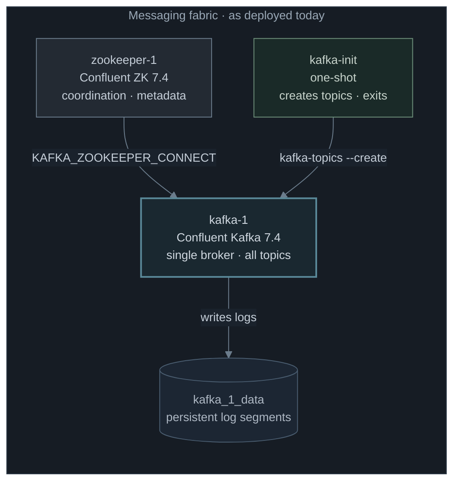
```mermaid
---
config:
  theme: base
  themeVariables:
    darkMode: true
    background: "#12171e"
    primaryColor: "#1c2633"
    primaryTextColor: "#c5ced8"
    primaryBorderColor: "#3d4f63"
    secondaryColor: "#1a2830"
    secondaryTextColor: "#c5ced8"
    secondaryBorderColor: "#4a6270"
    tertiaryColor: "#232a33"
    tertiaryTextColor: "#aeb8c4"
    tertiaryBorderColor: "#455364"
    lineColor: "#6b7c8c"
    textColor: "#aeb8c4"
    mainBkg: "#1c2633"
    clusterBkg: "#161c24"
    clusterBorder: "#2e3a48"
    titleColor: "#9aa8b6"
    edgeLabelBackground: "#1a222c"
    fontFamily: "ui-sans-serif, system-ui, Segoe UI, sans-serif"
    fontSize: "14px"
---
flowchart TB
  subgraph Msg["Messaging fabric · as deployed today"]
    direction TB
    ZK["zookeeper-1<br/><span style='color:#9aa8b6'>Confluent ZK 7.4</span><br/>coordination · metadata"]
    BROKER["kafka-1<br/><span style='color:#9aa8b6'>Confluent Kafka 7.4</span><br/>single broker · all topics"]
    VOL[("kafka_1_data<br/>persistent log segments")]
    INIT["kafka-init<br/><span style='color:#9aa8b6'>one-shot</span><br/>creates topics · exits"]
  end

  ZK -->|"KAFKA_ZOOKEEPER_CONNECT"| BROKER
  BROKER -->|"writes logs"| VOL
  INIT -->|"kafka-topics --create"| BROKER

  classDef zk fill:#232a33,stroke:#6b7c8c,color:#c5ced8
  classDef broker fill:#1a2830,stroke:#5b8a9a,stroke-width:2px,color:#d0d8e0
  classDef vol fill:#1c2633,stroke:#4a5d70,color:#aeb8c4
  classDef init fill:#1a2a28,stroke:#6d8f7a,color:#c8d4cc
  class ZK zk
  class BROKER broker
  class VOL vol
  class INIT init
```

### Why only one broker?

| Reason | Detail |
|---|---|
| **Cost & ops simplicity** | One Railway/Docker service for Kafka + one ZK is enough for clinic-scale traffic while developing and early production. |
| **Replication factor must match broker count** | With 1 broker you **must** use `replication-factor: 1`. You cannot place 3 replicas on 1 broker. |
| **Compose naming is future-proof** | Service is named `kafka-1` (not `kafka`) so `kafka-2` / `kafka-3` can be added later without renaming clients. |
| **Clients already support multi-broker** | `KAFKA_BROKERS` is a **comma-separated** list parsed in `KafkaOptionsFactory.getBrokers()`. |

### What each *Kafka-related* process is for (detail)

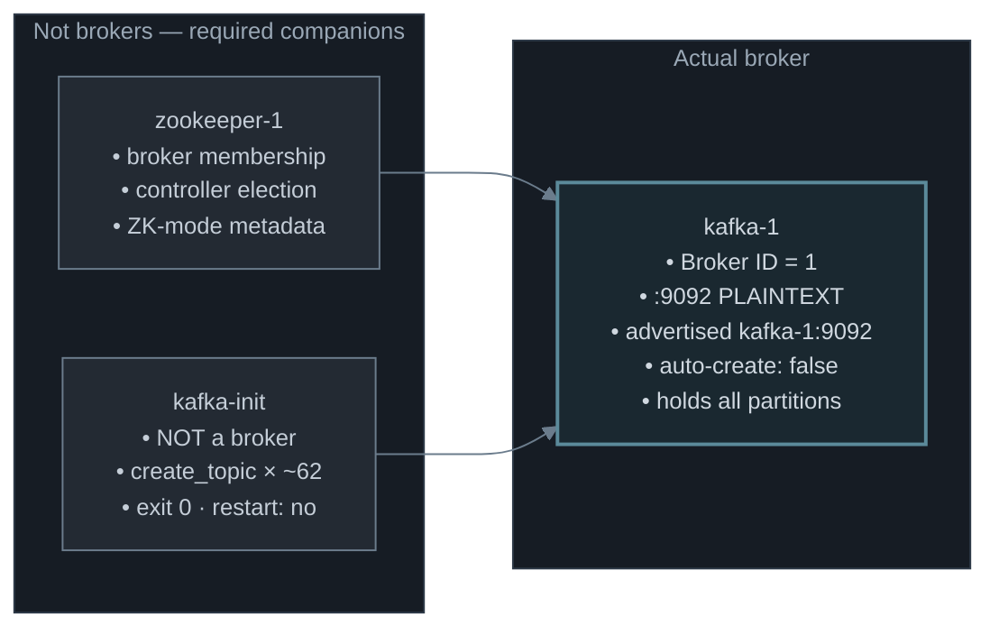
```mermaid
---
config:
  theme: base
  themeVariables:
    darkMode: true
    background: "#12171e"
    primaryColor: "#1c2633"
    primaryTextColor: "#c5ced8"
    primaryBorderColor: "#3d4f63"
    secondaryColor: "#1a2830"
    secondaryTextColor: "#c5ced8"
    secondaryBorderColor: "#4a6270"
    tertiaryColor: "#232a33"
    tertiaryTextColor: "#aeb8c4"
    tertiaryBorderColor: "#455364"
    lineColor: "#6b7c8c"
    textColor: "#aeb8c4"
    mainBkg: "#1c2633"
    clusterBkg: "#161c24"
    clusterBorder: "#2e3a48"
    titleColor: "#9aa8b6"
    edgeLabelBackground: "#1a222c"
    fontFamily: "ui-sans-serif, system-ui, Segoe UI, sans-serif"
    fontSize: "13px"
---
flowchart LR
  subgraph Support["Not brokers — required companions"]
    ZK["zookeeper-1<br/>• broker membership<br/>• controller election<br/>• ZK-mode metadata"]
    INIT["kafka-init<br/>• NOT a broker<br/>• create_topic × ~62<br/>• exit 0 · restart: no"]
  end

  subgraph Core["Actual broker"]
    K1["kafka-1<br/>• Broker ID = 1<br/>• :9092 PLAINTEXT<br/>• advertised kafka-1:9092<br/>• auto-create: false<br/>• holds all partitions"]
  end

  ZK --> K1
  INIT --> K1

  classDef support fill:#232a33,stroke:#6b7c8c,color:#c5ced8
  classDef core fill:#1a2830,stroke:#5b8a9a,stroke-width:2px,color:#d0d8e0
  class ZK,INIT support
  class K1 core
```

#### `kafka-1` (the only broker)

From `docker-compose.yml`:

- **Image:** `confluentinc/cp-kafka:7.4.0`
- **Broker ID:** `1`
- **Listeners:** `PLAINTEXT://0.0.0.0:9092` advertised as `PLAINTEXT://kafka-1:9092`
- **Offsets / transaction RF:** `1` (required for single broker)
- **`KAFKA_AUTO_CREATE_TOPICS_ENABLE: "false"`** in Docker — topics must come from `kafka-init` with explicit partition/retention settings
- **Default retention hours:** `168` (7 days) at broker level; topics also set `retention.ms`
- **Heap:** `-Xms256m -Xmx512m` (dev-friendly)
- **Max message:** 1 MiB
- **Healthcheck:** `kafka-broker-api-versions --bootstrap-server kafka-1:9092`

#### Why there is *not* a `kafka-2` / `kafka-3` today

A 3-broker cluster would give:

- Higher availability (survive one broker loss)
- True `replicationFactor: 3` and `min.insync.replicas: 2` as already coded in **production** `TopicConfigurations`

That is **designed for later**, not currently provisioned. Running three brokers on Railway would triple messaging cost/ops without changing app code much — only `KAFKA_BROKERS` and init RF.

#### “Broker” vs “service that talks to Kafka”

Do **not** confuse Nest services with brokers:

| Name | Is it a Kafka broker? |
|---|---|
| `kafka-1` | **Yes** |
| `zookeeper-1` | No (coordination) |
| `kafka-init` | No (admin client script) |
| `auth-service`, `user-service`, … | No (Kafka **clients**) |

---

## 4. Zookeeper & kafka-init

### Zookeeper (`zookeeper-1`)

Classic Confluent 7.4 stack uses ZooKeeper (not KRaft). One ZK node matches one broker for local/prod-lite.

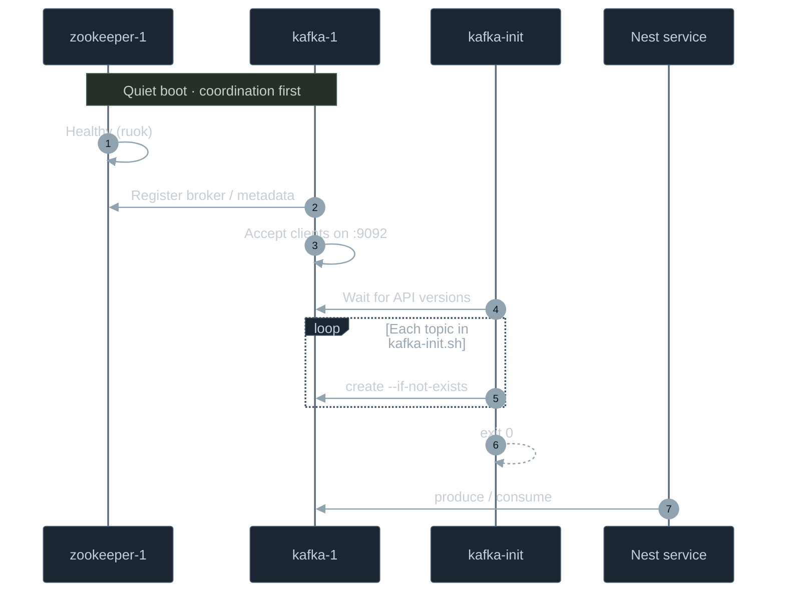
```mermaid
---
config:
  theme: base
  themeVariables:
    darkMode: true
    background: "#12171e"
    primaryColor: "#1c2633"
    primaryTextColor: "#c5ced8"
    primaryBorderColor: "#3d4f63"
    secondaryColor: "#1a2830"
    secondaryTextColor: "#c5ced8"
    secondaryBorderColor: "#4a6270"
    tertiaryColor: "#232a33"
    tertiaryTextColor: "#aeb8c4"
    tertiaryBorderColor: "#455364"
    lineColor: "#6b7c8c"
    textColor: "#aeb8c4"
    actorBkg: "#1c2633"
    actorBorder: "#4a6270"
    actorTextColor: "#c5ced8"
    actorLineColor: "#5a6a7a"
    signalColor: "#8fa3b0"
    signalTextColor: "#c5ced8"
    labelBoxBkgColor: "#1c2633"
    labelBoxBorderColor: "#3d4f63"
    labelTextColor: "#c5ced8"
    loopTextColor: "#9aa8b6"
    noteBkgColor: "#243028"
    noteTextColor: "#c5d0c8"
    noteBorderColor: "#4a6356"
    activationBkgColor: "#243040"
    sequenceNumberColor: "#0f1419"
    fontFamily: "ui-sans-serif, system-ui, Segoe UI, sans-serif"
    fontSize: "14px"
---
sequenceDiagram
  autonumber
  participant ZK as zookeeper-1
  participant K as kafka-1
  participant Init as kafka-init
  participant App as Nest service

  Note over ZK,K: Quiet boot · coordination first
  ZK->>ZK: Healthy (ruok)
  K->>ZK: Register broker / metadata
  K->>K: Accept clients on :9092
  Init->>K: Wait for API versions
  loop Each topic in kafka-init.sh
    Init->>K: create --if-not-exists
  end
  Init-->>Init: exit 0
  App->>K: produce / consume
```

### kafka-init

- **Not long-running.** `restart: "no"`.
- Mounts `Messaging/Kafka/scripts/kafka-init.sh`.
- Regenerated from `topics.config.ts` via `npm run generate:kafka-init-sh`.
- Docker Compose: microservices `depends_on: kafka-init: service_completed_successfully`.
- Railway: start script waits until kafka-init deployment reaches **SUCCESS** before Nest apps; entrypoint also waits for sentinel topic `audit.log`.

---

## 5. Topics — how many, why, and the catalog

### How many?

**62 topics** created by `kafka-init.sh`:

| Category | Count | Retention |
|---|---:|---|
| Standard domain / reply topics | **49** | 7 days (`604800000` ms) |
| Dead-letter topics (`.dlt`) | **13** | 30 days (`2592000000` ms) |
| **Total** | **62** | |

Single source of truth: `Messaging/Kafka/kafka-config/topics/topics.config.ts` (`KafkaTopics` enum + `DockerComposeTopicConfigurations`).

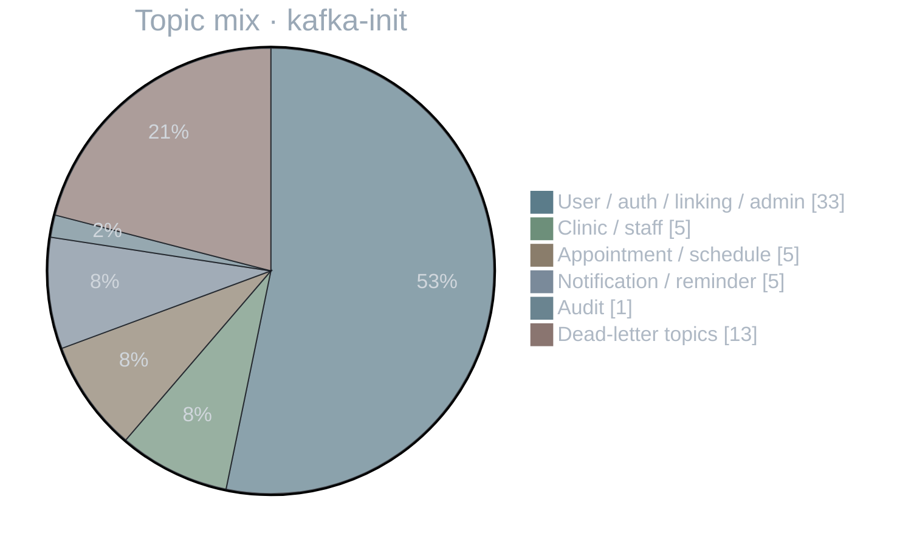
```mermaid
---
config:
  theme: base
  themeVariables:
    darkMode: true
    background: "#12171e"
    primaryColor: "#1c2633"
    primaryTextColor: "#c5ced8"
    primaryBorderColor: "#3d4f63"
    tertiaryColor: "#232a33"
    tertiaryTextColor: "#aeb8c4"
    lineColor: "#6b7c8c"
    textColor: "#aeb8c4"
    pie1: "#5b7c8a"
    pie2: "#6d8f7a"
    pie3: "#8a7d6b"
    pie4: "#7a8a9a"
    pie5: "#6a8490"
    pie6: "#8a7570"
    pieTitleTextColor: "#9aa8b6"
    pieSectionTextColor: "#d0d6dc"
    pieLegendTextColor: "#aeb8c4"
    pieStrokeColor: "#12171e"
    pieStrokeWidth: "1px"
    fontFamily: "ui-sans-serif, system-ui, Segoe UI, sans-serif"
    fontSize: "14px"
---
pie showData
  title Topic mix · kafka-init
  "User / auth / linking / admin" : 33
  "Clinic / staff" : 5
  "Appointment / schedule" : 5
  "Notification / reminder" : 5
  "Audit" : 1
  "Dead-letter topics" : 13
```

> Counts above group the 49 standard topics by domain for readability; exact names are listed below.

### Why so many topics (instead of one big “events” topic)?

| Design choice | Why MediCare does it |
|---|---|
| **One business event type ≈ one topic** | Clear ACLs/security matrix; independent consumer groups; easier retention/ops per domain |
| **`.reply` companion topics** | Nest Kafka request–reply correlation without polluting event streams |
| **`.dlt` companions** | Failed poison messages don’t block the main partition forever |
| **Separate audit topic** | Compliance stream consumed by auth-service only |

### Full catalog (standard)

#### User lifecycle

| Topic | Partitions | Purpose |
|---|---:|---|
| `user.create` | 3 | Request: create user (often auth → user) |
| `user.create.reply` | 3 | Reply channel for create |
| `user.created` | 3 | Event: user persisted → EMR provisioning |
| `user.updated` / `user.deleted` / `user.status.updated` | 3 | Lifecycle broadcasts |
| `user.phone.verified` / `user.email.verified` | 3 | Verification signals |
| `user.password.changed` | 3 | User → auth (invalidate / sync credentials) |

#### Auth / login

| Topic | Partitions | Purpose |
|---|---:|---|
| `user.login.request` | 3 | Auth asks user-service to validate credentials |
| `user.login.request.reply` | 3 | Validation result |
| `user.login.success` | 3 | Fire-and-forget login telemetry |
| `user.verify.otp` | 3 | OTP verified → user-service side effects |

#### Account linking (system manager ↔ patient)

| Topic | Partitions | Purpose |
|---|---:|---|
| `account.linked` / `account.unlinked` | 3 | User emits; system-manager consumes |
| `user.link.patient.account` (+ `.reply`) | 3 | Request–reply linking |
| `user.get.linked.accounts` (+ `.reply`) | 3 | Request–reply list |
| `user.unlink.account` (+ `.reply`) | 3 | Request–reply unlink |

#### Clinic admin / system manager

| Topic | Partitions | Purpose |
|---|---:|---|
| `user.create.clinic.admin.pending` | 3 | Pending admin user flow |
| `user.create.clinic.admin` | 3 | System-manager → user-service |
| `clinic.admin.activate` | 3 | Activation event |
| `system.manager.activate.clinic.admin` (+ `.reply`) | 3 | Request–reply activation |
| `user.dashboard.activation.updated` | 3 | Dashboard access flag |
| `system.manager.login` | **1** | Low-volume admin login signal |
| `system.manager.created` | **1** | Low-volume creation signal |
| `user.create.by.admin` (+ `.reply`) | 3 | Admin creates staff/patient via messaging |
| `user.check.exists` (+ `.reply`) | 3 | Existence check without HTTP coupling |

#### Clinic & schedule

| Topic | Partitions | Purpose |
|---|---:|---|
| `clinic.created` / `updated` / `deleted` | 3 | Clinic domain events (often no consumers yet — broadcast ready) |
| `clinic.staff.assigned` / `clinic.staff.removed` | 3 | Staff membership changes |
| `schedule.updated` | 3 | Scheduling broadcasts |

#### Appointments & messaging side effects

| Topic | Partitions | Purpose |
|---|---:|---|
| `appointment.created` | 3 | Fan-out → notification, reminder, emr |
| `appointment.updated` / `cancelled` / `completed` | 3 | Downstream sync |
| `notification.sent` / `notification.failed` | 3 | Notification outcomes |
| `reminder.scheduled` / `sent` / `failed` | 3 | Reminder pipeline telemetry |

#### Audit

| Topic | Partitions | Purpose |
|---|---:|---|
| `audit.log` | 3 | PHI / security audit events → **auth-service** consumer |

### Dead-letter topics (13)

| DLT topic | Partitions |
|---|---:|
| `account.linked.dlt` | 1 |
| `account.unlinked.dlt` | 1 |
| `user.create.clinic.admin.pending.dlt` | 1 |
| `clinic.admin.activate.dlt` | 1 |
| `user.create.dlt` | 1 |
| `user.verify.otp.dlt` | 1 |
| `user.login.request.dlt` | 1 |
| `user.check.exists.dlt` | 1 |
| `user.link.patient.account.dlt` | 1 |
| `user.unlink.account.dlt` | 1 |
| `user.get.linked.accounts.dlt` | 1 |
| `user.create.by.admin.dlt` | 1 |
| `user.created.dlt` | 1 |

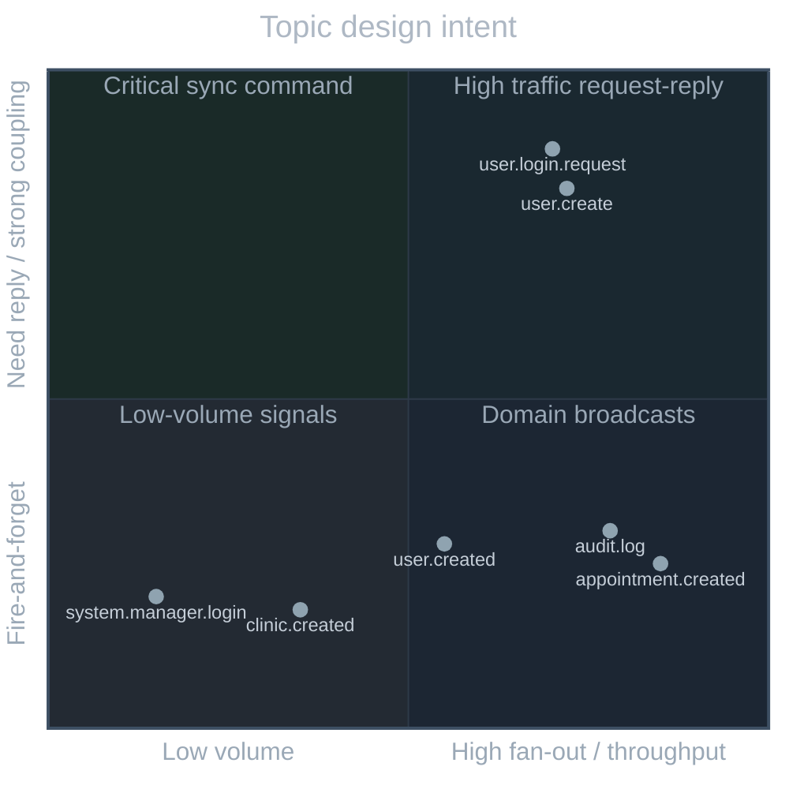
```mermaid
---
config:
  theme: base
  themeVariables:
    darkMode: true
    background: "#12171e"
    primaryColor: "#1c2633"
    primaryTextColor: "#c5ced8"
    primaryBorderColor: "#3d4f63"
    secondaryColor: "#1a2a28"
    secondaryTextColor: "#c5ced8"
    tertiaryColor: "#232a33"
    tertiaryTextColor: "#aeb8c4"
    lineColor: "#6b7c8c"
    textColor: "#aeb8c4"
    quadrant1Fill: "#1a2830"
    quadrant2Fill: "#1a2a28"
    quadrant3Fill: "#232a33"
    quadrant4Fill: "#1c2633"
    quadrant1TextFill: "#9aa8b6"
    quadrant2TextFill: "#9aa8b6"
    quadrant3TextFill: "#9aa8b6"
    quadrant4TextFill: "#9aa8b6"
    quadrantPointFill: "#8fa3b0"
    quadrantPointTextFill: "#c5ced8"
    quadrantXAxisTextFill: "#9aa8b6"
    quadrantYAxisTextFill: "#9aa8b6"
    quadrantTitleFill: "#aeb8c4"
    quadrantInternalBorderStrokeFill: "#2e3a48"
    quadrantExternalBorderStrokeFill: "#3d4f63"
    fontFamily: "ui-sans-serif, system-ui, Segoe UI, sans-serif"
    fontSize: "13px"
---
quadrantChart
  title Topic design intent
  x-axis Low volume --> High fan-out / throughput
  y-axis Fire-and-forget --> Need reply / strong coupling
  quadrant-1 High traffic request-reply
  quadrant-2 Critical sync command
  quadrant-3 Low-volume signals
  quadrant-4 Domain broadcasts
  user.create: [0.72, 0.82]
  user.login.request: [0.70, 0.88]
  appointment.created: [0.85, 0.25]
  audit.log: [0.78, 0.30]
  system.manager.login: [0.15, 0.20]
  clinic.created: [0.35, 0.18]
  user.created: [0.55, 0.28]
```

---

## 6. Partitions — how many, and why

### Defaults

| Topic class | Partitions | Why |
|---|---:|---|
| Almost all standard topics | **3** | Parallelism: up to 3 active consumers in one group can process the topic concurrently |
| `system.manager.login` / `system.manager.created` | **1** | Extremely low volume; ordering across the whole stream is simpler with a single partition |
| All `.dlt` topics | **1** | Failures are rare; operators want a single ordered dump for debugging |

### What a partition buys you

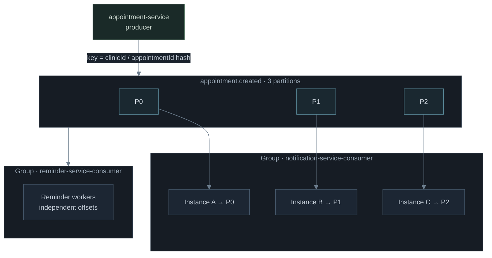
```mermaid
---
config:
  theme: base
  themeVariables:
    darkMode: true
    background: "#12171e"
    primaryColor: "#1c2633"
    primaryTextColor: "#c5ced8"
    primaryBorderColor: "#3d4f63"
    secondaryColor: "#1a2830"
    secondaryTextColor: "#c5ced8"
    secondaryBorderColor: "#4a6270"
    tertiaryColor: "#232a33"
    tertiaryTextColor: "#aeb8c4"
    tertiaryBorderColor: "#455364"
    lineColor: "#6b7c8c"
    textColor: "#aeb8c4"
    mainBkg: "#1c2633"
    clusterBkg: "#161c24"
    clusterBorder: "#2e3a48"
    titleColor: "#9aa8b6"
    edgeLabelBackground: "#1a222c"
    fontFamily: "ui-sans-serif, system-ui, Segoe UI, sans-serif"
    fontSize: "13px"
---
flowchart TB
  Prod["appointment-service<br/>producer"]

  subgraph Topic["appointment.created · 3 partitions"]
    direction LR
    P0["P0"]
    P1["P1"]
    P2["P2"]
  end

  Prod -->|"key = clinicId / appointmentId hash"| Topic

  subgraph CG["Group · notification-service-consumer"]
    direction LR
    N0["Instance A → P0"]
    N1["Instance B → P1"]
    N2["Instance C → P2"]
  end

  P0 --> N0
  P1 --> N1
  P2 --> N2

  subgraph CG2["Group · reminder-service-consumer"]
    R["Reminder workers<br/>independent offsets"]
  end

  Topic --> CG2

  classDef prod fill:#1a2a28,stroke:#6d8f7a,color:#c8d4cc
  classDef part fill:#1a2830,stroke:#5b8a9a,color:#d0d8e0
  classDef cons fill:#1c2633,stroke:#4a5d70,color:#c5ced8
  class Prod prod
  class P0,P1,P2 part
  class N0,N1,N2,R cons
```

**Important properties:**

1. **Ordering is per partition**, not per topic. Same key → same partition → ordered processing for that key.
2. **Throughput scales with partitions × consumers in the group** (up to partition count).
3. **Two services can both consume the same topic** by using **different consumer groups** — each gets a full copy of the stream (fan-out). That is why `appointment.created` can wake notification **and** reminder **and** EMR independently.

### Replication factor (related but not partitions)

| Environment | Partitions | Replication factor | `min.insync.replicas` |
|---|---:|---:|---:|
| Docker / current Railway init | 3 (or 1) | **1** | n/a / 1 |
| `TopicConfigurations` (multi-broker target) | 3 (or 1) | **3** | **2** |

Partitions ≠ replicas. Partitions split load; replicas copy data for HA.

---

## 7. What if there are none?

This section answers the failure modes you hit in real life.

### If there are **zero brokers** (Kafka down)

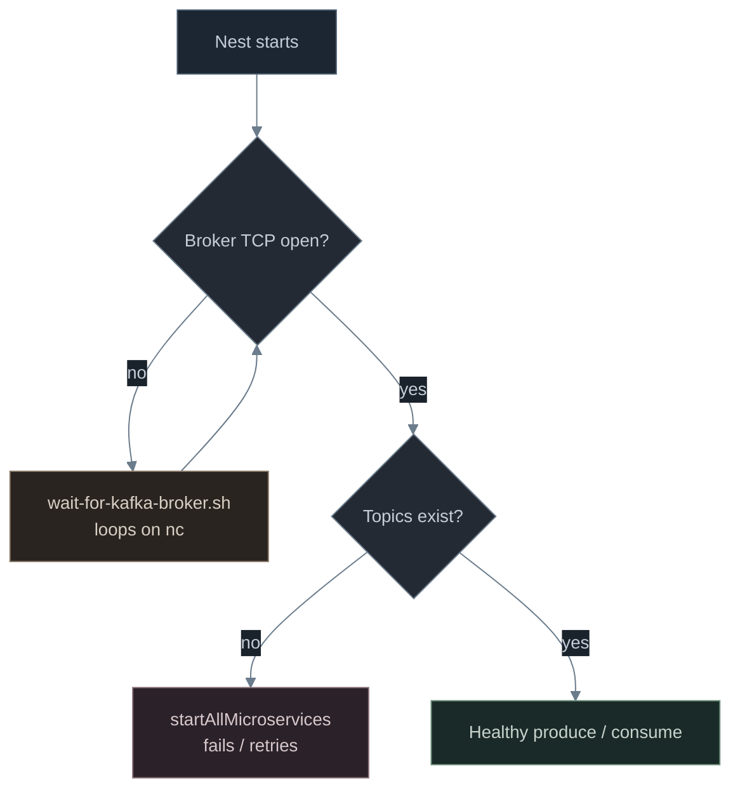
```mermaid
---
config:
  theme: base
  themeVariables:
    darkMode: true
    background: "#12171e"
    primaryColor: "#1c2633"
    primaryTextColor: "#c5ced8"
    primaryBorderColor: "#3d4f63"
    secondaryColor: "#2a2420"
    secondaryTextColor: "#d8d0c5"
    secondaryBorderColor: "#8a7a68"
    tertiaryColor: "#1a2a28"
    tertiaryTextColor: "#c8d4cc"
    tertiaryBorderColor: "#6d8f7a"
    lineColor: "#6b7c8c"
    textColor: "#aeb8c4"
    mainBkg: "#1c2633"
    clusterBkg: "#161c24"
    clusterBorder: "#2e3a48"
    titleColor: "#9aa8b6"
    edgeLabelBackground: "#1a222c"
    fontFamily: "ui-sans-serif, system-ui, Segoe UI, sans-serif"
    fontSize: "14px"
---
flowchart TD
  A["Nest starts"] --> B{"Broker TCP open?"}
  B -->|no| C["wait-for-kafka-broker.sh<br/>loops on nc"]
  C --> B
  B -->|yes| D{"Topics exist?"}
  D -->|no| E["startAllMicroservices<br/>fails / retries"]
  D -->|yes| F["Healthy produce / consume"]

  classDef start fill:#1c2633,stroke:#4a5d70,color:#c5ced8
  classDef ask fill:#232a33,stroke:#6b7c8c,color:#c5ced8
  classDef wait fill:#2a2420,stroke:#8a7a68,color:#d8d0c5
  classDef bad fill:#2a2228,stroke:#8a7078,color:#d8c8cc
  classDef ok fill:#1a2a28,stroke:#6d8f7a,color:#c8d4cc
  class A start
  class B,D ask
  class C wait
  class E bad
  class F ok
```

- Entrypoint `wait-for-kafka-broker.sh` blocks until `kafka-1:9092` accepts TCP.
- Health `/health/ready` uses `isKafkaBrokerReachable()` (`kafka-readiness.probe.ts`).
- Without a broker: **no events, no Kafka request–reply**; HTTP may still work for pure DB paths, but cross-service async workflows break (no EMR patient from `user.created`, no WhatsApp from appointments, etc.).

### If the broker exists but **zero topics** (or topics not ready yet)

This is the **cold-start race** you already saw:

- Clients set `allowAutoTopicCreation: false`.
- Consumers subscribe to named topics (`user.password.changed`, `audit.log`, …).
- KafkaJS throws **`UNKNOWN_TOPIC_OR_PARTITION`** / “This server does not host this topic-partition”.
- Nest `startAllMicroservices()` fails → process crash-loop → Railway **healthcheck Failed** (looks like “build failed” in the UI, but build often succeeded).

**Mitigations now in the repo:**

1. `kafka-init` creates topics before apps (Compose dependency / Railway start wait).
2. Entrypoint waits for sentinel topic **`audit.log`**.
3. `startKafkaMicroservicesWithRetry()` retries retriable Kafka start errors.

### If a **specific topic** is missing

Only consumers of that topic fail at subscribe time; other topics can work. Auto-create is disabled so “silent wrong partition counts” don’t happen.

### If there are **zero consumers** for a topic

Producers still succeed. Messages sit until retention expires (7 or 30 days). Several topics (`clinic.created`, `schedule.updated`, `user.login.success`, …) are intentionally **broadcast-ready** with empty consumer lists in the security matrix — future services can subscribe without changing producers.

### If there are **zero partitions** (invalid)

Kafka rejects topic creation with `partitions < 1`. This project never does that.

---

## 8. Client libraries & Nest wiring

### Shared config (copied into each service image)

At Docker build time:

```text
cp Messaging/Kafka/kafka-config/shared/*.ts → src/kafka-shared/
```

Key modules:

| File | Role |
|---|---|
| `kafka-options.factory.ts` | Builds Nest `Transport.KAFKA` options for `connectMicroservice` |
| `kafka-client.module.ts` | `ClientsModule` producer client (`KAFKA_CLIENT`) |
| `start-kafka-microservices.ts` | Retry wrapper around `startAllMicroservices()` |
| `kafka-readiness.probe.ts` | Admin `describeCluster` for readiness |

### Typical Nest bootstrap

```text
app.connectMicroservice(KafkaOptionsFactory.createConsumerOptions(...))
await startKafkaMicroservicesWithRetry(app)
app.listen(PORT)  // HTTP still served
```

Each service is therefore **hybrid**: HTTP API **and** Kafka microservice transport in one process.

### Consumer group IDs (examples)

| Service | Client / group id pattern |
|---|---|
| auth-service | `auth-service-consumer` |
| user-service | `user-service-consumer` |
| emr-service | `emr-service-consumer` |
| … | `<service>-consumer` |

Different group IDs ⇒ independent offsets ⇒ true pub/sub fan-out.

### Producer hardening

- Idempotent producer (`idempotent: true`, `acks: -1` in client module).
- Long producer retry for transient broker issues.
- Consumers: elevated retry counts for topic/metadata races.

---

## 9. Two messaging styles: emit vs send

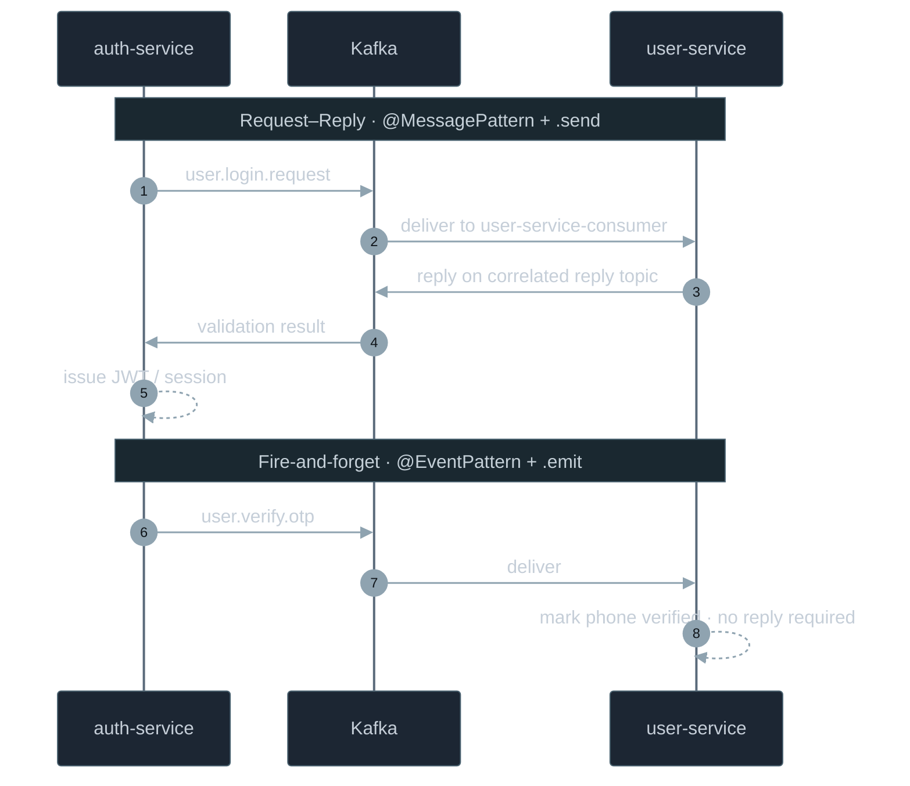
```mermaid
---
config:
  theme: base
  themeVariables:
    darkMode: true
    background: "#12171e"
    primaryColor: "#1c2633"
    primaryTextColor: "#c5ced8"
    primaryBorderColor: "#3d4f63"
    actorBkg: "#1c2633"
    actorBorder: "#4a6270"
    actorTextColor: "#c5ced8"
    actorLineColor: "#5a6a7a"
    signalColor: "#8fa3b0"
    signalTextColor: "#c5ced8"
    labelBoxBkgColor: "#1c2633"
    labelBoxBorderColor: "#3d4f63"
    labelTextColor: "#c5ced8"
    loopTextColor: "#9aa8b6"
    noteBkgColor: "#1a2830"
    noteTextColor: "#c5d0d8"
    noteBorderColor: "#4a6270"
    activationBkgColor: "#243040"
    sequenceNumberColor: "#0f1419"
    fontFamily: "ui-sans-serif, system-ui, Segoe UI, sans-serif"
    fontSize: "14px"
---
sequenceDiagram
  autonumber
  participant A as auth-service
  participant K as Kafka
  participant U as user-service

  Note over A,U: Request–Reply · @MessagePattern + .send
  A->>K: user.login.request
  K->>U: deliver to user-service-consumer
  U->>K: reply on correlated reply topic
  K->>A: validation result
  A-->>A: issue JWT / session

  Note over A,U: Fire-and-forget · @EventPattern + .emit
  A->>K: user.verify.otp
  K->>U: deliver
  U-->>U: mark phone verified · no reply required
```

| Style | Nest API | Handler decorator | When used |
|---|---|---|---|
| **Request–reply** | `client.send(pattern, payload)` | `@MessagePattern('…')` | Need a result before continuing (login validate, create user, check exists, link account) |
| **Event** | `client.emit(topic, payload)` | `@EventPattern('…')` | Side effects / fan-out (appointments, audit, password changed, account linked) |

Critical comment from system-manager consumer: **do not** handle `.emit()` events with `@MessagePattern` — Nest will wait for a reply correlation that never arrives.

---

## 10. Service communication map

### Who talks to whom over Kafka?

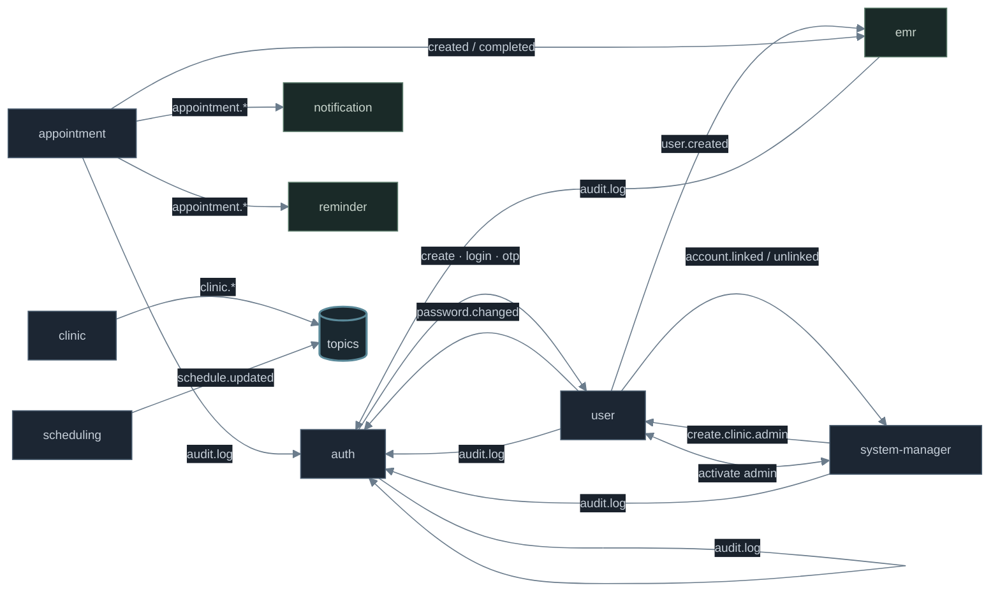
```mermaid
---
config:
  theme: base
  themeVariables:
    darkMode: true
    background: "#12171e"
    primaryColor: "#1c2633"
    primaryTextColor: "#c5ced8"
    primaryBorderColor: "#3d4f63"
    secondaryColor: "#1a2830"
    secondaryTextColor: "#c5ced8"
    secondaryBorderColor: "#4a6270"
    tertiaryColor: "#232a33"
    tertiaryTextColor: "#aeb8c4"
    tertiaryBorderColor: "#455364"
    lineColor: "#6b7c8c"
    textColor: "#aeb8c4"
    mainBkg: "#1c2633"
    clusterBkg: "#161c24"
    clusterBorder: "#2e3a48"
    titleColor: "#9aa8b6"
    edgeLabelBackground: "#1a222c"
    fontFamily: "ui-sans-serif, system-ui, Segoe UI, sans-serif"
    fontSize: "12px"
---
flowchart LR
  AUTH["auth"]
  USER["user"]
  SM["system-manager"]
  CLINIC["clinic"]
  APPT["appointment"]
  SCHED["scheduling"]
  NOTIF["notification"]
  REM["reminder"]
  EMR["emr"]
  BUS[("topics")]

  AUTH -->|"create · login · otp"| USER
  USER -->|"password.changed"| AUTH
  USER -->|"user.created"| EMR
  USER -->|"account.linked / unlinked"| SM
  SM -->|"create.clinic.admin"| USER
  SM <-->|"activate admin"| USER
  APPT -->|"appointment.*"| NOTIF
  APPT -->|"appointment.*"| REM
  APPT -->|"created / completed"| EMR
  CLINIC -->|"clinic.*"| BUS
  SCHED -->|"schedule.updated"| BUS
  AUTH -->|"audit.log"| AUTH
  USER -->|"audit.log"| AUTH
  APPT -->|"audit.log"| AUTH
  SM -->|"audit.log"| AUTH
  EMR -->|"audit.log"| AUTH

  classDef hub fill:#1a2830,stroke:#5b8a9a,stroke-width:2px,color:#d0d8e0
  classDef svc fill:#1c2633,stroke:#4a5d70,color:#c5ced8
  classDef side fill:#1a2a28,stroke:#5a7a6a,color:#c8d4cc
  class BUS hub
  class AUTH,USER,SM,CLINIC,APPT,SCHED svc
  class NOTIF,REM,EMR side
```

### Matrix (from `topic-security.matrix.ts` + code)

| Topic | Producers | Consumers | Why Kafka |
|---|---|---|---|
| `user.create` | auth, system-manager | user-service | Auth must not own user DB writes for all roles; async create with reply |
| `user.created` | user-service | **emr-service** | Provision OpenEMR patient after durable user row exists |
| `user.password.changed` | user-service | auth-service | Keep auth credential/session world consistent |
| `user.verify.otp` | auth-service | user-service | Mark verification without HTTP callback spaghetti |
| `user.login.success` | auth-service | _(none yet)_ | Telemetry / future analytics |
| `user.create.clinic.admin` | system-manager | user-service | Platform admin invites clinic admin |
| `account.linked` / `unlinked` | user-service | system-manager | Dashboard account graph updates |
| `appointment.created` | appointment | notification, reminder, **emr** | Classic fan-out: message + schedule + chart |
| `appointment.updated` / `cancelled` | appointment | notification, reminder | Keep patients informed; cancel reminders |
| `appointment.completed` | appointment | reminder, **emr** | Stop reminders; close clinical loop |
| `clinic.*` / `schedule.updated` | clinic / scheduling | _(often empty)_ | Future subscribers without coupling |
| `audit.log` | many services | **auth-service** | Central PHI/security audit sink |
| `system.manager.login` / `created` | system-manager | _(none)_ | Admin audit/telemetry |

### Deep dive: appointment fan-out (why Kafka shines)

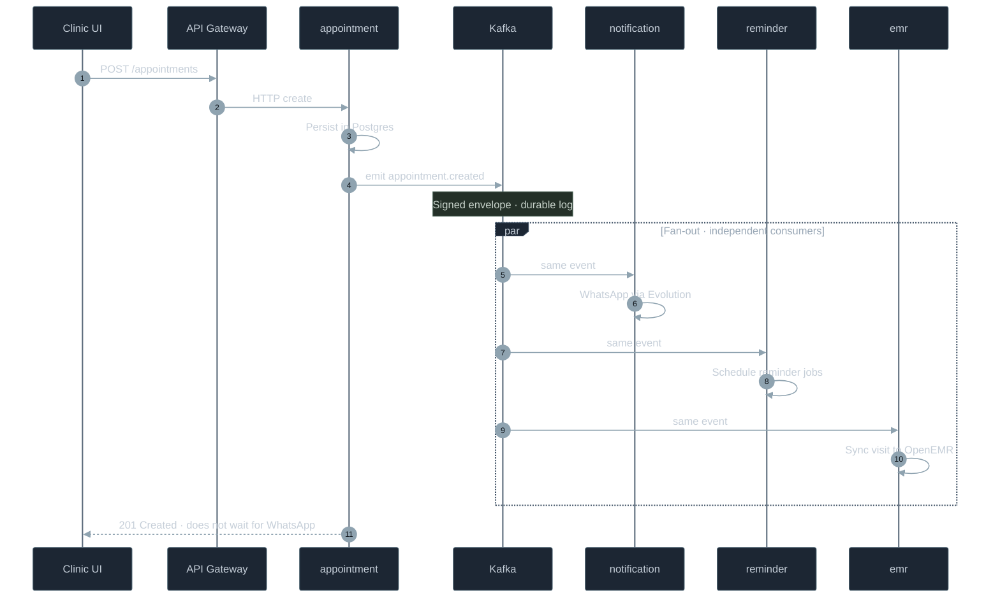
```mermaid
---
config:
  theme: base
  themeVariables:
    darkMode: true
    background: "#12171e"
    primaryColor: "#1c2633"
    primaryTextColor: "#c5ced8"
    primaryBorderColor: "#3d4f63"
    actorBkg: "#1c2633"
    actorBorder: "#4a6270"
    actorTextColor: "#c5ced8"
    actorLineColor: "#5a6a7a"
    signalColor: "#8fa3b0"
    signalTextColor: "#c5ced8"
    labelBoxBkgColor: "#1c2633"
    labelBoxBorderColor: "#3d4f63"
    labelTextColor: "#c5ced8"
    loopTextColor: "#9aa8b6"
    noteBkgColor: "#243028"
    noteTextColor: "#c5d0c8"
    noteBorderColor: "#4a6356"
    activationBkgColor: "#243040"
    sequenceNumberColor: "#0f1419"
    fontFamily: "ui-sans-serif, system-ui, Segoe UI, sans-serif"
    fontSize: "13px"
---
sequenceDiagram
  autonumber
  participant UI as Clinic UI
  participant GW as API Gateway
  participant AP as appointment
  participant K as Kafka
  participant N as notification
  participant R as reminder
  participant E as emr

  UI->>GW: POST /appointments
  GW->>AP: HTTP create
  AP->>AP: Persist in Postgres
  AP->>K: emit appointment.created
  Note over K: Signed envelope · durable log
  par Fan-out · independent consumers
    K->>N: same event
    N->>N: WhatsApp via Evolution
    K->>R: same event
    R->>R: Schedule reminder jobs
    K->>E: same event
    E->>E: Sync visit to OpenEMR
  end
  AP-->>UI: 201 Created · does not wait for WhatsApp
```

HTTP alone would force appointment-service to call three HTTP endpoints, handle partial failures, timeouts, and retries itself. Kafka turns that into **durable, replayable, independent consumers**.

### Deep dive: signup / EMR provisioning

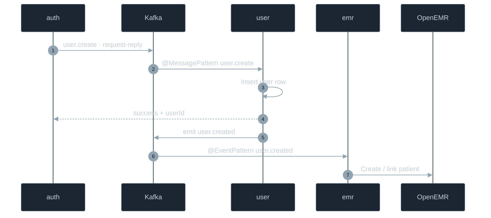
```mermaid
---
config:
  theme: base
  themeVariables:
    darkMode: true
    background: "#12171e"
    primaryColor: "#1c2633"
    primaryTextColor: "#c5ced8"
    primaryBorderColor: "#3d4f63"
    actorBkg: "#1c2633"
    actorBorder: "#4a6270"
    actorTextColor: "#c5ced8"
    actorLineColor: "#5a6a7a"
    signalColor: "#8fa3b0"
    signalTextColor: "#c5ced8"
    labelBoxBkgColor: "#1c2633"
    labelBoxBorderColor: "#3d4f63"
    labelTextColor: "#c5ced8"
    noteBkgColor: "#1a2830"
    noteTextColor: "#c5d0d8"
    noteBorderColor: "#4a6270"
    activationBkgColor: "#243040"
    sequenceNumberColor: "#0f1419"
    fontFamily: "ui-sans-serif, system-ui, Segoe UI, sans-serif"
    fontSize: "13px"
---
sequenceDiagram
  autonumber
  participant Auth as auth
  participant K as Kafka
  participant User as user
  participant EMR as emr
  participant OE as OpenEMR

  Auth->>K: user.create · request-reply
  K->>User: @MessagePattern user.create
  User->>User: Insert user row
  User-->>Auth: success + userId
  User->>K: emit user.created
  K->>EMR: @EventPattern user.created
  EMR->>OE: Create / link patient
```

### Deep dive: audit log

Every sensitive action can emit to `audit.log`. **auth-service** runs `phi-audit-consumer` on `@EventPattern('audit.log')` so audit storage/policy lives in one place (HIPAA-adjacent posture).

### What does **not** use Kafka?

| Component | Transport | Why |
|---|---|---|
| API Gateway | HTTP proxy | Edge routing, auth headers, rate limits |
| Dashboards / Flutter apps | HTTPS to gateway | Clients shouldn’t speak Kafka |
| Postgres / Redis | Direct drivers | System of record / cache |
| OpenEMR HTTP API | Called by emr-service | External monolith protocol |
| Evolution WhatsApp API | Called by notification-service | External messaging vendor |

---

## 11. Why Kafka instead of HTTP / Redis / gRPC

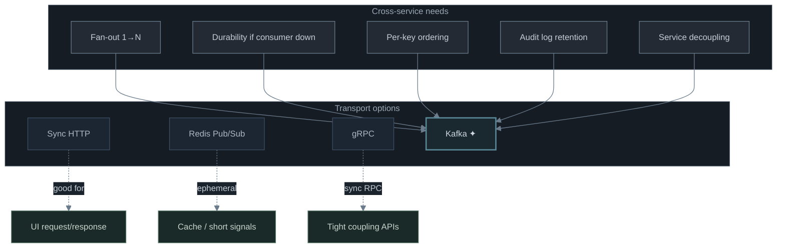
```mermaid
---
config:
  theme: base
  themeVariables:
    darkMode: true
    background: "#12171e"
    primaryColor: "#1c2633"
    primaryTextColor: "#c5ced8"
    primaryBorderColor: "#3d4f63"
    secondaryColor: "#1a2830"
    secondaryTextColor: "#c5ced8"
    secondaryBorderColor: "#4a6270"
    tertiaryColor: "#232a33"
    tertiaryTextColor: "#aeb8c4"
    tertiaryBorderColor: "#455364"
    lineColor: "#6b7c8c"
    textColor: "#aeb8c4"
    mainBkg: "#1c2633"
    clusterBkg: "#161c24"
    clusterBorder: "#2e3a48"
    titleColor: "#9aa8b6"
    edgeLabelBackground: "#1a222c"
    fontFamily: "ui-sans-serif, system-ui, Segoe UI, sans-serif"
    fontSize: "13px"
---
flowchart TB
  subgraph Needs["Cross-service needs"]
    F["Fan-out 1→N"]
    D["Durability if consumer down"]
    O["Per-key ordering"]
    A["Audit log retention"]
    Dcoupl["Service decoupling"]
  end

  subgraph Options["Transport options"]
    HTTP["Sync HTTP"]
    Redis["Redis Pub/Sub"]
    GRPC["gRPC"]
    KAFKA["Kafka ✦"]
  end

  F --> KAFKA
  D --> KAFKA
  O --> KAFKA
  A --> KAFKA
  Dcoupl --> KAFKA

  HTTP -.->|"good for"| SyncUI["UI request/response"]
  Redis -.->|"ephemeral"| Cache["Cache / short signals"]
  GRPC -.->|"sync RPC"| Tight["Tight coupling APIs"]

  classDef need fill:#232a33,stroke:#6b7c8c,color:#c5ced8
  classDef win fill:#1a2830,stroke:#5b8a9a,stroke-width:2px,color:#d0d8e0
  classDef alt fill:#1c2633,stroke:#3d4f63,color:#aeb8c4
  classDef niche fill:#1a2a28,stroke:#5a7a6a,color:#c8d4cc
  class F,D,O,A,Dcoupl need
  class KAFKA win
  class HTTP,Redis,GRPC alt
  class SyncUI,Cache,Tight niche
```

| Alternative | Why not as the **integration bus** here |
|---|---|
| **HTTP between every service** | Cascading failures; hard fan-out; caller blocks on WhatsApp/EMR; retry logic duplicated |
| **Redis Pub/Sub** | Fire-and-forget **without durable backlog**; if notification-service is down, message is gone |
| **Redis Streams** | Viable, but Kafka is the industry default for event-driven microservice platforms; team already standardized Nest Kafka |
| **gRPC only** | Excellent for sync RPC, weak for multi-subscriber durable events unless you reinvent a bus |
| **RabbitMQ** | Also fine for messaging; Kafka chosen for log/partition model, retention, and replay for audit/EMR catch-up |
| **DB polling / cron only** | Higher latency; couples schedulers to every workflow |

### Why these *specific* services were put on Kafka

| Service | Role on the bus | Why not only HTTP |
|---|---|---|
| **user-service** | Hub for identity records | Many writers (auth, system-manager) need create/validate without sharing DB |
| **auth-service** | Security boundary + audit sink | Must react to password changes & collect audit without polling |
| **appointment-service** | Clinical schedule events | Side effects must not slow booking API |
| **notification / reminder** | Side-effect workers | Independent scale & failure domains |
| **emr-service** | OpenEMR anti-corruption layer | Eventually consistent chart sync; retries/DLT matter |
| **system-manager** | Platform admin workflows | Account linking & clinic admin provisioning across bounded contexts |
| **clinic / scheduling** | Domain broadcasts | Ready for future subscribers (billing, analytics) |

---

## 12. Security, envelopes, idempotency, audit

### Topic security matrix

`Backend/NodeJS/shared/kafka-security/topic-security.matrix.ts` declares allowed **producers** and **consumers** per topic, plus:

- `requiresIdempotency`
- `requiresTenantCorroboration` (multi-tenant safety for clinic-scoped events)


```mermaid
---
config:
  theme: base
  themeVariables:
    darkMode: true
    background: "#12171e"
    primaryColor: "#1c2633"
    primaryTextColor: "#c5ced8"
    primaryBorderColor: "#3d4f63"
    secondaryColor: "#1a2830"
    secondaryTextColor: "#c5ced8"
    secondaryBorderColor: "#4a6270"
    tertiaryColor: "#232a33"
    tertiaryTextColor: "#aeb8c4"
    tertiaryBorderColor: "#455364"
    lineColor: "#6b7c8c"
    textColor: "#aeb8c4"
    mainBkg: "#1c2633"
    edgeLabelBackground: "#1a222c"
    fontFamily: "ui-sans-serif, system-ui, Segoe UI, sans-serif"
    fontSize: "13px"
---
flowchart LR
  P["Producer"] --> S["SignedKafkaPublisher"]
  S --> E["Envelope<br/>eventId · producer · signature · payload"]
  E --> K[("Kafka")]
  K --> C["Consumer"]
  C --> V["Verifier + matrix"]
  V --> I{"Idempotent?"}
  I -->|already seen| SKIP["Skip"]
  I -->|new| BIZ["Business handler"]

  classDef svc fill:#1c2633,stroke:#4a5d70,color:#c5ced8
  classDef bus fill:#1a2830,stroke:#5b8a9a,stroke-width:2px,color:#d0d8e0
  classDef gate fill:#232a33,stroke:#6b7c8c,color:#c5ced8
  classDef ok fill:#1a2a28,stroke:#6d8f7a,color:#c8d4cc
  classDef skip fill:#2a2420,stroke:#8a7a68,color:#d8d0c5
  class P,S,C,BIZ svc
  class E,V,I gate
  class K bus
  class SKIP skip
```

### Signed envelopes

`SignedKafkaPublisher` wraps payloads so consumers can reject spoofed `producerService` claims.

### Idempotency

Handlers (e.g. user-service OTP, EMR `user.created`) key off message identity / eventId so **at-least-once** Kafka delivery does not double-create patients or double-send side effects.

### Isolation level

Consumers prefer `isolationLevel: 'read_committed'` (client module) when transactional produce is in play.

### Network security note

Docker/Railway currently use **PLAINTEXT** between private network services. Code supports `KAFKA_SECURITY_PROTOCOL` + SASL for harder environments.

---

## 13. Dead-letter topics (DLT)

When a consumer cannot process a message after retries, pipelines can emit to `*.dlt` topics (1 partition, 30-day retention) for:

- Operator inspection
- Replay after bugfix
- Alerting hooks (`AlertingService` in user-service DLT handlers)

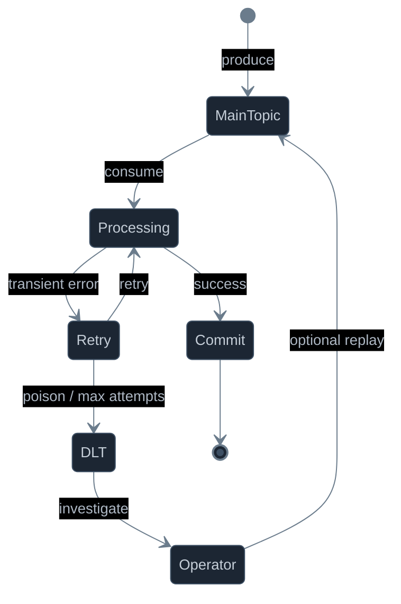
```mermaid
---
config:
  theme: base
  themeVariables:
    darkMode: true
    background: "#12171e"
    primaryColor: "#1c2633"
    primaryTextColor: "#c5ced8"
    primaryBorderColor: "#3d4f63"
    secondaryColor: "#2a2420"
    secondaryTextColor: "#d8d0c5"
    secondaryBorderColor: "#8a7a68"
    tertiaryColor: "#1a2a28"
    tertiaryTextColor: "#c8d4cc"
    tertiaryBorderColor: "#6d8f7a"
    lineColor: "#6b7c8c"
    textColor: "#aeb8c4"
    fontFamily: "ui-sans-serif, system-ui, Segoe UI, sans-serif"
    fontSize: "14px"
---
stateDiagram-v2
  [*] --> MainTopic: produce
  MainTopic --> Processing: consume
  Processing --> Commit: success
  Processing --> Retry: transient error
  Retry --> Processing: retry
  Retry --> DLT: poison / max attempts
  DLT --> Operator: investigate
  Operator --> MainTopic: optional replay
  Commit --> [*]
```

---

## 14. Startup order, health, and the cold-start race

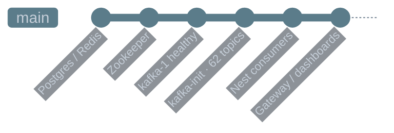
```mermaid
---
config:
  theme: base
  themeVariables:
    darkMode: true
    background: "#12171e"
    primaryColor: "#1c2633"
    primaryTextColor: "#c5ced8"
    primaryBorderColor: "#3d4f63"
    lineColor: "#6b7c8c"
    textColor: "#aeb8c4"
    git0: "#5b7c8a"
    git1: "#6d8f7a"
    git2: "#8a7d6b"
    git3: "#7a8a9a"
    gitBranchLabel0: "#c5ced8"
    gitBranchLabel1: "#c5ced8"
    commitLabelColor: "#c5ced8"
    commitLabelBackground: "#1c2633"
    commitLabelFontSize: "12px"
    fontFamily: "ui-sans-serif, system-ui, Segoe UI, sans-serif"
---
gitGraph
  commit id: "Postgres / Redis"
  commit id: "Zookeeper"
  commit id: "kafka-1 healthy"
  commit id: "kafka-init · 62 topics"
  commit id: "Nest consumers"
  commit id: "Gateway / dashboards"
```

### Compose

`depends_on: kafka-init: condition: service_completed_successfully`

### Railway ops scripts

`scripts/railway-start-deployments.mjs` deploys in order and **waits for kafka-init SUCCESS** before Nest services.

### Entrypoint

`wait-for-kafka-broker.sh`:

1. Wait for broker TCP  
2. Wait until topic `audit.log` metadata is visible (via kafkajs admin)  
3. `exec node dist/main`

### Application retry

`startKafkaMicroservicesWithRetry` — up to ~45 attempts × 2s for `UNKNOWN_TOPIC_OR_PARTITION`.

---

## 15. Local Docker vs Railway production

| Aspect | Docker Compose | Railway (reliable-flow) |
|---|---|---|
| Brokers | 1 × `kafka-1` | 1 × Kafka service |
| ZK | 1 × `zookeeper-1` | Matching ZK service |
| Topic create | `kafka-init` container | Same script / service |
| Auto-create topics | **false** on broker | May differ by env; clients still `allowAutoTopicCreation: false` |
| RF | 1 | 1 (single broker) |
| Advertised host | `kafka-1:9092` | Private DNS / Railway internal host in `KAFKA_BROKERS` |
| Nest ↔ Kafka | Private Docker network | Private Railway network |

Production `TopicConfigurations` with RF=3 remains the **target architecture** if/when you add brokers.

---

## 16. Key file map

```text
Messaging/Kafka/
  kafka-config/
    topics/topics.config.ts          # Enum + partition/RF/retention + generators
    shared/
      kafka-options.factory.ts       # Nest consumer transport options
      kafka-client.module.ts         # Producer ClientsModule
      start-kafka-microservices.ts   # Start retry helper
      kafka-readiness.probe.ts       # Ready probe
    scripts/generate-kafka-init-sh.ts
  scripts/
    kafka-init.sh                    # Creates all topics
    wait-for-kafka-broker.sh         # Entrypoint gate

Backend/NodeJS/shared/kafka-security/
  topic-security.matrix.ts
  signed-kafka.publisher.ts
  …

Backend/NodeJS/shared/phi-audit/
  types.ts                           # AUDIT_LOG_TOPIC = 'audit.log'

Backend/NodeJS/microservices/*/src/
  main.ts                            # connectMicroservice + start retry
  **/kafka.consumer.service.ts       # @EventPattern / @MessagePattern
  kafka-shared/                      # Copied at build from Messaging/Kafka

Integrations/OpenEMR/emr-service/
  src/emr/services/kafka.consumer.service.ts

docker-compose.yml                   # zookeeper-1, kafka-1, kafka-init
scripts/railway-start-deployments.mjs
```

---

## 17. Glossary

| Term | Meaning in this project |
|---|---|
| **Broker** | Kafka server process (`kafka-1`) storing logs |
| **Topic** | Named event stream (`appointment.created`) |
| **Partition** | Ordered shard of a topic (usually 3) |
| **Consumer group** | Competing consumers sharing partitions; different groups = fan-out |
| **Offset** | Position of a consumer in a partition |
| **RF / replication factor** | How many broker copies of each partition |
| **emit** | Fire-and-forget produce |
| **send** | Request–reply produce |
| **DLT** | Dead-letter topic for failed messages |
| **Envelope** | Signed wrapper around payload |
| **kafka-init** | One-shot topic creator — not a broker |
| **Sentinel topic** | `audit.log` used to detect “init finished” |

---

## Appendix A — Topic count verification

From `Messaging/Kafka/scripts/kafka-init.sh`:

- Lines creating standard topics: **49**
- Lines creating DLT topics: **13**
- **Total: 62**

Regenerate after editing `topics.config.ts`:

```bash
cd Messaging/Kafka/kafka-config
npm run generate:kafka-init-sh
```

---

## Appendix B — End-to-end architecture poster

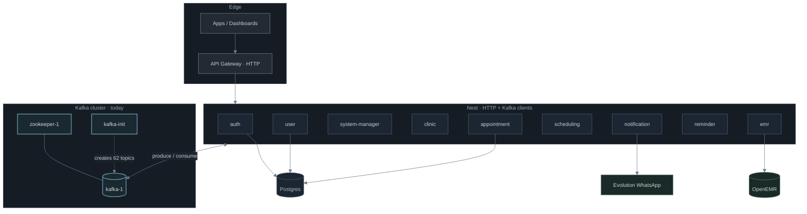
```mermaid
---
config:
  theme: base
  themeVariables:
    darkMode: true
    background: "#12171e"
    primaryColor: "#1c2633"
    primaryTextColor: "#c5ced8"
    primaryBorderColor: "#3d4f63"
    secondaryColor: "#1a2830"
    secondaryTextColor: "#c5ced8"
    secondaryBorderColor: "#4a6270"
    tertiaryColor: "#232a33"
    tertiaryTextColor: "#aeb8c4"
    tertiaryBorderColor: "#455364"
    lineColor: "#6b7c8c"
    textColor: "#aeb8c4"
    mainBkg: "#1c2633"
    clusterBkg: "#161c24"
    clusterBorder: "#2e3a48"
    titleColor: "#9aa8b6"
    edgeLabelBackground: "#1a222c"
    fontFamily: "ui-sans-serif, system-ui, Segoe UI, sans-serif"
    fontSize: "13px"
---
flowchart TB
  subgraph Edge["Edge"]
    UI["Apps / Dashboards"]
    GW["API Gateway · HTTP"]
  end

  subgraph SyncServices["Nest · HTTP + Kafka clients"]
    direction LR
    AUTH["auth"]
    USER["user"]
    SM["system-manager"]
    CLINIC["clinic"]
    APPT["appointment"]
    SCHED["scheduling"]
    NOTIF["notification"]
    REM["reminder"]
    EMR["emr"]
  end

  subgraph KafkaCluster["Kafka cluster · today"]
    ZK["zookeeper-1"]
    B[("kafka-1")]
    INIT["kafka-init"]
    ZK --- B
    INIT -.->|"creates 62 topics"| B
  end

  UI --> GW --> SyncServices
  SyncServices <-->|"produce / consume"| B

  EMR --> OpenEMR[("OpenEMR")]
  NOTIF --> WA["Evolution WhatsApp"]
  AUTH --> PG[("Postgres")]
  USER --> PG
  APPT --> PG

  classDef edge fill:#232a33,stroke:#6b7c8c,color:#c5ced8
  classDef svc fill:#1c2633,stroke:#4a5d70,color:#c5ced8
  classDef bus fill:#1a2830,stroke:#5b8a9a,stroke-width:2px,color:#d0d8e0
  classDef ext fill:#1a2a28,stroke:#5a7a6a,color:#c8d4cc
  classDef data fill:#1c2633,stroke:#4a5d70,color:#aeb8c4
  class UI,GW edge
  class AUTH,USER,SM,CLINIC,APPT,SCHED,NOTIF,REM,EMR svc
  class ZK,B,INIT bus
  class OpenEMR,WA ext
  class PG data
```

---

## Appendix C — Decision record (short)

| Decision | Choice | Consequence |
|---|---|---|
| Broker count | 1 | Cheap, RF=1, no broker HA |
| Topic auto-create | Off (clients + Docker) | Predictable partitions; requires kafka-init |
| Default partitions | 3 | Modest parallelism per consumer group |
| Integration style | Events + selective request–reply | Decoupled fan-out + sync where needed |
| Audit | Kafka topic → auth consumer | Central compliance sink |
| EMR sync | Kafka not HTTP from auth | Eventually consistent clinical chart |

---

*Document generated from the MediCare repository layout. Diagrams use a dark-mode Mermaid `base` theme with quiet slate / sage / mist tokens. When brokers or topic counts change, update `topics.config.ts` first, regenerate `kafka-init.sh`, then revise this guide.*
